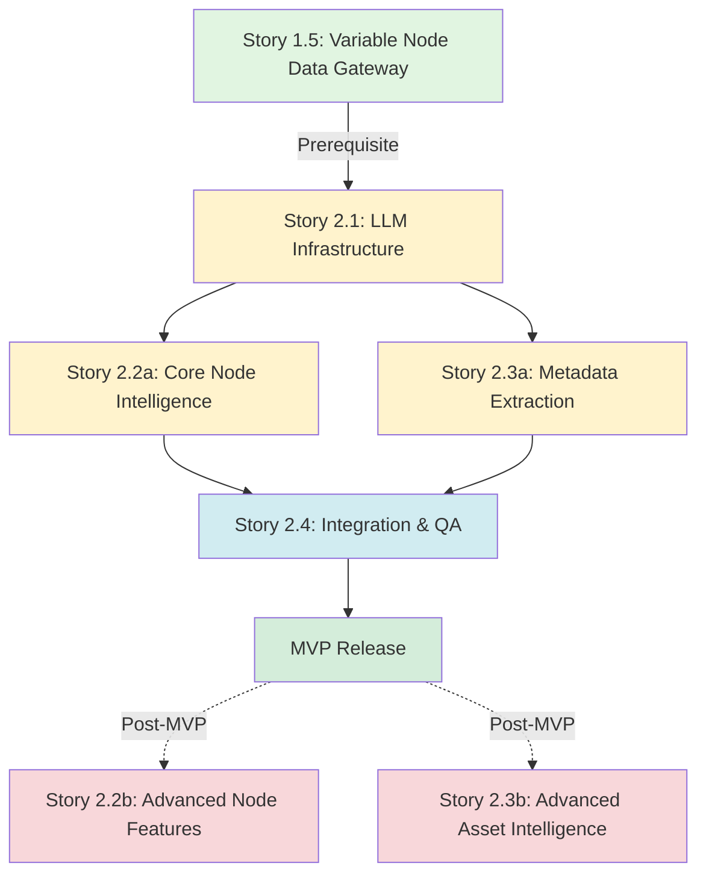

# Epic 2: Subtle Intelligence Layer

## Epic Overview
**Title**: Integrate LLM capabilities as subtle, non-exposed intelligence throughout the node graph system
**Goal**: Transform the prompt randomization tool into an intelligently-enhanced system that leverages LLMs transparently to improve user workflows without exposing chat interfaces
**Timeline**: 4-6 weeks (3 stories, parallel development possible)
**Business Value**: Differentiates product for fundraising by demonstrating AI-powered intelligence that enhances rather than replaces creative control

## Epic Context
Following the successful implementation of the Variable Node as Data Gateway (Story 1.5), this epic adds the intelligence layer that makes the tool feel "prescient" and sophisticated. LLMs operate behind the scenes through button triggers and background events, never as a front-facing chatbot. This approach aligns with the virtual backgrounds and reactive extras vision while maintaining the node-based paradigm users expect.

## Core Principles
1. **Non-Exposed Integration**: LLMs work transparently through existing UI patterns
2. **Token Efficiency**: Use free/cheap models, concise prompts, capped outputs
3. **Graceful Fallbacks**: System remains fully functional without LLM availability
4. **Director-First Control**: AI as conductor, not dictator - all suggestions are proposals
5. **Performance First**: <300ms response times, aggressive caching
6. **Artist-in-the-Loop**: Every AI action can be modified, undone, or overridden
7. **Ethical AI**: SAG-forward compliance with audit trails and consent tracking

## Story Dependency Diagram



### Timeline Flow
- **Week 0**: Story 1.5 (Variable Node) - Foundation
- **Week 1**: Story 2.1 (Infrastructure) + Story 2.3a (Metadata)
- **Week 2**: Story 2.2a (Core Intelligence)
- **Week 3**: Story 2.4 (Integration & QA)
- **Post-Funding**: Stories 2.2b & 2.3b

## Stories in Epic

### Story 2.1: Core LLM Infrastructure & OpenRouter Integration
**Priority**: P0 (Foundation)
**Size**: L (1 week)
**Description**: Establish the foundational LLM service layer using OpenRouter for multi-model access
**Key Deliverables**:
- OpenRouter API integration service
- Model selection & fallback chains
- Token management & caching system
- Admin panel with real-time monitoring
- Privacy protection & hallucination prevention
- Cost tracking & limits ($0.10/day target)

### Story 2.2a: Core Node Intelligence (MVP)
**Priority**: P1 (Demo Critical)
**Size**: M (1 week)
**Description**: Essential intelligence features for immediate demo value
**Key Deliverables**:
- "Populate Choices" for WeightedChoice nodes (the "wow" feature)
- "Optimize Weights" based on context
- Inspiration mode for empty nodes
- Offline fallback with 50+ patterns
- Variable preservation in all operations

### Story 2.2b: Advanced Node Features (Post-MVP)
**Priority**: P3 (Deferred)
**Size**: L (2 weeks)
**Description**: Production-ready features for complex graphs
**Key Deliverables**:
- Text refinement (expand/contract/correct)
- Preview variations generator
- Conflict detection & resolution
- Smart merge/split suggestions
- Graph complexity analysis

### Story 2.3a: Metadata Extraction (MVP)
**Priority**: P2 (Enhancement)
**Size**: S (3-4 days)
**Description**: Invisible intelligence through background metadata
**Key Deliverables**:
- Automatic silent metadata extraction
- Basic smart asset matching
- Natural language search enhancement
- Developer mode visibility
- Zero UI impact

### Story 2.3b: Advanced Asset Intelligence (Post-MVP)
**Priority**: P4 (Deferred)
**Size**: XL (3-4 weeks)
**Description**: Production-scale continuity and matching
**Key Deliverables**:
- Vector similarity matching
- 1000+ extra continuity tracking
- Bulk metadata operations
- Compliance reporting
- Scene consistency validation

### Story 2.4: End-to-End Integration & QA
**Priority**: P1 (Pre-Release)
**Size**: M (1 week)
**Description**: Comprehensive testing of all intelligence features
**Key Deliverables**:
- 100-extra stress test scenario
- Offline mode validation
- Demo script reliability
- Cross-browser testing
- Performance baseline establishment

## Global Intelligence Settings Panel
A unified control center for all AI features (Settings → Intelligence):
```typescript
interface IntelligenceSettings {
  // Master Controls
  enabled: boolean;                    // Global on/off
  mode: 'online' | 'offline' | 'auto'; // Connection mode
  
  // Feature Toggles
  features: {
    populateChoices: boolean;
    optimizeWeights: boolean;
    extractMetadata: boolean;
    smartSearch: boolean;
    conflictDetection: boolean;
  };
  
  // Performance Tuning
  performance: {
    cacheTTL: number;        // Minutes (5-60)
    maxConcurrent: number;   // Parallel LLM calls (1-5)
    timeoutMs: number;       // Per call (1000-5000)
  };
  
  // Cost Controls
  costs: {
    dailyLimit: number;      // USD (0.10 default)
    warningThreshold: 0.8;   // 80% warning
    preferFreeModels: boolean;
  };
  
  // Privacy
  privacy: {
    blockPII: boolean;       // Default: true
    localOnly: boolean;      // Use Ollama
    auditLogging: boolean;   // Compliance mode
  };
}
```

## Value Proposition Alignment

### Addresses $2.3B Virtual Production Problem
- **50% Reduction in Logistics**: Automated extra management vs manual coordination
- **10x Speed Increase**: 100 extras configured in 5 minutes vs 50 minutes manual
- **Cost Predictability**: $0.10/day vs $1000s in reshoots from continuity errors

### Director-First Philosophy
- **AI as Conductor, Not Roulette**: Every suggestion is a proposal
- **Creative Control Maintained**: All AI features are tools, not replacements
- **Artist-in-the-Loop**: Full override capability on every operation

### SAG-Forward Ethics Badge
- **Complete Audit Trails**: Every LLM call logged with consent status
- **Attribution Tracking**: Source data preserved through pipeline
- **Transparent Operations**: Admin panel shows all AI activity

## Technical Architecture

### Service Layer
```typescript
// packages/core/services/llm/LLMService.ts
interface LLMService {
  callLLM(prompt: LLMPrompt): Promise<LLMResponse>;
  populateChoices(context: string, section: string): Promise<Choice[]>;
  extractMetadata(text: string): Promise<Metadata>;
  refineText(text: string, mode: RefinementMode): Promise<string>;
  optimizeWeights(choices: Choice[], context: string): Promise<Weight[]>;
}
```

### Integration Points
1. **Node Level**: Buttons in inspector panels trigger LLM calls
2. **Graph Level**: Background analysis on save/load
3. **Segment Level**: Auto-metadata on edit completion
4. **Preview Level**: Enhanced variation generation

### Model Strategy
```javascript
const MODEL_CHAIN = {
  primary: 'deepseek/deepseek-r1:free',     // Reasoning tasks
  fallback1: 'mistral/mistral-medium-3.1:free', // Quick tasks
  fallback2: 'openai/gpt-4o-mini',          // Paid backup
  metadata: 'anthropic/claude-haiku',        // Classification
};
```

## Success Metrics
- **Performance**: 95% of LLM calls complete in <300ms
- **Cost**: Average <$0.001 per user action
- **Adoption**: 60% of users try intelligent features in first session
- **Quality**: 80% acceptance rate for LLM suggestions
- **Reliability**: System remains 100% functional when LLM unavailable

## Demo Scenarios

### Scenario 1: Intelligent Prompt Building
1. User pastes base prompt about "desert scene"
2. Clicks "Populate Choices" on WeightedChoice node
3. LLM suggests contextual variations with weights
4. User accepts/modifies suggestions
5. Graph generates diverse, coherent outputs

### Scenario 2: Reactive Extra Enhancement
1. World data injects "explosion" event
2. Background LLM analyzes impact on extras
3. Metadata auto-populates reaction types
4. Weights adjust based on proximity
5. Each extra gets contextually appropriate behavior

### Scenario 3: Asset Intelligence
1. User creates scene with multiple segments
2. LLM extracts metadata (location, mood, props)
3. Asset browser auto-filters relevant items
4. Continuity checker flags inconsistencies
5. Suggestions maintain scene coherence

## Risk Mitigation
- **API Costs**: Strict token limits, free tier priority, user quotas
- **Latency**: Aggressive caching, parallel processing, timeout limits
- **Privacy**: No PII in prompts, optional opt-out, local processing option
- **Quality**: Multiple model fallbacks, validation layers, user override always available
- **Dependency**: System fully functional without LLM, progressive enhancement only

## Implementation Phases

### Phase 1: Foundation (Week 1)
- OpenRouter integration
- Basic service layer
- Cost tracking

### Phase 2: Node Intelligence (Weeks 2-3)
- WeightedChoice enhancements
- Text refinement features
- Weight optimization

### Phase 3: Metadata Layer (Week 4)
- Metadata extraction
- Asset matching
- Continuity tracking

### Phase 4: Polish & Demo (Week 5)
- Performance optimization
- Demo scenarios
- Documentation

## Related Documentation
- Story 1.5: Variable Node as Data Gateway (prerequisite)
- Research: LLM Integration compiled notes
- API Docs: OpenRouter API Reference
- Cost Analysis: Token usage projections

## Change Log
| Date       | Version | Description                          | Author    |
|------------|---------|--------------------------------------|-----------|
| 2025-01-25 | 1.0     | Initial epic definition from research| Sarah (PO)|