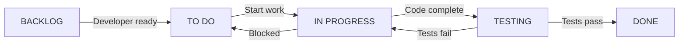

# Sprint Board Layout - Prompt Wizard Integration

## What is a Sprint Board?

A Sprint Board is a visual management tool that shows all work items in a sprint and their current status. Think of it as a dashboard where the team can see at a glance what needs to be done, what's in progress, and what's completed.

## Board Structure

```
┌─────────────────────────────────────────────────────────────────────────────┐
│                        SPRINT 1: WIZARD FOUNDATION                          │
│                        (Jan 13-24, 2025) - 21 Points                       │
├──────────────┬──────────────┬──────────────┬──────────────┬──────────────┤
│   BACKLOG    │    TO DO     │ IN PROGRESS  │   TESTING    │     DONE     │
│              │              │              │              │              │
│              │ ┌──────────┐ │              │              │              │
│              │ │WIZ-MOCK   │ │              │              │              │
│              │ │Create Mock│ │              │              │              │
│              │ │Service    │ │              │              │              │
│              │ │🔵 5pts    │ │              │              │              │
│              │ │👤 Unassign│ │              │              │              │
│              │ └──────────┘ │              │              │              │
│              │              │              │              │              │
│              │ ┌──────────┐ │              │              │              │
│              │ │WIZ-001    │ │              │              │              │
│              │ │Parsing    │ │              │              │              │
│              │ │Engine     │ │              │              │              │
│              │ │🔵 8pts    │ │              │              │              │
│              │ │👤 Unassign│ │              │              │              │
│              │ └──────────┘ │              │              │              │
│              │              │              │              │              │
│              │ ┌──────────┐ │              │              │              │
│              │ │WIZ-002A   │ │              │              │              │
│              │ │Panel      │ │              │              │              │
│              │ │Structure  │ │              │              │              │
│              │ │🔵 5pts    │ │              │              │              │
│              │ │👤 Unassign│ │              │              │              │
│              │ └──────────┘ │              │              │              │
│              │              │              │              │              │
│              │ ┌──────────┐ │              │              │              │
│              │ │WIZ-003    │ │              │              │              │
│              │ │Span       │ │              │              │              │
│              │ │Editing    │ │              │              │              │
│              │ │🔵 8pts    │ │              │              │              │
│              │ │⚠️ Blocked  │ │              │              │              │
│              │ └──────────┘ │              │              │              │
└──────────────┴──────────────┴──────────────┴──────────────┴──────────────┘

Legend:
🔵 Story Points  | 👤 Assignment  | ⚠️ Blocked  | ✅ Ready  | 🐛 Bug  | 🚀 Deployed
```

## Board Columns Explained

### 1. **BACKLOG**
- Stories selected for the sprint but not yet started
- Prioritized from top to bottom
- Team pulls from here when ready

### 2. **TO DO**
- Developer has committed to work on it next
- All prerequisites are met
- Story is "ready" by Definition of Ready

### 3. **IN PROGRESS**
- Active development happening
- Should have a developer assigned
- WIP (Work In Progress) limits may apply

### 4. **TESTING/REVIEW**
- Code complete, in QA or code review
- Acceptance criteria being verified
- May include peer review or user acceptance

### 5. **DONE**
- Meets Definition of Done
- Accepted by Product Owner
- Ready for deployment/release

## Digital Sprint Board Example (Jira/Trello/GitHub Projects Style)

```markdown
# 🚀 Sprint 1: Wizard Foundation (Jan 13-24)
**Goal:** Deliver parsing engine and basic UI panel
**Capacity:** 21 points | **Committed:** 21 points

## 📊 Burndown
Day 1: 21 points remaining
Day 2: 21 points remaining
Day 3: 16 points remaining ⬇️

## 🎯 Sprint Backlog

### TO DO (21 points)
┌─────────────────────────────┐
│ **STORY-WIZ-MOCK** 🏷️ 5pts  │
│ Create Mock Asset Service   │
│ Assignee: None              │
│ Labels: [backend][blocker]  │
└─────────────────────────────┘

┌─────────────────────────────┐
│ **STORY-WIZ-001** 🏷️ 8pts   │
│ Basic Parsing Infrastructure│
│ Assignee: None              │
│ Labels: [algorithm][core]   │
└─────────────────────────────┘

┌─────────────────────────────┐
│ **STORY-WIZ-002A** 🏷️ 5pts  │
│ Panel Structure             │
│ Assignee: None              │
│ Labels: [frontend][ui]      │
└─────────────────────────────┘

### IN PROGRESS (0 points)
*No items*

### IN REVIEW (0 points)
*No items*

### DONE (0 points)
*No items*

## 🚧 Impediments
- ❗ Need design mockups for WIZ-002A
- ❗ Confirm parsing algorithm approach

## 📝 Notes
- Daily standup: 9:30 AM
- Sprint review: Jan 24, 2:00 PM
```

## How to Use the Sprint Board

### Daily Workflow

1. **Morning Standup** (15 min)
   - Each developer updates their card position
   - Discuss blockers while looking at the board
   - Identify who needs help

2. **During the Day**
   - Move cards as status changes
   - Add blocker flags immediately
   - Update remaining hours/points

3. **End of Day**
   - Ensure board reflects reality
   - Flag any new impediments
   - Update burndown chart

### Card Movement Rules



## Benefits of Sprint Boards

1. **Transparency** - Everyone sees the same picture
2. **Focus** - Clear what to work on next
3. **Bottleneck Detection** - See where work piles up
4. **Progress Tracking** - Visual burndown/burnup
5. **Collaboration** - Easy to see who needs help
6. **Accountability** - Clear ownership of tasks

## Digital Tools Options

### Popular Sprint Board Tools
- **Jira** - Most comprehensive, enterprise-grade
- **Trello** - Simple, visual, easy to learn
- **GitHub Projects** - Integrated with code
- **Azure DevOps** - Microsoft ecosystem
- **Linear** - Modern, fast, developer-focused
- **Notion** - Flexible, good for documentation

### Physical Board Option
Some teams prefer physical boards with sticky notes:
- Whiteboard with columns drawn
- Sticky notes for stories
- Different colors for types
- Red dots for blockers
- Great for co-located teams

## Your Sprint Board Setup

For the Wizard epic, I recommend:

1. **Week 1 Setup**
   - Create board with 5 columns
   - Add all Sprint 1 stories to BACKLOG
   - Order by dependencies (MOCK first)

2. **Daily Practice**
   - 9:30 AM standup at the board
   - Update cards in real-time
   - Photo of physical board for remote team

3. **Metrics to Track**
   - Daily points remaining
   - Blockers per day
   - Cycle time per story
   - WIP limits (max 2 per developer)

Would you like me to:
1. Create a specific board template for your team?
2. Set up story cards with more detail?
3. Design a burndown chart tracker?