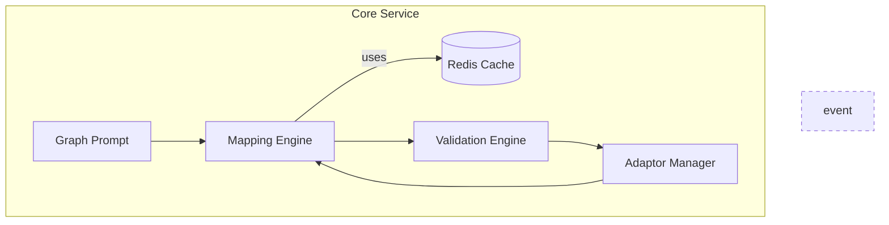
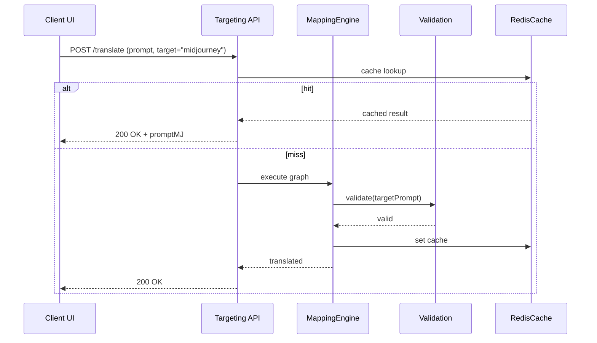
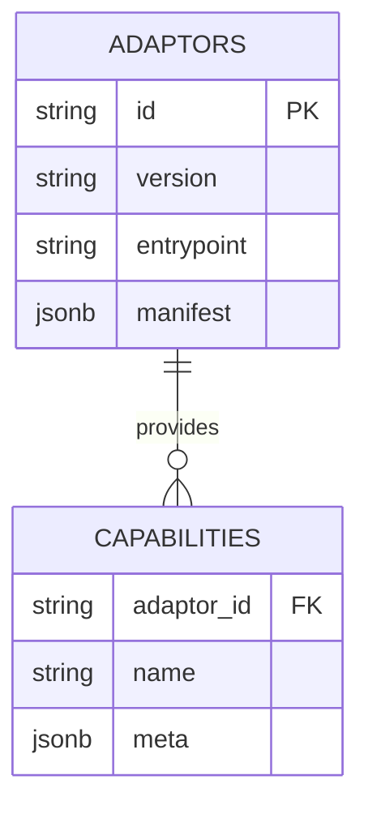
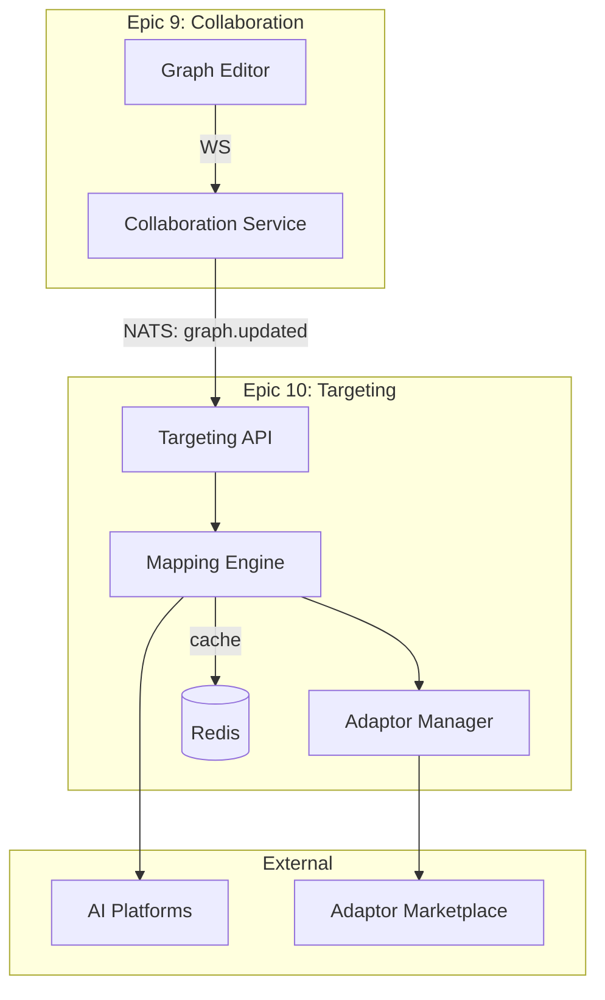

# Epic 10 – Prompt Targeting System Detailed Design

This companion document expands the implementation checklist in `epic10plan.md` with architecture decisions, data models, diagrams, and risks. Each section maps to a story in Epic 10.

---

## 1. Prompt Targeting Core (Story 10.1)

### 1.1 Purpose

Translate graph-based prompts into platform-specific formats (text-to-text, text-to-image, multi-modal) while preserving intent and optimising for each model’s capabilities.

### 1.2 Key Decisions

| Aspect        | Decision                                                          | Rationale                                            |
| ------------- | ----------------------------------------------------------------- | ---------------------------------------------------- |
| Language      | **TypeScript/Node 18**                                            | Alignment with wider codebase and plugin ecosystem   |
| Core Engine   | **Directed-acyclic transformation graph** using `prompt-core` lib | Explicit, debuggable mapping steps                   |
| Plugin System | **ESM dynamic import** adaptor plugins signed & versioned         | Easy extension, future marketplace                   |
| Event Bus     | **NATS JetStream** (`prompt.*` subjects)                          | Re-use infra from Epics 9/11, at-least-once delivery |
| Validation    | JSON Schema + custom rule engine (`Ajv`)                          | Fast runtime checks, extensible for severity levels  |
| Observability | OTEL traces + Prometheus + Loki                                   | Consistency across services                          |

### 1.3 Internal Components

1. **Adaptor Manager** – discovers, loads, and versions adaptor plugins.
2. **Mapping Engine** – executes transformation graph from source prompt to target model representation.
3. **Validation Engine** – pre/post-transform validation; severity + auto-fix hooks.
4. **Cache Layer** – Redis LRU for recent translations (hash of source+target).
5. **Metrics Exporter** – custom counters (translations/sec, cache hit rate, error rate).

### 1.4 Component Diagram



### 1.5 Sequence – Translation Happy Path



### 1.6 Risks / Mitigations

- **Plugin sandboxing** – Malicious adaptor code. → Run plugins in Node VM context with restricted globals; sign plugins.
- **Model API drift** – Platform parameters change. → Capability Discovery (Story 10.2) pings /metadata endpoints daily.
- **Cache staleness** – Translations rely on old capabilities. → Invalidate Redis keys when capability version bumps.

### 1.7 Phase-1 PoC Tasks

1. Scaffold `packages/prompt-target-core` (Mapping/Validation/Adaptor Mgr).
2. Implement minimal adaptors: OpenAI GPT, Midjourney.
3. Wire Redis cache + metrics.
4. Publish OTEL traces; create Grafana dashboard.

---

## 2. Adaptor Framework (Story 10.2)

### 2.1 Interface Definition

```ts
export interface ModelAdaptor {
  id: string; // "openai-gpt4", "midjourney-v6"
  version: string; // semver
  capabilities(): Capabilities;
  validate(graph: PromptGraph): ValidationResult[];
  transform(graph: PromptGraph): Promise<string>; // target prompt string
}
```

- **Discovery**: plugins expose a default adaptor export; Adaptor Mgr loads from `node_modules/@prompt/adaptors-*` or marketplace registry.
- **Configuration**: Adaptor manifests (`adaptor.json`) declare supported versions, params, and default overrides.

### 2.2 Data Model (Mermaid ER)



### 2.3 Risks

- **Version skew** between adaptor and core engine → enforce peer-dep semver, CI compatibility tests.

---

## 3. Text-to-Image Support (Story 10.3)

- Uses adaptor pattern; each adaptor stores generation metadata in `image_results` table (Postgres) and images in S3.
- Preview Generation service subscribes to `prompt.preview.request` and responds with low-res images.

---

## 4. Platform-Optimised Authoring (Story 10.4)

- Node types and compatibility indicators live entirely in the front-end but consume Capability Discovery JSON.
- Compatibility scores and overrides persisted in `prompt_overrides` table.

---

## 5. Open Questions

1. Marketplace signing authority for adaptor packages?
2. Licensing constraints for proprietary model APIs.
3. Fallback strategy when target model is temporarily unavailable.

---

## 6. Glossary

- **Adaptor** – Plugin translating graph prompts to a specific model.
- **Capability** – Structured description of model features (tokens, max length, image size).
- **PromptGraph** – Internal graph representation of user prompt.
- **TTL** – Time-to-live; cache key expiry.
- **DAG** – Directed Acyclic Graph, used for transformation pipelines.
- **ESM** – ECMAScript Modules, the modern JavaScript module format.

---

## 7. Testing Strategy

- **Unit** – Mapping rules, adaptor validations.
- **Integration** – Core + two adaptors, Redis cache hit/miss paths.
- **Contract** – JSON Schema validation of adaptor manifests.
- **Load** – 100 req/s translate throughput, memory profile.
- **Chaos** – Drop Redis, ensure graceful degradation.

---

## 8. System Integration Overview

### 8.1 Integration Points

- **Inbound**: Collaboration Service (Epic 9) publishes `graph.updated` events → Targeting Core subscribes and translates.
- **Outbound**: Translated prompts emitted as `prompt.targeted` events → Workflow Service or external AI gateways consume.
- **Shared Infra**: Auth JWT reuse; capability snapshots feed Versioning Service for prompt history diffs.

### 8.2 System Context Diagram



### 8.3 Key Flows

1. **Sync**: UI → API → Cache/Mapping → Response (< 500 ms).
2. **Batch**: Workflow trigger → NATS queue → background processing → callback.
3. **Error**: Standard error codes (422 on validation fail) with OTEL trace-ids.

---

## 9. Security & Compliance

### 9.1 Threat Model

- Prompt injection, malicious plugins, API abuse.
- PII in prompts ⇒ TLS + SSE encryption, log redaction.

### 9.2 Controls

- Sandboxed plugin VM, signed packages.
- Secrets in Vault, mTLS between services.
- Pen-tests and OWASP ZAP in CI.

---

## 10. Performance & Scaling Guide

- **Targets**: P99 < 500 ms; 100 req/s per pod; cache hit ≥ 80 %.
- **Scaling**: HPA on CPU; shard adaptors by model family.
- **Monitoring**: Grafana dashboard—translations/sec, error %, cache hit-rate.

---

## 11. Deployment & Operations

- Helm charts per environment; blue-green deploys.
- GitHub Actions: lint → tests → staging → manual prod.
- Cost rough-cuts: Redis micro, NATS m5.large, S3 lifecycle policies.

---

## 12. Future Enhancements & Tech Debt

- **Multi-modal chains** (text→image→caption).
- AI-assisted override suggestions.
- Registry v2 with ratings & auto-updates.

Known debt: hard-coded adaptors in PoC; add A/B test engine later.
