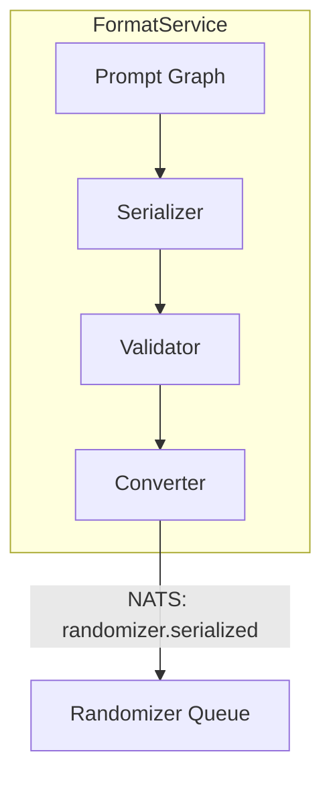
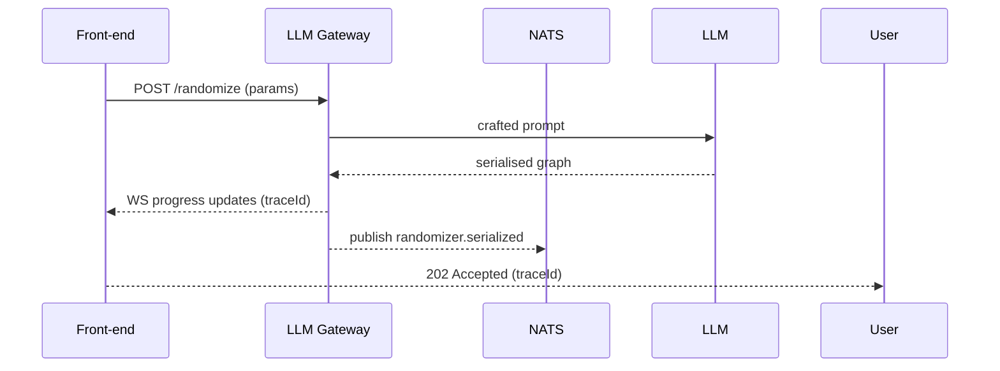
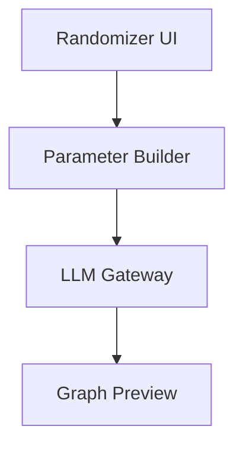

# Epic 12 – LLM Agent Randomizer System Detailed Design

This document elaborates on the checklist in `epic12plan.md`, providing architecture decisions, data models, diagrams, risks, and testing strategy. It builds on Epic 9’s Prompt Graph CRDTs and Epic 10’s Prompt Targeting serialization.

---

## 1. Serialization Format Design (Story 12.1)

### 1.1 Purpose

Define a compact, LLM-generatable format for serialising Prompt Spaghetti graphs, optimised for token efficiency and deterministic parsing.

### 1.2 Key Decisions

| Aspect       | Decision                                | Rationale                                                                 |
| ------------ | --------------------------------------- | ------------------------------------------------------------------------- |
| Format       | YAML-like with custom `---` delimiters  | Human-readable; fewer brackets than JSON; easy for LLM few-shot prompting |
| Versioning   | Header `version: x.y.z`                 | Enables backward compatibility & migration                                |
| Validation   | JSON Schema + custom semantic validator | Fast syntax checks plus domain rules (no cycles)                          |
| Optimisation | Short keys & delimiter sections         | Cuts token cost & LLM hallucination risk                                  |
| Transport    | NATS JetStream `randomizer.*`           | Aligns with Epics 9-11 infra                                              |
| Integrity    | SHA-256 `checksum` header               | Detect corruption / hallucination after LLM generation                    |

### 1.3 Internal Components

1. **Serializer** – converts Y.Graph ⇄ serialised text, appends meta.
2. **Validator** – schema + semantic checks; auto-migrates older versions.
3. **Converter** – bridges Epic 9 Y.Graph to Epic 10 PromptGraph.

### 1.4 Component Diagram



### 1.5 Strengths

- LLM-friendly; few-shot examples reduce hallucinations.
- Version header allows safe evolution.

### 1.6 Risks / Mitigations

| Risk                        | Mitigation                                                                                       |
| --------------------------- | ------------------------------------------------------------------------------------------------ |
| LLM inconsistent delimiters | Provide canonical examples & regex sanity checks; auto-fallback to JSON mode when model supports |
| Large graph size            | Stream sections; gzip payload before NATS publish                                                |
| Version drift               | Auto-upgrade in validator; CI fixtures of historic formats                                       |

### 1.7 Phase-1 PoC Tasks

1. Draft JSON Schema & example files.
2. Implement `serializer.ts` and `validator.ts` with AJV.
3. Round-trip test on small & 10k-node graphs.
4. Prompt OpenAI & Claude with few-shot examples; measure 95% parse success.

---

## 2. LLM Agent Script Development (Story 12.2)

### 2.1 Template Structure

- **System prompt** – format instructions + examples.
- **User prompt** – seed parameters.
- **Model-specific wrappers** – OpenAI JSON mode, Anthropic XML, Gemini structured.

### 2.2 Config Parameters

| Param       | Default | Purpose                                       |
| ----------- | ------- | --------------------------------------------- |
| temperature | 0.7     | Creativity balance                            |
| seed        | UUID    | Reproducibility                               |
| max_nodes   | 50      | Safety cap                                    |
| loop_count  | 1       | Iterations for generate→validate→correct loop |

### 2.3 Integration Flow



### 2.4 Risks / Mitigations

- Hallucination → retry with lower temp; fallback to deterministic seed.
- Provider quota → bulk jobs routed via background worker with rate-limits.

---

## 3. Parser Implementation (Story 12.3)

### 3.1 Parser Stages

1. **Lexical** – tokenise YAML-like syntax.
2. **AST Builder** – construct nodes/edges.
3. **Semantic** – validate against schema (types, no cycles).

### 3.2 ER / Class Diagram

```mermaid
classDiagram
  class Lexer {
    +tokens
    +tokenize(text)
  }
  class Parser {
    +parse(tokens): AST
  }
  class Validator {
    +validate(AST): Result[]
  }
  Lexer --> Parser --> Validator
```

### 3.3 Performance Targets

- Linear O(n) parsing.
- <200 ms for 10k nodes on 4 vCPU pod.

---

## 4. Randomizer Generator (Story 12.4)

### 4.1 Parameter Model

| Category    | Examples                                              |
| ----------- | ----------------------------------------------------- |
| Nodes       | count 5-50, type distribution `{ text:60, image:40 }` |
| Connections | density 0.2-0.8; acyclic=true                         |
| Properties  | value ranges, e.g., `temperature 0.2-1.0`             |

### 4.2 Component Diagram



### 4.3 Notes

- Canvas preview using `react-flow`.
- Real-time regen on param tweak (debounced).

---

## 5. Open Questions

1. How to store large variant sets? Option: S3 snapshots + Postgres index.
2. Metrics: define diversity score (Shannon entropy of node types?).
3. Should randomised prompts auto-publish to Epic 10 Targeting?

---

## 6. Glossary

- **AST** – Abstract Syntax Tree.
- **DAG** – Directed Acyclic Graph.
- **LLM** – Large Language Model.
- **Few-Shot Prompting** – Providing several formatted examples to steer LLM output.

---

## 7. Testing Strategy

- **Unit** – Serializer ↔ parser round-trip, validator rules.
- **Integration** – LLM gateway end-to-end with OpenAI/Claude stubs.
- **Load** – 1k 50-node graphs/min publish; monitor parser latency.
- **Security** – Regex denial on potentially malicious content.
- **Chaos** – NATS outage: ensure local retry queue.
- **Fuzz** – Hypothesis input fuzzing for lexer.
- **Record/Replay** – Snapshot real LLM responses for CI.
- **Metrics** – Track hallucination rate (parse failures / generations).

---

## 8. Security & Compliance

- Sanitise LLM outputs; deny unsafe YAML tags; prompt-injection pattern checks.
- Limit max_nodes & token count.
- Audit serialised graphs in Loki; 30-day retention.

---

## 9. Deployment & Operations

- Deployed as `format-service` + `parser-service` pods.
- HPA on CPU & publish rate.
- Prometheus metrics: serialise/sec, parse errors/sec.

---

## 10. Future Enhancements & Tech Debt

- Add binary Protobuf format for ultra-large graphs.
- Support multi-modal randomisation (audio, video) in v2.
- Tech debt: custom YAML lexer – evaluate existing parsers.
