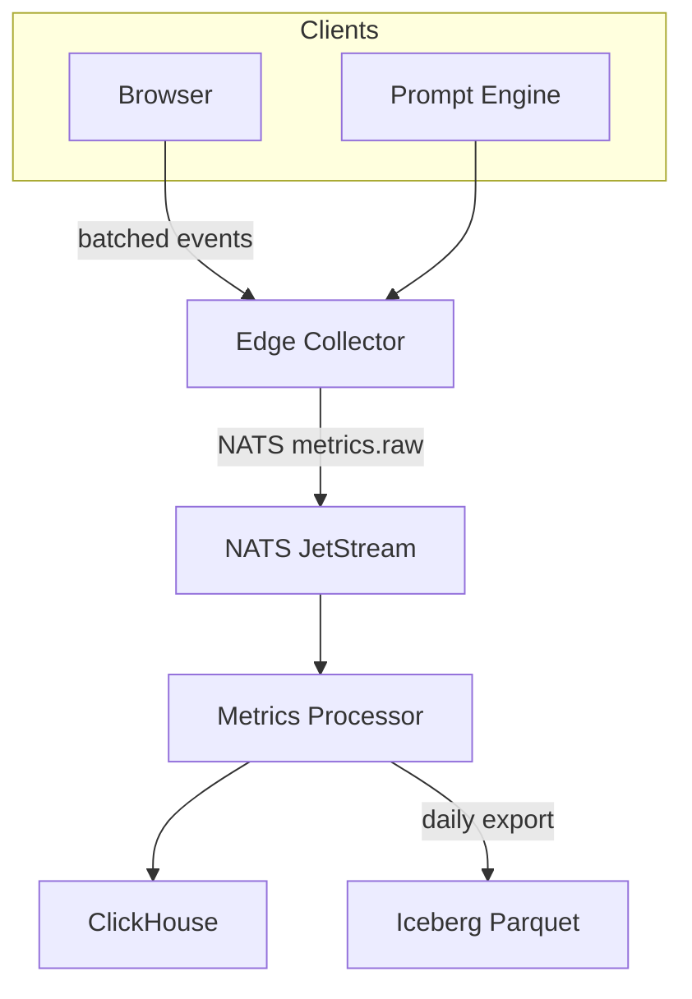
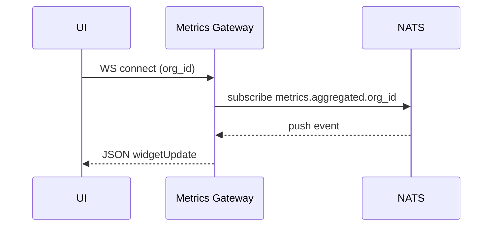

# Epic 13 – Analytics & Insights Dashboard Detailed Design

This document expands on `epic13plan.md`, providing architectural decisions, data pipelines, diagrams, risks, and testing strategy. It integrates with metrics emitted by Epics 9-12 and respects privacy from Epic 11’s auth/ORG model.

---

## 1. Analytics Data Collection (Story 13.1)

### 1.1 Purpose

Capture execution, cost, and user-interaction metrics with minimal runtime overhead while ensuring GDPR/CCPA compliance.

### 1.2 Key Decisions

| Aspect         | Decision                                             | Rationale                                                                      |
| -------------- | ---------------------------------------------------- | ------------------------------------------------------------------------------ |
| Ingest         | NATS JetStream `metrics.*` subjects                  | Re-use infra; at-least-once delivery                                           |
| Event Schema   | OpenTelemetry span‐style JSON + `org_id`/`user_id`   | Compatible with existing tracing; supports segmentation                        |
| Storage (Hot)  | ClickHouse cluster                                   | Columnar, cost-efficient analytics; high throughput                            |
| Storage (Cold) | S3 Parquet via Iceberg                               | Low-cost long retention; partitioned by day                                    |
| Sampling       | 100 % critical, 10 % non-critical (org-configurable) | Manage volume; Windsurf-style adaptive sampling; per-org override via Admin UI |
| Correlation    | `correlation_id` (UUID)                              | Link events to specific prompt graphs / sessions for debugging                 |
| Privacy        | SHA-256 salt-hash PII + consent flags                | Aligns with Windsurf’s auto-purge on opt-out                                   |

### 1.3 Pipeline Diagram

### 1.4 Strengths & Innovations

- Edge batching reduces latency impact.
- Org/user IDs enable enterprise segmentation out-of-the-box.
- Adaptive sampling lowers cost; critical spans (errors) always captured.

### 1.5 Risks / Mitigations

| Risk                                     | Mitigation                                                          |
| ---------------------------------------- | ------------------------------------------------------------------- |
| Storage explosion from node‐level events | Tiered sampling & TTL compaction jobs                               |
| ClickHouse materialised view bloat       | Monitor view size; optimise projections; purge unused views         |
| Privacy revocation requires data purge   | Partitioned data; purge job by hashed `user_id`                     |
| Client offline events lost               | IndexedDB queue with retry (Windsurf-inspired) + max 1 MB queue cap |

### 1.6 Phase-1 PoC Tasks

1. Define OTEL JSON schema & validate with AJV.
2. Implement edge collector (NestJS) with 50 ms flush.
3. Publish from Prompt Engine; verify throughput (5 k events/sec) under burst & steady loads (<5 % loss).
4. Load ClickHouse; run sample queries (latency <200 ms for 24 h window).

---

## 2. Performance Metrics Dashboard (Story 13.2)

### 2.1 UI Architecture

- **Dashboard Shell** – React + Chakra UI (+ drag-and-drop grid layout).
- **Auth Guard** – JWT validation in Metrics Gateway before WS subscribe.
- **Widget SDK** – Recharts-based components for charts.
- **Real-time Data** – WebSocket feed bridged from NATS.

### 2.2 Core Widgets (MVP)

| Widget               | Description                                   |
| -------------------- | --------------------------------------------- |
| Completion Stats     | % of graphs executed successfully (user/org)  |
| Execution Time Trend | P95 latency per day                           |
| Token Spend          | Tokens & $ cost by provider                   |
| Heatmap              | Hour-of-day usage pattern                     |
| Model A/B            | Success & cost compare between model versions |

### 2.3 Sequence – Live Widget Update

### 2.4 Accessibility & Customisation

- ARIA labels + keyboard nav.
- Saved layouts per user (localStorage) & synced to user prefs API for cross-device layouts.

---

## 3. Cost & Resource Analysis (Story 13.3)

### 3.1 Cost Engine

| Input                | Source                                                       |
| -------------------- | ------------------------------------------------------------ |
| Token counts         | Metrics Processor aggregation                                |
| Provider price table | Weekly fetched JSON (cached fallback; override via admin UI) |
| Cache savings        | Derived from duplicate prompt hash hits                      |

Forecast uses exponential smoothing with 95 % CI; supports multi-currency via daily FX rates.

### 3.2 Budget Alerts Flow

### 3.3 Org-Scoped Views

Costs aggregated by `org_id`, with RBAC from Epic 11; admins see all teams.

---

## 4. Usage Pattern Analytics (Story 13.4)

### 4.1 Advanced Insights

- Session journey graphs (DAG of UI actions) rendered via `react-flow`.
- Cohort analysis filters – plan, role, region.
- Diversity metrics (Shannon entropy of node types).

### 4.2 Session Replay

- Record UI events to IndexedDB (encrypted); upload in chunks.
- Sample 5 % sessions; WebM compressed.

---

## 5. Open Questions

1. Should cost alerts integrate with billing provider (Stripe) for auto top-ups?
2. ML anomaly detection on latency spikes – Phase 2?
3. Referral tracking to mirror Windsurf growth features?

---

## 6. Glossary

- **OTEL** – OpenTelemetry.
- **ClickHouse** – Columnar OLAP DB.
- **Sampling** – Collect subset of events to reduce load.
- **Shannon Entropy** – Measure of diversity.

---

## 7. Testing Strategy

- **Unit** – Schema validation, cost calc.
- **Integration** – End-to-end ingest → dashboard update.
- **Load** – 10 k events/sec for 1 h; ClickHouse QPS.
- **Chaos** – Kill NATS during ingest; ensure retry queues flush.
- **E2E** – Cypress dashboards, RBAC access.
- **Security** – GDPR opt-out purge tests.

---

## 8. Security & Compliance

- Consent banner; metrics disabled until accepted.
- Pseudonymise `user_id` on client; automated monthly salt rotation via Processor job with re-hash.
- Data retention: hot 30 days (org-overrideable), cold 12 months.

---

## 9. Deployment & Operations

- Helm charts: edge-collector, processor, dashboard.
- HPA on CPU for collector.
- Grafana: ingest rate, ClickHouse disk, WS latency.

---

## 10. Future Enhancements & Tech Debt

- AI insights: GPT summarises weekly trends.
- Drag-and-drop widget marketplace.
- Tech debt: refine sampling algorithm & add materialised views.
