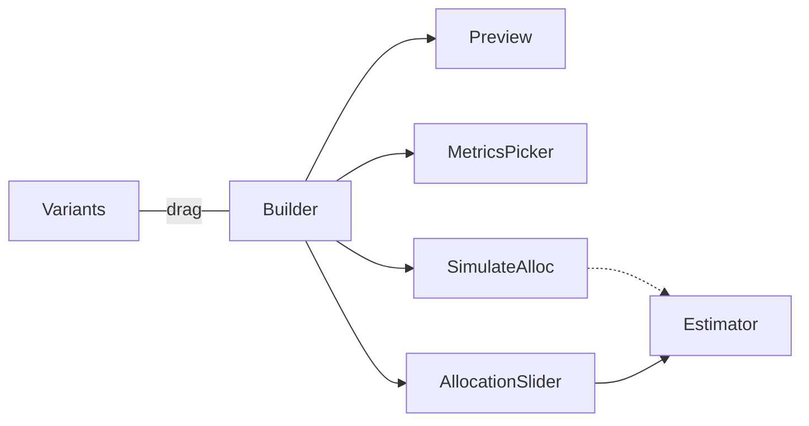
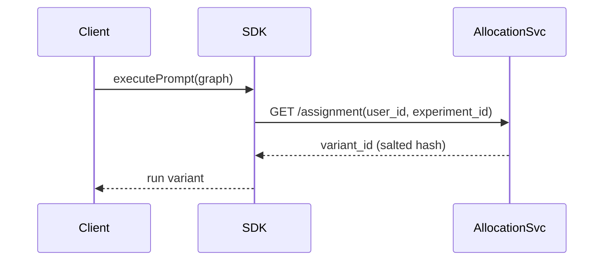

# Epic 14 – Experimentation & A/B Testing Detailed Design

This document elaborates on `epic14plan.md`, defining architecture, data models, workflows, and risk mitigations for a privacy-preserving, statistically-rigorous experimentation platform. It assumes analytics services from Epic 13 and auth/org segmentation from Epic 11.

---

## 1. Experiment Design System (Story 14.1)

### 1.1 Data Model

| Field                | Type                                         | Notes                                                     |
| -------------------- | -------------------------------------------- | --------------------------------------------------------- |
| `experiment_id`      | UUID                                         | PK                                                        |
| `org_id`             | UUID                                         | Segmentation (Epic 11)                                    |
| `name`               | text                                         | 255 chars                                                 |
| `type`               | enum(`prompt`,`graph`,`feature_flag`)        | Filter & UI shortcuts                                     |
| `hypothesis`         | text                                         | Markdown supported                                        |
| `variants`           | jsonb                                        | Array of variant meta incl. `prompt_hash`, `claude_model` |
| `traffic_allocation` | jsonb                                        | `{variant: percent}`                                      |
| `metrics`            | jsonb                                        | Success metrics refs (Epic 13 metrics IDs)                |
| `status`             | enum(`draft`,`running`,`paused`,`completed`) | Lifecycle                                                 |
| `start_at`           | timestamptz                                  | Scheduled launch                                          |
| `end_at`             | timestamptz                                  | Auto-stop                                                 |
| `created_by`         | UUID                                         | User ID                                                   |
| `created_at`         | timestamptz                                  |                                                           |
| `updated_at`         | timestamptz                                  |                                                           |

### 1.2 Visual Builder

- Drag-and-drop variant list with "Windsurf template" dropdown (pre-built Claude prompt/graph patterns).
- Claude preview pane (sends sample call to Prompt Engine; shows cost & tokens).
- Real-time sample-size estimator (pulls last 30 d baseline from ClickHouse).
- Publish from Prompt Engine; verify throughput (5 k events/sec) under burst & steady loads (<5 % loss); handle Claude API rate-limit errors in preview.

### 1.3 Configuration UI Mock

### 1.4 Success Metrics

- Pre-defined: completion rate, P95 latency, token spend.
- Custom: user adds ClickHouse SQL with parameterised `experiment_id` (UI linter blocks full table scans).
- Diversity metric (Shannon entropy) selectable.

### 1.5 Scheduling & Auto-Stop

- Cron job evaluates stop conditions hourly (min sample size, p-value <0.05, budget cap).
- Hooks anomaly detector from Epic 13 for early termination.

### 1.6 Statistical Engine

| Method                  | Use Case                    | Library |
| ----------------------- | --------------------------- | ------- |
| Chi-square              | Binary success (conversion) | `scipy` |
| t-test                  | Latency mean                | `scipy` |
| Bayesian Beta-Bernoulli | CTR                         | `scipy` |

Bayesian disabled by default; flag in `org_settings` to enable.

### 1.7 Risks / Mitigations

| Risk                                          | Mitigation                                                     |
| --------------------------------------------- | -------------------------------------------------------------- |
| Variant explosion in factorial tests          | UI warning; hard cap 12 variants                               |
| Mis-allocation due to incorrect sampling size | Estimator validation + CLI lint                                |
| Hypothesis drift after start                  | Lock hypothesis field post-launch; edits create new experiment |
| Privacy leak in segment filters               | Only hashed IDs; GDPR audit logs                               |

### 1.8 PoC Tasks

1. Build `experiments` table migration & Prisma model.
2. Stub React builder with drag-and-drop & allocation slider.
3. Wire preview endpoint to Prompt Engine (cost & latency only).
4. Validate sample estimator accuracy with synthetic ClickHouse data.

---

## 2. Traffic Allocation & Randomization (Story 14.2)

### 2.1 Allocation Engine

- Service subscribes `experiments.updated` NATS subject.
- Phase-2: ε-greedy bandit leveraging live success/latency metrics (Epic 13).
- Algorithm options: fixed ratio (MVP), greedy ε-greedy, Bayesian-TS (Phase 2).
- Live metrics feed (Epic 13) drives adaptive bandit decisions.

### 2.2 Assignment Algorithm

- Deterministic `SHA-256(salt+user_id+experiment_id)` → bucket 0-999.
- Monthly salt rotation job; old salt stored 90 d for consistency.

### 2.3 Multi-Variant & Factorial

- JSON `design_matrix` defines factors; validated via Epic 9 graph exec checker.
- Engine expands ≤ 12 cells; warns UI otherwise.

### 2.4 Session Management

- Sticky variant stored in browser `ab_session` cookie & IndexedDB for offline.
- Cross-device: server returns same variant via hash.

### 2.5 Gradual Rollout

- Ramp plan: 5→25→50→100 % governed by metrics thresholds + budget alerts.

### 2.6 Overrides & Debug

- `x-ab-force` header overrides in dev.
- CLI `ab simulate --user <id>` prints variant.

### 2.7 Risks / Mitigations

| Risk                        | Mitigation                                                             |
| --------------------------- | ---------------------------------------------------------------------- |
| Hash collision skew         | Use 64-bit bucket space; monitor allocation stats                      |
| Adaptive bandit instability | Floor each variant ≥ 5 % traffic                                       |
| Assignment latency          | AllocationSvc cached in Redis TTL 30 s (Grafana alert on eviction >5%) |

---

## 3. Results Analysis & Visualization (Story 14.3)

### 3.1 Dashboard Widgets

| Widget | Description |
| Graph Complexity Uplift | Node/edge count impact vs control |
|--------|-------------|
| Uplift | Variant vs control (% change, CI) |
| Probability to Win | Bayesian only |
| Latency Trend | Line chart per variant |
| Cost-Benefit | $ per successful run |
| Segment Breakdown | Table by role/plan/region |

Widgets reuse Epic 13 SDK; new ClickHouse view `ab_results_daily` materialised by cron.

### 3.2 Calculation Pipeline

1. `results_worker` aggregates raw events nightly.
2. Stats module computes p-values & posterior.
3. Gateway publishes `ab.results.*` for live WS updates.

### 3.3 Segment Analysis

- Default segments: org, role, plan.
- UI allows adhoc filter builder (role = "author" AND region = "EU").

### 3.4 Winner Detection Logic

- Frequentist: p < 0.05 & lift ±2 %.
- Bayesian: prob>0.95.
- Plus cost ratio improvement.

### 3.5 Comparison Tools

- Diff viewer: prompt text & node graph visual diff (leverages Epic 9 diff service) + side-by-side Claude outputs.

### 3.6 Risks / Mitigations

| Risk                        | Mitigation                                       |
| --------------------------- | ------------------------------------------------ |
| False positives (p-hacking) | Correction (Šidák) + guardrail metrics           |
| Large query latency         | Pre-compute materialised views; limit time range |

---

## 4. Experiment Management System (Story 14.4)

### 4.1 Experiment Library

- Search & tag (`#Claude`, `#cost-opt`, `#graph-v2`).
- Template generator from previous winners.

### 4.2 Status Tracking

- Kanban lanes: Draft → Running → Analysing → Winner → Archived.
- Events published to Notif Service (Epic 13) for Slack/email.

### 4.3 Version Control

- GitHub app records experiment JSON in `/experiments/` dir.
- Commit message includes `experiment_id`.

### 4.4 Winner Roll-out

- One-click promote variant to production graph (calls Epic 10 Targeting API).
- 7-day post-roll monitoring dashboard auto-generated.

### 4.5 Knowledge Base

- Claude summarises experiment outcome into `/docs/experiments/winners.md` via PR.

### 4.6 Templates

- Starter templates (prompt wording, Claude temp tweaks) ranked by prior uplift.

### 4.7 Risks / Mitigations

| Risk           | Mitigation                      |
| -------------- | ------------------------------- |
| GitHub outage  | Fallback to internal Git mirror |
| Spam templates | Owner approval workflow         |

---

## 5. Open Questions

1. Should assignment SDK be bundled with frontend only, or also CLI?
2. Bandits vs Bayesian – which gets priority after MVP?
3. How to track Claude model upgrades within ongoing experiments?

---

## 6. Glossary

- **Variant** – A specific prompt/graph version under test.
- **Lift** – % improvement vs control.
- **Bandit** – Algorithm reallocating traffic based on performance.

---

## 7. Testing Strategy

- **Unit** – Hash bucket tests, stats accuracy.
- **Integration** – Allocation ↔ execution ↔ metrics round-trip.
- **Load** – 2 k assignment reqs/sec with p95 <20 ms.
- **Security** – Verify no PII in experiment events; GDPR export.
- **Chaos** – Random kill AllocationSvc pod; ensure fallback to default.

---

## 8. Security & Compliance

- Salt rotation job with audit trail.
- Assignments stored hashed; no raw user IDs.
- Opt-out instantly disables experiment participation.

---

## 9. Deployment & Operations

- Helm chart for AllocationSvc + results_worker.
- HPA based on CPU & NATS lag.
- Grafana dashboards: allocation skew, assignment latency.

---

## 10. Future Enhancements & Tech Debt

- Multi-armed bandit TS integration.
- Mutually exclusive experiment groups.
- Tech debt: clean up deprecated variants in S3.
