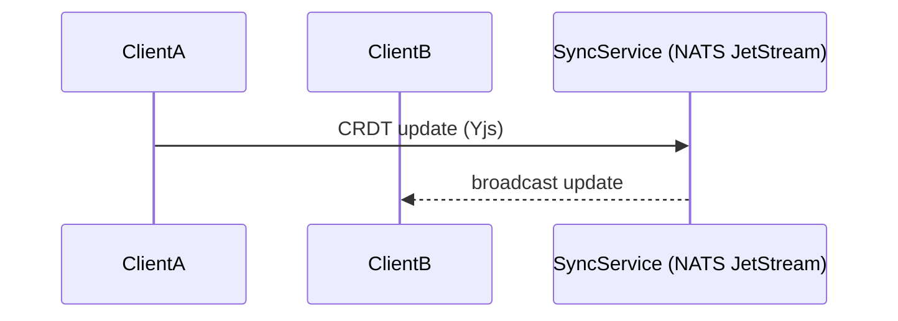

# Epic 15 – Cross-Platform Client Suite & Synchronisation Detailed Design

This document expands on `epic15plan.md`, describing architectural choices, data flows, and risk mitigations for bringing Prompt-Spaghetti to web, mobile, and desktop while offering robust offline-first collaboration powered by secure synchronisation.

Dependencies: Epic 11 (Auth/RBAC), Epic 13 (Analytics), Epic 14 (Experimentation), Epic 9 (Collab CRDT).

---

## 1. Responsive Web Interface (Story 15.1)

### 1.1 Framework & Tech

| Layer   | Choice                        | Rationale                                          |
| ------- | ----------------------------- | -------------------------------------------------- |
| UI      | React 19 + Chakra UI          | Consistent with Epics 13–14; SSR/Streaming support |
| Styling | Emotion CSS-in-JS             | Enables dynamic breakpoints & theming              |
| Canvas  | `react-flow` + WebGL fallback | High-perf graph rendering                          |
| PWA     | Workbox                       | Offline caching & install prompt                   |

### 1.2 Layout & Interaction

- Mobile-first CSS grid; collapsible sidebars with Windsurf color themes (Chakra preset).
- Node Editor mini-mode: tap to expand, pinch to zoom; haptic via `navigator.vibrate` (node connect success).
- Minimap with adaptive detail: Level-of-detail tied to FPS metrics (Epic 13), logged for A/B canvas tests (Epic 14).

- WebGPU polyfill fallback if WebGL context lost.
- "Degraded mode" banner when FPS <30.

### 1.3 Performance & Offline

- Service Worker caches static + GraphQL queries.
- IndexedDB cache mirrors ClickHouse hot metrics for offline dashboards.
- WebVitals logged to NATS `perf.web` for ongoing A/B (Epic 14).

### 1.4 Testing

- Percy visual regression across breakpoints.
- Cypress touch emulation scripts for gestures.

---

## 2. Native Mobile Applications (Story 15.2)

### 2.1 Architecture

| Aspect    | Choice                              | Rationale                                              |
| --------- | ----------------------------------- | ------------------------------------------------------ |
| Framework | React Native (Expo)                 | Code-share w/ web; mature plugin ecosys                |
| Canvas    | `react-native-skia`                 | ≥60 FPS graph rendering (benchmark with 50-node graph) |
| Local DB  | SQLite via WatermelonDB (encrypted) | Conflict-friendly & performant                         |
| Voice     | Expo Speech / native SDK            | Optional Claude voice prompt input                     |

### 2.2 Key Features

1. Graph editor parity: reuse business-logic package shared via Monorepo.
2. Offline queue: same CRDT ops queue as web; persisted in SQLite with "Quick-Sync" button for manual flush.
3. Biometric auth guard (FaceID/Android biometry) bridging Epic 11 JWT refresh.

### 2.3 Deployment

- CI via EAS (Expo) → TestFlight & Play Console tracks.
- Firebase Crashlytics + Epic 13 ingestion adapter.

### 2.4 Risks & Mitigations

| Risk                   | Mitigation                                         |
| ---------------------- | -------------------------------------------------- |
| Canvas perf on low-end | Skia fallback to simplified SVG; FPS monitor alert |
| Fragmentation          | Device matrix (top 12) test farm in CI             |

---

## 3. Desktop Application Suite (Story 15.3)

### 3.1 Framework Evaluation

- PoC comparison (5 days): Electron, Tauri, Qt.
- Metrics: bundle size, cold-start, graph FPS.
- Decision matrix → adopt **Tauri** (Rust core) if FPS ≥55 & bundle <50 MB; else fallback Electron.

### 3.2 App Shell

- Shared React renderer (from web) embedded in Tauri WebView2.
- Rust side-car provides:
  - File system access (import/export .psgraph).
  - OS notifications.
  - Auto-update via `tauri-bunderist` (Sparkle/Squirrel).

### 3.3 Integrations

- Global shortcut `⌘⇧P` / `Ctrl+Shift+P` to open Claude quick-prompt.
- Tray icon shows queued offline ops count.

### 3.4 Testing & Perf

- Spectron-equivalent for Tauri (`tauri-driver`).
- GPU usage sampling; regress if >80 %.

---

## 4. Synchronisation & Cloud Storage (Story 15.4)

### 4.1 Protocol Overview

- CRDT: **Yjs** with custom `GraphNode` type for prompt graphs.
- Transport: NATS subject `sync.<org_id>.<project_id>` (ephemeral consumer per client).
- Ops compressed via msg-pack; max 32 KB.

### 4.2 Offline Queue & Conflict Handling

- Each client persists Yjs Update queue in IndexedDB/SQLite.
- Vector-clock metadata detects divergence; automatic merge or prompts visual diff (Epic 9 diff UI).

### 4.3 Security

| Concern        | Approach                                                      |
| -------------- | ------------------------------------------------------------- |
| E2E encryption | XChaCha20-Poly1305; keys via Epic 11 key-exchange API         |
| Access control | JWT in NATS connection; subject ACLs per org/team             |
| GDPR purge     | CRDT docs decrypted client-side; server holds ciphertext only |

### 4.4 Sync Analytics

- SyncService publishes metrics `sync.lag`, `conflict.rate`, `health.score` stored in ClickHouse; new dashboard widget "Sync Health" in Epic 13.

### 4.5 Open-Source Storage Gateway

- Optional S3 backend via `sync-snapshot` job for cold storage; enterprise customers can self-host.

---

## 5. Shared Component Strategy

- Monorepo (`turbo`) with packages:
  - `graph-core` — pure TS graph model + CRDT wrappers.
  - `ui-kit` — React/React-Native primitives (Chakra base).
  - `analytics-sdk` — ClickHouse & NATS adapters.
  - `claude-sdk` — shared Claude prompt & voice helpers.
- CI badge tracks code-reuse %, aiming ≥85 %.
- 85 % code reuse target across clients.

---

## 6. Testing Strategy

| Layer       | Tools      | Key Checks                              |
| ----------- | ---------- | --------------------------------------- |
| Unit        | Jest       | graph-core ops, encryption utils        |
| Integration | Detox      | mobile offline ↔ sync reconnection     |
| End-to-End  | Playwright | web PWA install & offline edits         |
| Load        | Locust     | 500 concurrent clients sync RTT <300 ms |
| Chaos       | Toxiproxy  | 30 % packet loss simulation             |

---

## 7. Security & Compliance

- All offline stores encrypted at rest.
- Bi-annual penetration test; dependencies scanned via Snyk.
- Accessibility WCAG 2.2 AA across platforms.

---

## 8. Deployment & Operations

- Kubernetes `sync-service` (Go) with HPA on msg rate.
- Prometheus exporters: FPS, sync lag, mobile crash rate.
- Sentry source-maps for React Native & Tauri.

---

## 9. Risks & Mitigations

| Risk                               | Impact | Mitigation                                              |
| ---------------------------------- | ------ | ------------------------------------------------------- |
| Framework pivot delays             | Medium | Parallel PoCs weeks 1-2, decision gate                  |
| Offline conflict edge cases        | High   | Fuzz CRDT ops, visual diff fallback                     |
| NATS consumer drops on flaky links | Medium | Client retry queue w/ exponential backoff, ack tracking |
| App-store rejection                | Medium | Follow platform HIG; beta review via TestFlight         |

---

## 10. Future Enhancements

- Graph voice editing (speech-to-prompt) on mobile.
- Cloud-sync delta compression via Brotli.
- Desktop plugin system for IDE integrations.
