# Epic 19 - Security & Compliance Framework Visual Architecture

**Document Version**: 1.0  
**Created**: 2025-07-25  
**Epic**: 19 - Security & Compliance Framework  
**Purpose**: Visual documentation for complex security flows and architecture

## Overview

This document provides comprehensive visual architecture diagrams for the Epic 19 Security & Compliance Framework, illustrating complex security flows, authentication processes, compliance workflows, and system integrations.

## 1. Security Framework Overview Architecture

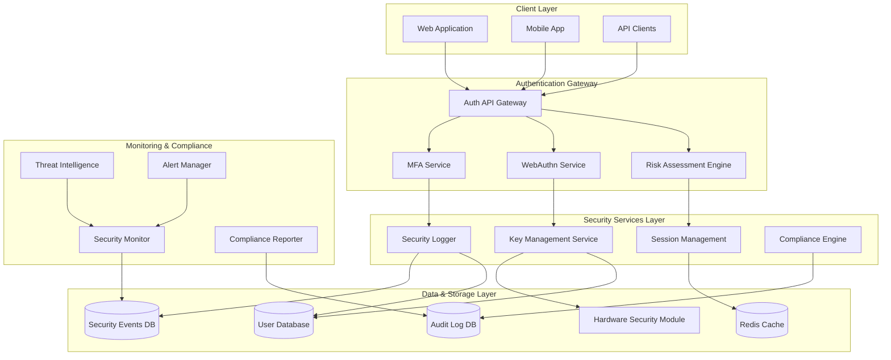

## 2. Authentication & Authorization Flow

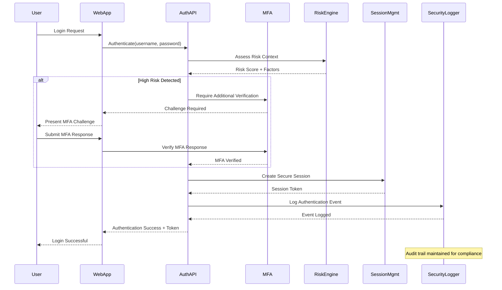

## 3. WebAuthn/FIDO2 Registration Flow

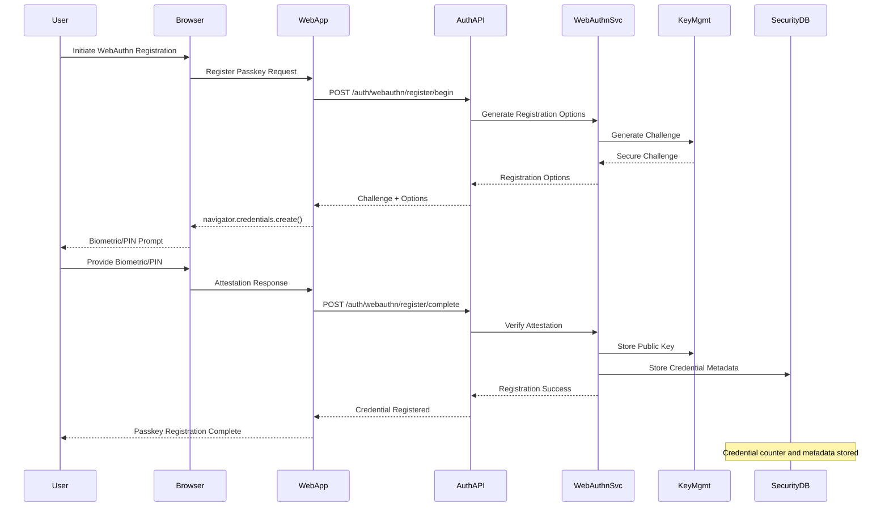

## 4. Risk Assessment Engine Architecture

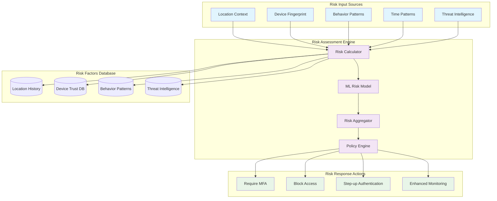

## 5. Compliance Reporting Architecture

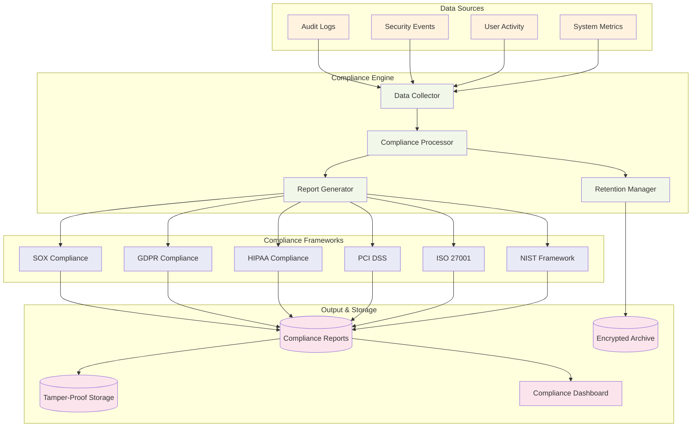

## 6. Security Event Monitoring Flow

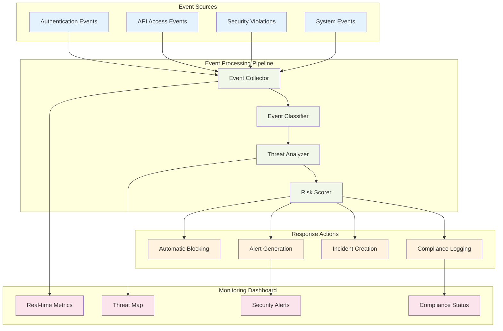

## 7. API Key Management Lifecycle

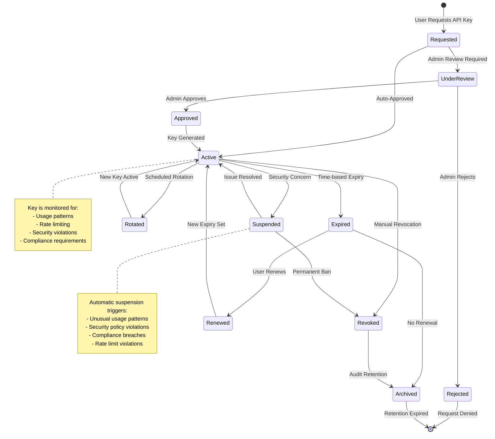

## 8. Session Management Architecture

```mermaid
graph TB
    subgraph "Session Lifecycle"
        SessionCreate[Session Creation]
        SessionValidate[Session Validation]
        SessionRefresh[Session Refresh]
        SessionTerminate[Session Termination]
    end

    subgraph "Session Storage"
        RedisCluster[(Redis Cluster)]
        SessionDB[(Session Database)]
        SessionBackup[(Session Backup)]
    end

    subgraph "Security Controls"
        IPValidation[IP Address Validation]
        DeviceFingerprint[Device Fingerprinting]
        ConcurrencyControl[Session Concurrency Control]
        AnomalyDetection[Session Anomaly Detection]
    end

    subgraph "Session Context"
        UserContext[User Context]
        SecurityContext[Security Context]
        PermissionContext[Permission Context]
        ComplianceContext[Compliance Context]
    end

    subgraph "Monitoring & Audit"
        SessionLogger[Session Logger]
        ActivityTracker[Activity Tracker]
        ComplianceTracker[Compliance Tracker]
        SecurityMonitor[Security Monitor]
    end

    SessionCreate --> RedisCluster
    SessionValidate --> RedisCluster
    SessionRefresh --> RedisCluster
    SessionTerminate --> RedisCluster

    RedisCluster --> SessionDB
    SessionDB --> SessionBackup

    SessionValidate --> IPValidation
    SessionValidate --> DeviceFingerprint
    SessionCreate --> ConcurrencyControl
    SessionValidate --> AnomalyDetection

    SessionCreate --> UserContext
    SessionCreate --> SecurityContext
    SessionCreate --> PermissionContext
    SessionCreate --> ComplianceContext

    SessionCreate --> SessionLogger
    SessionValidate --> ActivityTracker
    SessionRefresh --> ComplianceTracker
    SessionTerminate --> SecurityMonitor

    classDef lifecycle fill:#e8f5e8
    classDef storage fill:#e3f2fd
    classDef security fill:#fff3e0
    classDef context fill:#f3e5f5
    classDef monitoring fill:#fce4ec

    class SessionCreate,SessionValidate,SessionRefresh,SessionTerminate lifecycle
    class RedisCluster,SessionDB,SessionBackup storage
    class IPValidation,DeviceFingerprint,ConcurrencyControl,AnomalyDetection security
    class UserContext,SecurityContext,PermissionContext,ComplianceContext context
    class SessionLogger,ActivityTracker,ComplianceTracker,SecurityMonitor monitoring
```

## 9. Multi-Factor Authentication Flow

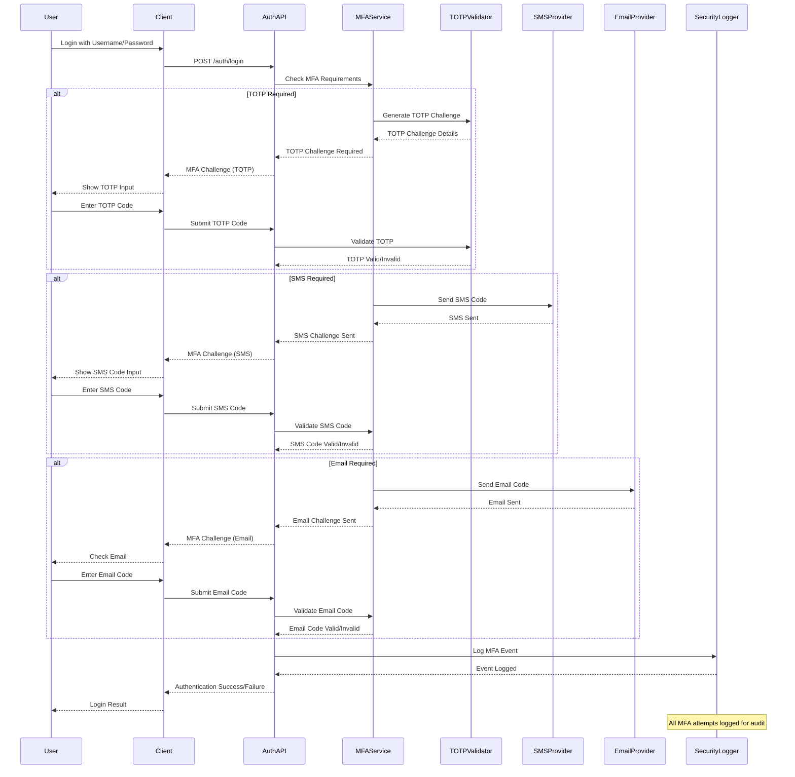

## 10. Encryption Key Management Flow

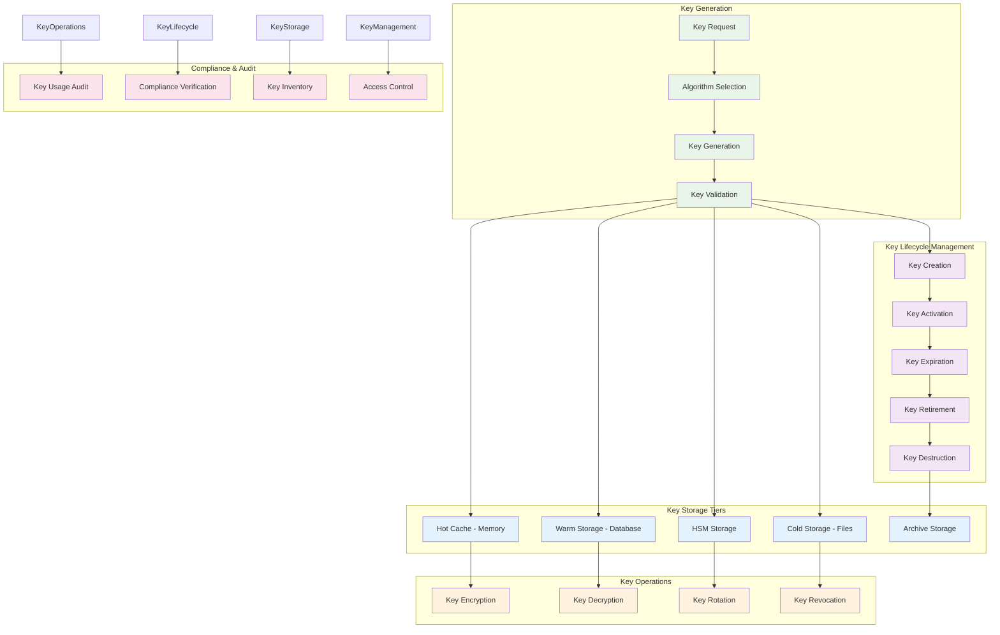

## 11. Threat Intelligence Integration

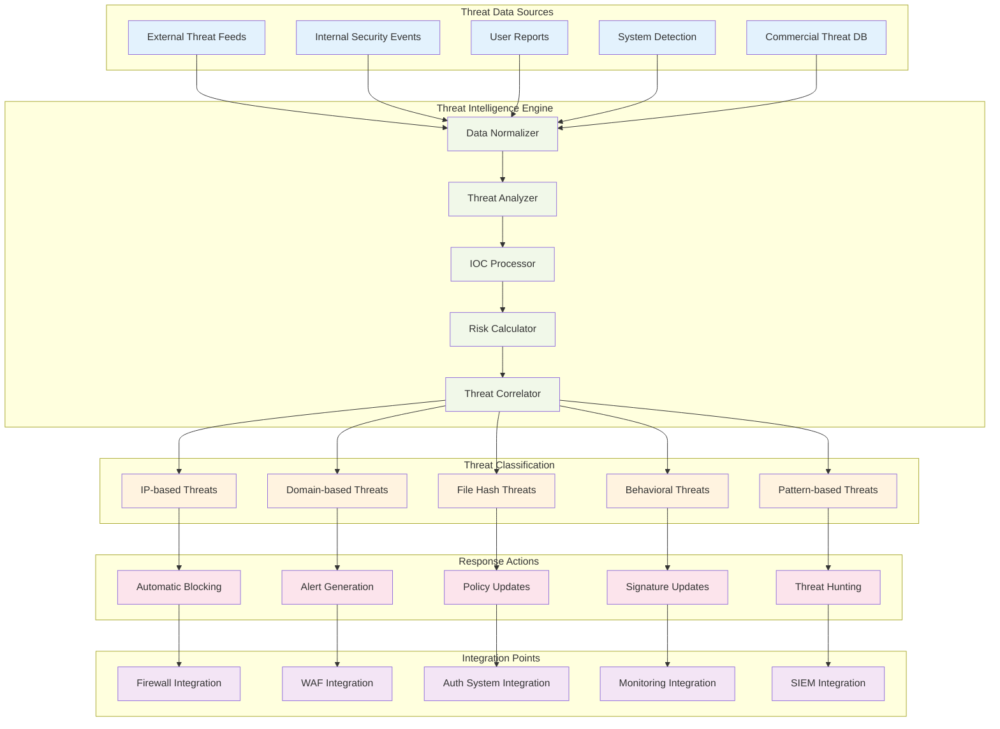

## 12. Data Classification & Protection Flow

```mermaid
flowchart TD
    subgraph "Data Sources"
        UserData[User Data]
        SystemData[System Data]
        AuditData[Audit Data]
        APIData[API Data]
        FileData[File Data]
    end

    subgraph "Classification Engine"
        DataDiscovery[Data Discovery]
        ContentAnalysis[Content Analysis]
        ClassificationRules[Classification Rules]
        MLClassifier[ML Classifier]
        PolicyEngine[Policy Engine]
    end

    subgraph "Data Classifications"
        Public[Public Data]
        Internal[Internal Data]
        Confidential[Confidential Data]
        Restricted[Restricted Data]
        PII[Personal Data (PII)]
        PHI[Health Data (PHI)]
    end

    subgraph "Protection Controls"
        Encryption[Data Encryption]
        AccessControl[Access Controls]
        DataMasking[Data Masking]
        Tokenization[Tokenization]
        DLP[Data Loss Prevention]
        Watermarking[Digital Watermarking]
    end

    subgraph "Compliance & Audit"
        ComplianceCheck[Compliance Verification]
        DataInventory[Data Inventory]
        AccessAudit[Access Audit]
        RetentionMgmt[Retention Management]
        BreachDetection[Breach Detection]
    end

    UserData --> DataDiscovery
    SystemData --> DataDiscovery
    AuditData --> ContentAnalysis
    APIData --> ContentAnalysis
    FileData --> ContentAnalysis

    DataDiscovery --> ClassificationRules
    ContentAnalysis --> MLClassifier
    ClassificationRules --> PolicyEngine
    MLClassifier --> PolicyEngine

    PolicyEngine --> Public
    PolicyEngine --> Internal
    PolicyEngine --> Confidential
    PolicyEngine --> Restricted
    PolicyEngine --> PII
    PolicyEngine --> PHI

    Public --> AccessControl
    Internal --> Encryption
    Confidential --> DataMasking
    Restricted --> Tokenization
    PII --> DLP
    PHI --> Watermarking

    Encryption --> ComplianceCheck
    AccessControl --> DataInventory
    DataMasking --> AccessAudit
    Tokenization --> RetentionMgmt
    DLP --> BreachDetection
    Watermarking --> ComplianceCheck

    classDef dataSource fill:#e3f2fd
    classDef engine fill:#f1f8e9
    classDef classification fill:#fff3e0
    classDef protection fill:#fce4ec
    classDef compliance fill:#f3e5f5

    class UserData,SystemData,AuditData,APIData,FileData dataSource
    class DataDiscovery,ContentAnalysis,ClassificationRules,MLClassifier,PolicyEngine engine
    class Public,Internal,Confidential,Restricted,PII,PHI classification
    class Encryption,AccessControl,DataMasking,Tokenization,DLP,Watermarking protection
    class ComplianceCheck,DataInventory,AccessAudit,RetentionMgmt,BreachDetection compliance
```

## Architecture Integration Summary

### Key Integration Points

| Component              | Integration Method        | Security Level | Compliance Impact  |
| ---------------------- | ------------------------- | -------------- | ------------------ |
| Authentication Gateway | JWT + OAuth 2.0           | High           | SOX, GDPR, HIPAA   |
| Session Management     | Redis + Database          | High           | All Frameworks     |
| Key Management         | HSM + Multi-tier Storage  | Critical       | PCI DSS, ISO 27001 |
| Audit Logging          | Tamper-proof + Encryption | Critical       | All Frameworks     |
| Risk Assessment        | ML + Behavioral Analysis  | Medium         | NIST, ISO 27001    |
| Compliance Reporting   | Automated + Scheduled     | High           | All Frameworks     |

### Security Architecture Principles

1. **Defense in Depth**: Multiple security layers with fail-safe mechanisms
2. **Zero Trust**: Never trust, always verify principle
3. **Principle of Least Privilege**: Minimal access rights
4. **Data Protection**: Encryption at rest and in transit
5. **Continuous Monitoring**: Real-time security monitoring
6. **Compliance by Design**: Built-in compliance controls

### Performance Characteristics

| Flow Type          | Target Latency | Throughput       | Scalability     |
| ------------------ | -------------- | ---------------- | --------------- |
| Authentication     | < 200ms        | 1000 req/sec     | Horizontal      |
| Session Validation | < 50ms         | 5000 req/sec     | Cached          |
| Risk Assessment    | < 100ms        | 500 req/sec      | ML-optimized    |
| Audit Logging      | Async          | 10000 events/sec | Queue-based     |
| Key Operations     | < 10ms         | 2000 ops/sec     | HSM-backed      |
| Compliance Reports | < 5s           | 10 reports/min   | Batch-processed |

---

**Document Status**: ✅ Complete  
**Review Cycle**: Quarterly  
**Next Review**: Q4 2025  
**Maintainer**: Security Architecture Team
