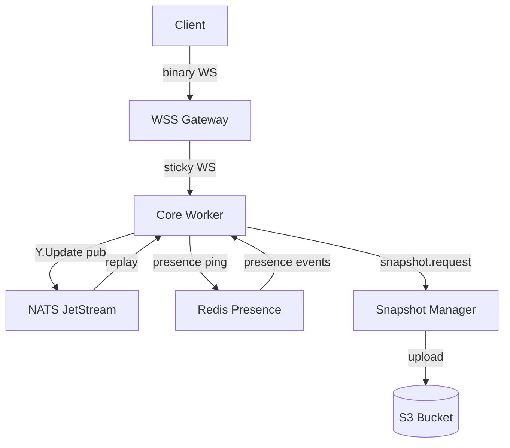
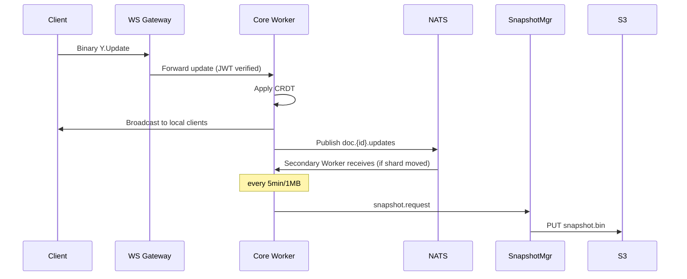
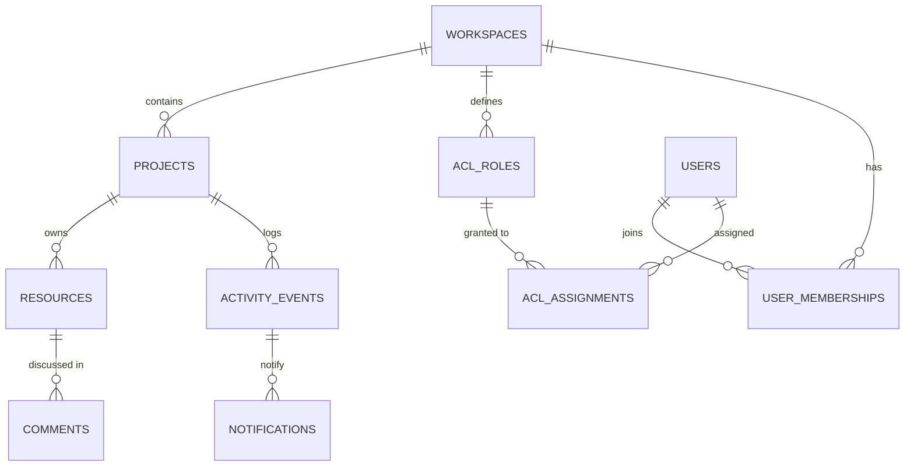
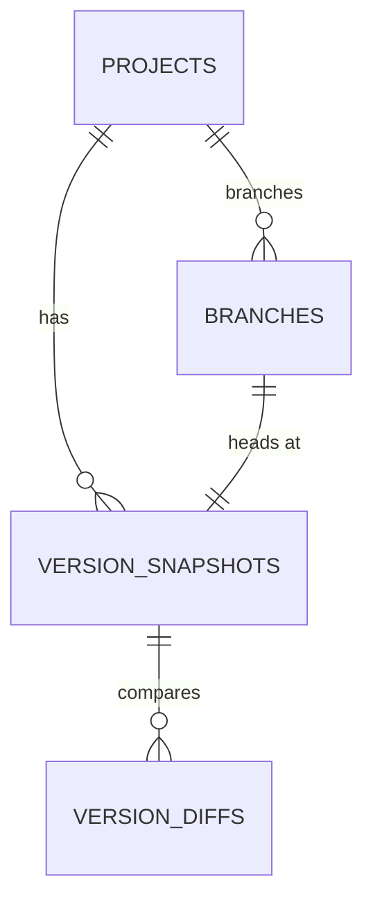

# Epic 9 – Detailed Design & Architecture

This document captures architectural decisions, design details, risks, and refinement suggestions that underpin each story in **Epic 9 – Collaborative Editing & Workflow**.  
It should be read in conjunction with `epic9plan.md`, which lists granular implementation tasks.

---

## 1. Collaboration Service (Story 9.1)

### 1.1 Purpose

Provide low-latency, real-time editing of directed graphs plus user presence/awareness over secure WebSocket connections. It concentrates CRDT logic and network fan-out so upstream services stay stateless.

### 1.2 Key Decisions

| Aspect        | Decision                                                                         | Rationale                                                             |
| ------------- | -------------------------------------------------------------------------------- | --------------------------------------------------------------------- |
| CRDT Engine   | **Yjs** with custom `Y.Graph` type                                               | Mature, binary diffs, awareness helpers; extensible for node/edge ops |
| Transport     | WebSocket (`ws` lib) – binary frames                                             | Widely supported; binary saves ~33 % over base64                      |
| Pub/Sub       | **NATS JetStream**                                                               | Lightweight, ordered, at-least-once semantics match CRDT idempotency  |
| Persistence   | Ops log in JetStream; snapshots (5 min / 1 MB) to S3; presence in Redis TTL keys | Balances durability with cost/perf                                    |
| Auth & RBAC   | JWT validated on connect; per-op ACL cached from Workspace Service               | Zero-trust, minimal latency                                           |
| Observability | OpenTelemetry traces; Prometheus metrics; logs to Loki                           | Production-grade insights                                             |

### 1.3 Internal Components

1. **WS Gateway** – TLS termination, JWT auth, sticky LB by `docId`, rate-limit.
2. **Core Worker** – Hosts in-mem `Y.Doc` shard; applies updates; publishes/consumes `doc.{id}.updates` on NATS; broadcasts to local clients.
3. **Snapshot Manager** – Queue-group consumers that serialise Y state and store to S3; multiple replicas for HA.
4. **Presence Store** – Redis keys `presence:{docId}:{userId}` (TTL = 10 s); Redis Pub/Sub `presence.{docId}` for joins/leaves.

Sequence (edit happy-path):

1. Client → Gateway (JWT) → Worker (binary `Y.Update`).
2. Worker applies, broadcasts to clients, publishes to NATS.
3. Other Workers (if shard moves) replay ops.
4. Snapshot Manager periodically persists state.

### 1.4 Strengths

- Mature OSS components minimise bespoke code.
- Horizontal scaling via consistent hashing.
- CRDT ensures convergence despite at-least-once delivery.

### 1.5 Risks / Mitigations

- **Shard hotspot** – Uneven doc popularity may overload a worker shard. _Mitigation_: expose shard-load metrics (ops/sec, mem) in Prometheus; add optional rebalance coordinator that can update shard assignments via NATS KV.

- **CPU-bound merges** on huge graphs → Benchmark spike; switch to worker threads or Rust if P99 > 10 ms.
- **Presence load** (thousands of users) → In-memory Redis, avoid Postgres writes.
- **Snapshot lag** during spikes → Multiple Snapshot Manager replicas; monitor lag metric.

### 1.6 Phase-1 PoC Tasks

1. Repo scaffold (`graph-crdt`, `collab-worker`, `infra/local`).
2. Implement `Y.Graph` + unit tests.
3. Single-node WS server with Redis presence.
4. CI, metrics, and load-test harness.

### 1.7 Component Diagram

### 1.8 Edit-Flow Sequence Diagram

---

## 2. Collaborative Workspace (Story 9.2)

### 2.1 Relational Data Model

| Table              | Key Columns                                                                 | Purpose                                                 |
| ------------------ | --------------------------------------------------------------------------- | ------------------------------------------------------- |
| `workspaces`       | `id (PK)`, `owner_id`, `name`, `created_at`                                 | Logical container for projects and ACL roots            |
| `projects`         | `id (PK)`, `workspace_id (FK)`, `name`, `description`, `created_at`         | Graph/document grouping inside a workspace              |
| `resources`        | `id (PK)`, `project_id (FK)`, `type`, `json_meta`, `created_at`             | Generic table for artefacts (graphs, files, templates)  |
| `acl_roles`        | `id (PK)`, `workspace_id (FK)`, `name`, `permissions (bitmask)`             | Custom RBAC roles per workspace                         |
| `acl_assignments`  | `user_id`, `role_id (FK)`, `scope_id`, `scope_type`                         | Many-to-many: users → roles (workspace / project scope) |
| `user_memberships` | `user_id`, `workspace_id`, `joined_at`, `state`                             | Invitation & membership tracking                        |
| `activity_events`  | `id (PK)`, `project_id`, `actor_id`, `type`, `payload JSONB`, `created_at`  | Feed items (commented, edited, etc.)                    |
| `comments`         | `id (PK)`, `resource_id`, `author_id`, `parent_id`, `body_md`, `created_at` | Threaded comments                                       |
| `notifications`    | `id (PK)`, `user_id`, `event_id (FK)`, `read_at`                            | Delivery of activity events                             |

#### Index & Performance Notes

- Composite index `(workspace_id, created_at DESC)` on `activity_events` for feed paging.
- GIN index on `payload` JSONB for flexible querying/filtering.
- `acl_assignments` updated emits `workspace.acl.updated` NATS event → Collaboration Service cache invalidation.

### 2.2 Mermaid ER Diagram

---

## 3. Version History & Comparison (Story 9.3)

### 3.1 Relational / Object Storage Model

| Store                          | Key Fields                                                                            | Purpose                                    |
| ------------------------------ | ------------------------------------------------------------------------------------- | ------------------------------------------ |
| `version_snapshots` (Postgres) | `id (PK)`, `project_id`, `branch`, `s3_uri`, `created_by`, `created_at`, `size_bytes` | Pointer to immutable snapshot artefact     |
| `version_diffs` (Postgres)     | `id (PK)`, `from_snapshot_id`, `to_snapshot_id`, `diff_json`, `created_at`            | Pre-computed graph diffs for fast UI       |
| `branches` (Postgres)          | `id(PK)`, `project_id`, `name`, `head_snapshot_id`, `created_at`                      | Lightweight branch metadata                |
| `change_events` (JetStream)    | Subject `project.{id}.ops`                                                            | Stream of CRDT ops with author attribution |
| Snapshots (S3)                 | Key: `snap/{projectId}/{uuid}.bin`                                                    | Compressed Yjs state @ snapshot point      |

### 3.2 Mermaid ER Diagram

### 3.3 Notes

- Snapshot creation triggered by Collaboration Service `snapshot.done` → Versioning Service persists row in `version_snapshots`.
- `version_diffs` lazily generated on first comparison request and cached.
- Branch HEAD update uses transaction to change `head_snapshot_id` and insert snapshot atomically.

---

## 3. Version History & Comparison (Story 9.3)

- Snapshot artifacts (S3 URIs) emitted on `snapshot.done` events → **Versioning Service** ingests to build version list and diff bases.
- Ops log stream provides fine-grained attribution for change authorship.

---

## 4. Workflow Orchestration (Story 9.4)

- State transitions (e.g., _review → approved_) published as CRDT metadata ops so that every client reflects workflow status in real time.
- Locking mechanism leverages Redis SETNX with TTL for optimistic lock acquisition on critical nodes.

---

## 5. Open Questions

1. Thresholds for **cold-storage offload** of inactive documents?
2. Mobile/offline persistence strategy (IndexedDB?) for clients.
3. Branch metadata schema – embed in snapshot header or separate table?

---

## 6. Glossary

- **CRDT** – Conflict-free Replicated Data Type.
- **Y.Update** – Binary diff payload produced by Yjs.
- **Shard** – A subset of documents assigned to one Worker instance.
- **RBAC** – Role-Based Access Control.
- **TTL** – Time-To-Live (automatic key expiry duration).

---

## 7. Testing Strategy

- **Unit tests** – Validate Y.Graph convergence, Workspace/Versioning DAL functions.
- **Integration tests** – docker-compose stack (Gateway, Worker, NATS, Redis); assert two mock clients stay in sync.
- **Load tests** – Artillery simulating 50 concurrent users editing a 10k-node graph; capture P99 latency & memory.
- **End-to-end** – Cypress flow: create workspace → collaborative edit → snapshot → diff → restore.
- **Chaos tests** – Kill Worker pod during heavy edits; verify replay and no data loss.
