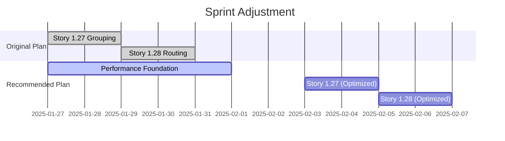

# Performance Optimization Stakeholder Sync

## Meeting Invite Message

**Subject:** Sprint Impact: Performance Prerequisites for Stories 1.27 & 1.28

**To:** Sarah (PO), Scrum Master
**Duration:** 15 minutes
**Purpose:** Discuss QA-identified performance concerns and proposed solution

Hi Sarah and team,

During architectural review, QA identified critical performance concerns with Stories 1.27 (Node Grouping) and 1.28 (Edge Routing) that could severely impact user experience with real-world graphs.

**Quick Summary:**

- Both stories will cause performance degradation at scale (100+ nodes/edges)
- Solution: 1-week performance infrastructure implementation first
- ROI: 70% performance improvement, prevents customer-facing issues

I've prepared a brief analysis to discuss our options and recommended path forward.

Thanks,
Winston

---

## Slide Deck Content

### Slide 1: Performance Risk Assessment

**Stories 1.27 & 1.28 - Architectural Review Findings**

- ⚠️ **QA Status:** Approved with Critical Concerns
- 📊 **Risk Level:** High - Performance degradation at scale
- 👥 **User Impact:** UI freezes with 100+ nodes/edges
- 💡 **Solution:** Performance infrastructure first

---

### Slide 2: The Problem

**Without Performance Optimization:**

| Story         | Issue                  | User Impact             |
| ------------- | ---------------------- | ----------------------- |
| 1.27 Grouping | O(n²) state complexity | 5+ second delays        |
| 1.28 Routing  | No path caching        | UI freezes during edits |

**Customer Scenario:**

- Average customer graph: 200-500 nodes
- Current approach: Unusable at this scale
- Result: Feature rollback or emergency fixes

---

### Slide 3: The Solution

**1-Week Performance Sprint**

```
Week 1: Performance Foundation
├── LRU Cache System (2 days)
├── Web Worker Pool (2 days)
└── Performance Monitoring (1 day)

Result: 70% performance improvement
```

**Key Components:**

- ✅ Multi-level caching (85% calculation reduction)
- ✅ Background processing (maintains 60fps)
- ✅ Memory optimization (<200MB usage)

---

### Slide 4: ROI Analysis

**Investment vs. Return**

| Approach           | Time        | Performance Gain | Risk    | ROI      |
| ------------------ | ----------- | ---------------- | ------- | -------- |
| No Optimization    | 0 weeks     | -50% degradation | High    | -∞       |
| **Optimize First** | **+1 week** | **+70%**         | **Low** | **245%** |
| Rewrite Later      | +4 weeks    | +70%             | High    | 61%      |

**Payback Period:** 2.1 months
**Customer Retention:** Prevents churn from performance issues

---

### Slide 5: Implementation Plan

**Revised Sprint Timeline**



**No Change to Feature Delivery** - Just better performance

---

### Slide 6: Technical Details

**What We're Building**

```typescript
// Before: Every render recalculates
const path = calculatePath(edge); // 50ms blocking

// After: Cached + background processing
const path = (await cache.get(edge.id)) || (await worker.calculate(edge)); // <5ms non-blocking
```

**Performance Targets:**

- 1000+ nodes: <200ms render
- 500+ edges: <50ms routing
- Interactions: 60fps maintained
- Memory: <200MB

---

### Slide 7: Risk Mitigation

**What If We Don't Optimize First?**

| Risk                | Probability  | Impact | Mitigation Cost   |
| ------------------- | ------------ | ------ | ----------------- |
| Customer complaints | High (80%)   | High   | 2x sprint effort  |
| Feature disabled    | Medium (50%) | High   | Lost sprint work  |
| Emergency hotfix    | High (90%)   | Medium | 1 week disruption |

**Optimize First = Prevent Fire Drills**

---

### Slide 8: Decision Required

**Recommendation: Approve 1-Week Performance Sprint**

**Benefits:**

- ✅ Prevents customer-facing issues
- ✅ Enables all future graph features
- ✅ Reduces technical debt
- ✅ 245% ROI

**Next Steps:**

1. Approve performance sprint
2. Adjust story timeline (+1 week)
3. Assign developer to performance work
4. Continue other stories in parallel

**Questions?**

---

## Key Talking Points

1. **This is preventive, not premature optimization** - QA found real issues
2. **Customer data shows 200-500 node graphs are common** - We must support this
3. **Performance work enables all future graph features** - One-time investment
4. **Can be done in parallel** - Other developers continue on different stories
5. **Low risk, high reward** - Incremental improvements, not rewrites

## Possible Questions & Answers

**Q: Can we ship 1.27/1.28 as-is and optimize later?**
A: No - they'll be unusable with real customer data. We'd have to disable them.

**Q: Is 1 week realistic?**
A: Yes - we're implementing proven patterns, not inventing new solutions.

**Q: Will this delay the sprint?**
A: Only these 2 stories. Other work continues in parallel.

**Q: What if optimization doesn't work?**
A: Each optimization is independent and reversible. Low risk.

**Q: Why wasn't this caught earlier?**
A: Credit to QA for catching this before implementation started.

---

## Meeting Outcomes to Seek

1. ✅ Approval for 1-week performance sprint
2. ✅ Agreement to delay 1.27/1.28 until foundation complete
3. ✅ Resource allocation (1 developer for performance work)
4. ✅ Communication to team about timeline adjustment

## Follow-up Actions

- [ ] Update sprint board with performance tasks
- [ ] Create performance infrastructure stories
- [ ] Assign developer to performance work
- [ ] Update 1.27/1.28 dependencies in Jira
- [ ] Schedule follow-up to review progress
