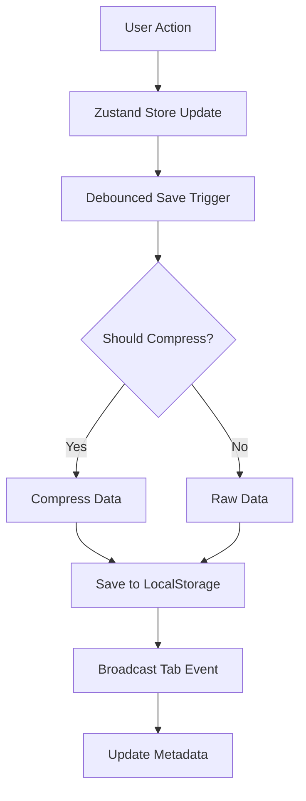
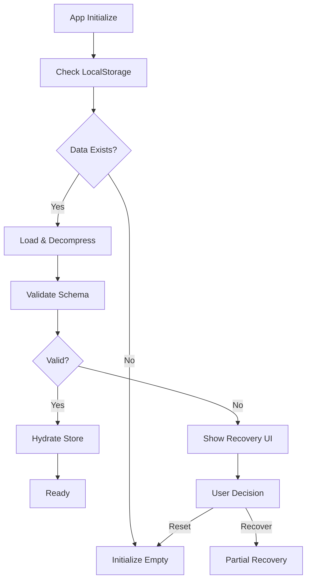

# Technical Design: Persistence Layer Architecture

## Overview

This document outlines the technical design for the browser-based persistence layer that will provide automatic state saving and restoration for the graph editor application.

## Architecture Components

### 1. Core Persistence System

```typescript
// packages/core/persistence/PersistenceManager.ts
interface PersistenceManager {
  // Core operations
  save(state: GraphState): Promise<void>;
  load(): Promise<GraphState | null>;
  clear(): Promise<void>;

  // Metadata operations
  getMetadata(): Promise<PersistenceMetadata>;
  getStorageInfo(): Promise<StorageInfo>;

  // Versioning
  migrate(state: unknown, fromVersion: number): GraphState;
}

interface PersistenceMetadata {
  version: number;
  lastModified: Date;
  size: number;
  compressed: boolean;
  checksum: string;
}

interface StorageInfo {
  used: number;
  available: number;
  quota: number;
  percentage: number;
}
```

### 2. Zustand Integration

```typescript
// packages/core/persistence/zustandPersist.ts
import { StateCreator, StoreMutatorIdentifier } from 'zustand';
import { PersistenceManager } from './PersistenceManager';

type Persist = <
  T extends State,
  Mps extends [StoreMutatorIdentifier, unknown][] = [],
  Mcs extends [StoreMutatorIdentifier, unknown][] = []
>(
  f: StateCreator<T, Mps, Mcs>,
  options: PersistOptions<T>
) => StateCreator<T, Mps, Mcs>;

interface PersistOptions<T> {
  name: string;
  version: number;
  partialize?: (state: T) => Partial<T>;
  merge?: (persistedState: unknown, currentState: T) => T;
  skipHydration?: boolean;
}

export const createPersistMiddleware = (
  manager: PersistenceManager
): Persist => {
  return (config, options) => (set, get, api) => {
    // Implementation details
    const persistState = debounce(async () => {
      const state = options.partialize ? options.partialize(get()) : get();
      await manager.save(state);
    }, 1000);

    // Subscribe to changes
    api.subscribe(persistState);

    // Hydration logic
    if (!options.skipHydration) {
      manager.load().then(state => {
        if (state) {
          set(options.merge ? options.merge(state, get()) : (state as T));
        }
      });
    }

    return config(set, get, api);
  };
};
```

### 3. Compression Strategy

```typescript
// packages/core/persistence/compression.ts
import LZString from 'lz-string';

interface CompressionStrategy {
  compress(data: string): string;
  decompress(data: string): string;
  shouldCompress(size: number): boolean;
}

export class LZStringCompression implements CompressionStrategy {
  private threshold = 100 * 1024; // 100KB

  compress(data: string): string {
    return LZString.compressToUTF16(data);
  }

  decompress(data: string): string {
    return LZString.decompressFromUTF16(data) || '';
  }

  shouldCompress(size: number): boolean {
    return size > this.threshold;
  }
}

// Compression wrapper
export class CompressedStorage {
  constructor(
    private storage: Storage,
    private compression: CompressionStrategy
  ) {}

  setItem(key: string, value: string): void {
    const size = new Blob([value]).size;
    const data = this.compression.shouldCompress(size)
      ? { compressed: true, data: this.compression.compress(value) }
      : { compressed: false, data: value };

    this.storage.setItem(key, JSON.stringify(data));
  }

  getItem(key: string): string | null {
    const stored = this.storage.getItem(key);
    if (!stored) return null;

    const { compressed, data } = JSON.parse(stored);
    return compressed ? this.compression.decompress(data) : data;
  }
}
```

### 4. Multi-Tab Synchronization

```typescript
// packages/core/persistence/TabSync.ts
interface TabSyncManager {
  broadcast(event: TabEvent): void;
  subscribe(handler: TabEventHandler): () => void;
  requestLeadership(): Promise<boolean>;
  isLeader(): boolean;
}

type TabEvent =
  | { type: 'STATE_CHANGED'; payload: GraphState }
  | { type: 'STATE_CONFLICT'; payload: ConflictInfo }
  | { type: 'STORAGE_CLEARED' }
  | { type: 'LEADER_ELECTED'; tabId: string };

export class BroadcastChannelSync implements TabSyncManager {
  private channel: BroadcastChannel;
  private tabId = crypto.randomUUID();
  private isLeaderTab = false;
  private handlers = new Set<TabEventHandler>();

  constructor(channelName: string) {
    this.channel = new BroadcastChannel(channelName);
    this.channel.onmessage = this.handleMessage.bind(this);
    this.electLeader();
  }

  private async electLeader(): Promise<void> {
    // Leader election algorithm
    const election = {
      type: 'ELECTION',
      tabId: this.tabId,
      timestamp: Date.now()
    };

    this.channel.postMessage(election);

    // Wait for other tabs to respond
    await new Promise(resolve => setTimeout(resolve, 100));

    // If no objection, become leader
    this.isLeaderTab = true;
    this.broadcast({
      type: 'LEADER_ELECTED',
      tabId: this.tabId
    });
  }

  broadcast(event: TabEvent): void {
    this.channel.postMessage({
      ...event,
      source: this.tabId,
      timestamp: Date.now()
    });
  }

  // ... rest of implementation
}
```

### 5. Conflict Resolution

```typescript
// packages/core/persistence/ConflictResolver.ts
interface ConflictResolver {
  detect(local: GraphState, remote: GraphState): ConflictInfo | null;
  resolve(conflict: ConflictInfo, strategy: ResolutionStrategy): GraphState;
}

type ResolutionStrategy = 'LOCAL_WINS' | 'REMOTE_WINS' | 'MERGE' | 'MANUAL';

interface ConflictInfo {
  localVersion: number;
  remoteVersion: number;
  localTimestamp: number;
  remoteTimestamp: number;
  differences: Difference[];
}

interface Difference {
  path: string;
  localValue: unknown;
  remoteValue: unknown;
  type: 'ADD' | 'DELETE' | 'MODIFY';
}

export class OptimisticLockResolver implements ConflictResolver {
  detect(local: GraphState, remote: GraphState): ConflictInfo | null {
    if (local.version === remote.version) return null;

    const differences = this.findDifferences(local, remote);
    if (differences.length === 0) return null;

    return {
      localVersion: local.version,
      remoteVersion: remote.version,
      localTimestamp: local.lastModified,
      remoteTimestamp: remote.lastModified,
      differences
    };
  }

  resolve(conflict: ConflictInfo, strategy: ResolutionStrategy): GraphState {
    switch (strategy) {
      case 'LOCAL_WINS':
        return this.localWins(conflict);
      case 'REMOTE_WINS':
        return this.remoteWins(conflict);
      case 'MERGE':
        return this.autoMerge(conflict);
      case 'MANUAL':
        throw new Error('Manual resolution required');
    }
  }

  private autoMerge(conflict: ConflictInfo): GraphState {
    // Three-way merge algorithm
    // 1. Find common ancestor
    // 2. Apply non-conflicting changes from both
    // 3. For conflicts, use timestamp-based resolution
    // Implementation details...
  }
}
```

## Data Flow

### Save Flow



### Load Flow



## Storage Schema

```typescript
// Storage key structure
const STORAGE_KEYS = {
  STATE: 'promptgraph:state:v1',
  METADATA: 'promptgraph:meta:v1',
  BACKUP: 'promptgraph:backup:v1',
  SETTINGS: 'promptgraph:settings:v1'
} as const;

// Stored state structure
interface StoredState {
  version: 1;
  timestamp: number;
  checksum: string;
  compressed: boolean;
  data: string | CompressedData;
}

interface CompressedData {
  algorithm: 'lz-string' | 'gzip';
  content: string;
  originalSize: number;
  compressedSize: number;
}

// Graph state structure
interface GraphState {
  version: number;
  lastModified: number;
  nodes: Node[];
  edges: Edge[];
  viewport: Viewport;
  metadata: {
    title?: string;
    description?: string;
    tags?: string[];
    createdAt: number;
    updatedAt: number;
  };
}
```

## Error Handling

### Storage Quota Exceeded

```typescript
class StorageQuotaManager {
  async ensureSpace(requiredBytes: number): Promise<boolean> {
    const info = await this.getStorageInfo();

    if (info.available > requiredBytes) {
      return true;
    }

    // Try cleanup strategies
    const strategies = [
      () => this.removeOldBackups(),
      () => this.compressUncompressed(),
      () => this.removeOrphanedData(),
      () => this.promptUserCleanup()
    ];

    for (const strategy of strategies) {
      await strategy();
      const newInfo = await this.getStorageInfo();
      if (newInfo.available > requiredBytes) {
        return true;
      }
    }

    return false;
  }
}
```

### Corruption Recovery

```typescript
class CorruptionRecovery {
  async attemptRecovery(corrupted: unknown): Promise<RecoveryResult> {
    const strategies = [
      () => this.tryParseJSON(corrupted),
      () => this.tryDecompress(corrupted),
      () => this.tryPartialRecovery(corrupted),
      () => this.tryBackupRestore()
    ];

    for (const strategy of strategies) {
      try {
        const result = await strategy();
        if (result.success) {
          return result;
        }
      } catch (error) {
        console.error('Recovery strategy failed:', error);
      }
    }

    return {
      success: false,
      error: 'Unable to recover data',
      partial: null
    };
  }
}
```

## Performance Considerations

### Optimization Strategies

1. **Debouncing**: 1-second delay for saves to batch rapid changes
2. **Compression**: Automatic for states > 100KB
3. **Partial Updates**: Only persist changed portions (future optimization)
4. **Web Workers**: Offload compression/decompression (for very large graphs)
5. **IndexedDB**: Migration path for graphs > 5MB

### Benchmarks

| Operation                 | Target  | Measurement Method |
| ------------------------- | ------- | ------------------ |
| Save (< 100KB)            | < 10ms  | Performance.now()  |
| Save (> 100KB compressed) | < 50ms  | Performance.now()  |
| Load (< 100KB)            | < 20ms  | Performance.now()  |
| Load (> 100KB compressed) | < 100ms | Performance.now()  |
| Conflict Detection        | < 5ms   | Performance.now()  |

## Security Considerations

1. **XSS Prevention**: Validate all loaded data against schema
2. **Data Integrity**: Checksum validation on load
3. **Privacy**: No sensitive data in localStorage keys
4. **Cleanup**: Clear storage on logout
5. **Encryption**: Optional encryption for sensitive graphs (future)

## Migration Strategy

```typescript
class MigrationManager {
  private migrations: Record<number, Migration> = {
    1: (data: unknown) => this.migrateV0ToV1(data),
    2: (data: unknown) => this.migrateV1ToV2(data)
    // Future migrations
  };

  async migrate(data: unknown, fromVersion: number): Promise<GraphState> {
    let current = data;

    for (let v = fromVersion; v < CURRENT_VERSION; v++) {
      const migration = this.migrations[v + 1];
      if (migration) {
        current = await migration(current);
      }
    }

    return current as GraphState;
  }
}
```

## Testing Strategy

### Unit Tests

- Compression/decompression with various sizes
- Schema validation with valid/invalid data
- Conflict detection algorithms
- Migration functions

### Integration Tests

- Full save/load cycle
- Multi-tab synchronization
- Quota handling
- Recovery flows

### E2E Tests

- User workflow with persistence
- Browser refresh preservation
- Tab switching scenarios
- Error recovery UX

## Implementation Phases

### Phase 1: Core Persistence (Story 1.19)

- Basic localStorage implementation
- Zustand middleware integration
- Simple compression

### Phase 2: Autosave (Story 1.20)

- Debounced save mechanism
- Save status indicators
- Basic conflict detection

### Phase 3: Recovery (Story 1.21)

- Schema validation
- Recovery UI
- Reset functionality

### Phase 4: Future Enhancements

- IndexedDB for large graphs
- Partial state updates
- Advanced merge strategies
- Encryption support
