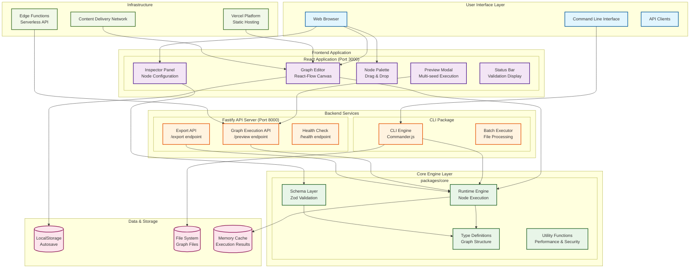
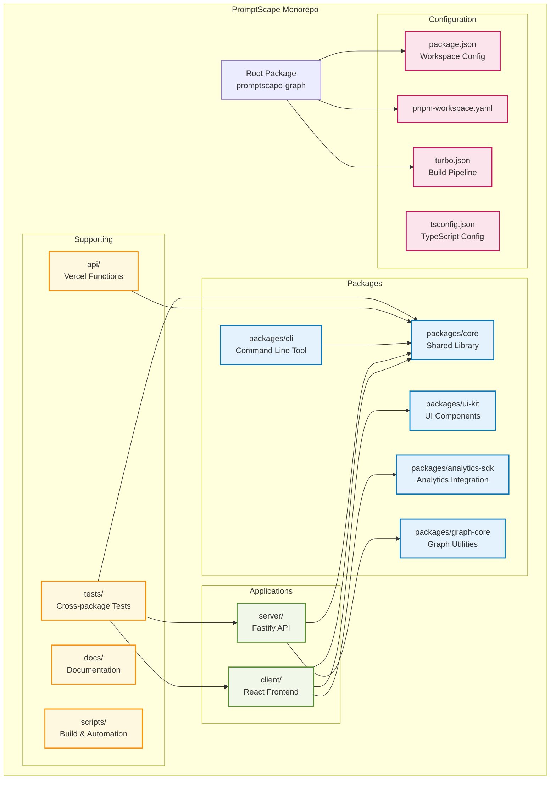
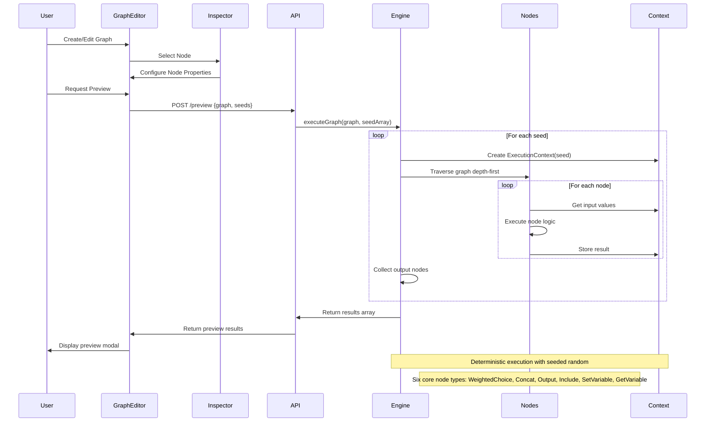
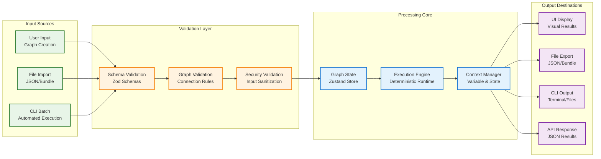
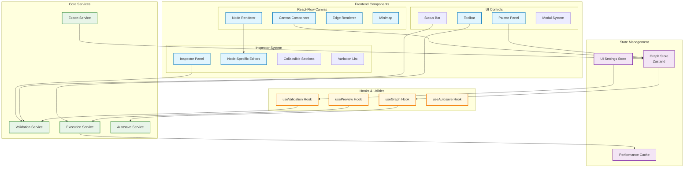
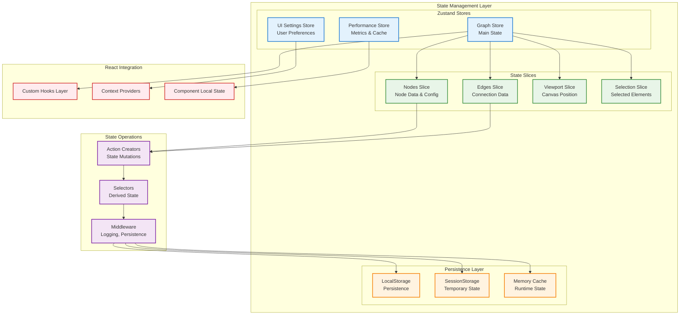

# PromptScape System Architecture Diagrams

**Task**: E18-1753114562020-546CB8 - Create architecture diagrams  
**Epic**: 18 - Technical Debt & Refactoring  
**Author**: Claude Code  
**Date**: 2025-07-22  

## Overview

This document provides comprehensive architectural diagrams for the PromptScape Randomizer Graph system, illustrating the system's structure, data flow, component interactions, and execution patterns. These diagrams serve as visual documentation for developers, architects, and stakeholders.

## 1. High-Level System Overview



## 2. Monorepo Structure Diagram



## 3. Node Execution Flow Diagram



## 4. Data Flow Architecture



## 5. Component Interaction Diagram



## 6. Runtime Engine Architecture

```mermaid
graph TB
    subgraph "Execution Context Layer"
        BASIC_CONTEXT[Basic ExecutionContext<br/>Variables, Seed, Depth]
        ADVANCED_CONTEXT[Advanced ExecutionContext<br/>State, Performance, Cache]
        EXTENDED_CONTEXT[Extended ExecutionContext<br/>Extensions, Debugging]
    end

    subgraph "Node Type Hierarchy"
        BASE_NODE[RuntimeNode<br/>Abstract Base]
        
        subgraph "Basic Nodes (Epic 3)"
            WEIGHTED_CHOICE[WeightedChoiceNode<br/>Random Selection]
            CONCAT_NODE[ConcatNode<br/>String Joining]
            OUTPUT_NODE[OutputNode<br/>Terminal Output]
            INCLUDE_NODE[IncludeNode<br/>External Reference]
            SET_VAR_NODE[SetVariableNode<br/>State Storage]
            GET_VAR_NODE[GetVariableNode<br/>State Retrieval]
        end
        
        subgraph "Advanced Nodes (Epic 7)"
            ADVANCED_BASE[AdvancedRuntimeNode<br/>Enhanced Base]
            WEIGHTED_ADV[WeightedAdvanced<br/>Complex Distributions]
            CONDITIONAL[Conditional<br/>Expression Evaluation]
            SEQUENTIAL[Sequential<br/>Pattern Sequences]
            MARKOV[Markov<br/>State Transitions]
        end
    end

    subgraph "Support Systems"
        SCHEMA_SYSTEM[Schema System<br/>Zod Validation]
        SECURITY_SYSTEM[Security System<br/>Input Sanitization]
        PERFORMANCE_SYSTEM[Performance System<br/>Metrics & Optimization]
        EXTENSION_SYSTEM[Extension System<br/>Plugin Architecture]
    end

    %% Inheritance
    BASE_NODE --> WEIGHTED_CHOICE
    BASE_NODE --> CONCAT_NODE
    BASE_NODE --> OUTPUT_NODE
    BASE_NODE --> INCLUDE_NODE
    BASE_NODE --> SET_VAR_NODE
    BASE_NODE --> GET_VAR_NODE

    BASE_NODE --> ADVANCED_BASE
    ADVANCED_BASE --> WEIGHTED_ADV
    ADVANCED_BASE --> CONDITIONAL
    ADVANCED_BASE --> SEQUENTIAL
    ADVANCED_BASE --> MARKOV

    %% Context Usage
    BASIC_CONTEXT --> WEIGHTED_CHOICE
    BASIC_CONTEXT --> CONCAT_NODE
    ADVANCED_CONTEXT --> WEIGHTED_ADV
    ADVANCED_CONTEXT --> CONDITIONAL
    EXTENDED_CONTEXT --> SEQUENTIAL
    EXTENDED_CONTEXT --> MARKOV

    %% System Integration
    SCHEMA_SYSTEM --> BASE_NODE
    SECURITY_SYSTEM --> BASE_NODE
    PERFORMANCE_SYSTEM --> ADVANCED_BASE
    EXTENSION_SYSTEM --> ADVANCED_BASE

    %% Styling
    classDef context fill:#e8f5e8,stroke:#2e7d32,stroke-width:2px
    classDef basic fill:#e3f2fd,stroke:#1976d2,stroke-width:2px
    classDef advanced fill:#f3e5f5,stroke:#7b1fa2,stroke-width:2px
    classDef system fill:#fff3e0,stroke:#f57c00,stroke-width:2px

    class BASIC_CONTEXT,ADVANCED_CONTEXT,EXTENDED_CONTEXT context
    class BASE_NODE,WEIGHTED_CHOICE,CONCAT_NODE,OUTPUT_NODE,INCLUDE_NODE,SET_VAR_NODE,GET_VAR_NODE basic
    class ADVANCED_BASE,WEIGHTED_ADV,CONDITIONAL,SEQUENTIAL,MARKOV advanced
    class SCHEMA_SYSTEM,SECURITY_SYSTEM,PERFORMANCE_SYSTEM,EXTENSION_SYSTEM system
```



## 7. State Management Architecture



## 8. API & Service Layer

```mermaid
graph TB
    subgraph "API Layer"
        subgraph "Fastify Server (Port 8000)"
            FASTIFY_APP[Fastify App<br/>Main Server]
            
            subgraph "Route Handlers"
                PREVIEW_ROUTE[POST /preview<br/>Graph Execution]
                EXPORT_ROUTE[POST /export<br/>Bundle Generation]
                HEALTH_ROUTE[GET /health<br/>Health Check]
                ANALYTICS_ROUTE[POST /analytics<br/>Usage Metrics]
            end
            
            subgraph "Middleware"
                CORS_MIDDLEWARE[CORS<br/>Cross-Origin]
                HELMET_MIDDLEWARE[Helmet<br/>Security Headers]
                LOGGING_MIDDLEWARE[Logging<br/>Request/Response]
                VALIDATION_MIDDLEWARE[Validation<br/>Request Schema]
            end
        end
        
        subgraph "Vercel Edge Functions"
            PREVIEW_EDGE[api/preview.js<br/>Serverless Preview]
            EXPORT_EDGE[api/export.js<br/>Serverless Export]
            HEALTH_EDGE[api/health.js<br/>Serverless Health]
        end
    end

    subgraph "Service Layer"
        EXECUTION_SERVICE_LAYER[Execution Service<br/>Graph Processing]
        EXPORT_SERVICE_LAYER[Export Service<br/>Bundle Conversion]
        VALIDATION_SERVICE_LAYER[Validation Service<br/>Schema Checking]
        ANALYTICS_SERVICE[Analytics Service<br/>Metrics Collection]
    end

    subgraph "Data Integration"
        CORE_ENGINE_API[Core Engine<br/>Runtime Execution]
        SCHEMA_VALIDATION_API[Schema Validation<br/>Zod Schemas]
        PERFORMANCE_TRACKING[Performance Tracking<br/>Metrics Collection]
        ERROR_HANDLING[Error Handling<br/>Graceful Failures]
    end

    %% Connections
    FASTIFY_APP --> PREVIEW_ROUTE
    FASTIFY_APP --> EXPORT_ROUTE
    FASTIFY_APP --> HEALTH_ROUTE
    FASTIFY_APP --> ANALYTICS_ROUTE

    FASTIFY_APP --> CORS_MIDDLEWARE
    FASTIFY_APP --> HELMET_MIDDLEWARE
    FASTIFY_APP --> LOGGING_MIDDLEWARE
    FASTIFY_APP --> VALIDATION_MIDDLEWARE

    PREVIEW_ROUTE --> EXECUTION_SERVICE_LAYER
    EXPORT_ROUTE --> EXPORT_SERVICE_LAYER
    HEALTH_ROUTE --> VALIDATION_SERVICE_LAYER
    ANALYTICS_ROUTE --> ANALYTICS_SERVICE

    EXECUTION_SERVICE_LAYER --> CORE_ENGINE_API
    EXPORT_SERVICE_LAYER --> SCHEMA_VALIDATION_API
    VALIDATION_SERVICE_LAYER --> PERFORMANCE_TRACKING
    ANALYTICS_SERVICE --> ERROR_HANDLING

    PREVIEW_EDGE --> EXECUTION_SERVICE_LAYER
    EXPORT_EDGE --> EXPORT_SERVICE_LAYER
    HEALTH_EDGE --> VALIDATION_SERVICE_LAYER

    %% Styling
    classDef api fill:#e3f2fd,stroke:#1976d2,stroke-width:2px
    classDef route fill:#e8f5e8,stroke:#388e3c,stroke-width:2px
    classDef middleware fill:#fff3e0,stroke:#f57c00,stroke-width:2px
    classDef service fill:#f3e5f5,stroke:#7b1fa2,stroke-width:2px
    classDef data fill:#ffebee,stroke:#d32f2f,stroke-width:2px

    class FASTIFY_APP,PREVIEW_EDGE,EXPORT_EDGE,HEALTH_EDGE api
    class PREVIEW_ROUTE,EXPORT_ROUTE,HEALTH_ROUTE,ANALYTICS_ROUTE route
    class CORS_MIDDLEWARE,HELMET_MIDDLEWARE,LOGGING_MIDDLEWARE,VALIDATION_MIDDLEWARE middleware
    class EXECUTION_SERVICE_LAYER,EXPORT_SERVICE_LAYER,VALIDATION_SERVICE_LAYER,ANALYTICS_SERVICE service
    class CORE_ENGINE_API,SCHEMA_VALIDATION_API,PERFORMANCE_TRACKING,ERROR_HANDLING data
```



## 9. Performance & Optimization Architecture

```mermaid
graph TB
    subgraph "Performance Monitoring"
        PERFORMANCE_TRACKER[Performance Tracker<br/>Global Instance]
        METRICS_COLLECTOR[Metrics Collector<br/>Real-time Data]
        BASELINE_SYSTEM[Baseline System<br/>Historical Comparison]
    end

    subgraph "Optimization Layers"
        subgraph "Frontend Optimizations"
            REACT_MEMO[React.memo<br/>Component Memoization]
            CANVAS_VIRTUAL[Canvas Virtualization<br/>Large Graph Handling]
            DEBOUNCED_OPS[Debounced Operations<br/>Reduced Computation]
            LAZY_LOADING[Lazy Loading<br/>Code Splitting]
        end
        
        subgraph "Backend Optimizations"
            CONTEXT_POOLING[Context Pooling<br/>Object Reuse]
            RESULT_CACHING[Result Caching<br/>Execution Memoization]
            PARALLEL_EXECUTION[Parallel Execution<br/>Independent Nodes]
            SCHEMA_COMPILATION[Schema Compilation<br/>Validation Optimization]
        end
    end

    subgraph "Caching Strategy"
        MEMORY_CACHE_PERF[Memory Cache<br/>Runtime Results]
        BROWSER_CACHE[Browser Cache<br/>Static Assets]
        CDN_CACHE[CDN Cache<br/>Global Distribution]
        VALIDATION_CACHE[Validation Cache<br/>Schema Results]
    end

    subgraph "Monitoring & Analysis"
        PERFORMANCE_DASHBOARD[Performance Dashboard<br/>Real-time Metrics]
        REGRESSION_DETECTION[Regression Detection<br/>Automated Alerts]
        OPTIMIZATION_TRACKING[Optimization Tracking<br/>Improvement Measurement]
        PROFILING_TOOLS[Profiling Tools<br/>Deep Analysis]
    end

    %% Connections
    PERFORMANCE_TRACKER --> METRICS_COLLECTOR
    METRICS_COLLECTOR --> BASELINE_SYSTEM

    REACT_MEMO --> PERFORMANCE_TRACKER
    CANVAS_VIRTUAL --> PERFORMANCE_TRACKER
    DEBOUNCED_OPS --> PERFORMANCE_TRACKER
    LAZY_LOADING --> BROWSER_CACHE

    CONTEXT_POOLING --> MEMORY_CACHE_PERF
    RESULT_CACHING --> MEMORY_CACHE_PERF
    PARALLEL_EXECUTION --> PERFORMANCE_TRACKER
    SCHEMA_COMPILATION --> VALIDATION_CACHE

    PERFORMANCE_DASHBOARD --> BASELINE_SYSTEM
    REGRESSION_DETECTION --> METRICS_COLLECTOR
    OPTIMIZATION_TRACKING --> PERFORMANCE_TRACKER
    PROFILING_TOOLS --> PERFORMANCE_DASHBOARD

    CDN_CACHE --> BROWSER_CACHE
    VALIDATION_CACHE --> MEMORY_CACHE_PERF

    %% Styling
    classDef monitoring fill:#e8f5e8,stroke:#2e7d32,stroke-width:2px
    classDef frontend fill:#e3f2fd,stroke:#1976d2,stroke-width:2px
    classDef backend fill:#f3e5f5,stroke:#7b1fa2,stroke-width:2px
    classDef caching fill:#fff3e0,stroke:#f57c00,stroke-width:2px
    classDef analysis fill:#ffebee,stroke:#d32f2f,stroke-width:2px

    class PERFORMANCE_TRACKER,METRICS_COLLECTOR,BASELINE_SYSTEM monitoring
    class REACT_MEMO,CANVAS_VIRTUAL,DEBOUNCED_OPS,LAZY_LOADING frontend
    class CONTEXT_POOLING,RESULT_CACHING,PARALLEL_EXECUTION,SCHEMA_COMPILATION backend
    class MEMORY_CACHE_PERF,BROWSER_CACHE,CDN_CACHE,VALIDATION_CACHE caching
    class PERFORMANCE_DASHBOARD,REGRESSION_DETECTION,OPTIMIZATION_TRACKING,PROFILING_TOOLS analysis
```



## 10. Deployment & Infrastructure

```mermaid
graph TB
    subgraph "Development Environment"
        DEV_CLIENT[Client Dev Server<br/>Vite (Port 3000)]
        DEV_API[API Dev Server<br/>Fastify (Port 8000)]
        DEV_CONTAINER[DevContainer<br/>VS Code/Windsurf]
    end

    subgraph "Build & CI/CD Pipeline"
        subgraph "GitHub Actions"
            LINT_TEST[Lint & Test<br/>Quality Gates]
            BUILD_STAGE[Build Stage<br/>Compilation]
            SECURITY_SCAN[Security Scan<br/>Vulnerability Check]
            PERFORMANCE_TEST[Performance Test<br/>Regression Check]
        end
        
        subgraph "Deployment Targets"
            VERCEL_PREVIEW[Vercel Preview<br/>PR Deployments]
            VERCEL_PROD[Vercel Production<br/>Main Branch]
            DOCKER_REGISTRY[Docker Registry<br/>Container Images]
        end
    end

    subgraph "Production Infrastructure"
        subgraph "Vercel Platform"
            STATIC_HOSTING[Static Hosting<br/>React SPA]
            EDGE_FUNCTIONS_INFRA[Edge Functions<br/>Serverless API]
            CDN_GLOBAL[Global CDN<br/>Asset Distribution]
        end
        
        subgraph "Monitoring & Analytics"
            VERCEL_ANALYTICS[Vercel Analytics<br/>Usage Metrics]
            ERROR_TRACKING[Error Tracking<br/>Issue Monitoring]
            PERFORMANCE_MONITORING[Performance Monitoring<br/>Real-time Metrics]
        end
    end

    subgraph "External Services"
        CODECOV[Codecov<br/>Coverage Reports]
        SECURITY_ADVISORS[Security Advisors<br/>Vulnerability DB]
        PERFORMANCE_BUDGETS[Performance Budgets<br/>Threshold Monitoring]
    end

    %% Development Flow
    DEV_CLIENT --> DEV_API
    DEV_CONTAINER --> DEV_CLIENT
    DEV_CONTAINER --> DEV_API

    %% CI/CD Flow
    DEV_CLIENT --> LINT_TEST
    DEV_API --> LINT_TEST
    LINT_TEST --> BUILD_STAGE
    BUILD_STAGE --> SECURITY_SCAN
    SECURITY_SCAN --> PERFORMANCE_TEST

    PERFORMANCE_TEST --> VERCEL_PREVIEW
    PERFORMANCE_TEST --> VERCEL_PROD
    BUILD_STAGE --> DOCKER_REGISTRY

    %% Production Deployment
    VERCEL_PROD --> STATIC_HOSTING
    VERCEL_PROD --> EDGE_FUNCTIONS_INFRA
    STATIC_HOSTING --> CDN_GLOBAL

    %% Monitoring Integration
    STATIC_HOSTING --> VERCEL_ANALYTICS
    EDGE_FUNCTIONS_INFRA --> ERROR_TRACKING
    CDN_GLOBAL --> PERFORMANCE_MONITORING

    %% External Integration
    LINT_TEST --> CODECOV
    SECURITY_SCAN --> SECURITY_ADVISORS
    PERFORMANCE_TEST --> PERFORMANCE_BUDGETS

    %% Styling
    classDef dev fill:#e8f5e8,stroke:#2e7d32,stroke-width:2px
    classDef ci fill:#e3f2fd,stroke:#1976d2,stroke-width:2px
    classDef prod fill:#f3e5f5,stroke:#7b1fa2,stroke-width:2px
    classDef monitoring fill:#fff3e0,stroke:#f57c00,stroke-width:2px
    classDef external fill:#ffebee,stroke:#d32f2f,stroke-width:2px

    class DEV_CLIENT,DEV_API,DEV_CONTAINER dev
    class LINT_TEST,BUILD_STAGE,SECURITY_SCAN,PERFORMANCE_TEST,VERCEL_PREVIEW,VERCEL_PROD,DOCKER_REGISTRY ci
    class STATIC_HOSTING,EDGE_FUNCTIONS_INFRA,CDN_GLOBAL prod
    class VERCEL_ANALYTICS,ERROR_TRACKING,PERFORMANCE_MONITORING monitoring
    class CODECOV,SECURITY_ADVISORS,PERFORMANCE_BUDGETS external
```

## Conclusion

These architecture diagrams provide comprehensive visual documentation of the PromptScape Randomizer Graph system, covering:

1. **High-level system overview** showing the complete application stack
2. **Monorepo structure** illustrating package organization and dependencies
3. **Node execution flow** detailing the graph processing pipeline
4. **Data flow architecture** showing information movement through the system
5. **Component interactions** mapping frontend and backend relationships
6. **Runtime engine architecture** detailing the node execution framework
7. **State management** showing how application state is handled
8. **API & service layer** illustrating the backend service architecture
9. **Performance & optimization** detailing performance enhancement strategies
10. **Deployment & infrastructure** showing the complete DevOps pipeline

These diagrams serve as living documentation that should be updated as the system evolves, providing clear visual references for developers, architects, and stakeholders to understand the system's structure and behavior.