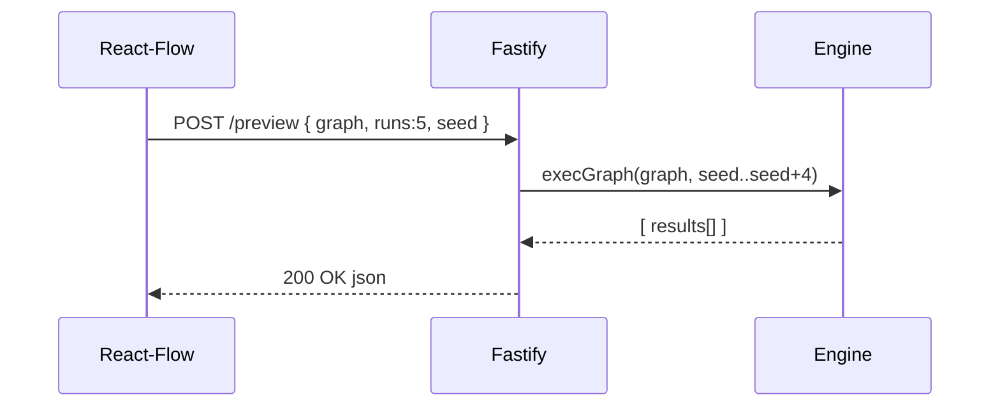

# Technical Architecture – PromptScape Randomizer Graph

_Version 0.2 · 2025-07-15_

> This document provides a comprehensive technical architecture overview, updated for Epic 4 implementation including performance optimizations, corrections system, and production deployment.

## 1. High-Level System Diagram
```
┌─────────────────────────────────────────────────────────────────┐
│                        User Interface                          │
├─────────────────────────────────────────────────────────────────┤
│                     React Frontend                             │
│  ┌─────────────────┐ ┌─────────────────┐ ┌─────────────────┐  │
│  │   Graph Editor  │ │   Inspector     │ │    Palette      │  │
│  │   (React-Flow)  │ │   (Zod Forms)   │ │   (Drag/Drop)   │  │
│  └─────────────────┘ └─────────────────┘ └─────────────────┘  │
├─────────────────────────────────────────────────────────────────┤
│                      Core Library                              │
│  ┌─────────────────┐ ┌─────────────────┐ ┌─────────────────┐  │
│  │  Schema Layer   │ │  Runtime Engine │ │  State Manager  │  │
│  │   (Zod Types)   │ │   (Execution)   │ │   (Zustand)     │  │
│  └─────────────────┘ └─────────────────┘ └─────────────────┘  │
├─────────────────────────────────────────────────────────────────┤
│                     API Services                               │
│  ┌─────────────────┐ ┌─────────────────┐ ┌─────────────────┐  │
│  │   Graph API     │ │   Export API    │ │    CLI Tool     │  │
│  │   (Fastify)     │ │   (Bundler)     │ │   (Commander)   │  │
│  └─────────────────┘ └─────────────────┘ └─────────────────┘  │
├─────────────────────────────────────────────────────────────────┤
│                     Infrastructure                             │
│  ┌─────────────────┐ ┌─────────────────┐ ┌─────────────────┐  │
│  │     Vercel      │ │   LocalStorage  │ │   File System   │  │
│  │   (Deployment)  │ │   (Autosave)    │ │   (CLI Usage)   │  │
│  └─────────────────┘ └─────────────────┘ └─────────────────┘  │
└─────────────────────────────────────────────────────────────────┘
```
• **Monorepo** with packages: `client`, `server`, `core`, `cli`  
• **Production Ready**: Vercel deployment with Edge Functions
• **Performance Optimized**: React.memo, virtualization, debouncing

## 2. Runtime Component Responsibilities
| Component | Tech | Responsibilities |
|-----------|------|------------------|
| Client (`client/`) | React + Vite, TS | UI rendering, autosave, validation, API calls, seed mgmt |
| Server (`server/`) | Node 18, Fastify | Graph executor, REST endpoints (`/preview`, `/export`), bundle import/export, validation logic shareable to CLI |
| Shared (`packages/core`) | TypeScript, Zod | Graph types, validation schemas, executor engine |
| CLI (`packages/cli`) | Node, Commander.js | Batch execution for CI, scriptable usage |

## 3. Module Structure (pnpm Workspaces)
```
root
├─ packages
│  ├─ core            # Types, Zod schemas, engine
│  └─ cli             # Wrapper around core
├─ client             # React SPA
└─ server             # Fastify API + server-side rendering placeholder
```

## 4. Key Data Models
### 4.1 Graph JSON (internal)
```ts
interface Graph {
  nodes: GraphNode[];
  edges: GraphEdge[];
  meta: {
    version: string; // semver
    seed: number;
  };
}
```
`GraphNode` carries `type`, `id`, `params`, `position`.

### 4.2 GeneratorBundle (export format)
Conforms to existing Randomizer Engine schema v2 – adapter lives in `core/exporter.ts`.

## 5. Sequence Diagrams
### 5.1 Preview-5 Flow


## 6. Deployment Topology
| Environment | Host | URL | Notes |
|-------------|------|-----|-------|
| Dev | Windsurf container | `*.windsurf.dev` | Hot-reload via Vite & Fastify |
| Preview | Windsurf PR builds | auto-generated | One per branch |
| Prod | Vercel | `promptscape.vercel.app` | Static SPA + Edge Functions |

### Ports
• 3000 – client dev server  
• 8000 – API in dev  

## 7. CI/CD Pipeline
1. **Lint + Test + Coverage (Codecov)** on every push  
2. **Docker Build** (server) published to GH Registry  
3. **Preview Deploy** (Windsurf) on PRs  
4. **Prod Deploy** (Vercel) on `main` success

## 8. Non-Functional Considerations
| Concern | Strategy |
|---------|----------|
| Performance | Web-worker executor, memoised React components, lazy-loaded heavy deps |
| Security | CSP headers, `helmet` middleware, Secrets via env vars |
| Accessibility | Lighthouse CI score ≥ 90, keyboard edge creation |
| Observability | `pino` logs streamed, Vercel analytics |

## 9. Content Metadata & Slot Taxonomy
The Randomizer Engine and editor rely on **inline `_meta` blocks** (see `metadata_storage_decision.md`). Each prompt-visible rule may include:
```jsonc
"panelArchetype": {
  "_meta": { "slot": "subject", "priority": 10 },
  "$values": ["industrial console", "medical terminal"]
}
```
Key points:
1. `_meta.slot` must reference a value from the canonical **slot taxonomy** (`docs/promptrandomizer-docs/slot_taxonomy.md`).
2. Loader ignores unknown keys starting with `_` for forward compat.
3. Linter (shared package) verifies slot presence & taxonomy validity.
4. The editor Inspector surfaces `_meta` for advanced users.

## 10. Engine Rule Types & Capabilities
Beyond the six MVP node types, the underlying engine supports additional rule kinds described in `system_design_doc.md` – `Weighted`, `Conditional`, `Sequential`, `Markov`, etc. These map to future node palette items (Epic > Phase-1). The executor engine in `packages/core` is designed to be **extensible**: rule classes register via a factory map, enabling phased roll-out without breaking existing graphs.

Deterministic operation is enforced via a seedable PRNG (LCG). All API and CLI entry points accept an optional `seed` param; if omitted, timestamp is used.

### 10.1 Include Resolver Strategy
Generator graphs may reference external rule files using the `$include` directive described in `system_design_doc.md`.

| Environment | Resolution Mechanism |
|-------------|----------------------|
| **Browser / React** | The editor passes an `includeResolver(path)` function to the engine which fetches the referenced file via `fetch()` from the same origin (or fails politely offline). |
| **Node API** | Fastify handler resolves includes from the repo file system relative to the uploaded graph. Symlink jail prevents escapes. |
| **CLI** | Defaults to file-system resolution; `--include-root` flag overrides base directory. |

All resolvers must be **pure functions** returning the JSON content string. Missing includes surface a validation error before execution.


## 11. Future Phase-1 Extensions
• Python micro-service for heavy NLP transforms  
• Collaborative editing via WebSockets + CRDT  
• Persistent storage (Postgres) for shared bundles

---

*End of architecture v0.1*
