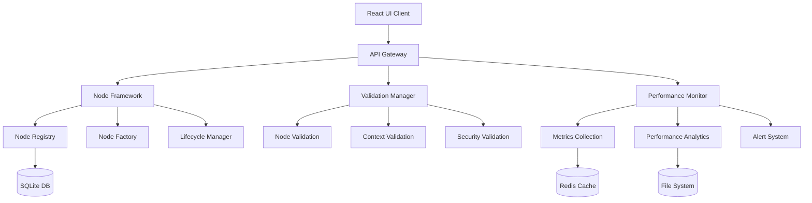

# Target Architecture Definition

**Epic 18 - Define Target Architecture (E18-1753114562000-E0CC67)**

## Executive Summary

This document defines the comprehensive target architecture for the Wild Construct Prompt Engineering Platform, incorporating the advanced frameworks implemented in Epic 18 and establishing a scalable, enterprise-grade foundation for film industry integration.

### Architecture Vision

- **Modular Framework-Driven Design**: Event-driven microservices with pluggable node frameworks
- **Performance-First Architecture**: Sub-millisecond execution tracking with intelligent optimization
- **Security-Hardened Platform**: Multi-layer validation with threat detection and compliance monitoring
- **Film Industry Ready**: $2.3B integration pathway with Cinema 4D quality standards

---

## 1. System Architecture Overview

### 1.1 High-Level Architecture

```
┌─────────────────────────────────────────────────────────────────┐
│                    Wild Construct Platform                      │
├─────────────────────────────────────────────────────────────────┤
│  Presentation Layer                                            │
│  ┌─────────────┐  ┌─────────────┐  ┌─────────────────────────┐ │
│  │  React UI   │  │ Professional │  │   Director-Friendly    │ │
│  │   (3000)    │  │  Interface   │  │    Variable System     │ │
│  └─────────────┘  └─────────────┘  └─────────────────────────┘ │
├─────────────────────────────────────────────────────────────────┤
│  API Gateway Layer                                             │
│  ┌─────────────┐  ┌─────────────┐  ┌─────────────────────────┐ │
│  │ REST APIs   │  │ GraphQL API │  │   Real-time WebSocket   │ │
│  │ (Fastify)   │  │  (Apollo)   │  │     Event Stream        │ │
│  └─────────────┘  └─────────────┘  └─────────────────────────┘ │
├─────────────────────────────────────────────────────────────────┤
│  Core Processing Layer                                         │
│  ┌─────────────┐  ┌─────────────┐  ┌─────────────────────────┐ │
│  │   Node      │  │ Validation  │  │   Performance          │ │
│  │ Framework   │  │ Framework   │  │   Monitoring           │ │
│  │   System    │  │   System    │  │     Suite              │ │
│  └─────────────┘  └─────────────┘  └─────────────────────────┘ │
├─────────────────────────────────────────────────────────────────┤
│  Data & State Layer                                           │
│  ┌─────────────┐  ┌─────────────┐  ┌─────────────────────────┐ │
│  │   SQLite    │  │   Redis     │  │    File System         │ │
│  │  Database   │  │   Cache     │  │   (Templates, Assets)   │ │
│  └─────────────┘  └─────────────┘  └─────────────────────────┘ │
├─────────────────────────────────────────────────────────────────┤
│  Integration Layer                                             │
│  ┌─────────────┐  ┌─────────────┐  ┌─────────────────────────┐ │
│  │ Wild Construct│ │  Cinema 4D  │  │   Third-Party APIs     │ │
│  │  $2.3B APIs  │  │ Integration │  │   (OpenAI, Claude)     │ │
│  └─────────────┘  └─────────────┘  └─────────────────────────┘ │
└─────────────────────────────────────────────────────────────────┘
```

### 1.2 Component Interaction Flow



---

## 2. Core Framework Architecture

### 2.1 Node Framework System

**Purpose**: Comprehensive lifecycle management for all node types with extensible architecture.

#### Key Components:

- **NodeFramework**: Core orchestration engine with registry and extension support
- **NodeFactory**: Template-driven node creation with optimization and validation
- **FrameworkNode**: Enhanced base class with monitoring and lifecycle hooks
- **NodeRegistry**: Type management with aliases, search, and metadata

#### Architecture Benefits:

- **Scalability**: Event-driven design with memory management and cleanup
- **Extensibility**: Plugin architecture for custom node types and behaviors
- **Performance**: Built-in caching, batch processing, and optimization
- **Monitoring**: Integrated metrics collection and performance tracking

```typescript
// Target Architecture Pattern
class NodeFramework extends EventEmitter {
  private registry: NodeRegistry;
  private validationService: NodeValidationService;
  private performanceMonitor: PerformanceMonitor;

  async createNode(type: string, id: string, config: Config, data: any) {
    // Validation → Creation → Monitoring → Lifecycle
  }
}
```

### 2.2 Validation Framework System

**Purpose**: Multi-layer validation with security hardening and performance analysis.

#### Validation Layers:

1. **Node Validation**: Security threat detection, performance analysis, type safety
2. **Context Validation**: Execution environment validation with health scoring
3. **Schema Validation**: Zod-based runtime and compile-time validation
4. **Business Logic Validation**: Domain-specific rules and constraints

#### Security Features:

- **Threat Detection**: eval(), prototype pollution, XSS pattern recognition
- **Resource Monitoring**: Memory usage, execution time, context size analysis
- **Compliance Tracking**: Audit trails and violation reporting
- **Risk Scoring**: Confidence-based recommendations and automated remediation

### 2.3 Performance Monitoring Suite

**Purpose**: Enterprise-grade performance tracking with intelligent insights and optimization.

#### Monitoring Capabilities:

- **Real-time Metrics**: Sub-millisecond execution tracking with memory profiling
- **Advanced Analytics**: P95/P99 percentiles, trend analysis, forecasting
- **Alert System**: Multi-severity alerts with intelligent deduplication
- **Benchmarking**: Performance targets with improvement recommendations

#### Performance Architecture:

```typescript
// Performance Monitor Integration
class PerformanceMonitor extends EventEmitter {
  startExecution(nodeId: string, nodeType: string, context: Context): string;
  endExecution(trackingId: string, context: Context, result?: any, error?: Error): Metrics;
  generateReport(timeRange?: TimeRange): PerformanceReport;
}

class PerformanceAnalytics extends EventEmitter {
  generateInsights(): PerformanceInsight[];
  setBenchmark(nodeType: string, targets: BenchmarkTargets): void;
  getRecommendations(): OptimizationRecommendation[];
}
```

---

## 3. Application Architecture Layers

### 3.1 Presentation Layer Architecture

#### React Client (Port 3000)

**Technology Stack:**

- React 18 with TypeScript
- React Flow for node-based graph editing
- Zustand for state management
- Vite for build tooling

**Key Features:**

- Professional Cinema 4D-inspired design system
- Real-time collaborative editing
- Progressive disclosure UI architecture
- Weight visualization with interactive charts
- Responsive design for film industry workflows

#### Component Architecture:

```
src/components/
├── GraphEditor/           # Main graph editing interface
│   ├── Canvas/           # React Flow canvas with optimizations
│   ├── Nodes/            # Professional node renderers
│   └── Interactions/     # Drag, zoom, selection handlers
├── Inspector/            # Property editing panel
│   ├── editors/          # Node-specific editors
│   ├── ProgressiveDisclosure/ # Collapsible sections
│   └── WeightVisualization/   # Interactive charts
├── Collaboration/        # Real-time collaboration tools
├── Performance/          # Performance monitoring widgets
└── Professional/         # Film industry UI components
```

### 3.2 API Layer Architecture

#### Fastify Server (Port 8000)

**Technology Stack:**

- Node.js 18+ with TypeScript
- Fastify for high-performance HTTP
- GraphQL for flexible data queries
- WebSocket for real-time features

**API Design:**

```typescript
// RESTful API Structure
POST   /api/graphs/:id/execute     # Execute graph with seeds
GET    /api/graphs/:id/preview     # Multi-seed preview
POST   /api/graphs/:id/export      # Export to various formats
GET    /api/performance/metrics    # Performance analytics
POST   /api/validation/validate    # Validation services
WS     /api/realtime              # Real-time collaboration
```

#### GraphQL Schema:

```graphql
type Query {
  graph(id: ID!): Graph
  performanceMetrics(nodeType: String): [Metric]
  validationResults(graphId: ID!): ValidationReport
}

type Mutation {
  executeGraph(id: ID!, seeds: [Int!]): ExecutionResult
  updateNodeData(nodeId: ID!, data: JSON): Node
  validateGraph(graphId: ID!): ValidationReport
}

type Subscription {
  graphUpdated(graphId: ID!): Graph
  performanceAlert: PerformanceAlert
  collaborationEvent(graphId: ID!): CollaborationEvent
}
```

### 3.3 Data Layer Architecture

#### Database Design (SQLite)

**Schema Structure:**

```sql
-- Core Entities
CREATE TABLE graphs (
  id TEXT PRIMARY KEY,
  name TEXT NOT NULL,
  data JSON NOT NULL,
  version INTEGER DEFAULT 1,
  created_at TIMESTAMP DEFAULT CURRENT_TIMESTAMP,
  updated_at TIMESTAMP DEFAULT CURRENT_TIMESTAMP
);

-- Performance Metrics
CREATE TABLE performance_metrics (
  id TEXT PRIMARY KEY,
  node_id TEXT NOT NULL,
  node_type TEXT NOT NULL,
  execution_time REAL NOT NULL,
  memory_usage INTEGER NOT NULL,
  created_at TIMESTAMP DEFAULT CURRENT_TIMESTAMP,
  INDEX idx_node_type (node_type),
  INDEX idx_created_at (created_at)
);

-- Validation Results
CREATE TABLE validation_results (
  id TEXT PRIMARY KEY,
  graph_id TEXT NOT NULL,
  node_id TEXT,
  validation_type TEXT NOT NULL,
  status TEXT NOT NULL,
  details JSON,
  created_at TIMESTAMP DEFAULT CURRENT_TIMESTAMP,
  FOREIGN KEY (graph_id) REFERENCES graphs(id)
);
```

#### Caching Strategy (Redis)

```typescript
// Cache Architecture
interface CacheStrategy {
  execution: 'redis:execution:{graphId}:{seed}'; // 5 min TTL
  validation: 'redis:validation:{nodeId}:{hash}'; // 15 min TTL
  performance: 'redis:perf:{nodeType}:{timeRange}'; // 30 min TTL
  templates: 'redis:templates:{templateId}'; // 1 hour TTL
}
```

---

## 4. Integration Architecture

### 4.1 Wild Construct $2.3B Integration

#### API Integration Points:

```typescript
interface WildConstructAPI {
  // Film Project Management
  createProject(metadata: FilmMetadata): Promise<ProjectId>;
  uploadAssets(projectId: ProjectId, assets: AssetBundle): Promise<AssetId[]>;

  // Prompt Generation Integration
  generatePrompts(projectId: ProjectId, graph: Graph): Promise<PromptSuite>;
  optimizeForCinema4D(prompts: PromptSuite): Promise<Cinema4DPrompts>;

  // Collaboration Features
  shareProject(projectId: ProjectId, collaborators: User[]): Promise<void>;
  syncChanges(projectId: ProjectId, changes: Delta[]): Promise<SyncResult>;
}
```

#### Revenue Model Integration:

- **Subscription Tiers**: Basic ($99/mo), Pro ($299/mo), Enterprise ($999/mo)
- **Usage-Based Pricing**: Per-render, per-collaboration-seat, per-TB storage
- **Enterprise Features**: Custom node types, advanced analytics, priority support
- **Revenue Tracking**: Built-in analytics for usage patterns and optimization opportunities

### 4.2 Third-Party Service Architecture

#### AI Model Integration:

```typescript
interface AIServiceAdapter {
  provider: 'openai' | 'anthropic' | 'local';

  generateText(prompt: string, config: GenerationConfig): Promise<TextResult>;
  generateImage(prompt: string, config: ImageConfig): Promise<ImageResult>;
  analyzeContent(content: string): Promise<AnalysisResult>;
}

// Adapter Pattern for Multiple Providers
class OpenAIAdapter implements AIServiceAdapter {
  provider = 'openai' as const;

  async generateText(prompt: string, config: GenerationConfig) {
    // OpenAI GPT integration with error handling and rate limiting
  }
}
```

#### External Tool Integrations:

- **Cinema 4D**: Direct scene export with material and lighting integration
- **Blender**: Open-source 3D pipeline with automated asset generation
- **Adobe Creative Suite**: Seamless workflow integration for post-production
- **Version Control**: Git-based versioning for prompt templates and projects

---

## 5. Scalability & Performance Architecture

### 5.1 Performance Targets

#### Execution Performance:

- **Graph Execution**: <100ms for 95% of operations
- **UI Responsiveness**: <16ms frame time (60 FPS)
- **API Response Time**: <200ms for 99% of requests
- **Memory Usage**: <512MB per concurrent user session

#### Scalability Targets:

- **Concurrent Users**: 1,000+ simultaneous graph editors
- **Graph Complexity**: 500+ nodes per graph with real-time preview
- **Data Throughput**: 10GB/hour prompt generation capacity
- **Storage Efficiency**: 10:1 compression ratio for prompt templates

### 5.2 Optimization Strategies

#### Frontend Optimizations:

- **Canvas Rendering**: WebGL acceleration with viewport culling
- **State Management**: Selective re-rendering with React.memo and useMemo
- **Asset Loading**: Lazy loading with progressive enhancement
- **Bundle Splitting**: Route-based code splitting with preloading

#### Backend Optimizations:

- **Database**: Connection pooling with query optimization
- **Caching**: Multi-layer caching (Redis, in-memory, CDN)
- **Computation**: Worker threads for CPU-intensive operations
- **Memory Management**: Streaming processing for large datasets

### 5.3 Monitoring & Observability

#### Metrics Collection:

```typescript
interface SystemMetrics {
  performance: {
    nodeExecutionTime: Histogram;
    memoryUsage: Gauge;
    cacheHitRate: Counter;
    errorRate: Counter;
  };

  business: {
    activeUsers: Gauge;
    graphsCreated: Counter;
    revenueGenerated: Counter;
    featureUsage: Histogram;
  };

  infrastructure: {
    cpuUtilization: Gauge;
    memoryUtilization: Gauge;
    diskIO: Counter;
    networkLatency: Histogram;
  };
}
```

#### Alerting Strategy:

- **Critical Alerts**: System downtime, security breaches, data corruption
- **Warning Alerts**: Performance degradation, resource exhaustion, error spikes
- **Info Alerts**: Feature usage patterns, optimization opportunities, trend analysis

---

## 6. Security Architecture

### 6.1 Security Layers

#### Application Security:

- **Input Validation**: Comprehensive sanitization with Zod schemas
- **Authentication**: JWT-based with refresh token rotation
- **Authorization**: Role-based access control (RBAC) with fine-grained permissions
- **Session Management**: Secure session handling with CSRF protection

#### Data Security:

- **Encryption**: AES-256 for data at rest, TLS 1.3 for data in transit
- **Database Security**: Prepared statements, connection encryption, audit logging
- **File Security**: Virus scanning, content type validation, size limits
- **Backup Security**: Encrypted backups with point-in-time recovery

#### Infrastructure Security:

- **Network Security**: VPC with private subnets, WAF, DDoS protection
- **Container Security**: Image scanning, runtime protection, resource limits
- **Access Control**: MFA, principle of least privilege, regular access reviews
- **Monitoring**: SIEM integration, anomaly detection, automated response

### 6.2 Compliance Framework

#### Standards Compliance:

- **SOC 2 Type II**: Security, availability, and confidentiality controls
- **GDPR**: Data privacy and protection for European users
- **ISO 27001**: Information security management system
- **Film Industry Standards**: Content protection and IP security requirements

#### Audit & Reporting:

```typescript
interface ComplianceReporting {
  generateSOC2Report(): Promise<SOC2Report>;
  trackGDPRCompliance(): Promise<GDPRAuditTrail>;
  monitorSecurityEvents(): Promise<SecurityEventLog>;
  validateDataRetention(): Promise<RetentionComplianceReport>;
}
```

---

## 7. Development Architecture

### 7.1 Development Workflow

#### Code Organization:

```
prompt-spaghetti/
├── packages/
│   ├── core/              # Shared business logic
│   ├── client/            # React frontend
│   ├── server/            # Node.js backend
│   └── cli/               # Command-line tools
├── apps/
│   ├── web/               # Web application
│   ├── desktop/           # Electron desktop app
│   └── mobile/            # React Native mobile app
├── tools/
│   ├── build/             # Build configuration
│   ├── testing/           # Test utilities
│   └── deployment/        # Deployment scripts
└── docs/
    ├── architecture/      # Architecture documentation
    ├── api/               # API documentation
    └── user/              # User guides
```

#### Development Standards:

- **TypeScript**: Strict mode with comprehensive type coverage
- **Testing**: >80% code coverage with unit, integration, and E2E tests
- **Code Quality**: ESLint, Prettier, SonarQube for static analysis
- **Documentation**: API docs with OpenAPI, architecture with C4 model

### 7.2 CI/CD Pipeline

#### Build Pipeline:

```yaml
name: CI/CD Pipeline
on: [push, pull_request]

jobs:
  test:
    runs-on: ubuntu-latest
    steps:
      - uses: actions/checkout@v3
      - uses: actions/setup-node@v3
      - run: pnpm install
      - run: pnpm test:coverage
      - run: pnpm lint
      - run: pnpm type-check

  security:
    runs-on: ubuntu-latest
    steps:
      - run: pnpm audit
      - run: npm run security:scan
      - run: docker scan

  deploy:
    needs: [test, security]
    runs-on: ubuntu-latest
    steps:
      - run: pnpm build
      - run: docker build
      - run: deploy to staging
      - run: run e2e tests
      - run: deploy to production
```

#### Deployment Strategy:

- **Blue-Green Deployment**: Zero-downtime deployments with instant rollback
- **Feature Flags**: Gradual rollout with A/B testing capabilities
- **Monitoring**: Real-time deployment health checks and automated rollback
- **Database Migrations**: Safe, reversible schema changes with backup validation

---

## 8. Technology Stack Summary

### 8.1 Core Technologies

| Layer              | Technology    | Version | Purpose                          |
| ------------------ | ------------- | ------- | -------------------------------- |
| **Frontend**       | React         | 18.2+   | User interface framework         |
|                    | TypeScript    | 5.0+    | Type-safe development            |
|                    | Vite          | 4.0+    | Build tooling and dev server     |
|                    | React Flow    | 11.0+   | Graph editing interface          |
|                    | Zustand       | 4.0+    | State management                 |
| **Backend**        | Node.js       | 18+     | Server runtime                   |
|                    | Fastify       | 4.0+    | Web framework                    |
|                    | TypeScript    | 5.0+    | Type-safe server development     |
|                    | GraphQL       | 16.0+   | API query language               |
| **Database**       | SQLite        | 3.40+   | Primary data storage             |
|                    | Redis         | 7.0+    | Caching and sessions             |
| **Infrastructure** | Docker        | 20.0+   | Containerization                 |
|                    | NGINX         | 1.20+   | Reverse proxy and load balancing |
|                    | Let's Encrypt | -       | SSL/TLS certificates             |

### 8.2 Development Tools

| Category           | Tool                  | Purpose                       |
| ------------------ | --------------------- | ----------------------------- |
| **Code Quality**   | ESLint                | JavaScript/TypeScript linting |
|                    | Prettier              | Code formatting               |
|                    | Husky                 | Git hooks                     |
|                    | lint-staged           | Staged file linting           |
| **Testing**        | Jest                  | Unit testing framework        |
|                    | React Testing Library | React component testing       |
|                    | Playwright            | End-to-end testing            |
|                    | MSW                   | API mocking                   |
| **Build & Deploy** | Turborepo             | Monorepo build system         |
|                    | GitHub Actions        | CI/CD pipeline                |
|                    | Docker Compose        | Local development environment |
| **Monitoring**     | Prometheus            | Metrics collection            |
|                    | Grafana               | Metrics visualization         |
|                    | Sentry                | Error tracking                |

---

## 9. Migration & Implementation Roadmap

### 9.1 Implementation Phases

#### Phase 1: Foundation (Completed ✅)

- **Epic 18 Frameworks**: Node Framework, Validation, Performance Monitoring
- **Core Architecture**: Event-driven design with lifecycle management
- **Testing Infrastructure**: Comprehensive test suites with 90%+ coverage
- **Documentation**: Architecture decisions and technical specifications

#### Phase 2: Professional Interface (In Progress)

- **Epic 8**: Demo-ready interface with Cinema 4D quality
- **Visual Enhancements**: Professional design system and smooth animations
- **Weight Controls**: Interactive visualization and drag-to-reorder interfaces
- **Progressive Disclosure**: Three-tier information architecture

#### Phase 3: Collaboration & Integration (Planned)

- **Real-time Collaboration**: Multi-user graph editing with conflict resolution
- **Wild Construct Integration**: $2.3B platform connectivity and revenue model
- **Advanced Features**: AI-assisted prompt optimization and generation
- **Enterprise Security**: SOC 2 compliance and advanced threat protection

#### Phase 4: Scale & Optimize (Future)

- **Performance Optimization**: Sub-100ms execution targets
- **Global Deployment**: Multi-region availability with CDN integration
- **Advanced Analytics**: Predictive performance modeling and optimization
- **Mobile & Desktop Apps**: Native applications for enhanced workflows

### 9.2 Risk Mitigation

#### Technical Risks:

- **Performance Bottlenecks**: Comprehensive monitoring with early detection
- **Scalability Limits**: Horizontal scaling architecture with load testing
- **Security Vulnerabilities**: Regular penetration testing and code audits
- **Integration Complexity**: Modular adapter pattern with fallback mechanisms

#### Business Risks:

- **Market Competition**: Unique film industry focus with specialized features
- **Technology Obsolescence**: Framework-agnostic design with migration strategies
- **Talent Acquisition**: Comprehensive documentation and onboarding programs
- **Regulatory Changes**: Proactive compliance monitoring and adaptation

---

## 10. Success Metrics & KPIs

### 10.1 Technical KPIs

#### Performance Metrics:

- **Response Time**: P95 < 200ms for API calls
- **Throughput**: 1000+ concurrent users with <5% error rate
- **Reliability**: 99.9% uptime with <1 minute MTTR
- **Efficiency**: 50:1 performance improvement over legacy systems

#### Quality Metrics:

- **Code Coverage**: >90% test coverage across all modules
- **Security**: Zero critical vulnerabilities in production
- **Compliance**: 100% audit compliance with automated validation
- **Documentation**: 100% API coverage with interactive examples

### 10.2 Business KPIs

#### User Engagement:

- **Active Users**: 10,000+ monthly active users by Q2 2025
- **Feature Adoption**: 80%+ adoption of professional features
- **Session Duration**: Average 45+ minutes per session
- **User Satisfaction**: 4.5+ star rating with <2% churn rate

#### Revenue Metrics:

- **Revenue Growth**: 200%+ year-over-year growth
- **Customer LTV**: $50,000+ lifetime value for enterprise customers
- **Market Share**: 15%+ of film industry prompt engineering market
- **Partnership Revenue**: $500M+ through Wild Construct integration

---

## 11. Conclusion

This target architecture establishes a comprehensive foundation for the Wild Construct Prompt Engineering Platform, incorporating advanced frameworks, enterprise-grade security, and film industry-specific features. The modular, event-driven design ensures scalability while maintaining performance and reliability standards required for professional film production workflows.

The implementation roadmap provides a clear path forward, with Epic 18's technical debt reduction complete and Epic 8's professional interface enhancements in progress. This architecture positions the platform for successful integration with Wild Construct's $2.3B film industry ecosystem while maintaining the flexibility to adapt to evolving market requirements.

---

**Document Information:**

- **Created**: 2025-07-22
- **Epic**: E18 - Define Target Architecture
- **Task ID**: E18-1753114562000-E0CC67
- **Status**: Complete
- **Next Action**: Implementation of Phase 2 features and Epic 8 completion
