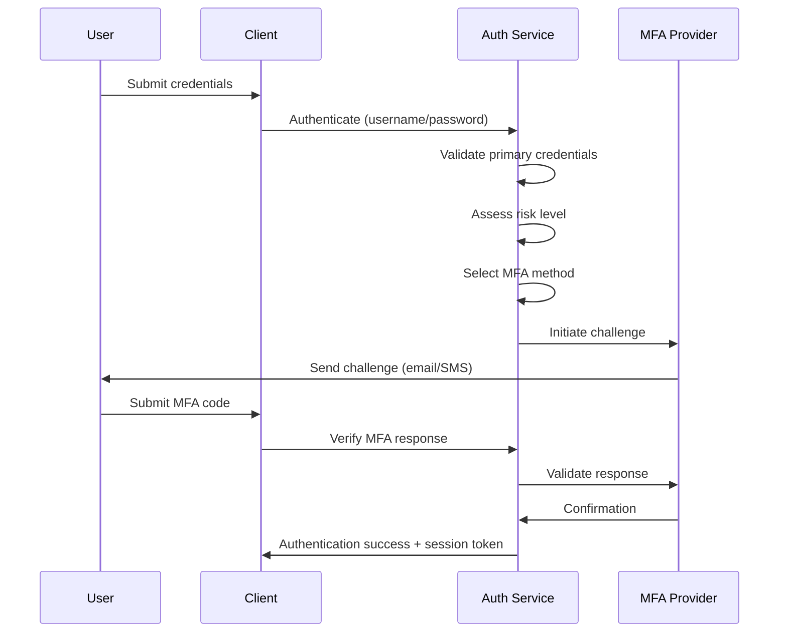
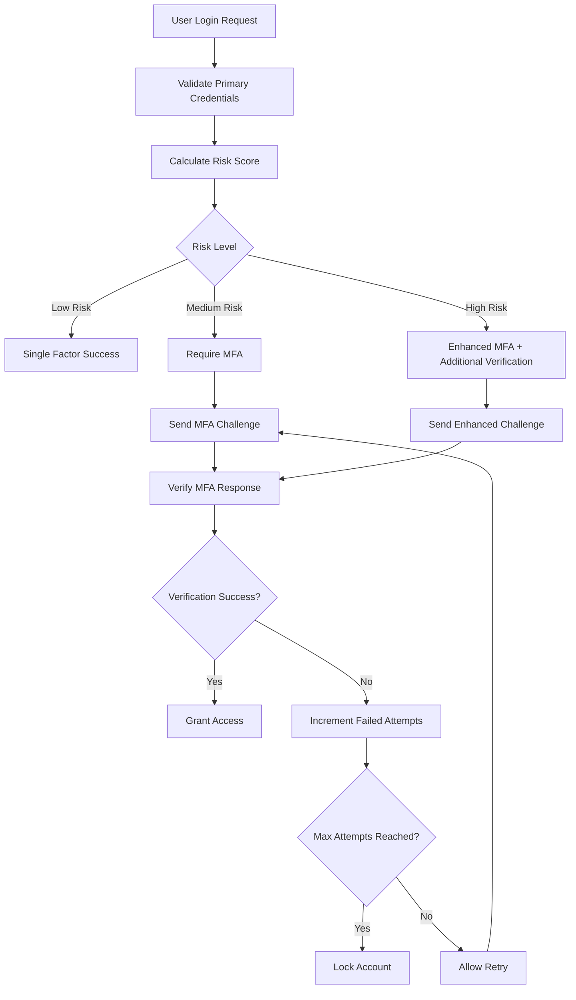
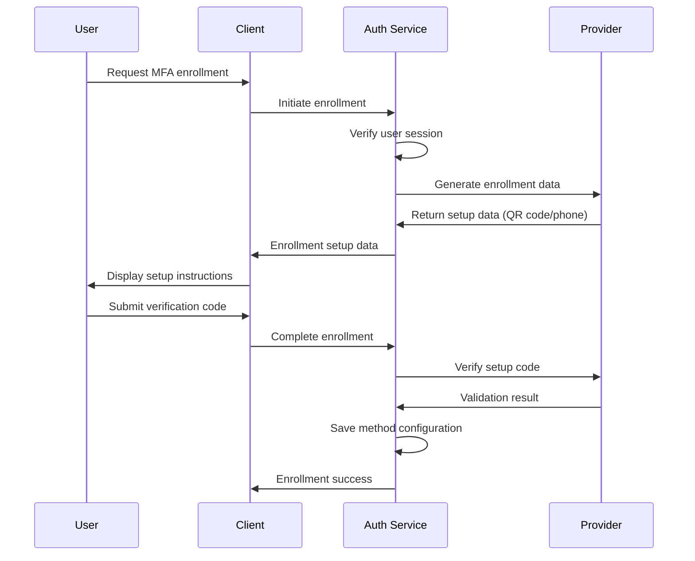

# Multi-Factor Authentication (MFA) Architecture Design

## Overview

This document outlines the comprehensive MFA architecture design for Epic 19: Authentication Enhancement & Security Hardening. The design supports multiple authentication methods with a scalable, secure, and user-friendly approach.

## System Architecture Overview

```
┌─────────────────┐    ┌─────────────────┐    ┌─────────────────┐
│   Web Client    │    │  Mobile App     │    │  API Clients    │
│                 │    │                 │    │                 │
└─────────┬───────┘    └─────────┬───────┘    └─────────┬───────┘
          │                      │                      │
          └──────────────────────┼──────────────────────┘
                                 │
                    ┌─────────────┴─────────────┐
                    │      API Gateway          │
                    │  (Rate Limiting, Auth)    │
                    └─────────────┬─────────────┘
                                 │
                    ┌─────────────┴─────────────┐
                    │   Authentication Service  │
                    │                           │
                    │  ┌─────────────────────┐ │
                    │  │   MFA Controller    │ │
                    │  └─────────────────────┘ │
                    │  ┌─────────────────────┐ │
                    │  │  Method Providers   │ │
                    │  │ ┌─────┐ ┌─────────┐ │ │
                    │  │ │Email│ │  TOTP   │ │ │
                    │  │ └─────┘ └─────────┘ │ │
                    │  │ ┌─────┐ ┌─────────┐ │ │
                    │  │ │ SMS │ │Hardware │ │ │
                    │  │ └─────┘ └─────────┘ │ │
                    │  └─────────────────────┘ │
                    └─────────────┬─────────────┘
                                 │
         ┌───────────────────────┼───────────────────────┐
         │                       │                       │
┌────────┴─────────┐   ┌─────────┴─────────┐   ┌─────────┴─────────┐
│  User Database   │   │ Session Store     │   │ Audit Database    │
│                  │   │    (Redis)        │   │                   │
│ ┌──────────────┐ │   │ ┌───────────────┐ │   │ ┌───────────────┐ │
│ │ User Profile │ │   │ │ Active        │ │   │ │ Auth Events   │ │
│ │ MFA Settings │ │   │ │ Sessions      │ │   │ │ Failed Attempts│ │
│ │ Device Trust │ │   │ │ Pending       │ │   │ │ Risk Scores   │ │
│ └──────────────┘ │   │ │ Challenges    │ │   │ └───────────────┘ │
└──────────────────┘   │ └───────────────┘ │   └───────────────────┘
                       └───────────────────┘

External Services:
┌─────────────────────────────────────────────────────────────────┐
│  Email Provider     SMS Gateway      Push Notification Service  │
│  (SendGrid)         (Twilio)        (Firebase, APNs)           │
└─────────────────────────────────────────────────────────────────┘
```

## Core Components

### 1. MFA Controller Service

**Responsibilities**:

- Orchestrate authentication flows
- Method selection and routing
- Risk assessment and adaptive authentication
- Session management and state tracking

```typescript
interface MFAController {
  initiateChallenge(
    userId: string,
    method: AuthMethod
  ): Promise<ChallengeResponse>;
  verifyChallenge(
    challengeId: string,
    response: string
  ): Promise<VerificationResult>;
  enrollMethod(
    userId: string,
    method: AuthMethod,
    config: MethodConfig
  ): Promise<void>;
  revokeMethod(userId: string, methodId: string): Promise<void>;
  assessRisk(context: AuthContext): Promise<RiskLevel>;
}
```

### 2. Authentication Method Providers

#### Email Provider

```typescript
class EmailAuthProvider implements AuthProvider {
  async sendChallenge(email: string, template: string): Promise<string> {
    const code = this.generateOTP();
    const challengeId = await this.storeChallenge(email, code);
    await this.emailService.send(email, template, { code });
    return challengeId;
  }

  async verifyResponse(challengeId: string, code: string): Promise<boolean> {
    return this.validateOTP(challengeId, code);
  }
}
```

#### TOTP Provider

```typescript
class TOTPAuthProvider implements AuthProvider {
  async enrollDevice(userId: string): Promise<EnrollmentData> {
    const secret = this.generateSecret();
    const qrCode = this.generateQRCode(secret, userId);
    await this.storeSecret(userId, secret);
    return { secret, qrCode };
  }

  async verifyTOTP(userId: string, token: string): Promise<boolean> {
    const secret = await this.getSecret(userId);
    return this.validateTOTP(secret, token);
  }
}
```

#### SMS Provider

```typescript
class SMSAuthProvider implements AuthProvider {
  async sendChallenge(phoneNumber: string): Promise<string> {
    const code = this.generateOTP();
    const challengeId = await this.storeChallenge(phoneNumber, code);
    await this.smsGateway.send(phoneNumber, `Your code: ${code}`);
    return challengeId;
  }
}
```

### 3. Risk Assessment Engine

**Risk Factors**:

- Geographic location anomalies
- Device fingerprint analysis
- Time-based behavioral patterns
- Network reputation scores
- Authentication velocity

```typescript
interface RiskAssessment {
  location: LocationRisk;
  device: DeviceRisk;
  behavior: BehaviorRisk;
  network: NetworkRisk;
  velocity: VelocityRisk;
  overallScore: number; // 0-100
}

class RiskAssessmentEngine {
  async assessRisk(context: AuthContext): Promise<RiskAssessment> {
    const factors = await Promise.all([
      this.assessLocation(context.ip, context.userId),
      this.assessDevice(context.deviceFingerprint, context.userId),
      this.assessBehavior(context.userAgent, context.userId),
      this.assessNetwork(context.ip),
      this.assessVelocity(context.userId)
    ]);

    return this.calculateOverallRisk(factors);
  }
}
```

## Database Schema Design

### User MFA Configuration

```sql
CREATE TABLE user_mfa_config (
  id UUID PRIMARY KEY DEFAULT gen_random_uuid(),
  user_id UUID NOT NULL REFERENCES users(id),
  is_enabled BOOLEAN DEFAULT false,
  default_method VARCHAR(20),
  backup_methods JSONB DEFAULT '[]',
  risk_tolerance VARCHAR(10) DEFAULT 'medium', -- low, medium, high
  created_at TIMESTAMP DEFAULT NOW(),
  updated_at TIMESTAMP DEFAULT NOW()
);

CREATE TABLE mfa_methods (
  id UUID PRIMARY KEY DEFAULT gen_random_uuid(),
  user_id UUID NOT NULL REFERENCES users(id),
  method_type VARCHAR(20) NOT NULL, -- email, sms, totp, hardware
  identifier VARCHAR(255), -- email address, phone number, device serial
  secret_hash TEXT, -- for TOTP secrets
  is_verified BOOLEAN DEFAULT false,
  is_backup BOOLEAN DEFAULT false,
  metadata JSONB DEFAULT '{}',
  created_at TIMESTAMP DEFAULT NOW(),
  last_used_at TIMESTAMP
);
```

### Challenge Management

```sql
CREATE TABLE mfa_challenges (
  id UUID PRIMARY KEY DEFAULT gen_random_uuid(),
  user_id UUID NOT NULL REFERENCES users(id),
  method_id UUID REFERENCES mfa_methods(id),
  challenge_type VARCHAR(20) NOT NULL,
  challenge_data_hash TEXT NOT NULL,
  attempts INTEGER DEFAULT 0,
  max_attempts INTEGER DEFAULT 3,
  created_at TIMESTAMP DEFAULT NOW(),
  expires_at TIMESTAMP NOT NULL,
  completed_at TIMESTAMP,
  ip_address INET,
  user_agent TEXT
);
```

### Risk and Audit Logging

```sql
CREATE TABLE auth_risk_scores (
  id UUID PRIMARY KEY DEFAULT gen_random_uuid(),
  user_id UUID NOT NULL REFERENCES users(id),
  session_id UUID,
  risk_score INTEGER NOT NULL, -- 0-100
  risk_factors JSONB NOT NULL,
  action_taken VARCHAR(50), -- allow, challenge, block
  ip_address INET,
  created_at TIMESTAMP DEFAULT NOW()
);

CREATE TABLE auth_audit_log (
  id UUID PRIMARY KEY DEFAULT gen_random_uuid(),
  user_id UUID REFERENCES users(id),
  event_type VARCHAR(50) NOT NULL,
  method_type VARCHAR(20),
  success BOOLEAN NOT NULL,
  failure_reason VARCHAR(100),
  ip_address INET,
  user_agent TEXT,
  metadata JSONB DEFAULT '{}',
  created_at TIMESTAMP DEFAULT NOW()
);
```

## Authentication Flow Designs

### 1. Standard MFA Flow



### 2. Adaptive Authentication Flow



### 3. Method Enrollment Flow



## Security Implementation

### 1. Cryptographic Standards

```typescript
// TOTP Secret Generation
const generateTOTPSecret = (): string => {
  return crypto.randomBytes(32).toString('base32');
};

// OTP Code Generation
const generateOTP = (length: number = 6): string => {
  const max = Math.pow(10, length) - 1;
  const min = Math.pow(10, length - 1);
  return crypto.randomInt(min, max).toString();
};

// Challenge ID Generation
const generateChallengeId = (): string => {
  return crypto.randomBytes(16).toString('hex');
};
```

### 2. Rate Limiting Strategy

```typescript
interface RateLimitConfig {
  maxAttempts: number;
  windowMinutes: number;
  blockDurationMinutes: number;
}

const rateLimits = {
  codeGeneration: {
    maxAttempts: 5,
    windowMinutes: 60,
    blockDurationMinutes: 15
  },
  codeVerification: {
    maxAttempts: 3,
    windowMinutes: 15,
    blockDurationMinutes: 30
  },
  methodEnrollment: {
    maxAttempts: 3,
    windowMinutes: 24 * 60,
    blockDurationMinutes: 60
  }
};
```

### 3. Session Management

```typescript
interface MFASession {
  sessionId: string;
  userId: string;
  pendingChallenges: Challenge[];
  completedMethods: string[];
  riskScore: number;
  expiresAt: Date;
  requiresAdditionalVerification: boolean;
}

class SessionManager {
  async createMFASession(
    userId: string,
    riskScore: number
  ): Promise<MFASession> {
    const session: MFASession = {
      sessionId: crypto.randomUUID(),
      userId,
      pendingChallenges: [],
      completedMethods: [],
      riskScore,
      expiresAt: new Date(Date.now() + 10 * 60 * 1000), // 10 minutes
      requiresAdditionalVerification: riskScore > 70
    };

    await this.redis.setex(
      `mfa_session:${session.sessionId}`,
      600, // 10 minutes
      JSON.stringify(session)
    );

    return session;
  }
}
```

## Configuration and Policies

### 1. Method Priority Configuration

```json
{
  "methodPriority": {
    "primary": ["totp", "hardware"],
    "secondary": ["email", "sms"],
    "fallback": ["recovery_codes"]
  },
  "riskBasedSelection": {
    "lowRisk": ["email"],
    "mediumRisk": ["totp", "sms"],
    "highRisk": ["hardware", "totp"]
  }
}
```

### 2. Policy Engine

```typescript
interface MFAPolicy {
  requireMFA: boolean;
  allowedMethods: AuthMethod[];
  minimumMethods: number;
  riskThresholds: {
    requireAdditional: number;
    blockAccess: number;
  };
  sessionTimeout: number;
  rememberDeviceDays: number;
}

const defaultPolicy: MFAPolicy = {
  requireMFA: true,
  allowedMethods: ['email', 'totp', 'sms'],
  minimumMethods: 1,
  riskThresholds: {
    requireAdditional: 60,
    blockAccess: 85
  },
  sessionTimeout: 600, // 10 minutes
  rememberDeviceDays: 30
};
```

## Performance and Scalability

### 1. Caching Strategy

- **Redis** for active challenge storage (TTL-based expiration)
- **In-memory cache** for frequently accessed user MFA configurations
- **CDN caching** for static QR code images and setup guides

### 2. Database Optimization

```sql
-- Indexes for performance
CREATE INDEX idx_mfa_challenges_user_expires ON mfa_challenges(user_id, expires_at);
CREATE INDEX idx_mfa_methods_user_type ON mfa_methods(user_id, method_type);
CREATE INDEX idx_auth_audit_user_created ON auth_audit_log(user_id, created_at);

-- Partitioning for audit logs
CREATE TABLE auth_audit_log_2025_01 PARTITION OF auth_audit_log
FOR VALUES FROM ('2025-01-01') TO ('2025-02-01');
```

### 3. Async Processing

```typescript
// Queue-based email/SMS sending
interface NotificationJob {
  type: 'email' | 'sms';
  recipient: string;
  template: string;
  data: Record<string, any>;
  priority: 'high' | 'normal' | 'low';
}

class NotificationQueue {
  async enqueue(job: NotificationJob): Promise<void> {
    await this.redis.lpush('notification_queue', JSON.stringify(job));
  }
}
```

## Monitoring and Observability

### 1. Key Metrics

- Authentication success/failure rates by method
- Challenge completion times
- Risk score distributions
- Method adoption rates
- Failed attempt patterns

### 2. Alerting Rules

```yaml
alerts:
  - name: HighFailureRate
    condition: failure_rate > 20%
    duration: 5m

  - name: UnusualRiskScores
    condition: avg_risk_score > 80
    duration: 10m

  - name: ProviderDowntime
    condition: provider_availability < 95%
    duration: 2m
```

## Migration and Rollout Strategy

### Phase 1: Foundation (Weeks 1-2)

- Core MFA service infrastructure
- Email OTP implementation
- Basic UI components

### Phase 2: Enhancement (Weeks 3-4)

- TOTP provider implementation
- Risk assessment engine
- Admin dashboard

### Phase 3: Advanced Features (Weeks 5-6)

- SMS provider integration
- Hardware token support
- Mobile app integration

### Phase 4: Optimization (Weeks 7-8)

- Performance tuning
- Advanced analytics
- User experience improvements

## Testing Strategy

### 1. Unit Testing

- Provider implementations
- Risk assessment algorithms
- Cryptographic functions

### 2. Integration Testing

- End-to-end authentication flows
- External service integrations
- Database operations

### 3. Security Testing

- Penetration testing for common vulnerabilities
- Rate limiting validation
- Session management security

### 4. Load Testing

- Concurrent user authentication
- Provider service limits
- Database performance under load

## Compliance and Documentation

### 1. Security Documentation

- Threat model analysis
- Security control implementation
- Incident response procedures

### 2. User Documentation

- Setup guides for each method
- Troubleshooting documentation
- Privacy and data handling notices

### 3. API Documentation

- OpenAPI specifications
- Integration guides
- SDK documentation

This architecture provides a robust, scalable, and secure foundation for multi-factor authentication that can evolve with changing security requirements and user needs.
