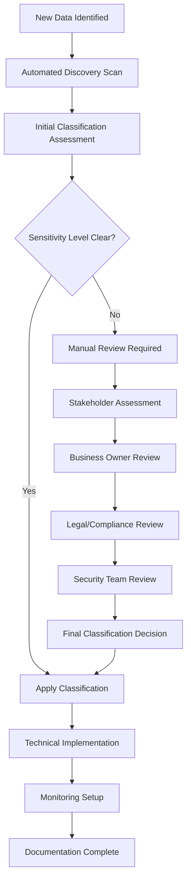
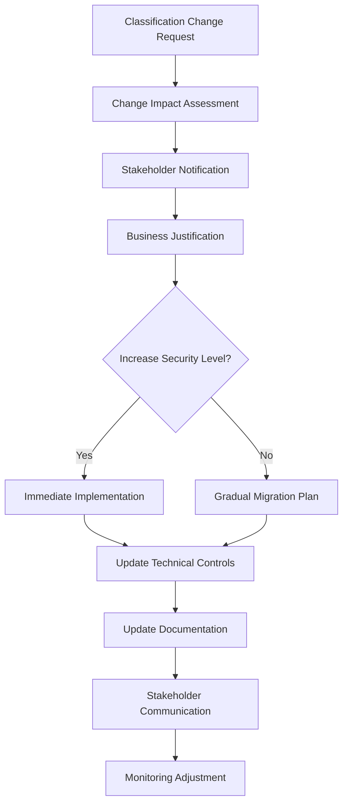

# Data Classification Decision Process

## Overview

This document defines the systematic process for classifying data within the Prompt Spaghetti application to ensure appropriate security controls, access restrictions, and handling procedures are applied based on data sensitivity levels.

## Classification Framework

### Data Sensitivity Levels

Based on Epic 19 requirements, we implement a four-tier classification system:

1. **PUBLIC** - Information that can be freely shared without restriction
2. **INTERNAL** - Information for internal use only, not for external distribution
3. **CONFIDENTIAL** - Sensitive information requiring strict access controls
4. **RESTRICTED** - Highly sensitive information with severe restrictions

## Decision Process

### Step 1: Data Discovery and Inventory

#### Automated Discovery

- **Database Fields**: Scan all database schemas for potentially sensitive field names
- **File System**: Analyze file names, extensions, and metadata
- **API Endpoints**: Review request/response payloads for sensitive data patterns
- **User Input**: Monitor form fields and data entry points

#### Manual Review

- Business stakeholder review of data types
- Legal/compliance team assessment
- Security team evaluation
- Data owner identification

### Step 2: Sensitivity Assessment

#### Classification Criteria

**PUBLIC**

- Marketing materials and public documentation
- Open source code and public APIs
- General product information
- Public user profiles (username, public bio)

**INTERNAL**

- Internal documentation and procedures
- Non-sensitive business metrics
- Internal user lists (non-PII)
- Application logs without PII
- System configuration (non-security related)

**CONFIDENTIAL**

- Personal Identifiable Information (PII)
  - Email addresses
  - User full names
  - IP addresses
  - Authentication tokens
- Business sensitive data
  - Proprietary algorithms
  - Customer data
  - Financial information
  - Security configurations

**RESTRICTED**

- Authentication credentials
  - Password hashes
  - API keys and secrets
  - Encryption keys
- Regulated data
  - Health information (HIPAA)
  - Financial records (PCI DSS)
  - EU personal data (GDPR)
- Legal and compliance data
  - Audit trails
  - Investigation records

#### Assessment Questions

For each data element, evaluate:

1. **Legal/Regulatory Requirements**
   - Is this data subject to specific regulations (GDPR, HIPAA, PCI DSS)?
   - Are there legal requirements for protection?
   - What are the penalty implications of a breach?

2. **Business Impact**
   - What would be the business impact if this data was disclosed?
   - Could this data provide competitive advantage to competitors?
   - Would disclosure damage customer trust?

3. **Personal Privacy**
   - Does this data identify or relate to an individual?
   - Could this data be used for identity theft or fraud?
   - Are there consent requirements for processing?

4. **Security Risk**
   - Could this data be used to gain unauthorized access?
   - Does this data contain security credentials or keys?
   - Would disclosure enable further attacks?

### Step 3: Classification Assignment

#### Decision Matrix

| Criteria         | PUBLIC | INTERNAL | CONFIDENTIAL  | RESTRICTED         |
| ---------------- | ------ | -------- | ------------- | ------------------ |
| Legal/Regulatory | None   | Low risk | Medium risk   | High risk/Required |
| Business Impact  | None   | Low      | Medium-High   | Critical           |
| Personal Privacy | None   | Minimal  | Personal data | Sensitive personal |
| Security Risk    | None   | Low      | Medium        | High/Critical      |

#### Classification Rules

1. **Highest Sensitivity Wins**: Apply the highest classification level that matches any criteria
2. **Default to Higher**: When in doubt, classify at a higher level initially
3. **Regular Review**: Classifications must be reviewed quarterly
4. **Context Matters**: Same data type may have different classifications based on context

### Step 4: Validation and Approval

#### Technical Validation

- Automated scanning confirms classification tags
- Data lineage analysis for consistency
- Access pattern analysis for appropriateness

#### Business Approval

- Data owner review and sign-off
- Legal/compliance team approval for restricted data
- Security team approval for security-related classifications

#### Documentation Requirements

- Classification rationale and justification
- Data owner identification
- Approval trail and timestamps
- Review schedule establishment

### Step 5: Implementation and Monitoring

#### Technical Implementation

- Apply classification metadata tags
- Configure access controls based on classification
- Implement encryption based on classification level
- Set up monitoring and alerting

#### Ongoing Monitoring

- Regular access pattern analysis
- Classification drift detection
- Compliance monitoring and reporting
- Incident response for misclassification

## Process Workflows

### New Data Classification Workflow



### Classification Change Workflow



## Implementation Guidelines

### Database Implementation

```typescript
// Classification metadata schema
interface DataClassification {
  id: string;
  dataElement: string;
  classification: 'PUBLIC' | 'INTERNAL' | 'CONFIDENTIAL' | 'RESTRICTED';
  rationale: string;
  dataOwner: string;
  classifiedBy: string;
  classificationDate: Date;
  reviewDate: Date;
  approvals: ClassificationApproval[];
  metadata: {
    regulatoryRequirements?: string[];
    businessJustification: string;
    riskAssessment: string;
  };
}

interface ClassificationApproval {
  approver: string;
  role: string;
  approvalDate: Date;
  comments?: string;
}
```

### API Integration

```typescript
// Classification service interface
interface ClassificationService {
  classifyData(data: any, context: ClassificationContext): Promise<Classification>;
  validateClassification(classification: Classification): Promise<ValidationResult>;
  getHandlingRequirements(classification: string): HandlingRequirements;
  auditClassificationAccess(userId: string, dataId: string): Promise<void>;
}
```

### Automated Classification Rules

```typescript
// Example classification rules engine
const classificationRules = {
  // Field name patterns
  fieldPatterns: {
    'password.*': 'RESTRICTED',
    email: 'CONFIDENTIAL',
    api_key: 'RESTRICTED',
    user_id: 'INTERNAL',
    'public_.*': 'PUBLIC',
  },

  // Content patterns
  contentPatterns: {
    'credit card': 'RESTRICTED',
    'social security': 'RESTRICTED',
    'phone number': 'CONFIDENTIAL',
    'ip address': 'CONFIDENTIAL',
  },

  // Context rules
  contextRules: {
    authentication: 'RESTRICTED',
    audit_log: 'CONFIDENTIAL',
    public_api: 'PUBLIC',
    internal_metrics: 'INTERNAL',
  },
};
```

## Compliance Integration

### GDPR Compliance

- Personal data automatically classified as CONFIDENTIAL or higher
- Special category data classified as RESTRICTED
- Consent tracking integrated with classification

### HIPAA Compliance

- Health information automatically classified as RESTRICTED
- Audit trail requirements implemented
- Access controls based on minimum necessary principle

### PCI DSS Compliance

- Payment card data classified as RESTRICTED
- Cardholder data environment identification
- Segmentation requirements enforced

## Quality Assurance

### Validation Checks

- Classification consistency across related data
- Access control alignment with classification
- Encryption requirement compliance
- Audit trail completeness

### Performance Monitoring

- Classification decision time tracking
- False positive/negative rates
- User satisfaction with classification accuracy
- Compliance violation frequency

### Continuous Improvement

- Regular classification rule updates
- Machine learning model training for automated classification
- Stakeholder feedback integration
- Regulatory requirement updates

## Training and Communication

### Role-Based Training

- **Data Owners**: Classification responsibilities and procedures
- **Developers**: Technical implementation and API usage
- **Security Team**: Advanced classification scenarios and exceptions
- **All Users**: Basic classification awareness and handling requirements

### Communication Channels

- Classification policy updates via internal communications
- Technical implementation guides in developer documentation
- Security awareness training integration
- Incident response procedure updates

## Metrics and Reporting

### Key Performance Indicators

- Percentage of data classified within SLA timeframes
- Classification accuracy rates
- Compliance violation reduction
- User training completion rates

### Regular Reports

- Monthly classification status dashboard
- Quarterly compliance assessment
- Annual classification framework review
- Incident response effectiveness analysis
