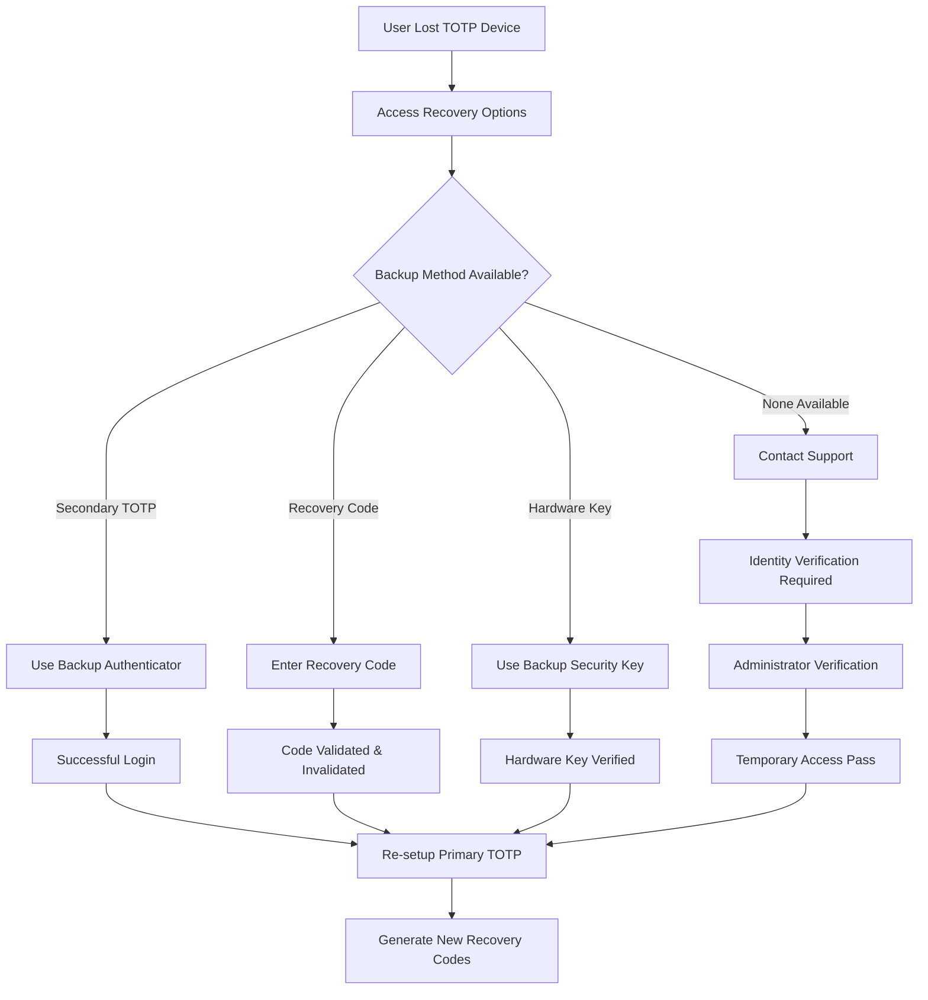

# MFA Recovery & Backup Procedures

## Executive Summary

This document defines comprehensive recovery and backup procedures for Multi-Factor Authentication (MFA) systems, aligned with NIST SP 800-63B guidelines and 2025 security best practices. The procedures prioritize security while ensuring users can regain access to their accounts through verified, secure channels.

## Regulatory Compliance Framework

### NIST SP 800-63B Compliance
- **Multiple Physical Authenticators**: Bind at least two physical authenticators per account
- **Secure Recovery Channels**: Use channels separate from primary authentication methods
- **Phishing-Resistant Methods**: Prioritize hardware security keys and TOTP over SMS
- **Knowledge-Based Authentication Prohibition**: Eliminate security questions and password hints

### Security Principles
1. **Defense in Depth**: Multiple recovery options with varying security levels
2. **Zero Trust**: Verify all recovery attempts through secure channels
3. **Least Privilege**: Grant minimum access required during recovery
4. **Auditability**: Log all recovery actions for security monitoring

## Recovery Method Hierarchy

### Tier 1: Primary Recovery Methods (Highest Security)
```
1. Hardware Security Keys (FIDO2/WebAuthn)
   ├── Backup YubiKey or similar device
   ├── Phishing-resistant authentication
   └── Immediate access restoration

2. Secondary TOTP Authenticator
   ├── Different device/app from primary
   ├── Microsoft Authenticator backup
   └── Google Authenticator on separate device
```

### Tier 2: Secure Backup Methods (High Security)
```
3. Recovery Codes (One-Time Use)
   ├── Cryptographically secure generation
   ├── Offline storage capability
   └── Single-use with automatic invalidation

4. Backup Email Address
   ├── Different email provider from primary
   ├── Must have its own MFA enabled
   └── Verified ownership required
```

### Tier 3: Administrative Recovery (Managed Security)
```
5. Administrator-Assisted Recovery
   ├── Identity verification through secure channels
   ├── Temporary access passes
   └── Mandatory MFA re-enrollment

6. Identity Proofing Re-verification
   ├── Document-based identity verification
   ├── In-person or video call verification
   └── Complete account security reset
```

## Recovery Code System

### Generation Specifications
```javascript
// Recovery Code Generation (NIST Compliant)
const recoveryCodeSpecs = {
  length: 12,              // 12 characters minimum
  format: 'alphanumeric',  // A-Z, 0-9 (excluding confusing chars)
  excludeChars: ['0', 'O', '1', 'I', 'l'], // Visual clarity
  quantity: 10,            // 10 codes per batch
  entropy: 64,             // Minimum 64 bits of entropy
  generator: 'CSPRNG',     // Cryptographically secure random
  expiration: '1 year',    // Maximum validity period
  usage: 'single-use'      // Each code valid for one use only
};

// Example generation function
function generateRecoveryCodes() {
  const alphabet = 'ABCDEFGHJKMNPQRSTUVWXYZ23456789';
  const codes = [];
  
  for (let i = 0; i < 10; i++) {
    let code = '';
    for (let j = 0; j < 12; j++) {
      const randomIndex = crypto.getRandomValues(new Uint32Array(1))[0] % alphabet.length;
      code += alphabet[randomIndex];
      
      // Add hyphen for readability every 4 characters
      if (j === 3 || j === 7) code += '-';
    }
    codes.push(code);
  }
  
  return codes;
}
```

### Recovery Code Format
```
Format: XXXX-XXXX-XXXX
Examples:
- A7K9-M2P4-Q8W3
- B5N6-R9T2-Y4E7
- C8H3-V6L1-Z9X5

Security Features:
✓ 64-bit entropy minimum
✓ Visually distinct characters
✓ Hyphenated for readability
✓ Case-insensitive input
✓ Single-use invalidation
```

### Storage and Presentation
```html
<div class="recovery-codes-container">
  <div class="security-notice">
    <h3>🔐 Important Security Information</h3>
    <ul class="security-checklist">
      <li>✅ Each code can only be used once</li>
      <li>✅ Store these codes in a secure location</li>
      <li>✅ Don't save them in your browser or cloud</li>
      <li>✅ Print them or use a password manager</li>
      <li>⚠️ Anyone with these codes can access your account</li>
    </ul>
  </div>
  
  <div class="codes-display">
    <h4>Your Recovery Codes:</h4>
    <div class="codes-grid">
      <div class="code-item">
        <span class="code-number">1.</span>
        <code class="recovery-code">A7K9-M2P4-Q8W3</code>
        <button class="copy-code" aria-label="Copy code 1">📋</button>
      </div>
      <!-- Repeat for all 10 codes -->
    </div>
  </div>
  
  <div class="download-options">
    <button id="download-txt" class="btn-secondary">
      📄 Download as Text File
    </button>
    <button id="print-codes" class="btn-secondary">
      🖨️ Print Codes
    </button>
    <button id="copy-all" class="btn-secondary">
      📋 Copy All Codes
    </button>
  </div>
  
  <div class="confirmation-required">
    <label class="checkbox-container">
      <input type="checkbox" id="codes-saved" required>
      <span class="checkmark"></span>
      I have securely saved these recovery codes
    </label>
  </div>
</div>
```

## Backup Email Configuration

### Requirements for Backup Email
```yaml
backup_email_requirements:
  different_provider: true  # Must be different from primary email
  mfa_enabled: true        # Must have its own MFA protection
  verified_ownership: true # Ownership verification required
  active_monitoring: true  # Check for bounces and engagement
  
verification_process:
  initial_verification:
    - Send verification code to backup email
    - Require code entry within 15 minutes
    - Confirm email accessibility
  
  periodic_verification:
    - Test backup email every 90 days
    - Send test message with confirmation link
    - Alert if verification fails
    
  security_checks:
    - Verify backup email has MFA enabled
    - Check for data breaches affecting backup email
    - Monitor for suspicious activity
```

### Backup Email Setup Flow
```html
<div class="backup-email-setup">
  <h3>📧 Add Backup Email Address</h3>
  
  <div class="requirements-check">
    <h4>Requirements for Backup Email:</h4>
    <ul class="requirement-list">
      <li class="requirement-item">
        <span class="req-icon">✅</span>
        Different email provider from your primary email
      </li>
      <li class="requirement-item">
        <span class="req-icon">🔒</span>
        Must have multi-factor authentication enabled
      </li>
      <li class="requirement-item">
        <span class="req-icon">📱</span>
        Active and regularly checked email address
      </li>
    </ul>
  </div>
  
  <div class="email-input-section">
    <label for="backup-email">Backup Email Address:</label>
    <div class="input-group">
      <input type="email" 
             id="backup-email" 
             placeholder="backup@different-provider.com"
             class="email-input">
      <button id="verify-backup-email" class="btn-verify">
        📤 Send Verification
      </button>
    </div>
    
    <div class="provider-check" id="provider-check">
      <!-- Dynamic content showing if email provider is different -->
    </div>
  </div>
  
  <div class="verification-step" id="verification-step" style="display: none;">
    <h4>📨 Check Your Backup Email</h4>
    <p>We've sent a verification code to your backup email address.</p>
    
    <div class="code-input-group">
      <label for="backup-verification-code">Enter the 6-digit code:</label>
      <input type="text" 
             id="backup-verification-code" 
             maxlength="6" 
             pattern="[0-9]{6}"
             class="verification-input">
    </div>
    
    <div class="verification-actions">
      <button id="verify-backup-code" class="btn-primary">
        ✅ Verify Code
      </button>
      <button id="resend-backup-code" class="btn-secondary">
        🔄 Resend Code
      </button>
    </div>
  </div>
</div>
```

## Account Recovery Workflows

### Scenario 1: Lost Primary TOTP Device


### Recovery Interface Design
```html
<div class="recovery-interface">
  <div class="recovery-header">
    <h2>🔓 Account Recovery</h2>
    <p>Choose a recovery method to regain access to your account:</p>
  </div>
  
  <div class="recovery-methods">
    <div class="method-card" data-method="recovery-code">
      <div class="method-icon">🎫</div>
      <h3>Recovery Code</h3>
      <p>Enter one of your saved backup codes</p>
      <button class="select-method">Use Recovery Code</button>
    </div>
    
    <div class="method-card" data-method="backup-totp">
      <div class="method-icon">📱</div>
      <h3>Backup Authenticator</h3>
      <p>Use your secondary authenticator app</p>
      <button class="select-method">Use Backup TOTP</button>
    </div>
    
    <div class="method-card" data-method="hardware-key">
      <div class="method-icon">🔑</div>
      <h3>Security Key</h3>
      <p>Use your backup hardware security key</p>
      <button class="select-method">Use Security Key</button>
    </div>
    
    <div class="method-card" data-method="backup-email">
      <div class="method-icon">📧</div>
      <h3>Backup Email</h3>
      <p>Send recovery code to backup email</p>
      <button class="select-method">Email Recovery Code</button>
    </div>
  </div>
  
  <div class="recovery-form" id="recovery-form">
    <!-- Dynamic content based on selected method -->
  </div>
  
  <div class="additional-help">
    <h3>Still Can't Access Your Account?</h3>
    <div class="help-options">
      <button class="btn-help" data-action="contact-support">
        📞 Contact Support
      </button>
      <button class="btn-help" data-action="identity-verification">
        🆔 Identity Verification
      </button>
    </div>
  </div>
</div>
```

### Scenario 2: Comprehensive Account Lockout
```javascript
// Complete lockout recovery procedure
const comprehensiveLockoutRecovery = {
  triggers: [
    'All MFA methods unavailable',
    'Suspected account compromise',
    'Multiple failed recovery attempts',
    'User-requested account reset'
  ],
  
  procedure: {
    step1: 'Account Security Freeze',
    step2: 'Identity Verification Required',
    step3: 'Administrator Review',
    step4: 'Temporary Access Pass',
    step5: 'Complete MFA Re-enrollment',
    step6: 'Security Audit Review'
  },
  
  identityVerification: {
    methods: [
      'Government-issued ID verification',
      'Biometric comparison (if previously enrolled)',
      'Knowledge verification (account history)',
      'Third-party identity service verification'
    ],
    
    timeline: {
      business_hours: '2-4 hours',
      after_hours: '24-48 hours',
      weekends: '48-72 hours'
    }
  }
};
```

## Administrator Recovery Procedures

### Temporary Access Pass System
```javascript
// Temporary Access Pass Specification
const temporaryAccessPass = {
  generation: {
    length: 16,
    format: 'alphanumeric',
    entropy: 80,
    valid_duration: '24 hours',
    single_use: false,
    max_uses: 5
  },
  
  restrictions: {
    scope: 'MFA setup only',
    ip_binding: true,
    session_duration: '30 minutes',
    privileged_actions: false,
    data_access: 'read-only'
  },
  
  monitoring: {
    all_actions_logged: true,
    security_team_alerts: true,
    usage_analytics: true,
    anomaly_detection: true
  }
};

// Example TAP interface
function generateTemporaryAccessPass(userId, adminId, reason) {
  const tap = {
    id: crypto.randomUUID(),
    code: generateSecureCode(16),
    userId: userId,
    issuedBy: adminId,
    reason: reason,
    validUntil: new Date(Date.now() + 24 * 60 * 60 * 1000),
    usageCount: 0,
    maxUsage: 5,
    restrictions: ['mfa-setup-only', 'ip-restricted', 'session-limited']
  };
  
  // Log issuance
  auditLogger.log('TEMPORARY_ACCESS_PASS_ISSUED', {
    tapId: tap.id,
    userId: userId,
    issuedBy: adminId,
    reason: reason,
    validUntil: tap.validUntil
  });
  
  return tap;
}
```

### Admin Recovery Interface
```html
<div class="admin-recovery-panel">
  <h2>👨‍💼 Administrator Account Recovery</h2>
  
  <div class="recovery-request-form">
    <h3>Issue Temporary Access Pass</h3>
    
    <div class="form-group">
      <label for="user-identifier">User Identifier:</label>
      <input type="text" 
             id="user-identifier" 
             placeholder="email@example.com or user ID">
    </div>
    
    <div class="form-group">
      <label for="verification-method">Identity Verification Method:</label>
      <select id="verification-method">
        <option value="id-document">Government ID Document</option>
        <option value="video-call">Video Call Verification</option>
        <option value="email-verification">Email Verification</option>
        <option value="manager-approval">Manager Approval</option>
      </select>
    </div>
    
    <div class="form-group">
      <label for="recovery-reason">Recovery Reason:</label>
      <select id="recovery-reason">
        <option value="lost-device">Lost MFA Device</option>
        <option value="device-reset">Device Factory Reset</option>
        <option value="app-uninstalled">Authenticator App Deleted</option>
        <option value="account-lockout">Complete Account Lockout</option>
        <option value="emergency-access">Emergency Access Required</option>
      </select>
    </div>
    
    <div class="form-group">
      <label for="admin-notes">Administrator Notes:</label>
      <textarea id="admin-notes" 
                placeholder="Document verification steps taken..."></textarea>
    </div>
    
    <div class="verification-checklist">
      <h4>Verification Checklist:</h4>
      <label class="checkbox-item">
        <input type="checkbox" required>
        User identity verified through secure channel
      </label>
      <label class="checkbox-item">
        <input type="checkbox" required>
        Account ownership confirmed
      </label>
      <label class="checkbox-item">
        <input type="checkbox" required>
        No signs of account compromise
      </label>
      <label class="checkbox-item">
        <input type="checkbox" required>
        Recovery request documented
      </label>
    </div>
    
    <div class="tap-settings">
      <h4>Temporary Access Pass Settings:</h4>
      <div class="setting-row">
        <label>Valid Duration:</label>
        <select id="tap-duration">
          <option value="4">4 hours</option>
          <option value="8">8 hours</option>
          <option value="24" selected>24 hours</option>
        </select>
      </div>
      
      <div class="setting-row">
        <label>Access Scope:</label>
        <select id="tap-scope">
          <option value="mfa-only" selected>MFA Setup Only</option>
          <option value="profile-update">Profile Updates</option>
          <option value="limited-access">Limited Account Access</option>
        </select>
      </div>
    </div>
    
    <div class="form-actions">
      <button id="issue-tap" class="btn-primary">
        🎫 Issue Temporary Access Pass
      </button>
      <button id="cancel-recovery" class="btn-secondary">
        ❌ Cancel
      </button>
    </div>
  </div>
</div>
```

## Security Monitoring & Alerts

### Recovery Event Monitoring
```javascript
// Security monitoring for recovery events
const recoveryMonitoring = {
  alertTriggers: {
    multipleRecoveryAttempts: {
      threshold: 3,
      timeWindow: '1 hour',
      action: 'lock_account_temporarily'
    },
    
    unusualLocationRecovery: {
      geoLocation: 'different_country',
      action: 'require_additional_verification'
    },
    
    suspiciousPatterns: {
      rapidFireAttempts: true,
      invalidRecoveryCodes: 5,
      action: 'security_team_alert'
    }
  },
  
  automatedResponses: {
    accountLockout: {
      duration: '2 hours',
      escalation: 'security_team',
      notification: 'user_email'
    },
    
    additionalVerification: {
      method: 'identity_proofing',
      approver: 'senior_admin',
      timeout: '24 hours'
    }
  }
};
```

### Recovery Analytics Dashboard
```html
<div class="recovery-analytics">
  <h2>📊 MFA Recovery Analytics</h2>
  
  <div class="metrics-grid">
    <div class="metric-card">
      <h3>Recovery Success Rate</h3>
      <div class="metric-value">94.3%</div>
      <div class="metric-trend positive">↗ +2.1%</div>
    </div>
    
    <div class="metric-card">
      <h3>Average Recovery Time</h3>
      <div class="metric-value">8.5 min</div>
      <div class="metric-trend negative">↘ -1.2 min</div>
    </div>
    
    <div class="metric-card">
      <h3>Admin Interventions</h3>
      <div class="metric-value">12</div>
      <div class="metric-trend neutral">→ 0%</div>
    </div>
    
    <div class="metric-card">
      <h3>Security Incidents</h3>
      <div class="metric-value">0</div>
      <div class="metric-trend positive">✅ Clean</div>
    </div>
  </div>
  
  <div class="recovery-method-breakdown">
    <h3>Recovery Method Usage</h3>
    <div class="method-stats">
      <div class="method-stat">
        <span class="method-name">Recovery Codes</span>
        <div class="usage-bar">
          <div class="usage-fill" style="width: 45%"></div>
        </div>
        <span class="usage-percent">45%</span>
      </div>
      
      <div class="method-stat">
        <span class="method-name">Backup TOTP</span>
        <div class="usage-bar">
          <div class="usage-fill" style="width: 30%"></div>
        </div>
        <span class="usage-percent">30%</span>
      </div>
      
      <div class="method-stat">
        <span class="method-name">Backup Email</span>
        <div class="usage-bar">
          <div class="usage-fill" style="width: 15%"></div>
        </div>
        <span class="usage-percent">15%</span>
      </div>
      
      <div class="method-stat">
        <span class="method-name">Admin Assistance</span>
        <div class="usage-bar">
          <div class="usage-fill" style="width: 10%"></div>
        </div>
        <span class="usage-percent">10%</span>
      </div>
    </div>
  </div>
</div>
```

## Testing & Validation Procedures

### Recovery Method Testing
```javascript
// Automated testing procedures for recovery methods
const recoveryTesting = {
  schedules: {
    recoveryCodes: 'quarterly',
    backupEmail: 'monthly',
    adminProcedures: 'semi-annually',
    userEducation: 'annually'
  },
  
  testProcedures: {
    recoveryCodeValidation: {
      testInvalidCodes: true,
      testExpiredCodes: true,
      testUsedCodes: true,
      testRateLimiting: true
    },
    
    backupEmailTesting: {
      deliverabilityTest: true,
      responseTimeTest: true,
      securityCheckTest: true,
      userAccessTest: true
    },
    
    adminWorkflowTesting: {
      identityVerification: true,
      temporaryAccessPass: true,
      escalationProcedures: true,
      auditTrailValidation: true
    }
  }
};
```

### User Education & Training
```html
<div class="recovery-education">
  <h2>🎓 MFA Recovery Best Practices</h2>
  
  <div class="education-modules">
    <div class="module-card">
      <h3>📱 Backup Method Setup</h3>
      <p>Learn how to configure multiple backup methods</p>
      <ul class="learning-objectives">
        <li>Setting up backup authenticator apps</li>
        <li>Configuring backup email addresses</li>
        <li>Generating and storing recovery codes</li>
      </ul>
      <button class="start-module">Start Module</button>
    </div>
    
    <div class="module-card">
      <h3>🔐 Secure Storage Practices</h3>
      <p>Best practices for storing recovery information</p>
      <ul class="learning-objectives">
        <li>Password manager integration</li>
        <li>Physical storage security</li>
        <li>Regular backup verification</li>
      </ul>
      <button class="start-module">Start Module</button>
    </div>
    
    <div class="module-card">
      <h3>🚨 Emergency Procedures</h3>
      <p>What to do when locked out of your account</p>
      <ul class="learning-objectives">
        <li>Step-by-step recovery process</li>
        <li>When to contact support</li>
        <li>Identity verification requirements</li>
      </ul>
      <button class="start-module">Start Module</button>
    </div>
  </div>
</div>
```

## Conclusion

This comprehensive MFA recovery and backup procedures framework provides multiple layers of security while ensuring users can regain access to their accounts through verified, secure channels. The system balances security requirements with usability considerations, following NIST guidelines and 2025 best practices.

### Key Success Metrics
- 🎯 95%+ recovery success rate
- ⚡ < 10 minutes average recovery time  
- 🔒 Zero successful unauthorized recoveries
- 📚 90%+ user education completion rate
- 🛡️ Full NIST SP 800-63B compliance