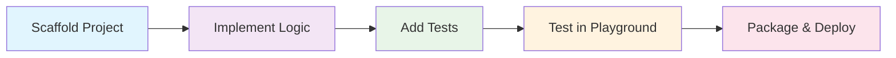

# PromptScape Custom Node Developer Portal

Welcome to the PromptScape Custom Node Developer Portal! This comprehensive resource helps you build powerful custom nodes and extensions for the PromptScape platform.

## Quick Start

<div class="quick-start-cards">
  <div class="card">
    <h3>🚀 5-Minute Tutorial</h3>
    <p>Build your first custom node in minutes</p>
    <a href="./tutorials/01-getting-started.html">Start Tutorial →</a>
  </div>
  
  <div class="card">
    <h3>🎮 Interactive Playground</h3>
    <p>Test and experiment with nodes in real-time</p>
    <a href="./playground/index.html">Open Playground →</a>
  </div>
  
  <div class="card">
    <h3>📦 Sample Projects</h3>
    <p>Explore complete example implementations</p>
    <a href="./sample-projects/index.html">Browse Examples →</a>
  </div>
</div>

## What You Can Build

Custom nodes extend PromptScape's capabilities with:

- **Text Processing**: Advanced string manipulation, formatting, and analysis
- **API Integrations**: Connect to external services and databases  
- **Logic & Control**: Complex conditional logic and flow control
- **Data Transformation**: Convert between formats and structures
- **Math & Computation**: Mathematical operations and algorithms
- **Utilities**: Helper functions and productivity tools

## Development Workflow



## Architecture Overview

PromptScape's custom node system is built on a robust foundation:

### Runtime Integration
- **Advanced Execution Context**: State management, variable access, and performance tracking
- **Type-Safe I/O System**: Comprehensive input/output handling with validation
- **Security Framework**: Sandboxed execution with configurable permissions
- **Performance Caching**: Intelligent caching for optimal graph execution

### Development Tools
- **TypeScript SDK**: Full type safety and IntelliSense support
- **CLI Scaffolding**: Interactive project generation with best practices
- **Testing Framework**: Mock contexts and test harnesses for reliable testing
- **Interactive Playground**: Real-time testing and experimentation environment

## Learning Path

### Beginner (30 minutes)
1. [Getting Started](./tutorials/01-getting-started.html) - Your first custom node
2. [Interactive Playground](./tutorials/02-playground-basics.html) - Test and iterate quickly
3. [Basic Patterns](./tutorials/03-basic-patterns.html) - Common implementation patterns

### Intermediate (2 hours)  
4. [Advanced I/O](./tutorials/04-advanced-io.html) - Complex input/output handling
5. [State Management](./tutorials/05-state-management.html) - Stateful node development
6. [Error Handling](./tutorials/06-error-handling.html) - Robust error management

### Advanced (4+ hours)
7. [Security & Permissions](./tutorials/07-security.html) - Safe external integrations
8. [Performance Optimization](./tutorials/08-performance.html) - Caching and optimization
9. [Production Deployment](./tutorials/09-deployment.html) - Publishing and distribution

## Featured Examples

### Text Processing Node
```typescript
export class TextProcessorNode extends CustomNodeBase {
  async execute(runtime: CustomNodeRuntime): Promise<CustomNodeResult> {
    const { text } = runtime.inputs;
    const processed = text.toUpperCase().trim();
    
    return { outputs: { result: processed } };
  }
}
```
[View Complete Example →](./sample-projects/text-processor/)

### API Integration Node  
```typescript
export class WeatherAPINode extends CustomNodeBase {
  async execute(runtime: CustomNodeRuntime): Promise<CustomNodeResult> {
    const { city } = runtime.inputs;
    const response = await fetch(`/api/weather?city=${city}`);
    const weather = await response.json();
    
    return { outputs: { forecast: weather.forecast } };
  }
}
```
[View Complete Example →](./sample-projects/weather-api/)

## Resources

### Documentation
- [API Reference](./api-reference/) - Complete SDK documentation
- [Extension Guide](../extension-development-guide.html) - Advanced extension development
- [Architecture Guide](../architecture/) - Understanding the runtime system

### Tools & Utilities
- [CLI Commands](./cli-reference.html) - Complete command reference
- [Testing Utilities](./testing/) - Mock contexts and test helpers
- [Code Templates](./templates/) - Reusable patterns and snippets

### Community
- [GitHub Issues](https://github.com/promptspaghetti/promptscape/issues) - Report bugs and request features
- [Discussions](https://github.com/promptspaghetti/promptscape/discussions) - Community Q&A
- [Examples Repository](https://github.com/promptspaghetti/custom-nodes) - Community contributed nodes

## Need Help?

- 📚 Check the [tutorials](./tutorials/) for step-by-step guides
- 🎮 Try the [interactive playground](./playground/) to experiment
- 💬 Ask questions in [GitHub Discussions](https://github.com/promptspaghetti/promptscape/discussions)
- 🐛 Report issues on [GitHub](https://github.com/promptspaghetti/promptscape/issues)

---

Ready to build something amazing? [Start with your first custom node →](./tutorials/01-getting-started.html)