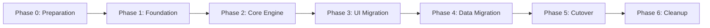

# Epic 1 Brownfield Migration Plan

## Executive Summary

This document outlines the phased migration strategy for Epic 1's brownfield rebuild of Prompt Spaghetti. The plan ensures zero downtime, data preservation, and progressive feature rollout while maintaining system stability.

## Migration Phases Overview



## Phase 0: Preparation (Week 1)

### Objectives
- Set up safety infrastructure
- Establish monitoring baseline
- Create rollback procedures

### Tasks
- [x] Risk assessment and mitigation framework
- [x] Feature flag system implementation
- [x] Monitoring and analytics setup
- [ ] Regression test suite creation
- [ ] Backup and recovery procedures
- [ ] Blue-green deployment setup

### Success Criteria
- All safety systems operational
- Baseline metrics captured
- Team trained on rollback procedures

## Phase 1: Foundation (Week 2)

### Objectives
- Deploy core safety infrastructure
- Begin parallel development environment
- Start regression test coverage

### Migration Steps

```typescript
// 1. Deploy feature flag service
await deployService('feature-flag-service', {
  config: EPIC1_FEATURE_FLAGS,
  rolloutPercentage: 0,
  emergencyKillSwitches: true,
});

// 2. Enable monitoring
await enableMonitoring({
  services: ['api', 'frontend', 'database'],
  metrics: ['performance', 'errors', 'usage'],
  alertThresholds: PRODUCTION_THRESHOLDS,
});

// 3. Set up parallel environment
await createEnvironment('epic1-staging', {
  copyFrom: 'production',
  dataSync: 'real-time',
  trafficSplit: 0,
});
```

### Rollback Plan
```bash
# Immediate rollback if any foundation component fails
./scripts/rollback-procedures.sh foundation
```

## Phase 2: Core Engine Migration (Week 3-4)

### Objectives
- Deploy new execution engine behind feature flag
- Implement data compatibility layer
- Test with synthetic workloads

### Migration Steps

1. **Deploy New Engine**
   ```typescript
   // Behind feature flag
   if (featureFlags.isEnabled('epic1-new-engine')) {
     return new DeterministicEngine(config);
   }
   return legacyEngine;
   ```

2. **Data Compatibility Layer**
   ```typescript
   class DataMigrationAdapter {
     async migrateGraph(oldFormat: LegacyGraph): Promise<PSGGraph> {
       // Convert node types
       const nodes = await this.migrateNodes(oldFormat.nodes);
       
       // Preserve connections
       const edges = await this.migrateEdges(oldFormat.edges);
       
       // Validate integrity
       await this.validateMigration(nodes, edges);
       
       return { nodes, edges, version: '2.0' };
     }
   }
   ```

3. **Shadow Mode Testing**
   - Run both engines in parallel
   - Compare outputs for consistency
   - Log discrepancies without affecting users

### Data Validation

```typescript
interface MigrationValidation {
  validateNodeIntegrity(node: PSGNode): ValidationResult;
  validateEdgeConnections(edges: PSGEdge[]): ValidationResult;
  validateExecutionOutput(legacy: any, modern: any): ValidationResult;
}
```

### Rollback Triggers
- Output mismatch rate > 1%
- Performance degradation > 20%
- Any data corruption detected

## Phase 3: UI Migration (Week 5-6)

### Objectives
- Deploy inline editing interface
- Migrate existing projects to new format
- Train users on new features

### Progressive Rollout Strategy

```typescript
const rolloutSchedule = [
  { week: 5, percentage: 5, segment: 'internal-testers' },
  { week: 5.5, percentage: 10, segment: 'beta-users' },
  { week: 6, percentage: 25, segment: 'power-users' },
  { week: 6.5, percentage: 50, segment: 'general-availability' },
  { week: 7, percentage: 100, segment: 'all-users' },
];
```

### User Communication Plan

1. **Pre-Migration (T-7 days)**
   - Email announcement
   - In-app notifications
   - Tutorial videos released

2. **During Migration**
   - Real-time status updates
   - Support chat availability
   - Fallback to legacy UI option

3. **Post-Migration**
   - Feedback collection
   - Performance surveys
   - Success metrics tracking

## Phase 4: Data Migration (Week 7)

### Objectives
- Migrate all user data to new format
- Ensure backward compatibility
- Validate data integrity

### Migration Process

```sql
-- 1. Create migration tracking
CREATE TABLE migration_status (
  user_id UUID PRIMARY KEY,
  migration_started TIMESTAMP,
  migration_completed TIMESTAMP,
  status ENUM('pending', 'in_progress', 'completed', 'failed'),
  retry_count INT DEFAULT 0,
  error_details JSONB
);

-- 2. Batch migration process
WITH batch AS (
  SELECT user_id 
  FROM users 
  WHERE migration_status = 'pending'
  LIMIT 1000
)
UPDATE projects 
SET format_version = '2.0',
    data = migrate_project_data(data),
    updated_at = NOW()
WHERE user_id IN (SELECT user_id FROM batch);
```

### Data Integrity Checks

```typescript
class DataIntegrityValidator {
  async validateMigration(userId: string): Promise<ValidationReport> {
    const checks = [
      this.checkNodeCount(userId),
      this.checkConnectionIntegrity(userId),
      this.checkExecutionConsistency(userId),
      this.checkAssetReferences(userId),
    ];
    
    const results = await Promise.all(checks);
    return this.compileReport(results);
  }
}
```

## Phase 5: Cutover (Week 8)

### Objectives
- Complete transition to new system
- Disable legacy code paths
- Full monitoring validation

### Cutover Checklist

- [ ] All feature flags at 100%
- [ ] Legacy API endpoints deprecated
- [ ] Database migrations completed
- [ ] Performance baselines met
- [ ] Zero critical bugs for 48 hours
- [ ] User satisfaction > 80%
- [ ] Rollback procedures tested

### Traffic Cutover Process

```nginx
# Gradual traffic shift
upstream legacy_backend {
    server legacy.promptspaghetti.com weight=0;
}

upstream epic1_backend {
    server epic1.promptspaghetti.com weight=100;
}
```

## Phase 6: Cleanup (Week 9+)

### Objectives
- Remove legacy code
- Archive old data
- Document lessons learned

### Cleanup Tasks

1. **Code Removal**
   ```bash
   # Remove legacy components
   git rm -r src/legacy/
   git rm -r src/components/old-editor/
   git commit -m "chore: remove legacy code after Epic 1 migration"
   ```

2. **Database Cleanup**
   ```sql
   -- Archive old tables
   CREATE SCHEMA legacy_archive;
   ALTER TABLE old_projects SET SCHEMA legacy_archive;
   
   -- Remove unused columns
   ALTER TABLE projects DROP COLUMN legacy_data;
   ```

3. **Documentation**
   - Update all API documentation
   - Archive migration guides
   - Create post-mortem report

## Risk Mitigation Matrix

| Risk | Probability | Impact | Mitigation Strategy |
|------|------------|---------|-------------------|
| Data Loss | Low | Critical | Hourly backups, validation checks |
| Performance Degradation | Medium | High | Shadow mode, gradual rollout |
| User Confusion | Medium | Medium | Training, tutorials, support |
| Integration Failures | Low | High | Compatibility layer, testing |
| Rollback Failure | Very Low | Critical | Multiple rollback paths tested |

## Monitoring Dashboard

```typescript
interface MigrationMetrics {
  // System Health
  errorRate: number;
  responseTime: { p50: number; p95: number; p99: number };
  uptime: number;
  
  // Migration Progress
  usersOnNewEngine: number;
  projectsMigrated: number;
  featureFlagStatus: Record<string, number>;
  
  // User Experience
  userSatisfaction: number;
  supportTickets: number;
  adoptionRate: number;
}
```

## Communication Templates

### User Notification Email
```
Subject: Exciting Updates Coming to Prompt Spaghetti

We're upgrading Prompt Spaghetti with new features:
- ✨ Inline editing - edit directly on the canvas
- 🚀 3x faster performance
- 🎯 Improved reliability

Migration begins: [DATE]
No action required - your work is safe!

Learn more: [LINK TO GUIDE]
```

### Status Page Update
```
🚀 Epic 1 Migration Status

Current Phase: [PHASE]
Progress: [===========] 55%
Systems: All Operational ✅

Next Milestone: [DESCRIPTION]
ETA: [TIME]
```

## Success Metrics

### Technical Metrics
- Zero data loss incidents ✅
- < 0.1% error rate during migration
- < 200ms p95 response time maintained
- 100% backward compatibility

### Business Metrics
- User retention > 95%
- Feature adoption > 70% in 30 days
- Support ticket volume < 2x normal
- NPS score improvement > 10 points

## Post-Migration Review

### Week 10 Review Agenda
1. Metrics analysis
2. Incident review
3. User feedback summary
4. Team retrospective
5. Documentation updates
6. Next phase planning

---

**Document Status**: Living Document
**Last Updated**: 2025-08-01
**Next Review**: Weekly during migration