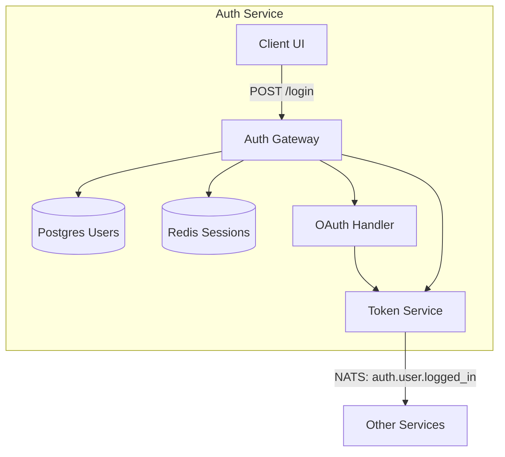
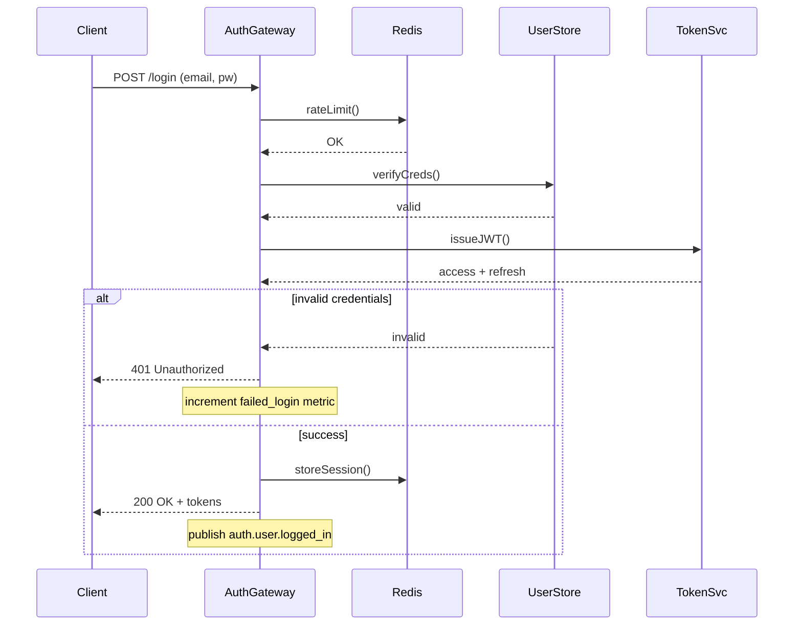
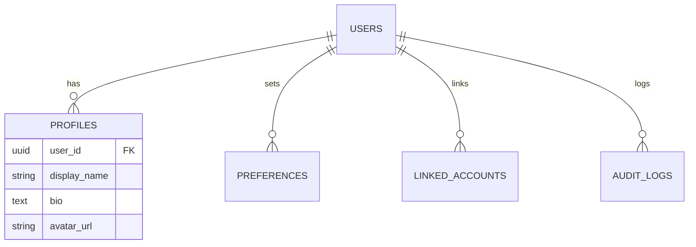
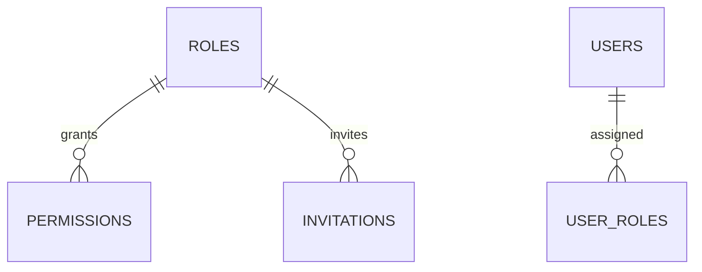
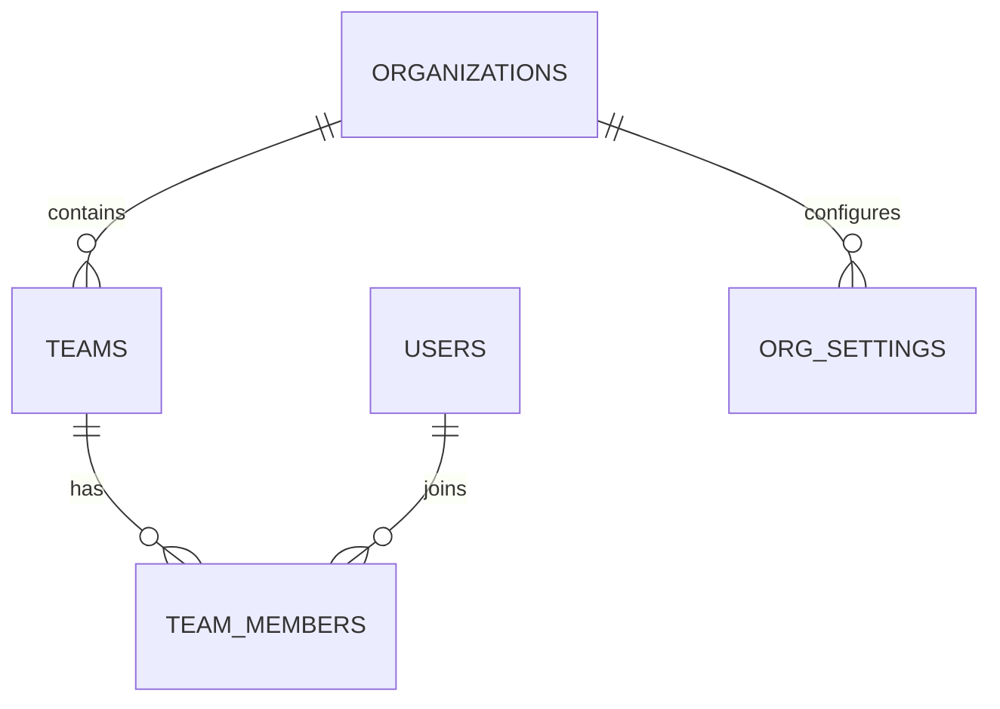

# Epic 11 – Authentication & User Management Detailed Design

This companion document elaborates on the checklist in `epic11plan.md`, providing architecture decisions, data models, diagrams, risks, and testing strategy. Each section aligns with a story in Epic 11 and integrates with previous epics (notably Epic 9’s workspace RBAC and Epic 10’s targeting service).

---

## 1. Authentication Foundation (Story 11.1)

### 1.1 Purpose
Establish a secure, extensible authentication layer that supports multiple login methods (email + password, OAuth providers) and issues JWTs consumed by other services via NATS.

### 1.2 Key Decisions
| Aspect | Decision | Rationale |
|--------|----------|-----------|
| Framework | Keycloak core + custom Node gateway | Keycloak provides mature OAuth/SSO; Node gateway adds app-specific logic without vendor lock-in |
| Token Format | JWT (RS256) + refresh tokens | Stateless, verifiable; refresh allows short-lived access tokens |
| Storage | Postgres (`users`, `sessions`) | Durable, ACID |
| Cache / Rate Limit | Redis | Low-latency token revocation & sliding-window limits |
| Event Bus | NATS JetStream `auth.*` | Consistent with Epics 9-10, enables `user.created`, `user.logged_in` |
| Observability | OpenTelemetry + Prometheus + Loki | Uniform tracing & metrics |

### 1.3 Internal Components
1. **Auth Gateway** – REST/GraphQL edge; performs rate-limit checks and delegates to Keycloak.
2. **Token Service** – Signs/refreshes JWTs, stores revocation lists in Redis.
3. **OAuth Handler** – Manages provider flows (Google, GitHub) and account linking.
4. **Session Manager** – Tracks active sessions/devices (Redis TTL keys).
5. **User Store** – CRUD for `users` table, password hashing (Argon2id).

### 1.4 Component Diagram

### 1.5 Sequence – Login Happy Path

### 1.6 Strengths
* Modular; easy to add MFA later.
* Stateless JWTs enable horizontal scaling.
* Compliance with OWASP: Argon2 hashing, secure cookies, CSRF defenses.
* JWT `roles` claim aligns with Epic 9 RBAC.

### 1.7 Risks / Mitigations
| Risk | Mitigation |
|------|-----------|
| Token theft | Access tokens 15 min TTL, HTTPS-only, refresh rotation, Redis revocation list |
| OAuth API drift | Weekly CI smoke tests, provider SDK version pinning |
| Login spikes | Redis-backed rate limit, UserStore sharding, autoscale gateway pods |

### 1.8 Phase-1 PoC Tasks
1. Provision Keycloak with GitHub/OIDC providers.
2. Scaffold `auth-gateway` (NestJS) with `/login`, `/refresh` endpoints.
3. Implement Redis sliding-window limiter (5 logins/min per IP).
4. Issue JWTs (RS256) and publish `auth.user.created`/`logged_in` to NATS.
5. OTEL tracing; Grafana dashboard for auth metrics.

---

## 2. User Profile & Preferences (Story 11.2)

### 2.1 Data Model (Postgres)
| Table | Key Columns | Purpose |
|-------|-------------|---------|
| `users` | `id` PK, `email`, `hashed_pw`, `created_at` | Primary accounts |
| `profiles` | `user_id` FK, `display_name`, `bio`, `avatar_url` | Extended profile data |
| `preferences` | `user_id` FK, `category`, `settings` JSONB, `last_updated` | Notification & UI prefs; updated_at for cache invalidation |
| `linked_accounts` | `user_id` FK, `provider`, `external_id` | OAuth links |
| `audit_logs` | `id` PK, `user_id`, `action`, `ts` | Compliance trail |

Indexes: GIN on `preferences.settings`, unique (`provider`,`external_id`), cascade deletes.

### 2.2 ER Diagram

### 2.3 Notes
* Avatars stored in S3; thumbnail processing via Sharp (lambda).
* Soft-delete users with 30-day grace; GDPR export endpoint (`/users/{id}/export`).
* Publish `user.profile.updated` on change for cache invalidation.

---

## 3. Access Control System (Story 11.3)

### 3.1 RBAC Data Model
| Table | Key Columns | Purpose |
|-------|-------------|---------|
| `roles` | `id` PK, `name`, `description` | System roles |
| `permissions` | `id` PK, `role_id` FK, `resource`, `action`, `scope` | Granular perms (scope: global/org/team) |
| `user_roles` | `user_id` FK, `role_id` FK | Assignments |
| `invitations` | `id` PK, `email`, `role_id` FK, `token`, `expires_at` | Secure invites |

### 3.2 ER Diagram

### 3.3 Notes
* Middleware checks JWT role claims; fallback to Redis-cached permission set.
* Admin dashboard (React) with impersonation (writes audit log).
* Alerts on bulk role changes via Prometheus → PagerDuty.

---

## 4. Teams & Organizations (Story 11.4)

### 4.1 Data Model
| Table | Key Columns | Purpose |
|-------|-------------|---------|
| `organizations` | `id` PK, `name`, `branding` JSONB | Tenant root |
| `teams` | `id` PK, `org_id` FK, `parent_team_id` FK, `name` | Nested sub-groups |
| `team_members` | `team_id` FK, `user_id` FK, `role` | Memberships |
| `org_settings` | `org_id` FK, `settings` JSONB | Overrides |

### 4.2 ER Diagram

### 4.3 Notes
* Role inheritance org → team; conflict resolved by most-privileged wins.
* Events: `org.user.added`, `team.user.invited` on NATS.
* Branding via CSS vars pulled from `org_settings`.

---

## 5. Open Questions
1. Timeline for MFA (TOTP/SMS) – include in 11.1 or post-MVP?
2. Custom domain support for org branding?
3. Billing integration (per-org plans) – align with future Epic 13.

---

## 6. Glossary
* **JWT** – JSON Web Token.
* **RBAC** – Role-Based Access Control.
* **MFA** – Multi-Factor Authentication.
* **OIDC** – OpenID Connect.

---

## 7. Testing Strategy
* **Unit** – Argon2 hashing, rate-limit logic.
* **Integration** – Login flow, token refresh, OAuth callbacks.
* **Contract** – JSON Schema for JWT claims, RBAC API.
* **Load** – 1 k login req/min, 100 concurrent refreshes; monitor P99.
* **Security** – OWASP ZAP scan, dependency audit (Snyk).
* **Chaos** – Redis outage; verify graceful degradation (fallback to stricter rate-limit).
* **E2E** – Invite → accept → role check flow via Cypress.

---

## 8. Security & Compliance
* Threat model: token theft, brute-force, privilege escalation.
* Controls: CSP, rate limits, IP allow-listing for admin routes.
* Compliance: GDPR data export/delete, audit retention = 1 year.

---

## 9. Deployment & Operations
* Helm chart `auth-service`; secrets in Vault.
* Blue-green releases; Keycloak in HA mode.
* Grafana dashboards: login rate, failed attempts, token issuance.

---

## 10. Future Enhancements & Tech Debt
* Add MFA (TOTP + WebAuthn).
* Fine-grained API scopes with OAuth2 PKCE.
* Move audit logs to ClickHouse for analytics.
