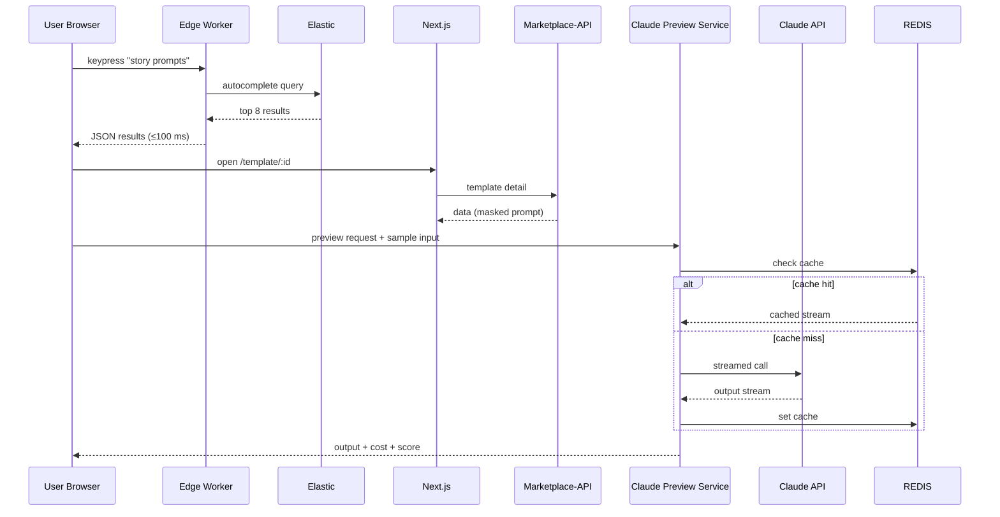
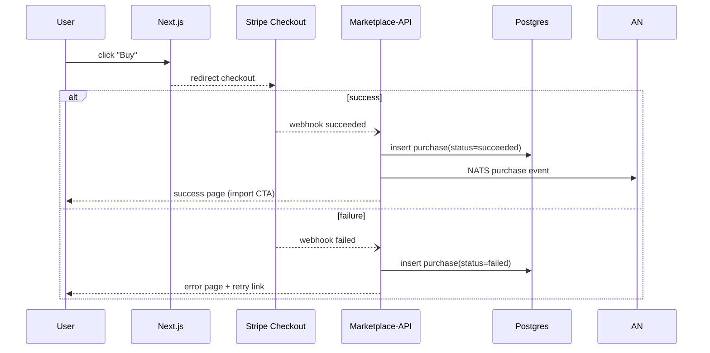
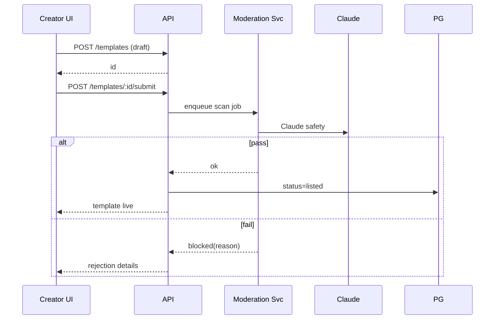
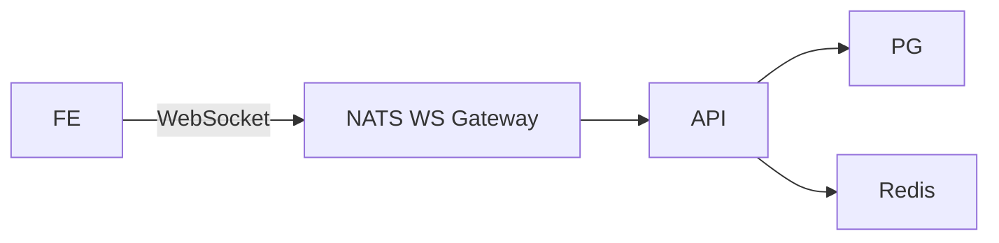
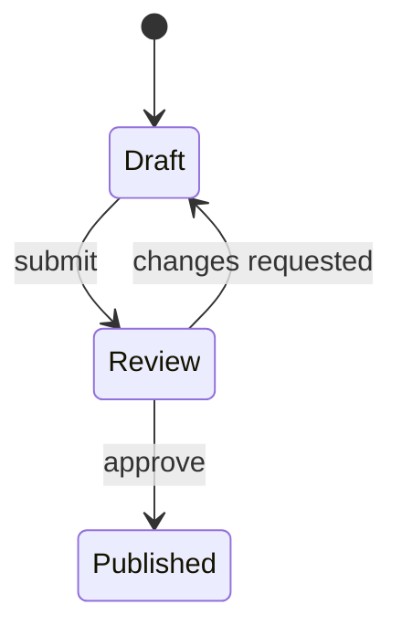

# Epic 16 – Prompt-Spaghetti Ecosystem & Marketplace – Detailed Design

> This document currently covers **Story 16.1 – Prompt Template Marketplace MVP**. Later stories (publishing, community, knowledge-base) will extend the shared architecture, schema, and services defined here.

Dependencies: Epics 11 (Auth/RBAC), 13 (Analytics), 14 (Experimentation), 15 (Cross-platform clients).

---

## 1. Goals & Non-Goals

| ID | Goal | Metric |
|----|------|--------|
| G1 | 30-second buyer flow search → purchase | p95 funnel time ≤ 30 s |
| G2 | Zero-trust previews that protect template IP | No plaintext prompt leaked before purchase |
| G3 | Preview-to-purchase conversion ≥ 5 % (measured & iterated via Epic 14 A/B) | `preview_to_purchase_conversion` in ClickHouse |
| G4 | Edge latency for search & preview ≤ 100 ms (p95) | Cloudflare Workers traces |
| G5 | Compliance by design (GDPR, PSD3) | Passed legal review checklist |
| G6 | Claude preview quality score ≥ 4/5 | `preview_quality_score_avg` in ClickHouse |

Non-Goals: Creator dashboards (16.2), forums (16.3) – buyer-side only for MVP. However, authentication scopes, event topics, and DB schema hooks are designed for smooth extension in 16.2-16.4.

---

## 2. High-Level Architecture

```mermaid
flowchart LR
  subgraph Frontend
    A[Next.js 15 UI]<-->B[Edge Autocomplete (Cloudflare Worker)]
  end
  A -- Preview Req --> P(Claude Preview Service)
  A -- Purchase --> C[Stripe Checkout]
  P -- Claude SDK --> CL[Claude SaaS]
  subgraph Core Services (K8s)
    CDN[(CloudFront CDN for thumbnails)]
    API[NestJS Marketplace API]
    SRCH[Elastic 8 Cluster]
    REC[ClickHouse Rec Engine]
    REDIS[(Redis)]
    OTEL[(OpenTelemetry Collector)]
    
  end
  API <--> SRCH
  CDN --- B
  API <--> PG[(Postgres 15)]
  API <--> REDIS
  SRCH <-- Nightly Batch --> REC
  API --NATS--> AN[Analytics Ingest]
  C -- Webhook --> API
  OTEL -.trace.- API
  OTEL -.trace.- P
```

*OpenTelemetry* spans front-to-back, feeding Epic 13 observability stack.

---

## 3. Data Model (ER Diagram)

```mermaid
erDiagram
  users ||--o{ template : owns
  template ||--|{ template_version : has
  template ||--o{ purchase : sold
  users ||--o{ purchase : buys
  template ||--o{ rating_review : rated

  users {
    uuid id PK
    text name
    text email
  }
  template {
    uuid id PK
    uuid owner_id FK
    text title
    text description
    text[] tags GIN_INDEX
    int price_cents
    boolean is_ai_generated
    text[] claude_compat
    text status ENUM(draft,listed,blocked,archived)
    jsonb stats
    uuid current_version_id
  }
  template_version {
    uuid id PK
    uuid template_id FK
    text claude_model
    text graph_json
    text prompt_yaml
    text changelog_md
    text hash SHA256
    int token_per_run_estimate
    float safety_score
    timestamptz created_at
  }
  purchase {
    uuid id PK
    uuid buyer_id FK
    uuid template_id FK
    uuid version_id FK
    text stripe_payment_intent_id
    text status
    text refund_reason ENUM(not_as_described,claude_incompat,claude_hallucination,other)
    timestamptz created_at
  }
  rating_review {
    uuid id PK
    uuid template_id FK
    uuid buyer_id FK
    smallint stars
    text comment
    text sentiment_ai
    boolean verified_purchase
    timestamptz created_at
  }
```

Additional indices: `template(price_cents)`, `purchase(status)`, `rating_review(stars)`.

S3 `template-assets/` bucket has **versioning enabled** for rollback support.

---

## 4. Key Components

1. **Marketplace API (NestJS)**
   * REST + GraphQL gateways.
   * JWT auth guard (Epic 11) with RBAC roles `buyer`, `creator`, `admin`.
   * Implements business rules: escrow hold (7 days), free template auto-purchase.
   * Publishes NATS events `marketplace.event.*` (view, preview, purchase, refund).
   * Exposes OpenAPI spec for clients (web, mobile, desktop).

2. **Claude Preview Service**
   * Stateless NestJS pod.
   * Input `{version_id, user_input_hash, claude_model_override?}`.
   * Checks Redis cache keyed by `version_id:user_input_hash` (TTL 1 h).
   * Builds prompt in **sandbox mode** – masks proprietary sections with `[[REDACTED]]` wrapper until purchase.
   * Calls Claude via `claude-sdk` streaming API; returns `{stream, cost, quality_score}`.
   * Rate-limit bucket 15/min default, elevated tiers for org admins.

3. **Search & Recommendation**
   * Elastic index with BM25 + optional semantic rerank (Claude embeddings) pipeline.
   * Nightly ClickHouse → Elastic enrichment job produces recommendations.
   * Thumbnail A/B variants stored with `thumbnail_v1`, `thumbnail_v2`; Epic 14 allocates traffic.

4. **Moderation Pipeline**
   * VirusTotal → Claude safety → Graph static scan (unsafe nodes) → Manual queue.
   * Failing any automatic check marks template `status=blocked` and emits alert.

5. **Payments & Compliance**
   * Stripe Connect Custom; webhook events (`payment_intent.succeeded`, etc.) processed via signed endpoint.
   * Escrow: funds captured, transferred to creator after 7 days unless refund open.
   * GDPR anonymization job pseudonymizes deleted buyers but keeps aggregate stats.

---

## 5. User Flows & Sequence Diagrams

### 5.1 Search → Preview


### 5.2 Purchase (Success & Failure)


---

## 6. Risks & Mitigations

| ID | Risk | Impact | Likelihood | Mitigation |
|----|------|--------|------------|------------|
| R1 | Claude API downtime | Previews unavailable | Low | Fallback to static sample output; alert banner |
| R2 | High preview token cost | Budget overruns | Med | Cap per-user & per-org daily cost; alert via Epic 13 |
| R7 | Elastic reindex delays | Stale search results | Low | Incremental indexer via NATS events |
| R8 | Claude model deprecation | Poor template compatibility | Low | Scheduled audit flags & creator notifications
| R3 | Search latency spike | Conversion drop | Med | Multi-AZ Elastic, edge cache, auto-scale |
| R4 | Payment disputes | Revenue loss | Low | Escrow hold, dispute reason analytics |
| R5 | Template IP leakage in preview | IP infringement | Low | Sandbox redaction & rate limits |
| R6 | GIN index bloat | Slow queries | Low | Weekly VACUUM + monitor via pg_stat |

---

## 7. Testing Strategy (Story 16.1)

| Layer | Tool | Scenario |
|-------|------|----------|
| Unit | Jest | API service methods, CLAUDE mask util |
| Contract | Pact | Stripe → API webhooks |
| Integration | Supertest | search → preview → purchase flow |
| Load | k6 | 1k rps search, 500 concurrent previews (p95 <2 s) |
| E2E | Playwright | 30 s funnel SLA across geos |
| Chaos | Toxiproxy | Claude latency + Stripe failures |

Synthetic Elastic index with **1 k templates** used for latency benchmarks (< 100 ms p95).

---

## 8. PoC & Sprint-0 Tasks

1. Scaffold Marketplace-API repo + NestJS boilerplate, enable OpenTelemetry exporter.  
2. Provision Elastic index; import 1 k synthetic docs; measure autocomplete latency.  
3. Implement Claude Preview Service stub with static response; integrate rate-limit middleware.  
4. End-to-end Stripe sandbox flow, including escrow delay logic.  
5. Build minimal Next.js template detail page with optimistic `useActionState` flow.  
6. Connect analytics events to NATS → ClickHouse; dashboard preview cost.

---

## 9. Open Questions

1. Stripe 2025 AI policy final confirmation – do we need extra creator attestation?  
2. Should crypto payments be allowed behind feature flag?  
3. Claude preview sandboxing granularity: full prompt mask vs. partial?  
4. Threshold for automatic Claude safety rejection (currently 0.7).  

---

## 10. Future Story Inheritance

• **16.2 Publishing** will reuse Template & TemplateVersion tables; add endpoints for version diff & analytics.  
• **16.3 Community** will extend RatingReview for comments & sentiment; use same moderation services.  
• **16.4 Knowledge Base** will reuse search infra with separate index namespace and Claude embeddings.

---

## Story 16.2 – Template Publishing & Creator Management

### Objectives
| OID | Objective | KPI |
|-----|-----------|-----|
| O1 | Empower creators to publish & version templates with minimal friction | Avg submission time < 5 min |
| O2 | Provide analytics & revenue dashboard | Dashboard MAU ≥70 % of active creators |
| O3 | Maintain quality via automated checks | Rejection false-positive < 3 % |

### Key Additions
1. **Creator Console** (Next.js route `/creator`)
2. **Version Diff Service** – generates HTML diff + Claude summary
3. **Revenue & Analytics Endpoint** – aggregates ClickHouse events
4. **Promotion Engine** – schedules discounts; integrates Epic 14 A/B

### API Extensions (Marketplace-API)
| Endpoint | Method | Auth | Description |
|----------|--------|------|-------------|
| /templates (POST) | POST | creator | Submit draft template (status=draft) |
| /templates/:id/submit | POST | creator | Trigger moderation pipeline |
| /templates/:id/versions | GET | creator | List versions + metrics |
| /versions/:vid/diff/:other | GET | creator | HTML diff & Claude summary |
| /creator/dashboard | GET | creator | Sales, views, CTR, revenue |
| /promotions | CRUD | creator | Discount schedules, A/B flags |

### Publishing Flow


### Analytics Dashboard Widgets
* Sales over time (line)
* Preview→Purchase funnel per template
* Claude hallucination reduction trend (token savings)
* Refund reasons pie-chart

### Risks & Mitigations
| Risk | Mitigation |
|------|-----------|
| Dashboard privacy leaks | Aggregate at 24 h window; min-count ≥5 |
| Discount abuse | Max 1 active promo per template; A/B guard |

---

## Story 16.3 – Community & Social Layer

### Features Snapshot
1. **User Profiles** with activity feed & privacy toggles.
2. **Follow & Notifications** using NATS `notif.*` streams.
3. **Forums & Comments** – Markdown w/ embedded graph previews.
4. **Reaction & Sentiment Analytics** – Claude classifies tone.
5. **Moderation Suite** – trust levels, auto-flag, escalation.

### Data Model Extensions
* `follow(user_id, target_id, created_at)`
* `comment(id, parent_id, entity_type, entity_id, body_md, sentiment_ai, created_at)`
* `notif(id,user_id,type,payload,read_at)`

### Real-Time Architecture


Notification fan-out uses NATS JetStream durable consumers; mobile/desktop clients reuse Epic 15 WS.

### Moderation Workflow
| Level | Action |
|-------|--------|
| Auto | Claude toxicity score >0.8 → hidden pending review |
| Community | Trusted users can flag; 3 flags hides post |
| Admin | Epic 17 panel approves/blocks |

### KPIs
* Daily active commenters ≥10 % of buyers
* Toxicity false-negative <2 %

---

## Story 16.4 – Knowledge Base & Learning Resources

### Components
1. **KB CMS** – Creators/Admins author articles, tutorials, patterns.
2. **Semantic Search** – Claude embeddings, separate Elastic index `kb_*`.
3. **Interactive Tutorials** – Step-based with in-browser Claude runs.
4. **Case Study Generator** – Claude summarises ROI from analytics export.
5. **Contextual Help Widget** – JS SDK embedding chatbot overlay.

### Authoring Workflow

* Reviewers selected from trusted creators (RBAC `kb_reviewer`).

### Search Flow Enhancements
* Query → Elastic BM25 → Semantic rerank (top50) via Claude vectors.
* Results include templates, KB articles, forum posts (federated).

### Metrics
| Metric | Target |
|--------|--------|
| KB article CTR | ≥8 % |
| Tutorial completion rate | ≥60 % |
| Chatbot answer helpful | ≥4/5 rating |

### Risks
| Risk | Mitigation |
|------|-----------|
| Outdated content | Quarterly audit reminder; flag low-CTR articles |
| Claude misuse generating wrong info | Reviewer double-check; version logs |

---

End of Epic 16 Detailed Design

