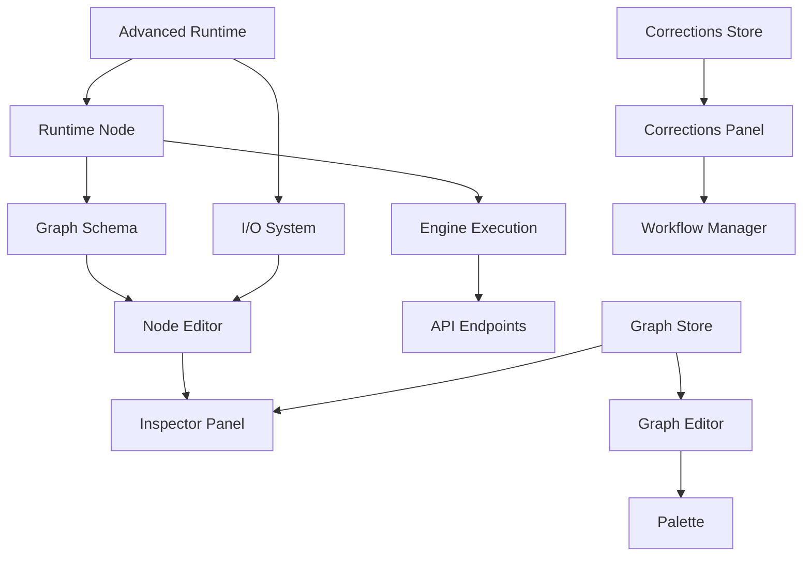

# Epic 8.4 - Extension System Architecture

> **Story 8.4.1 - Extension Point Documentation**

## 📋 Overview

The Prompt Spaghetti extension system provides a comprehensive framework for extending the application's functionality through well-defined extension points. This document maps all extensible components and provides formal specifications for each extension point.

## 🔍 System Component Audit

### Core Runtime System Extension Points

#### 1. Node Runtime Extensions (`RuntimeNode`)
**Location**: `packages/core/runtime/index.ts`
**Purpose**: Add new node types with custom execution logic
**Extensibility**: HIGH

**Extension Points**:
- **Custom Node Types**: Extend `RuntimeNode<TOutput>` or `AdvancedRuntimeNode<TOutput>`
- **Execution Context**: Access to `ExecutionContext` and `AdvancedExecutionContext`
- **State Management**: Persistent state through `nodeStates` Map
- **Performance Tracking**: Built-in performance metrics collection

**Current Node Types**:
- `WeightedChoiceNode` - Weighted random selection
- `ConcatNode` - String concatenation
- `OutputNode` - Output generation
- `IncludeNode` - Template inclusion
- `SetVariableNode` - Variable assignment
- `GetVariableNode` - Variable retrieval
- `WeightedAdvanced` - Advanced weighted selection (Epic 7)
- `Conditional` - Conditional branching (Epic 7)
- `Sequential` - Sequential processing (Epic 7)
- `Markov` - Markov chain processing (Epic 7)
- `PythonTransform` - Python code execution (Epic 8)

#### 2. Advanced Runtime Extensions (`AdvancedRuntimeNode`)
**Location**: `packages/core/runtime/advanced.ts`
**Purpose**: Add advanced nodes with state management and caching
**Extensibility**: HIGH

**Extension Points**:
- **State Management**: `getState()` and `setState()` methods
- **Validation**: `validate()` method for configuration validation
- **Serialization**: `serialize()` method for persistence
- **Performance Hints**: Configuration for execution optimization
- **Cache Integration**: Access to performance cache

#### 3. I/O System Extensions
**Location**: `packages/core/runtime/io-system.ts`
**Purpose**: Type-safe input/output handling with validation
**Extensibility**: MEDIUM

**Extension Points**:
- **Input Specifications**: `IOSpecBuilder` for defining inputs
- **Output Specifications**: Type-safe output definitions
- **Validation Constraints**: Custom validation rules
- **Type Coercion**: Custom type conversion logic

### UI Component Extension Points

#### 4. Inspector Panel Extensions
**Location**: `packages/core/components/Inspector/InspectorPanel.tsx`
**Purpose**: Add custom node editors and UI components
**Extensibility**: HIGH

**Extension Points**:
- **Node Editors**: Custom editors for node configuration
- **Properties Section**: Custom property editors
- **Preview Section**: Custom preview components
- **Collapsible Sections**: Reusable UI components

**Current Editors**:
- `BaseNodeEditor` - Base class for all editors
- `WeightedChoiceEditor` - Weighted choice configuration
- `OutputEditor` - Output node configuration
- `ConcatEditor` - Concatenation configuration
- `VariableEditor` - Variable node configuration
- `PythonTransformEditor` - Python code editor

#### 5. Graph Editor Extensions
**Location**: `packages/core/GraphEditor.tsx`
**Purpose**: Add custom graph visualization and interaction
**Extensibility**: MEDIUM

**Extension Points**:
- **Node Rendering**: Custom node visual representation
- **Edge Rendering**: Custom connection visualization
- **Interaction Handlers**: Custom user interactions
- **Validation Rules**: Custom graph validation

#### 6. Palette Extensions
**Location**: `packages/core/Palette.tsx`
**Purpose**: Add new node types to the palette
**Extensibility**: HIGH

**Extension Points**:
- **Node Categories**: Group nodes by functionality
- **Node Icons**: Custom icons for node types
- **Drag & Drop**: Custom drag behavior
- **Node Creation**: Custom node instantiation

### Schema and Validation Extensions

#### 7. Graph Schema Extensions
**Location**: `packages/core/graphSchema.ts`
**Purpose**: Add validation schemas for new node types
**Extensibility**: HIGH

**Extension Points**:
- **Node Type Enum**: Add new node types to `NodeTypeEnum`
- **Node Schemas**: Zod schemas for node validation
- **Graph Validation**: Custom graph-level validation
- **Migration Support**: Schema versioning and migration

#### 8. Node Schema Extensions
**Location**: `packages/core/nodeSchemas.ts`
**Purpose**: Add UI schemas for form generation
**Extensibility**: HIGH

**Extension Points**:
- **UI Schema Generation**: Auto-generate forms from schemas
- **Field Validation**: Custom field validation rules
- **Form Layout**: Custom form layouts
- **Help Text**: Documentation integration

### State Management Extensions

#### 9. Graph Store Extensions
**Location**: `packages/core/graphStore.ts`
**Purpose**: Add custom state management for extensions
**Extensibility**: MEDIUM

**Extension Points**:
- **State Slices**: Custom state management
- **Action Creators**: Custom actions
- **Selectors**: Custom state selectors
- **Middleware**: Custom state middleware

#### 10. Corrections Store Extensions
**Location**: `packages/core/correctionsStore.ts`
**Purpose**: Add custom correction management
**Extensibility**: MEDIUM

**Extension Points**:
- **Correction Types**: Custom correction categories
- **Validation Rules**: Custom correction validation
- **Statistics**: Custom metrics collection
- **Workflow Integration**: Custom correction workflows

### Server-Side Extensions

#### 11. Engine Extensions
**Location**: `server/src/engine.ts`
**Purpose**: Add server-side execution logic
**Extensibility**: HIGH

**Extension Points**:
- **Node Execution**: Server-side node processing
- **Graph Validation**: Server-side validation
- **Performance Optimization**: Execution optimization
- **Error Handling**: Custom error processing

#### 12. API Extensions
**Location**: `server/src/index.ts`
**Purpose**: Add new API endpoints
**Extensibility**: HIGH

**Extension Points**:
- **REST Endpoints**: Custom API endpoints
- **Middleware**: Custom request processing
- **Authentication**: Custom auth providers
- **Rate Limiting**: Custom rate limiting

## 🎯 High-Value Extension Points

### 1. Custom Node Types (Priority: CRITICAL)
**Value**: Allows adding entirely new functionality
**Effort**: Medium
**Examples**: AI model integration, database queries, web scraping

### 2. Inspector Editors (Priority: HIGH)
**Value**: Custom configuration interfaces
**Effort**: Low-Medium
**Examples**: Visual editors, code editors, form builders

### 3. Graph Visualization (Priority: MEDIUM)
**Value**: Custom graph rendering
**Effort**: High
**Examples**: 3D visualization, custom layouts, animations

### 4. Validation Rules (Priority: HIGH)
**Value**: Custom validation logic
**Effort**: Low
**Examples**: Business rules, data validation, compliance checks

### 5. State Management (Priority: MEDIUM)
**Value**: Custom state handling
**Effort**: Medium
**Examples**: Persistence, synchronization, caching

## 📊 Extension Point Relationships



## 🔧 Extension Development Workflow

### 1. Node Extension Development
```typescript
// 1. Create runtime node
class CustomNode extends AdvancedRuntimeNode<string> {
  run(ctx: AdvancedExecutionContext): string {
    // Custom logic
    return "result";
  }
  
  validate(): ValidationResult {
    // Validation logic
    return { valid: true, errors: [], warnings: [] };
  }
  
  serialize(): AdvancedNodeData {
    // Serialization logic
    return { id: this.id, type: 'Custom', config: this.config, data: {} };
  }
}

// 2. Add to schema
export const CustomNodeSchema = BaseNode.extend({
  type: z.literal('Custom'),
  customProperty: z.string()
});

// 3. Create editor
export const CustomNodeEditor: React.FC<BaseNodeEditorProps> = (props) => {
  return (
    <BaseNodeEditor title="Custom Node" {...props}>
      {/* Custom UI */}
    </BaseNodeEditor>
  );
};

// 4. Register in system
// Add to NodeTypeEnum, node registry, editor registry
```

### 2. UI Extension Development
```typescript
// 1. Create custom component
export const CustomInspectorSection: React.FC<Props> = ({ node, onChange }) => {
  return (
    <CollapsibleSection title="Custom Section">
      {/* Custom UI */}
    </CollapsibleSection>
  );
};

// 2. Register in inspector
// Add to editor selection logic
```

### 3. API Extension Development
```typescript
// 1. Create API handler
app.post('/api/custom-endpoint', async (req, res) => {
  // Custom logic
  res.json({ result: 'success' });
});

// 2. Add client integration
// Update client-side API calls
```

## 🛡️ Security Considerations

### Extension Sandboxing
- **Code Isolation**: Extensions run in isolated contexts
- **Permission System**: Granular permission control
- **Resource Limits**: Memory and CPU limitations
- **API Access Control**: Restricted API access

### Validation Requirements
- **Schema Validation**: All extensions must provide schemas
- **Input Sanitization**: User input validation
- **Output Validation**: Result validation
- **Error Handling**: Comprehensive error handling

## 📈 Performance Considerations

### Optimization Strategies
- **Lazy Loading**: Load extensions on demand
- **Caching**: Cache extension results
- **Batching**: Batch extension operations
- **Monitoring**: Performance monitoring

### Resource Management
- **Memory Limits**: Per-extension memory limits
- **Execution Timeout**: Prevent infinite loops
- **Garbage Collection**: Proper cleanup
- **Resource Pooling**: Shared resource pools

## 🔄 Version Compatibility

### API Versioning
- **Semantic Versioning**: Extension API versions
- **Backward Compatibility**: Maintain compatibility
- **Deprecation Warnings**: Graceful deprecation
- **Migration Tools**: Version migration utilities

### Extension Lifecycle
- **Installation**: Extension installation process
- **Activation**: Extension activation/deactivation
- **Updates**: Extension update mechanisms
- **Removal**: Clean extension removal

---

*This extension point documentation provides the foundation for Epic 8.4 - Extension System Architecture, enabling developers to create powerful extensions that integrate seamlessly with the Prompt Spaghetti system.*