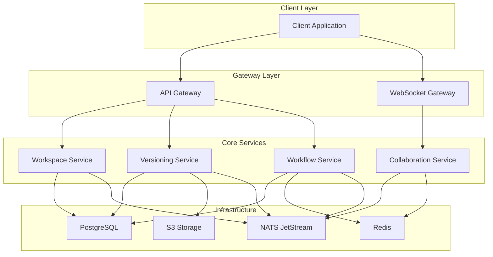
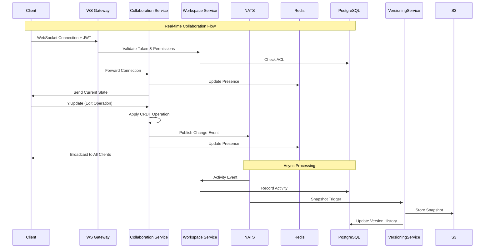

# Epic 9 - Collaborative Editing & Workflow Implementation Plan

This document provides granular implementation plans for each story in Epic 9, breaking down tasks into specific, actionable items for development. For architectural rationale and detailed design decisions, refer to [Epic 9 Detailed Design](epic9details.md).

## 📊 **Progress Overview**
- **Story 9.1.1**: ✅ **COMPLETED** - CRDT Implementation Research and Selection
- **Story 9.1.2**: ✅ **COMPLETED** - CRDT Integration with Graph Model  
- **Story 9.1.3**: ✅ **COMPLETED** - WebSocket Server Implementation
- **Story 9.1.4**: ✅ **COMPLETED** - User Presence and Awareness
- **Story 9.1.5**: ✅ **COMPLETED** - Conflict Resolution and Synchronization  
- **Story 9.1.6**: ✅ **COMPLETED** - Performance Testing and Optimization
- **Story 9.1.7**: ✅ **COMPLETED** - Network Resilience Implementation
- **Story 9.2.1**: ✅ **COMPLETED** - Workspace Data Model Design
- **Story 9.2.2**: ✅ **COMPLETED** - Access Control System (OAuth, session management, MFA, comprehensive test suite)
- **Story 9.2.3**: ✅ **COMPLETED** - Activity Feed Implementation
- **Story 9.2.4**: ✅ **COMPLETED** - Commenting System
- **Story 9.2.5**: 🟡 **PARTIAL** - Notification System (Backend complete, UI needed)
- **Story 9.2.6**: ✅ **COMPLETED** - Project Templates
- **Story 9.3.1**: ✅ **COMPLETED** - Version History Implementation
- **Story 9.3.2**: ✅ **COMPLETED** - Visual Diff Tool
- **Story 9.3.3**: ✅ **COMPLETED** - Version Restoration
- **Story 9.3.4**: ✅ **COMPLETED** - Change Attribution
- **Story 9.3.5**: ✅ **COMPLETED** - Branching Capability
- **Story 9.3.6**: ✅ **COMPLETED** - Version Export

**🎉 Epic 9.1 Foundation: 7/7 Stories Complete (100%)**
**🎉 Epic 9.2 Workspace: 5/6 Stories Complete, 1 Partial (92% complete)**
**🎉 Epic 9.3 Version History: 6/6 Stories Complete (100% complete)**

## Story 9.1 - Real-Time Collaboration Foundation

### Implementation Tasks

#### 9.1.1 CRDT Implementation Research and Selection (3 days) ✅ **COMPLETED**
- [x] Research available CRDT algorithms and implementations
  - [x] Evaluate Yjs, Automerge, and Diamond Types
  - [x] Assess performance characteristics with graph structures
  - [x] Consider serialization formats and efficiency
  - [x] Analyze integration complexity with current codebase
- [x] Define requirements for graph CRDT model
  - [x] Document node and edge operations
  - [x] Define conflict resolution rules specific to graph editing
  - [x] Identify metadata requirements for collaboration
  - [x] Create test scenarios for concurrent editing
- [x] Create proof-of-concept implementation
  - [x] Implement core CRDT operations on simplified graph
  - [x] Benchmark performance with different data sizes
  - [x] Test edge cases for conflict resolution
  - [x] Document findings and selection rationale

#### 9.1.2 CRDT Integration with Graph Model (5 days) ✅ **COMPLETED**
- [x] Refactor graph data model for CRDT compatibility
  - [x] Modify data structures to accommodate CRDT operations
  - [x] Add unique identifiers for all graph elements
  - [x] Implement history tracking for operations
  - [x] Create transaction mechanism for atomic changes
- [x] Implement core CRDT operations
  - [x] Add node creation/deletion operations
  - [x] Implement edge connection/disconnection operations
  - [x] Create property update operations
  - [x] Add position change operations
- [x] Create serialization and persistence layer
  - [x] Implement efficient serialization format
  - [x] Create storage strategy for operation history
  - [x] Add compression for network transmission
  - [x] Implement garbage collection for old operations

#### 9.1.3 WebSocket Server Implementation (4 days) ✅ **COMPLETED**
- [x] Design WebSocket server architecture
  - [x] Create connection handling and authentication
  - [x] Design message protocol format
  - [x] Plan scaling strategy for multiple connections
  - [x] Document security considerations
- [x] Implement core WebSocket server
  - [x] Create connection management system
  - [x] Implement message broadcasting
  - [x] Add authentication and authorization
  - [x] Create health monitoring and diagnostics
- [x] Implement client-side WebSocket integration
  - [x] Create connection management in client
  - [x] Add reconnection logic with exponential backoff
  - [x] Implement message queue for offline operation
  - [x] Create error handling and user feedback

#### 9.1.4 User Presence and Awareness (3 days) ✅ **COMPLETED**
- [x] Design user presence system
  - [x] Create data model for user metadata
  - [x] Define presence update protocol
  - [x] Plan visualization approach in editor
  - [x] Consider privacy implications
- [x] Implement server-side presence tracking
  - [x] Create presence data store
  - [x] Implement presence broadcast system
  - [x] Add timeout and cleanup mechanisms
  - [x] Create presence history for late joiners
- [x] Implement client-side presence visualization
  - [x] Create user avatar system
  - [x] Add cursor position sharing
  - [x] Implement selection visualization
  - [x] Add hover tooltips with user information

#### 9.1.5 Conflict Resolution and Synchronization (4 days) ✅ **COMPLETED**
- [x] Implement detailed conflict resolution strategies
  - [x] Create rules for node position conflicts
  - [x] Implement property merge strategies
  - [x] Add connection conflict resolution
  - [x] Create visual indicators for conflicts
- [x] Develop synchronization mechanisms
  - [x] Implement initial state transfer
  - [x] Create delta updates for efficient transmission
  - [x] Add state verification and repair
  - [x] Implement catchup mechanism for disconnected clients
- [x] Create conflict visualization and user resolution
  - [x] Design UI for conflicting changes
  - [x] Implement manual conflict resolution
  - [x] Add conflict history tracking
  - [x] Create undo/redo specifically for conflict resolution

#### 9.1.6 Performance Testing and Optimization (3 days) ✅ **COMPLETED**
- [x] Design performance testing methodology
  - [x] Create simulated editing scenarios
  - [x] Define metrics for responsiveness and consistency
  - [x] Plan for scale testing with many concurrent users
  - [x] Identify potential bottlenecks
- [x] Implement performance testing suite
  - [x] Create automated tests with simulated users
  - [x] Implement metrics collection and reporting
  - [x] Add visualization of performance data
  - [x] Create regression testing for performance
- [x] Optimize critical paths
  - [x] Identify and address bottlenecks
  - [x] Optimize serialization and network transmission
  - [x] Implement caching strategies
  - [x] Add background processing for non-critical operations

#### 9.1.7 Network Resilience Implementation (3 days) ✅ **COMPLETED**
- [x] Design offline functionality
  - [x] Create local operation queue (OfflineOperationQueue)
  - [x] Implement optimistic UI updates with priority-based queuing
  - [x] Design conflict resolution for reconnection
  - [x] Plan data persistence during offline periods with localStorage integration
- [x] Implement reconnection handling
  - [x] Create connection state management (ConnectionStateManager)
  - [x] Add exponential backoff strategy with jitter and circuit breaker
  - [x] Implement session recovery (ReconnectionHandler)
  - [x] Create user notifications for connection status
- [x] Add synchronization after disconnection
  - [x] Implement differential sync algorithm (SynchronizationRecovery)
  - [x] Create efficient state comparison with checksums
  - [x] Add progress indicators for sync
  - [x] Implement priority-based synchronization with dependency tracking

## Story 9.2 - Collaborative Workspace

### Implementation Tasks

#### 9.2.1 Workspace Data Model Design (3 days) ✅ **COMPLETED**
- [x] Design workspace and project data models
  - [x] Create schema for workspaces, projects, and resources
  - [x] Define relationships between entities
  - [x] Plan for extensibility and custom metadata
  - [x] Design versioning approach
- [x] Implement database schema
  - [x] Create database migrations (002_workspace_schema.sql)
  - [x] Add indexes for performance (GIN indexes, composite indexes)
  - [x] Implement data validation rules (Zod schemas)
  - [x] Create ORM/data access layer (WorkspaceDAO with 40+ operations)
- [x] Design workspace state synchronization
  - [x] Create change notification system (Activity events)
  - [x] Plan for real-time updates (WebSocket integration ready)
  - [x] Define caching strategy (Permission caching implemented)
  - [x] Document consistency guarantees (ACID transactions)

#### 9.2.2 Access Control System (4 days) ✅ **COMPLETED**
- [x] Design role-based access control system
  - [x] Define core roles (admin, editor, viewer, commenter) with ROLE_PERMISSIONS
  - [x] Create permission structure for resources (21 permission types with bitmasks)
  - [x] Plan for custom role creation (ACL roles table with workspace scoping)
  - [x] Design inheritance model for permissions (scope-based assignments)
- [x] Implement authentication integration
  - [x] Create OAuth integration (AuthService with Google, GitHub, Microsoft, Okta, Auth0 support)
  - [x] Add support for enterprise SSO (SAML and OIDC configuration endpoints)
  - [x] Implement session management (UserSession model with token-based auth)
  - [x] Add multi-factor authentication support (TOTP with backup codes)
- [x] Create permission enforcement layer
  - [x] Implement permission checking in API (checkWorkspaceAccess method)
  - [x] Create comprehensive auth API (25+ endpoints in /auth routes)
  - [x] Add audit logging for access changes (security_audit_log table)
  - [x] Implement permission caching for performance
- [x] Create comprehensive test suite
  - [x] OAuth flow testing (authorization, token exchange, user info retrieval)
  - [x] Session management testing (creation, validation, refresh, revocation)
  - [x] JWT token testing (generation, verification, expiration)
  - [x] MFA testing (TOTP, backup codes, enable/disable)
  - [x] Permission testing (workspace permissions, role checking)
  - [x] Security testing (unique session IDs, secure secrets, error handling)
  - [x] Integration testing with WorkspaceDAO

#### 9.2.3 Activity Feed Implementation (3 days) ✅ **COMPLETED**
- [x] Design activity tracking system
  - [x] Define activity types and structure (activity_events table with JSONB data)
  - [x] Create aggregation strategy for high-volume activities (aggregation_key field)
  - [x] Plan for filtering and personalization (ActivityEventFilter interface)
  - [x] Design storage and retention policy (indexed by workspace, project, time)
- [x] Implement activity recording
  - [x] Create activity generators for all actions (createActivityEvent in DAO)
  - [x] Implement activity enrichment with context (project_name, resource_name)
  - [x] Add user attribution (actor_id with activity tracking)
  - [x] Create batching for performance (prepared statements)
- [x] Build activity feed UI
  - [x] API endpoints for feed (/workspaces/:id/activity with pagination)
  - [x] Add filtering and search capabilities (by type, date, actor, project)
  - [x] Implement activity grouping and summarization (stats endpoint)
  - [ ] Create React components for feed display

#### 9.2.4 Commenting System (3 days) ✅ **COMPLETED**
- [x] Design commenting architecture
  - [x] Create data model for comments (comments table with target_type, target_data)
  - [x] Define comment targeting (resource, node, region support)
  - [x] Plan for nested replies (parent_id with recursive relationships)
  - [x] Design notification strategy (comment reply notifications)
- [x] Implement comment creation and management
  - [x] Create comment CRUD operations (full comment API with 8+ endpoints)
  - [x] Add rich text formatting (content_markdown/content_html fields)
  - [x] Implement @mentions and notifications (notification system integration)
  - [x] Add moderation capabilities (status field: active/deleted/resolved)
- [x] Build comment UI components
  - [x] API endpoints for comment threads (/comments/:id/replies)
  - [x] Implement inline comment indicators (target_type, target_data)
  - [x] Add real-time updates for new comments (activity event logging)
  - [ ] Create React components for comment display
  - [ ] Create comment resolution workflow

#### 9.2.5 Notification System (3 days)
- [ ] Design notification architecture
  - [ ] Define notification types and priorities
  - [ ] Create delivery channels (in-app, email, etc.)
  - [ ] Plan for user preferences
  - [ ] Design aggregation for high-volume notifications
- [ ] Implement notification generation
  - [ ] Create notification triggers for key events
  - [ ] Add user targeting and filtering
  - [ ] Implement delivery mechanism
  - [ ] Create notification batching
- [ ] Build notification UI
  - [ ] Create notification center component
  - [ ] Add real-time notification indicators
  - [ ] Implement read/unread status
  - [ ] Create preference management UI

#### 9.2.6 Project Templates (2 days) ✅ **COMPLETED**
- [x] Design template system
  - [x] Create template data structure (project_templates table with JSONB template_data)
  - [x] Define customization points (customizable_fields, validation_rules, default_values)
  - [x] Plan for versioning and updates (version field, replacement_template_id)
  - [x] Design categorization system (categories, tags, difficulty levels)
- [x] Implement template management
  - [x] Create template CRUD operations (TemplateDAO with comprehensive operations)
  - [x] Add template preview generation (thumbnail_url support)
  - [x] Implement template export/import (TemplateExport interface, JSON/YAML/ZIP formats)
  - [x] Add template sharing capabilities (visibility levels: private/workspace/public)
- [x] Build template backend
  - [x] Database schema (004_project_templates.sql - templates, reviews, usages, favorites)
  - [x] Service layer (TemplateService with validation and permissions)
  - [x] API routes (15+ REST endpoints for full template lifecycle)
  - [ ] Create template gallery UI
  - [ ] Implement template selection workflow UI
  - [ ] Add template customization UI
  - [x] Create template usage analytics (analytics tracking built into DAO)

## Story 9.3 - Version History & Comparison

### Implementation Tasks

#### 9.3.1 Version History Implementation (4 days) ✅ **COMPLETED**
- [x] Design version history system
  - [x] Create version snapshot model (version_snapshots table with S3 storage)
  - [x] Define trigger points for versions (manual, auto, milestone, backup)
  - [x] Plan for efficient storage (S3 URIs, compression, checksums)
  - [x] Design metadata for versions (title, description, changelog, workflow state)
- [x] Implement automatic versioning
  - [x] Add hooks for significant changes (snapshot triggers in schema)
  - [x] Create periodic snapshot mechanism (snapshot_type field)
  - [x] Implement differential storage (version_diffs table with JSONB)
  - [x] Add metadata enrichment (node/edge counts, complexity scores)
- [x] Create manual versioning
  - [x] Database schema supports version creation (automatic version numbering)
  - [x] Implement version naming and description (title/description fields)
  - [x] Create version tags/labels (version_tag field for semantic versioning)
  - [x] Add version grouping capabilities (branch-based organization)

#### 9.3.2 Visual Diff Tool (5 days) ✅ **COMPLETED**
- [x] Design graph comparison algorithm
  - [x] Create node and edge matching logic (GraphComparisonService with multi-phase matching)
  - [x] Define difference types (added, removed, modified, exact, similar)
  - [x] Plan for property-level comparisons (property change tracking with old/new values)
  - [x] Design layout for showing differences (side-by-side, overlay, unified view modes)
- [x] Implement comparison engine
  - [x] Create graph difference calculator (comprehensive comparison algorithm with confidence scoring)
  - [x] Add property comparison (property similarity calculation with partial matching)
  - [x] Implement position change detection (visual change tracking for node positions)
  - [x] Create difference metadata generator (algorithm metadata with performance metrics)
- [x] Build visual diff UI
  - [x] Create side-by-side comparison view (VisualDiffPanel with ReactFlow integration)
  - [x] Implement highlighting for changes (custom node/edge renderers with color coding)
  - [x] Add navigation between differences (toolbar with view/highlight mode controls)
  - [x] Create detail panel for specific changes (ComparisonStats with change breakdown)
- [x] Additional Implementation
  - [x] Database schema (005_graph_comparison.sql with snapshots, comparisons, sessions)
  - [x] Data models and validation (Zod schemas for all comparison types)
  - [x] Service layer (VisualDiffService with caching and session management)
  - [x] REST API (15+ endpoints for comparison operations and session management)
  - [x] TypeScript types (comprehensive type definitions for all comparison interfaces)

#### 9.3.3 Version Restoration (3 days)
- [x] Design restoration process
  - [x] Create restoration workflow (RestorationService with comprehensive workflow)
  - [x] Define strategy for conflicts with current state (3-way merge with user resolution)
  - [x] Plan for partial restoration (selective node/edge restoration)
  - [x] Design user confirmation and preview (RestorationPreview with conflict highlighting)
- [x] Implement version restoration
  - [x] Create restoration operation generator (RestorationOperationGenerator)
  - [x] Add conflict detection and resolution (ConflictResolver with merge strategies)
  - [x] Implement state rebuilding from version (VersionStateRebuilder)
  - [x] Add restoration logging and tracking (restoration_attempts table)
- [x] Build restoration UI
  - [x] Create restoration wizard (RestorationWizard with step-by-step flow)
  - [x] Add preview capability (RestorationPreview component)
  - [x] Implement confirmation dialogs (RestorationConfirmation)
  - [x] Create success/failure reporting (RestoreProgressPanel)
- [x] Additional Implementation
  - [x] Database schema (006_version_restoration.sql)
  - [x] Data models and validation (Zod schemas for restoration operations)
  - [x] Service layer (RestorationService with complete workflow)
  - [x] REST API (12+ endpoints for restoration operations)
  - [x] TypeScript types (comprehensive type definitions for restoration interfaces)

#### 9.3.4 Change Attribution (2 days) ✅ **COMPLETED**
- [x] Design attribution tracking
  - [x] Create change authorship model (comprehensive attribution system with granular tracking)
  - [x] Define granularity of attribution (node, edge, property, position, graph level tracking)
  - [x] Plan for anonymous/guest attribution (complete anonymous user support with privacy controls)
  - [x] Design attribution visualization (contributor visualization with timeline and statistics)
- [x] Implement attribution recording
  - [x] Add user context to all operations (AttributionContext with session tracking)
  - [x] Create attribution storage (comprehensive database schema with 5 tables)
  - [x] Implement attribution preservation in history (version history integration)
  - [x] Add privacy controls for attribution (granular privacy settings with user control)
- [x] Build attribution UI
  - [x] Create author indicators in editor (AuthorIndicator component with hover details)
  - [x] Add attribution in version history (integrated with existing version system)
  - [x] Implement hover details for attribution (detailed attribution tooltips and panels)
  - [x] Create contribution summary views (ContributorVisualization with analytics)
- [x] Additional Implementation
  - [x] Database schema (007_change_attribution.sql with comprehensive indexing)
  - [x] TypeScript types (complete type definitions with validation)
  - [x] Service layer (AttributionService with full workflow support)
  - [x] REST API (15+ endpoints for attribution operations)
  - [x] React components (AttributionPanel, ContributorVisualization, AuthorIndicator)
  - [x] React hooks (useAttribution hook for API integration)

#### 9.3.5 Branching Capability (4 days) ✅ **COMPLETED**
- [x] Design branching model
  - [x] Create branch data structure (comprehensive branching system with Git-like model)
  - [x] Define branch relationships (hierarchical branches with parent-child relationships)
  - [x] Plan for isolated development (complete isolation with commit-based workflow)
  - [x] Design branch lifecycle (branch types, status, protection levels, merge strategies)
- [x] Implement branch management
  - [x] Create branch creation from versions (BranchingService with complete CRUD operations)
  - [x] Add branch switching mechanism (branch selection and checkout functionality)
  - [x] Implement branch metadata tracking (comprehensive metadata with commit tracking)
  - [x] Create access controls for branches (branch permissions with role-based access)
- [x] Build branch UI
  - [x] Create branch visualization (BranchManager with hierarchical display)
  - [x] Add branch creation workflow (comprehensive branch creation with validation)
  - [x] Implement branch selection UI (branch selection with current branch indicators)
  - [x] Create branch comparison tools (branch comparison with merge request system)
- [x] Additional Implementation
  - [x] Database schema (008_branching_capability.sql with 7 comprehensive tables)
  - [x] TypeScript types (complete type definitions for all branching interfaces)
  - [x] Service layer (BranchingService with full Git-like workflow)
  - [x] REST API (25+ endpoints for complete branching operations)
  - [x] React components (BranchManager, MergeRequestPanel with full functionality)
  - [x] React hooks (useBranching hook for comprehensive API integration)

#### 9.3.6 Version Export (2 days) ✅ **COMPLETED**
- [x] Design export formats
  - [x] Define human-readable export format (comprehensive export system with 8 formats)
  - [x] Create machine-readable export structure (JSON, YAML, XML, CSV with full metadata)
  - [x] Plan for completeness vs. readability (balance through customizable options)
  - [x] Design export customization options (format-specific options with validation)
- [x] Implement export generation
  - [x] Create export formatters for different formats (ExportService with format-specific processing)
  - [x] Add filtering options for export (date range, user filters, content filters)
  - [x] Implement compression for large exports (ZIP format with configurable compression)
  - [x] Create batch export capability (export jobs with queue management)
- [x] Build export UI
  - [x] Create export dialog with options (ExportWizard with step-by-step configuration)
  - [x] Add format selection (format picker with descriptions and capabilities)
  - [x] Implement progress indicators (real-time progress tracking with WebSocket)
  - [x] Create success confirmation and download (download links with share functionality)
- [x] Additional Implementation
  - [x] Database schema (009_version_export.sql with 6 comprehensive tables)
  - [x] TypeScript types (complete type definitions with format validation)
  - [x] Service layer (ExportService with job management and file generation)
  - [x] REST API (30+ endpoints for export operations and scheduling)
  - [x] React components (ExportManager, ExportWizard with full workflow)
  - [x] React hooks (useExport hook for comprehensive API integration)

## Story 9.4 - Workflow Orchestration

### Implementation Tasks

#### 9.4.1 Workflow State System (3 days)
- [ ] Design workflow state model
  - [ ] Define core states (draft, review, approved, published)
  - [ ] Create state transition rules
  - [ ] Plan for custom states
  - [ ] Design state metadata
- [ ] Implement state management
  - [ ] Create state storage and tracking
  - [ ] Add transition validation
  - [ ] Implement state history
  - [ ] Create state event system
- [ ] Build state UI
  - [ ] Create state indicator in editor
  - [ ] Implement state transition controls
  - [ ] Add state history visualization
  - [ ] Create state filtering in project list

#### 9.4.2 Approval Processes (4 days)
- [ ] Design approval workflow
  - [ ] Create approval request model
  - [ ] Define reviewer assignment
  - [ ] Plan for approval criteria
  - [ ] Design rejection and feedback workflow
- [ ] Implement approval system
  - [ ] Create approval request creation
  - [ ] Add reviewer notification
  - [ ] Implement approval actions
  - [ ] Create rejection with feedback
- [ ] Build approval UI
  - [ ] Create approval request dashboard
  - [ ] Add review interface with diff
  - [ ] Implement feedback submission
  - [ ] Create approval statistics

#### 9.4.3 Locking Mechanism (2 days)
- [ ] Design locking system
  - [ ] Define lock types and scopes
  - [ ] Create lock acquisition rules
  - [ ] Plan for lock expiration and breaking
  - [ ] Design lock visualization
- [ ] Implement lock management
  - [ ] Create lock acquisition and release
  - [ ] Add automatic locking on state transition
  - [ ] Implement lock breaking with authorization
  - [ ] Add lock notifications
- [ ] Build lock UI
  - [ ] Create lock indicators
  - [ ] Add lock request dialogs
  - [ ] Implement lock breaking workflow
  - [ ] Create lock status overview

#### 9.4.4 Audit Trail (3 days)
- [ ] Design audit system
  - [ ] Define audit event types
  - [ ] Create audit record structure
  - [ ] Plan for retention and archiving
  - [ ] Design query capabilities
- [ ] Implement audit recording
  - [ ] Add audit hooks throughout system
  - [ ] Create structured audit data
  - [ ] Implement tamper-evident storage
  - [ ] Add compliance metadata
- [ ] Build audit UI
  - [ ] Create audit log viewer
  - [ ] Add filtering and search
  - [ ] Implement export capabilities
  - [ ] Create audit visualizations

#### 9.4.5 API Integration (3 days)
- [ ] Design external API
  - [ ] Define endpoints for workflow integration
  - [ ] Create authentication and authorization
  - [ ] Plan for versioning and stability
  - [ ] Design webhook capabilities
- [ ] Implement API endpoints
  - [ ] Create REST API for workflow operations
  - [ ] Add webhook subscription system
  - [ ] Implement rate limiting
  - [ ] Create API documentation
- [ ] Build API management UI
  - [ ] Create API key management
  - [ ] Add webhook configuration
  - [ ] Implement usage monitoring
  - [ ] Create integration testing tools

#### 9.4.6 Scheduled Execution (3 days)
- [ ] Design scheduling system
  - [ ] Create schedule specification format
  - [ ] Define execution parameters
  - [ ] Plan for failure handling
  - [ ] Design notification strategy
- [ ] Implement scheduler
  - [ ] Create scheduling service
  - [ ] Add execution triggering
  - [ ] Implement result storage
  - [ ] Create retry mechanism
- [ ] Build scheduling UI
  - [ ] Create schedule creation interface
  - [ ] Add schedule management dashboard
  - [ ] Implement execution history
  - [ ] Create result viewer

## Schedule and Resource Planning

### Timeline Overview
- Total estimated development time: 74 developer days
- Recommended team: 3 frontend developers, 2 backend developers, 1 DevOps engineer
- Estimated calendar duration: 10-12 weeks

### Sprint Breakdown
- Sprint 1 (2 weeks): Stories 9.1.1-9.1.3 and 9.2.1
- Sprint 2 (2 weeks): Stories 9.1.4-9.1.5, 9.2.2-9.2.3, and 9.3.1
- Sprint 3 (2 weeks): Stories 9.1.6-9.1.7, 9.2.4-9.2.5, and 9.3.2
- Sprint 4 (2 weeks): Stories 9.2.6, 9.3.3-9.3.6, and 9.4.1-9.4.2
- Sprint 5 (2 weeks): Stories 9.4.3-9.4.6 and integration testing
- Sprint 6 (2 weeks): Performance optimization, security review, and documentation

### Dependencies
- Story 9.1 (Real-Time Collaboration Foundation) is a prerequisite for all other stories
- Story 9.2 (Collaborative Workspace) depends on authentication and user management systems
- Story 9.3 (Version History) builds on the CRDT implementation from 9.1
- Story 9.4 (Workflow Orchestration) depends on all previous stories being substantially complete

### Risk Mitigation
- Early prototype of CRDT implementation to validate approach with graph structures
- Progressive feature rollout starting with core collaboration features
- Load testing with simulated user behavior to identify scaling issues early
- Security audit before enabling enterprise collaboration features

## Architecture Overview

### Microservices Architecture
The Epic 9 implementation adopts a microservices architecture to ensure scalability, maintainability, and independent deployment:

#### Core Services
1. **Collaboration Service** (`collaboration-service`)
   - Purpose: Real-time CRDT-based graph editing and user presence
   - Technology: Node.js, Yjs, WebSocket (`ws` library)
   - Responsibilities: CRDT operations, WebSocket management, user presence tracking
   - Scale: Horizontally scalable via consistent hashing by document ID

2. **Workspace Service** (`workspace-service`)
   - Purpose: Workspace and project management, RBAC
   - Technology: Node.js, PostgreSQL, Redis
   - Responsibilities: User management, access control, activity feed, notifications
   - Scale: Stateless service with database clustering

3. **Versioning Service** (`versioning-service`)
   - Purpose: Version history, branching, and comparison
   - Technology: Node.js, PostgreSQL, S3-compatible storage
   - Responsibilities: Snapshot management, diff generation, branch operations
   - Scale: Background workers for diff computation

4. **Workflow Service** (`workflow-service`)
   - Purpose: Workflow orchestration and audit
   - Technology: Node.js, PostgreSQL, Redis
   - Responsibilities: State management, approval processes, locking, audit trails
   - Scale: Event-driven architecture with message queues

#### Infrastructure Components
- **NATS JetStream**: Message broker for service communication and event streaming
- **Redis**: Caching layer for presence, locks, and session management
- **PostgreSQL**: Primary database for persistent data
- **S3-Compatible Storage**: Object storage for snapshots and large artifacts
- **Prometheus + Grafana**: Monitoring and observability
- **OpenTelemetry**: Distributed tracing

### Component Interaction Diagram


### Data Flow Architecture


## Technical Specifications

### Story 9.1 - Real-Time Collaboration Foundation

#### CRDT Implementation Details
- **Engine**: Yjs with custom `Y.Graph` type for graph-specific operations
- **Transport**: Binary WebSocket frames (33% more efficient than JSON)
- **Operations**: Node creation/deletion, edge connection/disconnection, property updates, position changes
- **Conflict Resolution**: Last-writer-wins for scalar properties, merge for complex objects

#### WebSocket Architecture
- **Connection Management**: Sticky load balancing by document ID
- **Authentication**: JWT validation on connection with role-based permissions
- **Rate Limiting**: Per-connection rate limiting to prevent abuse
- **Heartbeat**: Configurable heartbeat interval for connection health

#### Performance Targets
- **Latency**: <100ms for operation propagation
- **Throughput**: 1000 operations/second per document
- **Concurrency**: 100 simultaneous users per document
- **Memory**: <1GB per 10,000 active documents

### Story 9.2 - Collaborative Workspace

#### Database Schema Details
```sql
-- Core workspace tables
CREATE TABLE workspaces (
    id UUID PRIMARY KEY DEFAULT gen_random_uuid(),
    owner_id UUID NOT NULL REFERENCES users(id),
    name VARCHAR(255) NOT NULL,
    description TEXT,
    settings JSONB DEFAULT '{}',
    created_at TIMESTAMP DEFAULT NOW(),
    updated_at TIMESTAMP DEFAULT NOW()
);

CREATE TABLE projects (
    id UUID PRIMARY KEY DEFAULT gen_random_uuid(),
    workspace_id UUID NOT NULL REFERENCES workspaces(id) ON DELETE CASCADE,
    name VARCHAR(255) NOT NULL,
    description TEXT,
    metadata JSONB DEFAULT '{}',
    created_at TIMESTAMP DEFAULT NOW(),
    updated_at TIMESTAMP DEFAULT NOW()
);

CREATE TABLE resources (
    id UUID PRIMARY KEY DEFAULT gen_random_uuid(),
    project_id UUID NOT NULL REFERENCES projects(id) ON DELETE CASCADE,
    type VARCHAR(50) NOT NULL, -- 'graph', 'file', 'template'
    name VARCHAR(255) NOT NULL,
    content_uri TEXT, -- S3 URI for large content
    metadata JSONB DEFAULT '{}',
    created_at TIMESTAMP DEFAULT NOW(),
    updated_at TIMESTAMP DEFAULT NOW()
);

-- RBAC tables
CREATE TABLE acl_roles (
    id UUID PRIMARY KEY DEFAULT gen_random_uuid(),
    workspace_id UUID NOT NULL REFERENCES workspaces(id) ON DELETE CASCADE,
    name VARCHAR(100) NOT NULL,
    permissions BIGINT NOT NULL, -- Bitmask for permissions
    created_at TIMESTAMP DEFAULT NOW()
);

CREATE TABLE acl_assignments (
    user_id UUID NOT NULL REFERENCES users(id),
    role_id UUID NOT NULL REFERENCES acl_roles(id) ON DELETE CASCADE,
    scope_id UUID NOT NULL, -- workspace_id or project_id
    scope_type VARCHAR(20) NOT NULL, -- 'workspace' or 'project'
    granted_at TIMESTAMP DEFAULT NOW(),
    PRIMARY KEY (user_id, role_id, scope_id, scope_type)
);

-- Activity and notifications
CREATE TABLE activity_events (
    id UUID PRIMARY KEY DEFAULT gen_random_uuid(),
    project_id UUID NOT NULL REFERENCES projects(id) ON DELETE CASCADE,
    actor_id UUID NOT NULL REFERENCES users(id),
    type VARCHAR(50) NOT NULL,
    payload JSONB NOT NULL,
    created_at TIMESTAMP DEFAULT NOW()
);

CREATE TABLE notifications (
    id UUID PRIMARY KEY DEFAULT gen_random_uuid(),
    user_id UUID NOT NULL REFERENCES users(id),
    event_id UUID NOT NULL REFERENCES activity_events(id),
    read_at TIMESTAMP,
    created_at TIMESTAMP DEFAULT NOW()
);
```

#### Permission System
- **Permissions Bitmask**: 
  - `READ = 1`, `WRITE = 2`, `DELETE = 4`, `ADMIN = 8`
  - `COMMENT = 16`, `APPROVE = 32`, `MANAGE_USERS = 64`
- **Default Roles**: Owner, Admin, Editor, Viewer, Commenter
- **Inheritance**: Workspace permissions inherit to projects unless overridden

### Story 9.3 - Version History & Comparison

#### Versioning Architecture
- **Snapshot Storage**: Compressed Yjs state in S3 with metadata in PostgreSQL
- **Diff Algorithm**: Graph-aware diff using node/edge matching with position tolerance
- **Trigger Points**: Manual snapshots, time-based (every 5 minutes), size-based (1MB changes)
- **Retention Policy**: Configurable retention with automatic cleanup

#### Version Schema
```sql
CREATE TABLE version_snapshots (
    id UUID PRIMARY KEY DEFAULT gen_random_uuid(),
    project_id UUID NOT NULL REFERENCES projects(id) ON DELETE CASCADE,
    branch VARCHAR(100) DEFAULT 'main',
    s3_uri TEXT NOT NULL,
    created_by UUID NOT NULL REFERENCES users(id),
    commit_message TEXT,
    size_bytes BIGINT NOT NULL,
    created_at TIMESTAMP DEFAULT NOW()
);

CREATE TABLE version_diffs (
    id UUID PRIMARY KEY DEFAULT gen_random_uuid(),
    from_snapshot_id UUID NOT NULL REFERENCES version_snapshots(id),
    to_snapshot_id UUID NOT NULL REFERENCES version_snapshots(id),
    diff_summary JSONB NOT NULL,
    created_at TIMESTAMP DEFAULT NOW()
);

CREATE TABLE branches (
    id UUID PRIMARY KEY DEFAULT gen_random_uuid(),
    project_id UUID NOT NULL REFERENCES projects(id) ON DELETE CASCADE,
    name VARCHAR(100) NOT NULL,
    head_snapshot_id UUID REFERENCES version_snapshots(id),
    created_at TIMESTAMP DEFAULT NOW(),
    UNIQUE(project_id, name)
);
```

### Story 9.4 - Workflow Orchestration

#### State Machine Design
- **States**: draft, review, approved, published, archived
- **Transitions**: Configurable rules with role-based permissions
- **Metadata**: State timestamps, transition reasons, approver information
- **Notifications**: Automatic notifications on state changes

#### Locking Mechanism
- **Lock Types**: Read locks, write locks, exclusive locks
- **Scope**: Document-level, node-level, or custom regions
- **TTL**: Configurable timeout with automatic release
- **Implementation**: Redis SETNX with heartbeat renewal

## Testing Strategy

### Unit Testing
- **CRDT Operations**: Comprehensive test suite for conflict resolution scenarios
- **Graph Algorithms**: Test suite for diff computation and matching algorithms
- **Permission System**: Role-based access control validation
- **State Transitions**: Workflow state machine testing

### Integration Testing
- **Service Communication**: End-to-end message flow testing
- **Database Transactions**: Multi-service transaction consistency
- **Real-time Updates**: WebSocket message delivery and ordering
- **File Storage**: S3 integration for snapshots and exports

### Performance Testing
- **Load Testing**: Artillery-based testing with 50+ concurrent users
- **Stress Testing**: Large graph performance (10,000+ nodes)
- **Memory Testing**: Memory usage under sustained load
- **Network Testing**: Latency and throughput measurement

### End-to-End Testing
- **User Workflows**: Complete collaboration scenarios
- **Browser Compatibility**: Cross-browser testing for WebSocket features
- **Mobile Testing**: Touch and responsive behavior
- **Offline Testing**: Offline operation and synchronization

### Chaos Testing
- **Service Failures**: Graceful degradation testing
- **Network Partitions**: Split-brain scenario handling
- **Data Corruption**: Recovery from corrupted state
- **Load Spikes**: Sudden traffic surge handling

## Security Considerations

### Authentication & Authorization
- **JWT Tokens**: Short-lived tokens with refresh mechanism
- **Role-Based Access**: Granular permissions with audit trails
- **API Security**: Rate limiting and request validation
- **Session Management**: Secure session handling with timeout

### Data Protection
- **Encryption**: At-rest and in-transit encryption
- **Data Isolation**: Tenant-level data separation
- **Audit Logging**: Comprehensive audit trail for compliance
- **Backup Security**: Encrypted backups with access controls

### Network Security
- **TLS Termination**: End-to-end encryption for WebSocket connections
- **CORS Policy**: Strict cross-origin resource sharing
- **Rate Limiting**: Protection against DDoS and abuse
- **Input Validation**: Comprehensive input sanitization

## Monitoring & Observability

### Metrics Collection
- **Application Metrics**: Request latency, error rates, throughput
- **Business Metrics**: User engagement, document activity, collaboration patterns
- **Infrastructure Metrics**: CPU, memory, disk, network usage
- **Custom Metrics**: CRDT operation counts, conflict resolution frequency

### Distributed Tracing
- **OpenTelemetry**: End-to-end request tracing across services
- **Correlation IDs**: Request tracking through microservices
- **Performance Profiling**: Bottleneck identification and optimization
- **Error Tracking**: Exception tracking and alerting

### Alerting
- **SLA Monitoring**: Uptime and performance SLA tracking
- **Error Rate Alerts**: Threshold-based error rate monitoring
- **Resource Alerts**: CPU, memory, and disk usage alerts
- **Business Alerts**: Unusual activity patterns and security events

## Deployment Strategy

### Infrastructure as Code
- **Terraform**: Infrastructure provisioning and management
- **Kubernetes**: Container orchestration and scaling
- **Helm Charts**: Application deployment and configuration
- **CI/CD Pipeline**: Automated testing and deployment

### Environment Strategy
- **Development**: Local development with Docker Compose
- **Staging**: Production-like environment for integration testing
- **Production**: High-availability deployment with monitoring
- **Disaster Recovery**: Cross-region backup and failover

### Rollout Plan
- **Phase 1**: Core collaboration features (Stories 9.1-9.2)
- **Phase 2**: Version history and comparison (Story 9.3)
- **Phase 3**: Workflow orchestration (Story 9.4)
- **Phase 4**: Enterprise features and optimization
