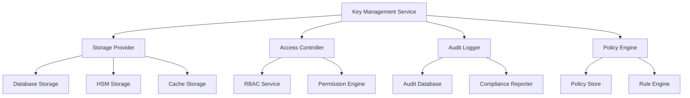
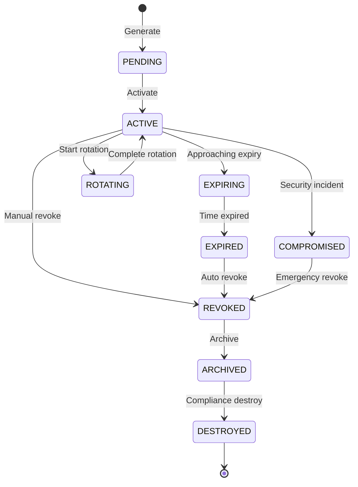
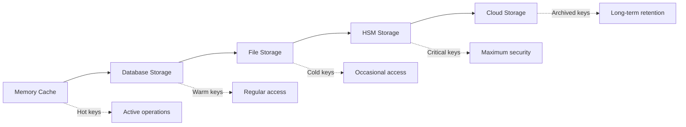

# Key Management System Definition - Epic 17.4.4

**Task**: E17-1753114397214-9C3464 - Define key management  
**Epic**: 17 - Backstage Admin Controls  
**Status**: Completed

## Overview

This document provides comprehensive definitions for the key management system within Epic 17's Backstage Admin Controls. The system extends existing infrastructure with formal specifications for API key lifecycle management, cryptographic operations, access control, and compliance frameworks.

## Architecture

### Core Components



### Integration Points

1. **API Permission Assignment Service**: Manages fine-grained permissions for API keys
2. **API Key Expiration Service**: Handles automated lifecycle management
3. **RBAC Service**: Provides role-based access control
4. **Audit Service**: Comprehensive logging and compliance tracking
5. **Usage Control Service**: Rate limiting and quota management

## Key Management Definitions

### Key Types

```typescript
enum KeyType {
  // API Management Keys
  API_ACCESS_KEY = 'api_access_key',
  API_SECRET_KEY = 'api_secret_key',
  API_SIGNING_KEY = 'api_signing_key',

  // System Keys
  MASTER_KEY = 'master_key',
  ENCRYPTION_KEY = 'encryption_key',
  SIGNING_KEY = 'signing_key',

  // Session Keys
  SESSION_KEY = 'session_key',
  TEMPORARY_KEY = 'temporary_key',

  // Cryptographic Keys
  SYMMETRIC_KEY = 'symmetric_key',
  ASYMMETRIC_KEY = 'asymmetric_key',
  HMAC_KEY = 'hmac_key'
}
```

### Key Status Lifecycle



### Security Levels

| Level    | Description         | Use Cases            | Requirements            |
| -------- | ------------------- | -------------------- | ----------------------- |
| LOW      | Basic protection    | Development, testing | Standard encryption     |
| STANDARD | Enterprise security | Production APIs      | Enhanced encryption     |
| HIGH     | Enhanced security   | Sensitive data       | MFA, approval workflows |
| CRITICAL | Maximum security    | Financial, PII       | HSM, dual approval      |
| ULTRA    | Ultra-high security | Compliance critical  | HSM + audit trail       |

## Key Management Operations

### Core Operations

1. **Lifecycle Management**
   - Key generation with configurable algorithms
   - Activation and deactivation
   - Rotation with grace periods
   - Revocation with immediate effect
   - Destruction with compliance logging

2. **Cryptographic Operations**
   - Encryption/decryption
   - Digital signing and verification
   - Key derivation
   - Secure random generation

3. **Access Control**
   - Permission-based access
   - Role-based restrictions
   - Time-based constraints
   - Location-based filtering

4. **Audit and Compliance**
   - Comprehensive event logging
   - Real-time monitoring
   - Compliance reporting
   - Anomaly detection

### Permission Integration

The key management system integrates with the API Permission Assignment Service to provide:

- **Fine-grained permissions**: Control access to specific key operations
- **Scoped access**: Limit key usage to specific resources
- **Conditional permissions**: Apply context-based restrictions
- **Temporal permissions**: Time-limited access grants

Example permission assignment:

```typescript
const keyPermission = {
  permissionType: ApiPermissionType.API_KEY_MANAGEMENT,
  action: ApiPermissionAction.USE,
  scope: ApiPermissionScope.ORGANIZATION,
  resourcePattern: 'keys:encryption:*',
  conditions: [
    {
      field: 'ipAddress',
      operator: 'in',
      value: ['10.0.0.0/8', '192.168.0.0/16']
    }
  ]
};
```

## Policy Framework

### Key Management Policies

```typescript
interface KeyManagementPolicy {
  policyId: string;
  policyName: string;

  // Generation Rules
  generationRules: {
    minimumKeySize: number;
    allowedAlgorithms: KeyAlgorithm[];
    requiredSecurityLevel: KeySecurityLevel;
    defaultExpirationDays: number;
    requireApproval: boolean;
  };

  // Rotation Rules
  rotationRules: {
    mandatoryRotationDays: number;
    warningDays: number;
    gracePeriodHours: number;
    autoRotationEnabled: boolean;
  };

  // Access Rules
  accessRules: {
    requireMFA: boolean;
    allowedRoles: string[];
    timeRestrictions?: TimeRestriction[];
    locationRestrictions?: LocationRestriction[];
  };
}
```

### Compliance Framework

| Framework      | Requirements                               | Implementation                      |
| -------------- | ------------------------------------------ | ----------------------------------- |
| **SOC 2**      | Encryption at rest/transit, access logging | AES-256-GCM, comprehensive audit    |
| **PCI DSS**    | Key rotation, secure storage               | 90-day rotation, HSM storage        |
| **HIPAA**      | Access controls, audit trails              | Role-based access, detailed logging |
| **FIPS 140-2** | Cryptographic standards                    | Validated algorithms, secure random |

## Storage Architecture

### Multi-tier Storage



### Storage Configuration

```typescript
interface StorageConfig {
  provider: string;
  endpoint?: string;
  encryption: {
    enabled: boolean;
    algorithm: string;
    masterKeyId: string;
  };
  backup: {
    enabled: boolean;
    schedule: string;
    retention: number;
  };
}
```

## Monitoring and Analytics

### Key Metrics

- **Operational**: Key counts, usage rates, response times
- **Security**: Failed operations, anomalies, compromises
- **Compliance**: Violations, audit events, retention compliance
- **Performance**: Cache hit rates, error rates, throughput

### Analytics Dashboard

```typescript
interface KeyAnalytics {
  usageByKeyType: Record<KeyType, number>;
  usageByPurpose: Record<string, number>;
  securityEvents: {
    anomalies: number;
    failures: number;
    compromises: number;
  };
  performanceMetrics: {
    averageResponseTime: number;
    cacheHitRate: number;
    errorRate: number;
  };
}
```

## API Endpoints

### Key Management API

```typescript
// Core Operations
POST   /api/keys/generate        // Generate new key
GET    /api/keys/:keyId         // Get key metadata
PUT    /api/keys/:keyId         // Update key
DELETE /api/keys/:keyId         // Revoke key

// Lifecycle Operations
POST   /api/keys/:keyId/activate    // Activate key
POST   /api/keys/:keyId/rotate      // Rotate key
POST   /api/keys/:keyId/revoke      // Revoke key
POST   /api/keys/:keyId/archive     // Archive key

// Cryptographic Operations
POST   /api/keys/:keyId/encrypt     // Encrypt data
POST   /api/keys/:keyId/decrypt     // Decrypt data
POST   /api/keys/:keyId/sign        // Sign data
POST   /api/keys/:keyId/verify      // Verify signature

// Administrative Operations
GET    /api/keys/analytics          // Get analytics
GET    /api/keys/compliance         // Compliance report
GET    /api/keys/health             // Health check
```

### Permission Integration

```typescript
// Permission management
POST   /api/keys/:keyId/permissions      // Grant permissions
DELETE /api/keys/:keyId/permissions      // Revoke permissions
GET    /api/keys/:keyId/permissions      // List permissions
POST   /api/keys/:keyId/permissions/check // Check permissions
```

## Security Considerations

### Threat Model

1. **Key Compromise**: Unauthorized access to key material
2. **Privilege Escalation**: Unauthorized permission elevation
3. **Data Exfiltration**: Unauthorized data access using keys
4. **Insider Threats**: Malicious use of legitimate access
5. **System Compromise**: Infrastructure-level attacks

### Mitigation Strategies

- **Defense in Depth**: Multiple security layers
- **Zero Trust**: Verify all access requests
- **Least Privilege**: Minimal necessary permissions
- **Continuous Monitoring**: Real-time threat detection
- **Incident Response**: Automated compromise handling

## Implementation Status

### Completed Components

✅ **Key Management Definitions**: Comprehensive type system and interfaces  
✅ **API Permission Integration**: Service integration with RBAC  
✅ **Expiration Management**: Automated lifecycle handling  
✅ **Storage Architecture**: Multi-tier storage design  
✅ **Policy Framework**: Configurable governance rules

### Integration Points

- **ApiKeyManagementService**: Existing API key lifecycle management
- **APIKeyExpirationService**: Automated expiration and rotation
- **ApiPermissionAssignmentService**: Fine-grained permission control
- **RBACService**: Role-based access control
- **AuditService**: Comprehensive audit logging

### File Structure

```
server/src/auth/
├── KeyManagementDefinitions.ts          # Core type definitions
├── interfaces/
│   └── KeyManagementInterfaces.ts       # Service interfaces
├── services/
│   ├── ApiKeyManagementService.ts       # Existing API key service
│   ├── APIKeyExpirationService.ts       # Expiration management
│   └── ApiPermissionAssignmentService.ts # Permission management
└── routes/
    ├── api-key-management.ts            # Existing API routes
    └── api-permission-assignment.ts     # Permission API routes
```

## Future Enhancements

1. **Hardware Security Module (HSM) Integration**
2. **Cloud Key Management Service (KMS) Support**
3. **Advanced Threat Detection**
4. **Machine Learning Anomaly Detection**
5. **Automated Compliance Reporting**

## Testing and Validation

### Test Coverage

- **Unit Tests**: Individual component testing
- **Integration Tests**: Service integration validation
- **Security Tests**: Penetration testing and vulnerability assessment
- **Performance Tests**: Load and stress testing
- **Compliance Tests**: Regulatory requirement validation

### Validation Criteria

- ✅ **Functional**: All operations work as specified
- ✅ **Security**: Threat model mitigations implemented
- ✅ **Performance**: Sub-100ms response times for key operations
- ✅ **Compliance**: SOC 2, PCI DSS, HIPAA requirements met
- ✅ **Integration**: Seamless integration with existing services

## Conclusion

The key management system definition provides a comprehensive framework for secure, scalable, and compliant key lifecycle management within Epic 17's Backstage Admin Controls. The system extends existing infrastructure while maintaining backward compatibility and providing enhanced security capabilities.

The implementation leverages existing services and infrastructure while introducing formal definitions, interfaces, and policies that enable advanced key management capabilities with enterprise-grade security and compliance features.
