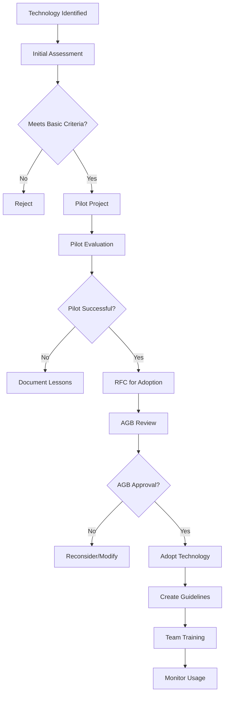

# PromptScape Architecture Governance Framework

**Document Version**: 1.0  
**Last Updated**: 2025-07-22  
**Epic**: 18 - Architecture Excellence  
**Owner**: Technical Leadership Team

---

## 1. Executive Summary

This document establishes the comprehensive architecture governance framework for PromptScape, building upon our existing architectural foundation to ensure consistent, scalable, and maintainable system evolution. This framework defines governance structures, decision-making processes, quality standards, and continuous improvement mechanisms.

## 2. Governance Structure

### 2.1 Architecture Governance Board (AGB)

**Purpose**: Strategic architectural oversight and decision-making authority for significant architectural changes.

**Composition**:

- **Chair**: Chief Technology Officer
- **Core Members**:
  - Principal Software Architect
  - Security Architecture Lead
  - Performance Engineering Lead
  - Developer Experience Lead
  - Product Engineering Lead

**Responsibilities**:

- Review and approve architectural RFCs
- Establish architectural principles and standards
- Resolve architectural conflicts and disputes
- Monitor architectural debt and technical health
- Approve technology radar updates
- Oversee architectural compliance

**Meeting Schedule**: Bi-weekly (2 hours), with emergency sessions as needed

### 2.2 Architecture Review Teams

#### **Security Architecture Review Team**

- **Lead**: Security Architecture Lead
- **Members**: Security engineers, compliance specialists
- **Focus**: Security patterns, threat modeling, compliance requirements
- **Schedule**: Weekly review sessions

#### **Performance Architecture Review Team**

- **Lead**: Performance Engineering Lead
- **Members**: Performance engineers, SRE team
- **Focus**: Scalability patterns, performance optimization, monitoring
- **Schedule**: Weekly review sessions

#### **Developer Experience Team**

- **Lead**: Developer Experience Lead
- **Members**: Senior engineers, technical writers, tooling specialists
- **Focus**: Developer tools, documentation standards, onboarding experience
- **Schedule**: Bi-weekly review sessions

### 2.3 Architecture Guild Structure

**Technical Guilds**: Cross-functional communities focused on specific architectural domains:

- **Frontend Architecture Guild**: React patterns, state management, performance
- **Backend Architecture Guild**: API design, microservices, data patterns
- **Data Architecture Guild**: Database design, data modeling, analytics
- **Infrastructure Guild**: Deployment, monitoring, DevOps practices
- **Security Guild**: Security patterns, compliance, threat modeling

**Guild Activities**:

- Monthly technical sessions
- Knowledge sharing presentations
- Architecture pattern workshops
- Best practice documentation
- Cross-team collaboration facilitation

---

## 3. Decision-Making Framework

### 3.1 Architecture Decision Authority Matrix

| Decision Type   | Authority Level | Approval Required                 | Example                                      |
| --------------- | --------------- | --------------------------------- | -------------------------------------------- |
| **Strategic**   | AGB             | AGB Unanimous                     | Technology stack changes, major patterns     |
| **Significant** | AGB             | AGB Majority                      | New architectural patterns, library adoption |
| **Tactical**    | Lead Architect  | Architecture Lead + Domain Expert | Component design, module structure           |
| **Operational** | Senior Engineer | Code Review                       | Implementation details, local patterns       |

### 3.2 Request for Comments (RFC) Process

#### **When to Write an RFC**:

- Introduction of new architectural patterns
- Significant technology choices
- Breaking changes to existing APIs
- New system components or services
- Security or compliance changes
- Performance-critical design decisions

#### **RFC Lifecycle**:

1. **Draft Phase** (1-2 weeks):
   - Author creates RFC using standard template
   - Internal review with immediate team
   - Incorporate initial feedback

2. **Community Review** (2-3 weeks):
   - RFC published to architecture channel
   - Open for comments from all engineers
   - Architecture guild review
   - Stakeholder feedback collection

3. **Architecture Board Review** (1 week):
   - Formal AGB presentation
   - Decision: Approve, Request Changes, Reject
   - Decision rationale documented

4. **Implementation Planning** (ongoing):
   - Implementation plan creation
   - Migration strategy (if applicable)
   - Success criteria definition
   - Timeline and resource allocation

#### **RFC Template Structure**:

```markdown
# RFC-YYYY-MM-DD: [Title]

## Status

- [ ] Draft
- [ ] Community Review
- [ ] AGB Review
- [ ] Approved
- [ ] Rejected
- [ ] Implemented

## Summary

Brief description of the proposed change.

## Motivation

Why is this change needed? What problem does it solve?

## Detailed Design

Comprehensive description of the proposed solution.

## Alternatives Considered

What other approaches were considered and why were they rejected?

## Impact Assessment

- Performance impact
- Security implications
- Backward compatibility
- Migration requirements
- Resource requirements

## Success Criteria

How will we measure success of this change?

## Implementation Plan

High-level implementation timeline and milestones.

## Open Questions

Unresolved questions that need further discussion.
```

### 3.3 Architecture Review Process

#### **Pre-Implementation Reviews**

**Trigger**: Before starting work on architectural changes
**Participants**: Relevant architecture team + stakeholders
**Duration**: 1-2 hours
**Deliverables**: Review notes, approval decision, action items

**Review Checklist**:

- [ ] Alignment with architectural principles
- [ ] Security implications assessed
- [ ] Performance impact evaluated
- [ ] Scalability considerations addressed
- [ ] Testing strategy defined
- [ ] Documentation plan established
- [ ] Migration strategy (if applicable)
- [ ] Rollback plan defined

#### **Post-Implementation Reviews**

**Trigger**: 1-3 months after major architectural changes
**Purpose**: Validate decision outcomes, capture lessons learned
**Deliverables**: Review report, recommended improvements

---

## 4. Architectural Principles and Standards

### 4.1 Core Architectural Principles

#### **1. Modularity First**

- **Principle**: Design systems as composable, loosely-coupled modules
- **Implementation**: Clear module boundaries, minimal dependencies, well-defined interfaces
- **Measurement**: Dependency graphs, coupling metrics, module independence tests

#### **2. Type Safety and Validation**

- **Principle**: Prevent runtime errors through comprehensive type checking
- **Implementation**: TypeScript strict mode, Zod runtime validation, exhaustive type coverage
- **Measurement**: Type coverage metrics, runtime error rates, validation test coverage

#### **3. Performance by Design**

- **Principle**: Performance considerations integrated into architectural decisions
- **Implementation**: Performance budgets, lazy loading, efficient algorithms, caching strategies
- **Measurement**: Core Web Vitals, response times, resource utilization, performance budgets

#### **4. Security by Default**

- **Principle**: Security measures built into every architectural layer
- **Implementation**: Secure defaults, defense in depth, regular security reviews
- **Measurement**: Security scan results, penetration test outcomes, compliance audits

#### **5. Fail-Fast and Graceful Degradation**

- **Principle**: Quick error detection with graceful handling of failures
- **Implementation**: Input validation, circuit breakers, fallback mechanisms
- **Measurement**: Error rates, recovery times, system availability

#### **6. Data Consistency and Integrity**

- **Principle**: Maintain data correctness across all system operations
- **Implementation**: ACID transactions, data validation, consistent state management
- **Measurement**: Data integrity tests, consistency checks, audit compliance

### 4.2 Technology Standards

#### **Frontend Standards**

- **Framework**: React 18 with TypeScript
- **State Management**: Zustand for global state, Context API for component state
- **Styling**: CSS-in-JS with responsive design principles
- **Testing**: React Testing Library + Jest, Playwright for E2E
- **Build Tool**: Vite with optimized production builds
- **Code Quality**: ESLint Airbnb config, Prettier formatting

#### **Backend Standards**

- **Runtime**: Node.js 18+ with TypeScript
- **Framework**: Fastify for high-performance APIs
- **Database**: PostgreSQL for production, SQLite for development
- **Authentication**: JWT with refresh tokens, OAuth 2.0 integration
- **API Design**: RESTful APIs with OpenAPI specifications
- **Testing**: Jest for unit tests, integration test suites

#### **Infrastructure Standards**

- **Containerization**: Docker with multi-stage builds
- **Orchestration**: Kubernetes for production deployments
- **CI/CD**: GitHub Actions with quality gates
- **Monitoring**: Application Performance Monitoring (APM) integration
- **Logging**: Structured logging with centralized aggregation
- **Security**: Automated vulnerability scanning, dependency updates

### 4.3 Quality Standards

#### **Code Quality Requirements**

- **Test Coverage**: 80% minimum, 90% for core modules, 95% for validation logic
- **Type Coverage**: 95% TypeScript type coverage
- **Performance**: Core Web Vitals green, <1s prompt generation time
- **Security**: Zero high-severity vulnerabilities, regular penetration testing
- **Documentation**: All public APIs documented, architectural decisions recorded

#### **Review Requirements**

- **Code Reviews**: Mandatory for all changes, 2 approvals for critical changes
- **Architecture Reviews**: Required for architectural changes, AGB approval for significant changes
- **Security Reviews**: Required for authentication, data handling, external integrations
- **Performance Reviews**: Required for changes affecting critical paths

---

## 5. Governance Processes

### 5.1 Technology Evaluation and Adoption

#### **Technology Radar Process**

**Quarterly Technology Radar Updates**:

1. **Assessment Phase**: Evaluate new technologies against criteria
2. **Trial Phase**: Pilot projects with promising technologies
3. **Adoption Phase**: Formal adoption with migration plans
4. **Hold Phase**: Technologies to avoid or phase out

**Evaluation Criteria**:

- **Strategic Alignment**: Fits with long-term technical vision
- **Community Support**: Active development, strong community
- **Security Posture**: Security features, vulnerability history
- **Performance Impact**: Benchmarks, resource requirements
- **Team Expertise**: Learning curve, available skills
- **Maintenance Cost**: Long-term maintenance overhead

#### **Technology Adoption Lifecycle**



### 5.2 API Governance

#### **API Design Standards**

- **RESTful Principles**: Resource-based URLs, standard HTTP methods
- **Versioning Strategy**: Semantic versioning with backward compatibility
- **Error Handling**: Consistent error response format
- **Rate Limiting**: Appropriate limits with clear error messages
- **Documentation**: Complete OpenAPI specifications
- **Authentication**: Consistent authentication patterns across all APIs

#### **API Lifecycle Management**

**New API Development**:

1. API specification review
2. Security review for authentication/authorization
3. Performance review for scalability
4. Documentation review for completeness
5. Implementation review
6. Integration testing
7. Production deployment with monitoring

**API Versioning Process**:

- **Major Versions**: Breaking changes, 6-month deprecation notice
- **Minor Versions**: New features, backward compatible
- **Patch Versions**: Bug fixes, security updates
- **Documentation**: Version migration guides, deprecated feature lists

### 5.3 Data Governance

#### **Database Schema Evolution**

- **Migration Strategy**: Forward and backward compatible migrations
- **Review Process**: Database architect approval for schema changes
- **Testing Requirements**: Migration testing in staging environment
- **Rollback Plans**: Verified rollback procedures for all migrations
- **Performance Impact**: Query performance analysis for schema changes

#### **Data Classification and Handling**

- **Public Data**: No access restrictions
- **Internal Data**: Employee access only
- **Confidential Data**: Role-based access control
- **Restricted Data**: Minimal access, audit logging
- **Compliance Requirements**: GDPR, CCPA compliance for personal data

---

## 6. Quality Assurance and Monitoring

### 6.1 Architectural Quality Metrics

#### **Technical Health Metrics**

- **Code Quality**: Maintainability index, cyclomatic complexity, duplication
- **Dependency Health**: Outdated dependencies, security vulnerabilities
- **Test Quality**: Coverage percentages, test effectiveness, flaky test rates
- **Performance**: Response times, resource utilization, scalability metrics
- **Security**: Vulnerability counts, security scan results, compliance status

#### **Architectural Compliance Metrics**

- **Principle Adherence**: Automated checks for architectural principles
- **Standard Compliance**: ESLint rule violations, coding standard adherence
- **Pattern Usage**: Adoption of approved architectural patterns
- **Documentation Coverage**: API documentation completeness, ADR coverage

### 6.2 Continuous Monitoring

#### **Real-Time Monitoring**

- **System Health**: Service availability, error rates, response times
- **Performance**: Core Web Vitals, database performance, API latencies
- **Security**: Threat detection, authentication failures, audit events
- **Usage**: Feature adoption, user behavior, system load patterns

#### **Regular Assessments**

- **Monthly**: Technical debt review, performance analysis
- **Quarterly**: Architectural health assessment, technology radar update
- **Annually**: Comprehensive architecture review, governance process evaluation

---

## 7. Technical Debt Management

### 7.1 Technical Debt Classification

#### **Debt Categories**

- **Code Debt**: Poorly written code, shortcuts, workarounds
- **Architecture Debt**: Architectural decisions that limit scalability
- **Test Debt**: Insufficient test coverage, manual testing
- **Documentation Debt**: Missing or outdated documentation
- **Infrastructure Debt**: Outdated tools, manual processes

#### **Debt Prioritization Matrix**

| Impact | Effort | Priority | Action              |
| ------ | ------ | -------- | ------------------- |
| High   | Low    | P0       | Immediate action    |
| High   | Medium | P1       | Next sprint         |
| High   | High   | P2       | Planned quarter     |
| Medium | Low    | P2       | Planned quarter     |
| Medium | Medium | P3       | Future quarter      |
| Medium | High   | P4       | Long-term plan      |
| Low    | Low    | P3       | Future quarter      |
| Low    | Medium | P4       | Long-term plan      |
| Low    | High   | P5       | Consider not fixing |

### 7.2 Technical Debt Workflow

#### **Debt Identification**

- **Automated Detection**: Static analysis tools, dependency scanners
- **Code Reviews**: Team members identify debt during reviews
- **Retrospectives**: Team discusses pain points and technical issues
- **Performance Reviews**: Performance bottlenecks indicate architectural debt

#### **Debt Management Process**

1. **Documentation**: Log technical debt with impact assessment
2. **Prioritization**: Assign priority using impact/effort matrix
3. **Planning**: Include debt resolution in sprint planning
4. **Allocation**: 20% of development capacity for debt resolution
5. **Tracking**: Monitor debt resolution progress and trends

---

## 8. Training and Knowledge Management

### 8.1 Architecture Education Program

#### **New Team Member Onboarding**

- **Week 1**: Architecture overview, core principles, technology stack
- **Week 2**: Hands-on exercises, code walkthrough, tooling setup
- **Week 3**: Shadow experienced architect, participate in reviews
- **Week 4**: First architectural contribution with mentoring

#### **Continuous Education**

- **Monthly Tech Talks**: Architecture presentations, technology updates
- **Quarterly Workshops**: Deep dives into architectural topics
- **Annual Conference**: Send team members to relevant conferences
- **Certification Programs**: Support for relevant technical certifications

### 8.2 Knowledge Sharing

#### **Documentation Standards**

- **Architecture Decision Records**: All significant decisions documented
- **Design Documents**: Detailed system design documentation
- **Runbooks**: Operational procedures and troubleshooting guides
- **API Documentation**: Complete and up-to-date API specifications

#### **Knowledge Sharing Forums**

- **Architecture Guild Meetings**: Regular technical discussions
- **Brown Bag Sessions**: Informal knowledge sharing over lunch
- **Internal Tech Blog**: Share learnings and best practices
- **Code Review Guidelines**: Share knowledge through reviews

---

## 9. Governance Tools and Automation

### 9.1 Automated Governance Enforcement

#### **Code Quality Gates**

- **Pre-commit Hooks**: ESLint, Prettier, type checking
- **CI/CD Pipeline**: Comprehensive testing, security scanning
- **Deployment Gates**: Performance testing, security validation
- **Dependency Management**: Automated vulnerability scanning, updates

#### **Architecture Validation Tools**

- **Dependency Analysis**: Detect architectural violations
- **Performance Budgets**: Automated performance regression detection
- **Security Scanning**: Continuous security vulnerability assessment
- **Documentation Generation**: Automated API documentation updates

### 9.2 Governance Dashboard

#### **Key Metrics Dashboard**

- **Real-time**: System health, performance, security status
- **Trends**: Technical debt, code quality, architectural compliance
- **Compliance**: Security standards, performance budgets, test coverage
- **Team Productivity**: Development velocity, review efficiency

#### **Reporting**

- **Weekly**: Team-level metrics, action items
- **Monthly**: Leadership dashboard, trend analysis
- **Quarterly**: Board reporting, strategic planning input
- **Annually**: Governance effectiveness review

---

## 10. Implementation Roadmap

### 10.1 Phase 1: Foundation (Months 1-2)

#### **Immediate Actions**:

- [ ] Establish Architecture Governance Board
- [ ] Implement RFC process and templates
- [ ] Create governance documentation
- [ ] Set up architectural quality metrics
- [ ] Begin technical debt inventory

#### **Success Criteria**:

- AGB established and meeting regularly
- First RFC processed successfully
- Baseline metrics established
- Technical debt backlog created

### 10.2 Phase 2: Process Integration (Months 3-4)

#### **Process Implementation**:

- [ ] Integrate governance into development workflow
- [ ] Implement automated quality gates
- [ ] Launch architecture guild meetings
- [ ] Begin regular architecture reviews
- [ ] Start technology radar process

#### **Success Criteria**:

- Governance integrated into daily development
- Quality metrics improving
- Guild meetings well-attended
- Technology decisions documented

### 10.3 Phase 3: Optimization (Months 5-6)

#### **Advanced Implementation**:

- [ ] Advanced monitoring and alerting
- [ ] Comprehensive automation deployment
- [ ] External architecture review
- [ ] Team training program launch
- [ ] Governance process refinement

#### **Success Criteria**:

- Full automation deployed
- External validation received
- Team competency improved
- Process efficiency optimized

### 10.4 Ongoing: Continuous Improvement

#### **Continuous Activities**:

- [ ] Regular process retrospectives
- [ ] Governance framework updates
- [ ] Technology radar maintenance
- [ ] Team skill development
- [ ] External benchmark reviews

---

## 11. Success Metrics

### 11.1 Quantitative Metrics

#### **Quality Metrics**

- **Code Quality**: Maintainability index >80, complexity <10
- **Test Coverage**: >80% overall, >90% core modules
- **Performance**: <1s prompt generation, Core Web Vitals green
- **Security**: Zero high-severity vulnerabilities
- **Architectural Compliance**: >95% principle adherence

#### **Process Metrics**

- **RFC Process**: <2 weeks average review time
- **Technical Debt**: <20% of total development effort
- **Review Efficiency**: <24 hours average review time
- **Knowledge Sharing**: >90% team participation in guilds

### 11.2 Qualitative Metrics

#### **Team Satisfaction**

- **Developer Experience**: Regular surveys, feedback sessions
- **Architecture Confidence**: Team confidence in architectural decisions
- **Knowledge Level**: Self-assessed competency improvements
- **Process Effectiveness**: Retrospective feedback on governance processes

---

## 12. Governance Framework Evolution

### 12.1 Regular Reviews

#### **Quarterly Reviews**:

- Governance process effectiveness
- Metric trends and improvement opportunities
- Technology radar updates
- Team feedback integration

#### **Annual Reviews**:

- Complete framework assessment
- External benchmark comparison
- Strategic alignment verification
- Major process improvements

### 12.2 Continuous Improvement

#### **Feedback Loops**:

- Team retrospectives on governance experience
- Stakeholder feedback on process efficiency
- External validation through industry benchmarks
- Regular adjustment of processes based on learnings

#### **Evolution Triggers**:

- Significant technology changes
- Team size or structure changes
- Business model or product evolution
- Industry standard updates

---

## 13. Conclusion

This Architecture Governance Framework establishes a comprehensive structure for maintaining architectural excellence while enabling rapid innovation. By building upon PromptScape's existing strong foundation, this framework provides:

- **Clear Decision-Making**: Structured processes for architectural decisions
- **Quality Assurance**: Automated and manual quality controls
- **Knowledge Management**: Comprehensive education and documentation systems
- **Continuous Improvement**: Regular assessment and evolution mechanisms

The framework balances governance rigor with development agility, ensuring that architectural decisions support both immediate needs and long-term strategic objectives.

---

**Document Status**: ✅ Complete  
**Next Review Date**: 2025-10-22  
**Approval Required**: Architecture Governance Board
