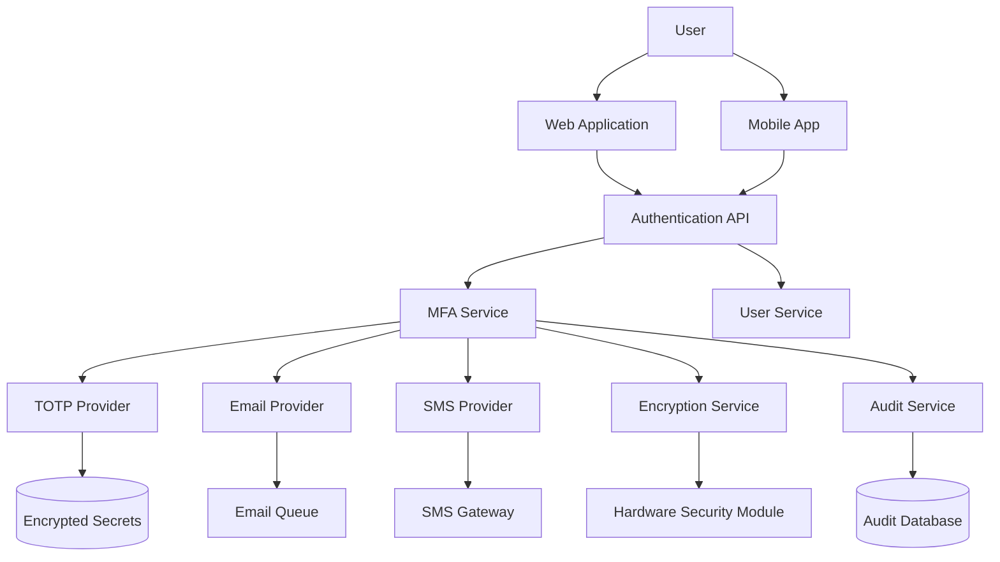

# MFA System Architecture - Epic 19 Implementation

## System Overview

This document defines the Multi-Factor Authentication (MFA) architecture for PromptScape, implementing security-first design principles with TOTP as the primary method.

## High-Level Architecture



## Core Components

### 1. MFA Service (Core)

**Responsibilities:**

- Orchestrate MFA enrollment and verification
- Enforce security policies and rate limiting
- Manage MFA method lifecycle
- Coordinate with providers

**Interface:**

```typescript
interface MFAService {
  // Enrollment
  enrollTOTP(userId: string): Promise<TOTPEnrollmentData>;
  enrollEmail(userId: string, email: string): Promise<void>;
  enrollSMS(userId: string, phoneNumber: string): Promise<void>;

  // Verification
  verifyTOTP(userId: string, code: string): Promise<boolean>;
  verifyEmail(userId: string, token: string): Promise<boolean>;
  verifySMS(userId: string, code: string): Promise<boolean>;

  // Management
  listMethods(userId: string): Promise<MFAMethod[]>;
  disableMethod(userId: string, methodId: string): Promise<void>;
  generateBackupCodes(userId: string): Promise<string[]>;
}
```

### 2. TOTP Provider (Primary)

**Components:**

- **Secret Generator**: Creates cryptographically secure secrets
- **QR Code Generator**: Secure QR code creation with expiry
- **Code Validator**: Time-window validation with clock skew tolerance
- **Backup Code Manager**: One-time recovery codes

**Security Features:**

```typescript
interface TOTPProvider {
  generateSecret(): Promise<{
    secret: string; // Base32 encoded
    qrCodeUrl: string; // data: URL with 5-min expiry
    backupCodes: string[]; // 10 one-time codes
  }>;

  validateCode(
    encryptedSecret: string,
    userCode: string,
    timeWindow?: number // Default: ±1 window (90 seconds)
  ): Promise<boolean>;
}
```

### 3. Email Provider (Secondary)

**Components:**

- **Token Generator**: Cryptographically secure tokens
- **Template Engine**: Security-focused email templates
- **Delivery Service**: Reliable email delivery with tracking
- **Rate Limiter**: Per-user and global rate limiting

**Security Implementation:**

```typescript
interface EmailProvider {
  sendVerificationEmail(
    userId: string,
    email: string,
    metadata: {
      ipAddress: string;
      userAgent: string;
      location?: string;
    }
  ): Promise<string>; // Returns verification token ID

  verifyToken(tokenId: string, userToken: string): Promise<boolean>;
}
```

### 4. SMS Provider (Fallback)

**Components:**

- **Code Generator**: 6-digit numeric codes
- **Gateway Integration**: Multiple SMS providers for redundancy
- **Fraud Detection**: Phone number validation and risk scoring
- **Rate Limiter**: Aggressive rate limiting for security

**Risk Mitigation:**

```typescript
interface SMSProvider {
  sendVerificationSMS(
    userId: string,
    phoneNumber: string,
    riskAssessment: {
      carrierInfo: string;
      countryCode: string;
      isVoIP: boolean;
      riskScore: number;
    }
  ): Promise<string>; // Returns verification ID

  verifyCode(verificationId: string, userCode: string): Promise<boolean>;
}
```

## Security Architecture

### 1. Encryption Service

**Key Management:**

```typescript
interface EncryptionService {
  // Secret encryption for TOTP
  encryptSecret(plainSecret: string, userId: string): Promise<string>;
  decryptSecret(encryptedSecret: string, userId: string): Promise<string>;

  // Token encryption for email/SMS
  encryptToken(plainToken: string, expiry: Date): Promise<string>;
  decryptToken(encryptedToken: string): Promise<string | null>;

  // Key rotation
  rotateUserKeys(userId: string): Promise<void>;
  rotateSystemKeys(): Promise<void>;
}
```

**Encryption Strategy:**

- **AES-256-GCM** for symmetric encryption
- **Per-user encryption keys** derived from master key + user salt
- **Hardware Security Module (HSM)** for key storage in production
- **Automatic key rotation** every 90 days

### 2. Rate Limiting Architecture

**Multi-Layer Protection:**

```typescript
interface RateLimitService {
  // User-level limits
  checkUserLimit(userId: string, action: MFAAction): Promise<boolean>;

  // IP-level limits
  checkIPLimit(ipAddress: string, action: MFAAction): Promise<boolean>;

  // Global limits
  checkGlobalLimit(action: MFAAction): Promise<boolean>;

  // Progressive delays
  getBackoffDelay(userId: string, failedAttempts: number): Promise<number>;
}
```

**Rate Limiting Rules:**
| Action | User Limit | IP Limit | Global Limit | Backoff |
|--------|------------|----------|--------------|---------|
| TOTP Verify | 10/min | 100/min | 1000/min | Exponential |
| Email Send | 3/hour | 20/hour | 1000/hour | Linear |
| SMS Send | 3/day | 10/day | 500/day | Exponential |

### 3. Audit Service

**Comprehensive Logging:**

```typescript
interface AuditService {
  logMFAEvent(event: {
    userId: string;
    action: MFAAction;
    method: MFAMethod;
    success: boolean;
    metadata: {
      ipAddress: string;
      userAgent: string;
      timestamp: Date;
      riskScore?: number;
    };
  }): Promise<void>;

  generateComplianceReport(
    startDate: Date,
    endDate: Date,
    format: 'SOC2' | 'GDPR' | 'NIST'
  ): Promise<Buffer>;
}
```

## Database Schema

### MFA Configuration Table

```sql
CREATE TABLE mfa_configurations (
  id UUID PRIMARY KEY,
  user_id UUID NOT NULL REFERENCES users(id),
  method_type VARCHAR(20) NOT NULL, -- 'totp', 'email', 'sms'
  encrypted_secret TEXT, -- For TOTP only
  email_address VARCHAR(255), -- For email only
  phone_number VARCHAR(20), -- For SMS only
  is_primary BOOLEAN DEFAULT false,
  is_enabled BOOLEAN DEFAULT true,
  created_at TIMESTAMP DEFAULT NOW(),
  updated_at TIMESTAMP DEFAULT NOW(),

  CONSTRAINT unique_user_method UNIQUE(user_id, method_type)
);
```

### Backup Codes Table

```sql
CREATE TABLE mfa_backup_codes (
  id UUID PRIMARY KEY,
  user_id UUID NOT NULL REFERENCES users(id),
  code_hash VARCHAR(255) NOT NULL,
  is_used BOOLEAN DEFAULT false,
  used_at TIMESTAMP NULL,
  created_at TIMESTAMP DEFAULT NOW()
);
```

### Verification Attempts Table

```sql
CREATE TABLE mfa_verification_attempts (
  id UUID PRIMARY KEY,
  user_id UUID NOT NULL REFERENCES users(id),
  method_type VARCHAR(20) NOT NULL,
  success BOOLEAN NOT NULL,
  ip_address INET NOT NULL,
  user_agent TEXT,
  attempt_at TIMESTAMP DEFAULT NOW(),

  INDEX idx_user_attempts (user_id, attempt_at),
  INDEX idx_ip_attempts (ip_address, attempt_at)
);
```

## API Integration Points

### 1. Authentication Flow Integration

```typescript
// Enhanced login flow with MFA
async function authenticateUser(
  credentials: LoginCredentials
): Promise<AuthResult> {
  // Step 1: Validate primary credentials
  const user = await validateCredentials(credentials);
  if (!user) throw new Error('Invalid credentials');

  // Step 2: Check MFA requirement
  const mfaRequired = await mfaService.isMFARequired(user.id);
  if (!mfaRequired) {
    return { success: true, token: generateJWT(user) };
  }

  // Step 3: Return MFA challenge
  const availableMethods = await mfaService.listMethods(user.id);
  return {
    success: false,
    requiresMFA: true,
    methods: availableMethods,
    mfaToken: generateMFAToken(user.id)
  };
}
```

### 2. React Components Integration

```typescript
// MFA enrollment component
interface MFAEnrollmentProps {
  userId: string;
  onComplete: (method: MFAMethod) => void;
  onError: (error: string) => void;
}

// MFA verification component
interface MFAVerificationProps {
  mfaToken: string;
  availableMethods: MFAMethod[];
  onSuccess: (authToken: string) => void;
  onError: (error: string) => void;
}
```

## Deployment Architecture

### Production Environment

```yaml
# Kubernetes deployment
apiVersion: apps/v1
kind: Deployment
metadata:
  name: mfa-service
spec:
  replicas: 3
  template:
    spec:
      containers:
        - name: mfa-service
          image: promptscape/mfa-service:latest
          env:
            - name: HSM_ENDPOINT
              valueFrom:
                secretKeyRef:
                  name: hsm-config
                  key: endpoint
            - name: DB_CONNECTION
              valueFrom:
                secretKeyRef:
                  name: postgres-config
                  key: connection-string
```

### Security Hardening

- **Container Scanning**: Regular vulnerability scans
- **Network Policies**: Restricted inter-service communication
- **Secrets Management**: External secrets store (HashiCorp Vault)
- **Resource Limits**: CPU/memory limits for DoS protection
- **Health Checks**: Liveness and readiness probes

## Testing Strategy

### Security Testing

- **Penetration Testing**: Regular security assessments
- **Fuzzing**: Input validation testing
- **Timing Attacks**: Constant-time comparison validation
- **Crypto Testing**: Secret generation randomness validation

### Load Testing

- **Rate Limit Testing**: Verify limits under load
- **Failover Testing**: Multi-region disaster recovery
- **Performance Testing**: Response time under concurrent load

## Monitoring & Alerting

### Key Metrics

- **Success Rates**: MFA verification success by method
- **Response Times**: P95/P99 latency for each operation
- **Error Rates**: Failed attempts and reasons
- **Security Events**: Suspicious activity patterns

### Alerts

- **High Failure Rates**: >10% failure rate for any method
- **Rate Limit Violations**: Potential attacks
- **HSM Connectivity**: Critical infrastructure failures
- **Unusual Patterns**: Geographic or temporal anomalies

## Migration & Rollout Plan

### Phase 1: Infrastructure (Week 1-2)

- Deploy MFA service infrastructure
- Set up HSM and encryption services
- Configure monitoring and alerting

### Phase 2: TOTP Implementation (Week 3-4)

- Implement TOTP provider
- Create enrollment UI
- Conduct security testing

### Phase 3: Email/SMS Implementation (Week 5-6)

- Implement email and SMS providers
- Add verification UI
- Load testing and optimization

### Phase 4: Production Rollout (Week 7-8)

- Gradual rollout to user segments
- Monitor metrics and security events
- Full deployment and documentation

This architecture provides a secure, scalable foundation for MFA implementation that prioritizes security while maintaining usability.
