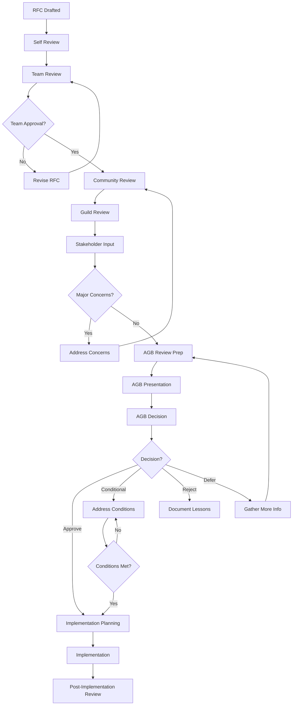

# Architecture Review Templates and Procedures

**Document Version**: 1.0  
**Last Updated**: 2025-07-22  
**Epic**: 18 - Architecture Excellence  
**Related**: Architecture Governance Framework

---

## 1. Overview

This document provides standardized templates and procedures for conducting architecture reviews within the PromptScape development process. These templates ensure consistent, thorough, and efficient architectural evaluation.

---

## 2. Request for Comments (RFC) Template

### 2.1 RFC Header Template

```markdown
# RFC-YYYY-MM-DD: [Descriptive Title]

**RFC Number**: RFC-YYYY-MM-DD-[short-name]  
**Status**: Draft | Community Review | AGB Review | Approved | Rejected | Implemented  
**Author(s)**: [Name] <email@promptscape.app>  
**Reviewer(s)**: [Names of assigned reviewers]  
**Created**: YYYY-MM-DD  
**Updated**: YYYY-MM-DD  
**Implementation Target**: [Sprint/Quarter]

## Quick Reference

- **Impact**: Low | Medium | High | Critical
- **Effort**: Small | Medium | Large | Extra Large
- **Risk**: Low | Medium | High | Critical
- **Dependencies**: [List of dependent systems/teams]
- **Breaking Changes**: Yes | No
```

### 2.2 RFC Content Template

```markdown
## 1. Summary

[One paragraph summary of the proposed change]

## 2. Motivation

### 2.1 Problem Statement

[What problem are we solving? Why is this important?]

### 2.2 Goals

- [Primary goal]
- [Secondary goal]
- [Optional goal]

### 2.3 Non-Goals

- [What this RFC explicitly does not address]
- [Scope limitations]

## 3. Background and Context

### 3.1 Current State

[Description of how things work today]

### 3.2 Historical Context

[Why do things work the way they do today?]

### 3.3 Related Work

[Similar solutions, previous attempts, industry standards]

## 4. Detailed Design

### 4.1 High-Level Architecture

[Architecture diagrams, system overview]

### 4.2 Component Design

[Detailed component specifications]

### 4.3 Interface Design

[API specifications, data contracts]

### 4.4 Data Design

[Database schemas, data flow diagrams]

### 4.5 Security Considerations

[Security implications, threat model updates]

### 4.6 Performance Considerations

[Performance impact analysis, optimization strategies]

## 5. Implementation Plan

### 5.1 Phases

1. **Phase 1**: [Description, timeline]
2. **Phase 2**: [Description, timeline]
3. **Phase 3**: [Description, timeline]

### 5.2 Migration Strategy

[How to migrate from current to new state]

### 5.3 Rollback Plan

[How to revert if implementation fails]

### 5.4 Testing Strategy

[Unit tests, integration tests, performance tests]

## 6. Impact Assessment

### 6.1 System Impact

- **Performance**: [Expected impact on system performance]
- **Scalability**: [Impact on system scalability]
- **Reliability**: [Impact on system reliability]
- **Security**: [Security implications]

### 6.2 Team Impact

- **Development**: [Impact on development team]
- **Operations**: [Impact on operations team]
- **Documentation**: [Documentation requirements]
- **Training**: [Training requirements]

### 6.3 User Impact

- **End Users**: [Impact on end users]
- **API Consumers**: [Impact on API consumers]
- **Breaking Changes**: [List of breaking changes]

## 7. Alternatives Considered

### 7.1 Alternative 1: [Name]

- **Description**: [Description of alternative]
- **Pros**: [Advantages]
- **Cons**: [Disadvantages]
- **Reason for rejection**: [Why not chosen]

### 7.2 Alternative 2: [Name]

- **Description**: [Description of alternative]
- **Pros**: [Advantages]
- **Cons**: [Disadvantages]
- **Reason for rejection**: [Why not chosen]

## 8. Success Criteria

### 8.1 Technical Metrics

- [Measurable technical success criteria]
- [Performance benchmarks]
- [Quality metrics]

### 8.2 Business Metrics

- [Business value indicators]
- [User experience improvements]
- [Operational efficiency gains]

## 9. Risks and Mitigation

### 9.1 Technical Risks

- **Risk**: [Description]
  - **Probability**: Low | Medium | High
  - **Impact**: Low | Medium | High | Critical
  - **Mitigation**: [Mitigation strategy]

### 9.2 Schedule Risks

- **Risk**: [Description]
  - **Probability**: Low | Medium | High
  - **Impact**: Low | Medium | High | Critical
  - **Mitigation**: [Mitigation strategy]

### 9.3 Operational Risks

- **Risk**: [Description]
  - **Probability**: Low | Medium | High
  - **Impact**: Low | Medium | High | Critical
  - **Mitigation**: [Mitigation strategy]

## 10. Open Questions

- [Question 1]
- [Question 2]
- [Question 3]

## 11. Dependencies

### 11.1 Technical Dependencies

- [Dependency 1]: [Description, timeline]
- [Dependency 2]: [Description, timeline]

### 11.2 Team Dependencies

- [Team 1]: [Required support, timeline]
- [Team 2]: [Required support, timeline]

## 12. Approval Checklist

- [ ] Architecture Board review scheduled
- [ ] Security review completed (if applicable)
- [ ] Performance review completed (if applicable)
- [ ] Documentation plan approved
- [ ] Implementation plan approved
- [ ] Resource allocation confirmed

## 13. References

- [Related RFCs]
- [External documentation]
- [Industry standards]
- [Research papers]

---

**Change Log**:

- YYYY-MM-DD: Initial draft
- YYYY-MM-DD: Community feedback incorporated
- YYYY-MM-DD: Final revisions
```

---

## 3. Architecture Review Checklist

### 3.1 Pre-Review Preparation Checklist

```markdown
## Pre-Review Checklist

**Review Type**: Initial Design | Implementation | Post-Implementation  
**Date**: YYYY-MM-DD  
**Reviewer**: [Name]  
**System/Component**: [Name]

### Documentation Review

- [ ] RFC or design document available
- [ ] Architecture diagrams provided
- [ ] API specifications documented
- [ ] Data models defined
- [ ] Security considerations documented
- [ ] Performance requirements specified

### Stakeholder Alignment

- [ ] Product requirements understood
- [ ] Technical requirements clarified
- [ ] Success criteria defined
- [ ] Resource allocation confirmed
- [ ] Timeline established

### Technical Preparation

- [ ] Current architecture understood
- [ ] Dependencies identified
- [ ] Constraints documented
- [ ] Alternatives evaluated
- [ ] Risk assessment completed
```

### 3.2 Architecture Review Evaluation Checklist

```markdown
## Architecture Review Evaluation

**Reviewer**: [Name]  
**Date**: YYYY-MM-DD  
**Rating Scale**: 1 (Poor) - 5 (Excellent)

### Architectural Principles Adherence

- [ ] **Modularity** (Rating: \_\_\_/5)
  - Clear module boundaries
  - Loose coupling between components
  - High cohesion within modules
  - Notes: [Comments]

- [ ] **Type Safety** (Rating: \_\_\_/5)
  - Comprehensive type definitions
  - Runtime validation where needed
  - Type-safe interfaces
  - Notes: [Comments]

- [ ] **Performance by Design** (Rating: \_\_\_/5)
  - Performance requirements considered
  - Scalability addressed
  - Optimization opportunities identified
  - Notes: [Comments]

- [ ] **Security by Default** (Rating: \_\_\_/5)
  - Security requirements addressed
  - Threat model considerations
  - Access control design
  - Notes: [Comments]

### Design Quality

- [ ] **Clarity** (Rating: \_\_\_/5)
  - Design is easy to understand
  - Documentation is clear
  - Diagrams are helpful
  - Notes: [Comments]

- [ ] **Completeness** (Rating: \_\_\_/5)
  - All requirements addressed
  - Edge cases considered
  - Error handling defined
  - Notes: [Comments]

- [ ] **Feasibility** (Rating: \_\_\_/5)
  - Technically achievable
  - Resource requirements realistic
  - Timeline reasonable
  - Notes: [Comments]

### Implementation Planning

- [ ] **Migration Strategy** (Rating: \_\_\_/5)
  - Clear migration path
  - Rollback plan defined
  - Risk mitigation addressed
  - Notes: [Comments]

- [ ] **Testing Strategy** (Rating: \_\_\_/5)
  - Test plan comprehensive
  - Test automation considered
  - Performance testing included
  - Notes: [Comments]

### Decision Quality

- [ ] **Alternatives Evaluation** (Rating: \_\_\_/5)
  - Multiple options considered
  - Trade-offs clearly explained
  - Decision rationale sound
  - Notes: [Comments]

- [ ] **Future Flexibility** (Rating: \_\_\_/5)
  - Design allows for evolution
  - Extension points identified
  - Backward compatibility considered
  - Notes: [Comments]

### Overall Assessment

- **Overall Rating**: \_\_\_/5
- **Recommendation**: Approve | Approve with Conditions | Request Changes | Reject
- **Key Strengths**: [Bullet points]
- **Key Concerns**: [Bullet points]
- **Action Items**: [List with owners and deadlines]
```

### 3.3 Security Review Checklist

```markdown
## Security Review Checklist

**System/Component**: [Name]  
**Reviewer**: [Security Team Member]  
**Date**: YYYY-MM-DD

### Authentication & Authorization

- [ ] Authentication mechanism appropriate
- [ ] Authorization model clearly defined
- [ ] Role-based access control implemented
- [ ] Token management secure
- [ ] Session management secure

### Data Protection

- [ ] Data classification performed
- [ ] Encryption at rest addressed
- [ ] Encryption in transit addressed
- [ ] Key management strategy defined
- [ ] PII handling compliant

### Input Validation

- [ ] Input validation comprehensive
- [ ] SQL injection protection
- [ ] XSS protection implemented
- [ ] CSRF protection implemented
- [ ] File upload security

### API Security

- [ ] API authentication required
- [ ] Rate limiting implemented
- [ ] CORS policy appropriate
- [ ] Error handling secure
- [ ] API versioning secure

### Infrastructure Security

- [ ] Network security addressed
- [ ] Container security considered
- [ ] Secrets management proper
- [ ] Logging security events
- [ ] Monitoring suspicious activity

### Compliance

- [ ] GDPR requirements addressed
- [ ] SOC 2 controls implemented
- [ ] Industry standards followed
- [ ] Audit trail requirements met
- [ ] Data retention policy compliant

### Action Items

- [ ] [Action item 1] - Owner: [Name] - Due: [Date]
- [ ] [Action item 2] - Owner: [Name] - Due: [Date]

**Security Approval**: ☐ Approved ☐ Approved with Conditions ☐ Requires Changes
```

### 3.4 Performance Review Checklist

```markdown
## Performance Review Checklist

**System/Component**: [Name]  
**Reviewer**: [Performance Team Member]  
**Date**: YYYY-MM-DD

### Performance Requirements

- [ ] Performance requirements clearly defined
- [ ] SLA targets specified
- [ ] Load expectations documented
- [ ] Growth projections considered
- [ ] Performance budgets established

### Design Analysis

- [ ] Algorithm complexity analyzed
- [ ] Database query performance considered
- [ ] Caching strategy appropriate
- [ ] Network latency minimized
- [ ] Resource utilization optimized

### Scalability

- [ ] Horizontal scaling addressed
- [ ] Vertical scaling limits understood
- [ ] Bottlenecks identified
- [ ] Load balancing strategy
- [ ] Auto-scaling capabilities

### Monitoring & Measurement

- [ ] Performance metrics defined
- [ ] Monitoring strategy established
- [ ] Alerting thresholds set
- [ ] Performance testing plan
- [ ] Benchmarking approach

### Optimization Opportunities

- [ ] Code-level optimizations identified
- [ ] Database optimizations planned
- [ ] Infrastructure optimizations considered
- [ ] Frontend optimizations addressed
- [ ] Third-party service optimization

**Performance Approval**: ☐ Approved ☐ Approved with Conditions ☐ Requires Changes
```

---

## 4. Review Meeting Templates

### 4.1 Architecture Review Meeting Agenda

```markdown
# Architecture Review Meeting

**Date**: YYYY-MM-DD  
**Time**: HH:MM - HH:MM  
**Location**: [Meeting room/Video conference]  
**RFC**: RFC-YYYY-MM-DD-[short-name]

## Attendees

**Required**:

- [Architecture Board members]
- [RFC Author]
- [Technical Lead]

**Optional**:

- [Subject Matter Experts]
- [Stakeholders]

## Agenda (120 minutes)

### 1. Introduction (5 minutes)

- Welcome and introductions
- Meeting objectives
- Review process explanation

### 2. RFC Presentation (20 minutes)

- **Presenter**: [RFC Author]
- Problem statement and motivation
- Proposed solution overview
- Key design decisions
- Implementation timeline

### 3. Technical Deep Dive (30 minutes)

- **Moderator**: [Technical Lead]
- Architecture details
- Interface specifications
- Data flow and storage
- Security considerations
- Performance implications

### 4. Alternative Solutions (15 minutes)

- **Moderator**: [Architecture Board member]
- Alternatives considered
- Trade-off analysis
- Decision rationale

### 5. Impact Assessment (20 minutes)

- **Moderator**: [Architecture Board member]
- System impact
- Team impact
- User impact
- Risk assessment

### 6. Questions & Discussion (25 minutes)

- Open floor for questions
- Concerns and clarifications
- Missing considerations
- Additional requirements

### 7. Decision & Next Steps (5 minutes)

- Board decision
- Conditions (if any)
- Action items
- Timeline for follow-up

## Pre-Meeting Preparation

- [ ] RFC document reviewed by all attendees
- [ ] Technical questions prepared
- [ ] Subject matter experts consulted
- [ ] Supporting materials distributed

## Decision Options

- **Approve**: RFC approved as presented
- **Approve with Conditions**: RFC approved with specific modifications
- **Request Changes**: RFC requires significant changes before approval
- **Defer**: Decision postponed pending additional information
- **Reject**: RFC rejected

## Follow-up Actions Template

- **Action Item**: [Description]
- **Owner**: [Name]
- **Due Date**: [Date]
- **Success Criteria**: [How to verify completion]
```

### 4.2 Post-Implementation Review Template

```markdown
# Post-Implementation Architecture Review

**System/Component**: [Name]  
**Implementation Date**: YYYY-MM-DD  
**Review Date**: YYYY-MM-DD  
**Original RFC**: RFC-YYYY-MM-DD-[short-name]

## Review Participants

- **Review Lead**: [Name]
- **Implementation Team**: [Names]
- **Operations Team**: [Names]
- **Product Team**: [Names]

## Implementation Assessment

### 1. Success Criteria Evaluation

**Original Criteria**:

- [Criterion 1]: ☐ Met ☐ Partially Met ☐ Not Met
- [Criterion 2]: ☐ Met ☐ Partially Met ☐ Not Met
- [Criterion 3]: ☐ Met ☐ Partially Met ☐ Not Met

**Notes**: [Detailed assessment]

### 2. Performance Analysis

- **Response Time**: Target: [X]ms, Actual: [Y]ms
- **Throughput**: Target: [X] req/sec, Actual: [Y] req/sec
- **Error Rate**: Target: <[X]%, Actual: [Y]%
- **Resource Utilization**: Target: [X]%, Actual: [Y]%

**Performance Assessment**: ☐ Exceeds Expectations ☐ Meets Expectations ☐ Below Expectations

### 3. Security Assessment

- **Security Tests Passed**: [X]/[Y]
- **Vulnerabilities Found**: [Number and severity]
- **Compliance Status**: ☐ Compliant ☐ Minor Issues ☐ Major Issues
- **Security Incidents**: [Number and description]

### 4. Operational Impact

- **Deployment Success**: ☐ Smooth ☐ Minor Issues ☐ Major Issues
- **Monitoring Coverage**: ☐ Complete ☐ Adequate ☐ Insufficient
- **Support Burden**: ☐ Low ☐ Moderate ☐ High
- **Documentation Quality**: ☐ Excellent ☐ Good ☐ Needs Improvement

## Lessons Learned

### What Went Well

1. [Positive outcome 1]
2. [Positive outcome 2]
3. [Positive outcome 3]

### What Could Be Improved

1. [Improvement area 1]
   - **Impact**: [Description]
   - **Root Cause**: [Analysis]
   - **Recommendation**: [Action]

2. [Improvement area 2]
   - **Impact**: [Description]
   - **Root Cause**: [Analysis]
   - **Recommendation**: [Action]

### Unexpected Challenges

1. [Challenge 1]
   - **Description**: [What happened]
   - **Resolution**: [How it was resolved]
   - **Prevention**: [How to prevent in future]

## Architecture Decision Validation

### Original Assumptions

- **Assumption 1**: ☐ Validated ☐ Partially Validated ☐ Invalid
- **Assumption 2**: ☐ Validated ☐ Partially Validated ☐ Invalid
- **Assumption 3**: ☐ Validated ☐ Partially Validated ☐ Invalid

### Design Decision Outcomes

- **Decision 1**: [Original decision] → [Actual outcome]
- **Decision 2**: [Original decision] → [Actual outcome]
- **Decision 3**: [Original decision] → [Actual outcome]

## Recommendations

### Short-term Actions (1-3 months)

- [ ] [Action 1] - Owner: [Name] - Due: [Date]
- [ ] [Action 2] - Owner: [Name] - Due: [Date]

### Long-term Improvements (3-12 months)

- [ ] [Improvement 1] - Owner: [Name] - Due: [Date]
- [ ] [Improvement 2] - Owner: [Name] - Due: [Date]

### Process Improvements

- [ ] [Process change 1] - Owner: [Name] - Due: [Date]
- [ ] [Process change 2] - Owner: [Name] - Due: [Date]

## Overall Assessment

**Implementation Success**: ☐ Highly Successful ☐ Successful ☐ Partially Successful ☐ Unsuccessful

**Key Success Factors**: [What made this successful]

**Key Risk Factors**: [What could have caused failure]

**Would we make the same decision again?**: ☐ Yes ☐ Probably ☐ Uncertain ☐ Probably Not ☐ No

**Rationale**: [Explanation of assessment]

---

**Review Status**: ☐ Complete ☐ Follow-up Required  
**Next Review Date**: [If applicable]  
**Distribution**: [List of stakeholders who should receive this review]
```

---

## 5. Review Process Workflows

### 5.1 RFC Review Workflow



### 5.2 Architecture Review Types Matrix

| Change Type     | Review Level     | Approvers          | Timeline  | Documentation |
| --------------- | ---------------- | ------------------ | --------- | ------------- |
| **Strategic**   | AGB Full Review  | AGB Unanimous      | 4-6 weeks | Full RFC      |
| **Significant** | AGB Standard     | AGB Majority       | 2-4 weeks | Full RFC      |
| **Tactical**    | Technical Review | Lead + SMEs        | 1-2 weeks | Design Doc    |
| **Operational** | Peer Review      | 2 Senior Engineers | 2-5 days  | Code Review   |

---

## 6. Review Tools and Resources

### 6.1 Review Scheduling

```markdown
## Review Calendar Template

### Architecture Board Reviews

- **Schedule**: Bi-weekly Wednesdays, 2:00-4:00 PM
- **Advance Notice**: 1 week minimum
- **Materials Due**: 3 days before meeting
- **Emergency Reviews**: 24-48 hour notice for critical changes

### Technical Reviews

- **Schedule**: On-demand, scheduled within 1 week of request
- **Duration**: 1-2 hours depending on complexity
- **Participants**: Relevant technical leads + SMEs

### Guild Reviews

- **Schedule**: Monthly guild meetings + ad-hoc
- **Format**: Presentation + discussion
- **Follow-up**: Recommendations to AGB if needed
```

### 6.2 Review Artifacts Repository

```markdown
## Document Organization

/docs/architecture/reviews/
├── templates/ # All review templates
├── rfcs/ # All RFC documents
│ ├── approved/ # Approved RFCs
│ ├── rejected/ # Rejected RFCs with rationale
│ └── draft/ # Draft RFCs in progress
├── decisions/ # Architecture Decision Records
├── reviews/ # Review meeting notes and outcomes
│ ├── YYYY/ # Year-based organization
│ └── post-implementation/ # Post-implementation reviews
└── processes/ # Process documentation
```

### 6.3 Review Quality Metrics

```markdown
## Review Effectiveness Metrics

### Timeliness Metrics

- RFC review cycle time (target: <21 days)
- Time from approval to implementation start (target: <7 days)
- Review meeting scheduling time (target: <7 days)

### Quality Metrics

- Post-implementation success rate (target: >90%)
- Review decision reversal rate (target: <5%)
- Implementation deviation from RFC (target: <10%)

### Process Metrics

- Meeting attendance rate (target: >90%)
- On-time material submission (target: >95%)
- Action item completion rate (target: >90%)

### Satisfaction Metrics

- Developer satisfaction with review process (target: >4.0/5.0)
- Stakeholder confidence in decisions (target: >4.0/5.0)
- Process efficiency rating (target: >4.0/5.0)
```

---

This comprehensive set of templates and procedures ensures consistent, thorough, and efficient architecture reviews that support the governance framework while maintaining development velocity.
