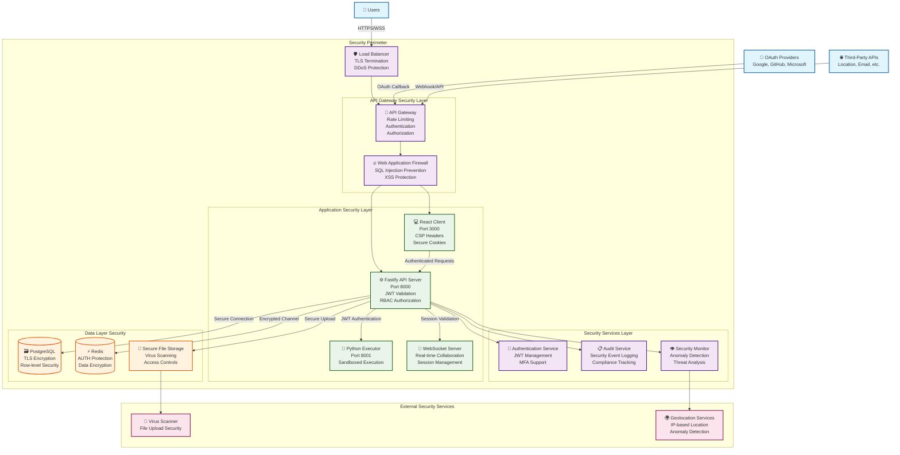
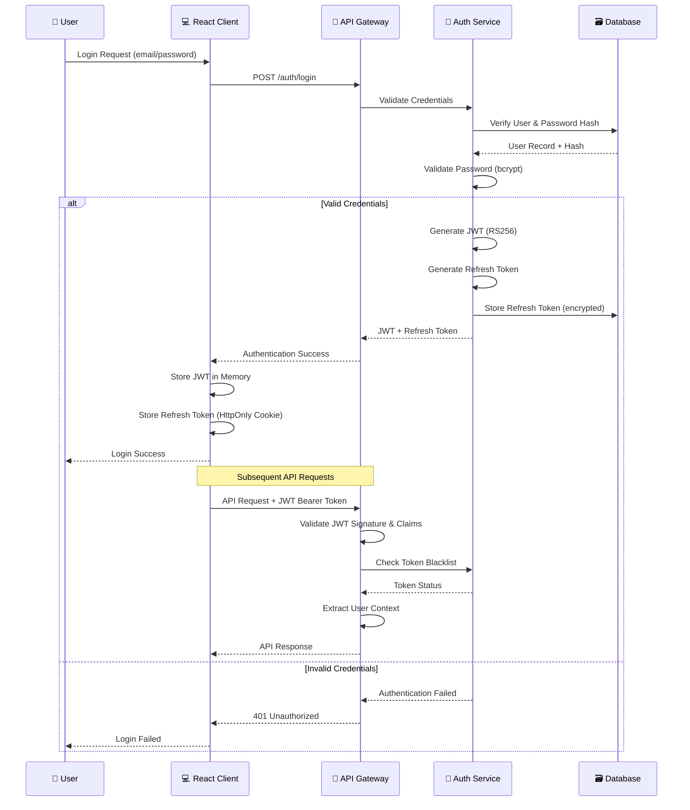
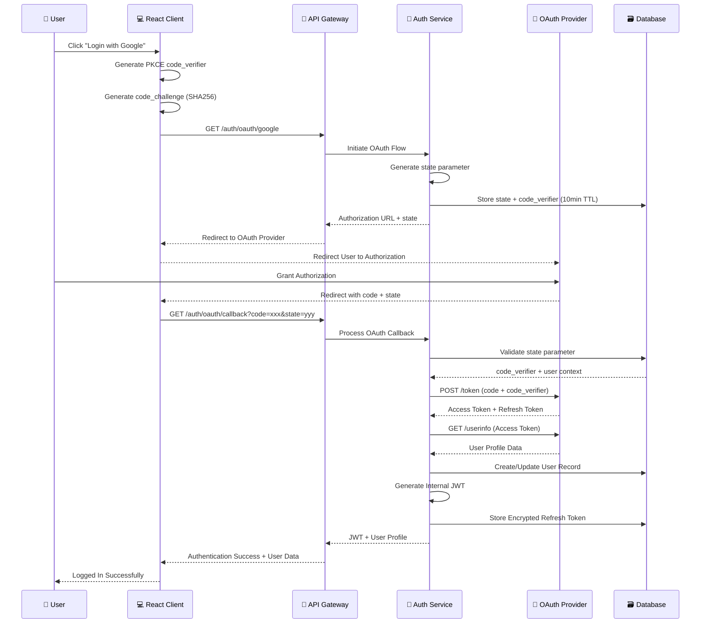
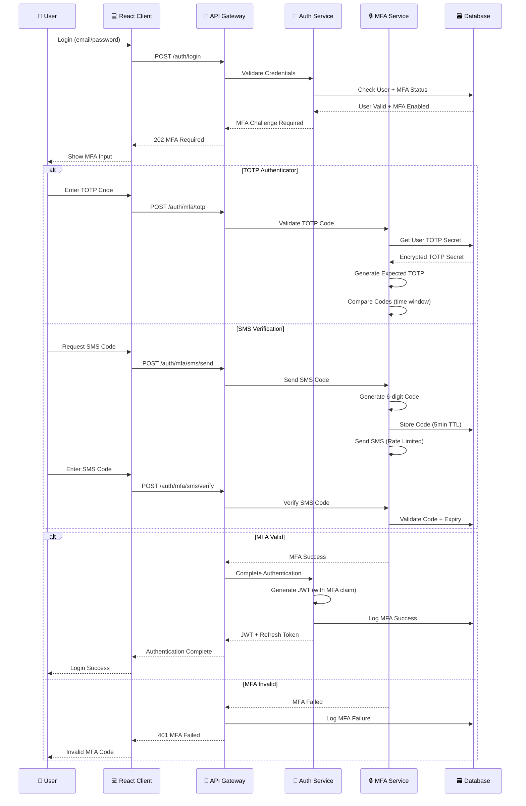
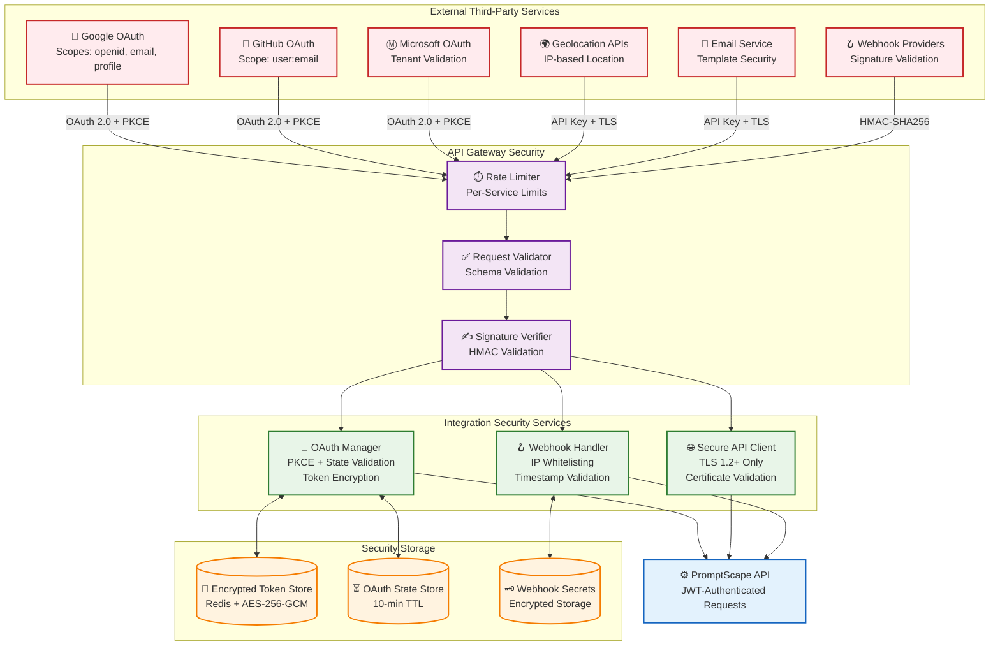
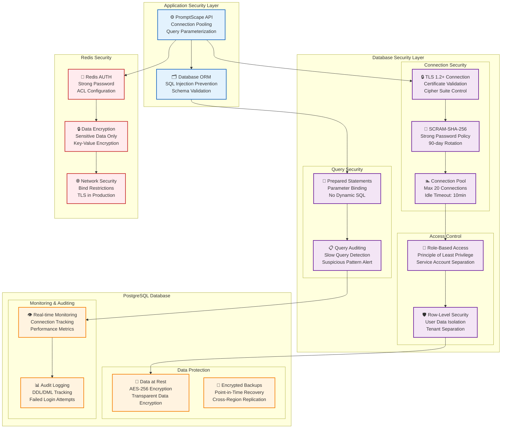
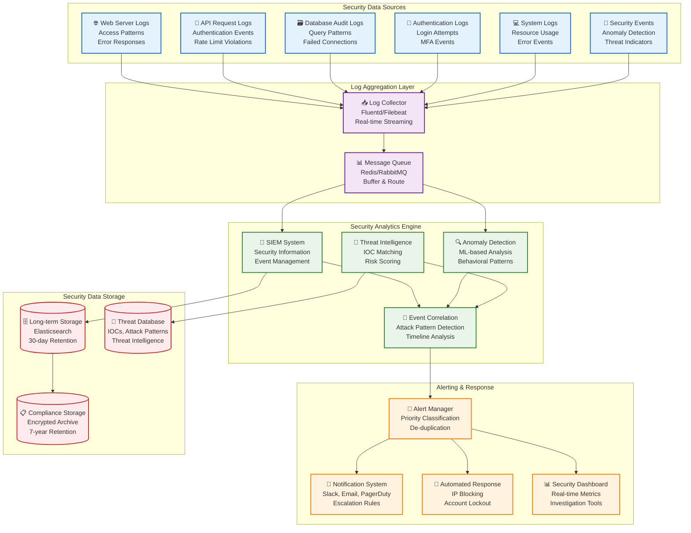
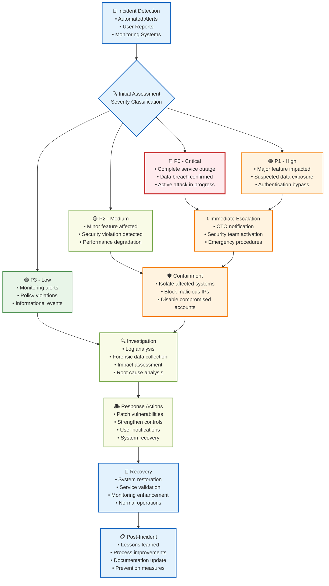
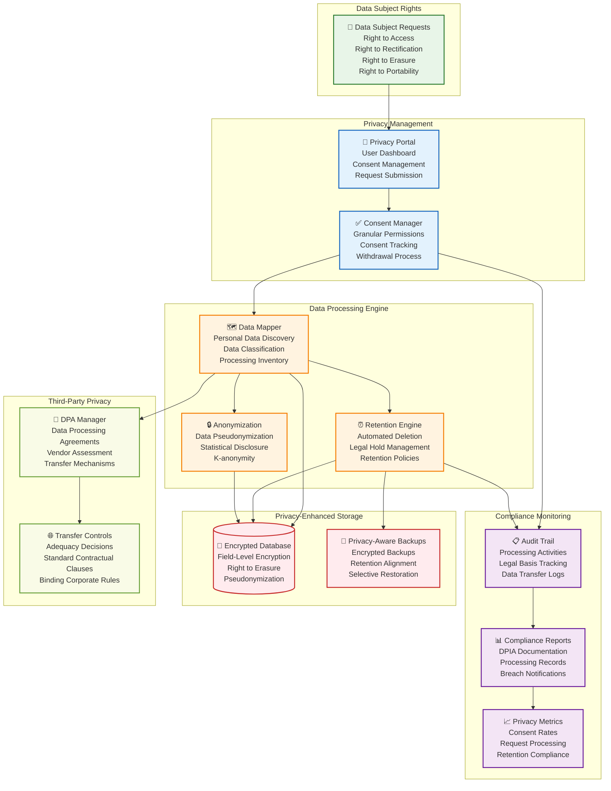
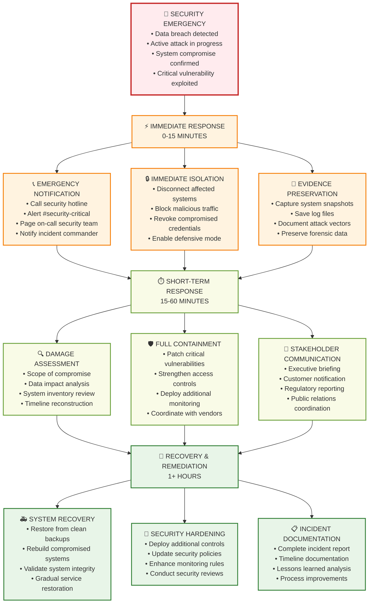

# PromptScape Security Component Diagrams

**Document Version**: 1.0  
**Last Updated**: 2025-07-22  
**Epic**: 19 - Security & Compliance Framework  
**Classification**: CONFIDENTIAL

---

## 1. Executive Summary

This document provides comprehensive visual diagrams of the PromptScape security architecture, illustrating how security components interact to protect the system, user data, and external integrations. These diagrams support the security requirements defined in the Integration Security Requirements document and serve as a reference for security implementation and auditing.

---

## 2. System Architecture Security Overview

### 2.1 High-Level Security Architecture



### 2.2 Security Zones and Trust Boundaries

```
┌─────────────────────────────────────────────────────────────────┐
│                        INTERNET (UNTRUSTED)                     │
│  👤 Users    🔐 OAuth Providers    🌐 Third-Party Services      │
└─────────────────────────┬───────────────────────────────────────┘
                          │ HTTPS/TLS 1.3
┌─────────────────────────▼───────────────────────────────────────┐
│                    DMZ (SEMI-TRUSTED)                           │
│  🛡️  Load Balancer + DDoS Protection                           │
│  🚪  API Gateway (Rate Limiting, Authentication)               │
│  🔥  Web Application Firewall                                   │
└─────────────────────────┬───────────────────────────────────────┘
                          │ Internal TLS
┌─────────────────────────▼───────────────────────────────────────┐
│                   APPLICATION ZONE (TRUSTED)                    │
│                                                                 │
│  💻 React Client         ⚙️  Fastify API Server                │
│  📡 WebSocket Server     🐍  Python Executor (Sandboxed)       │
│                                                                 │
│  🔑 Auth Service    📋 Audit Service    👁️  Security Monitor   │
└─────────────────────────┬───────────────────────────────────────┘
                          │ Encrypted DB Connections
┌─────────────────────────▼───────────────────────────────────────┐
│                     DATA ZONE (HIGHLY TRUSTED)                  │
│                                                                 │
│  🗃️  PostgreSQL (Row-Level Security)                           │
│  ⚡  Redis (AUTH + Encryption)                                  │
│  📁  Secure File Storage                                        │
└─────────────────────────────────────────────────────────────────┘

TRUST BOUNDARIES:
═══════════════════════════════════════════════════════════════════
Internet → DMZ:           HTTPS/TLS validation, certificate pinning
DMZ → Application:        JWT validation, rate limiting, WAF filtering
Application → Data:       Database authentication, connection encryption
Internal Services:       mTLS, service authentication, audit logging
```

---

## 3. Authentication Flow Diagrams

### 3.1 JWT Authentication Flow



### 3.2 OAuth 2.0 + PKCE Flow



### 3.3 Multi-Factor Authentication Flow



---

## 4. Integration Security Architecture

### 4.1 Third-Party Integration Security Model



### 4.2 API Security Integration Points

```
┌─────────────────────────────────────────────────────────────────┐
│                    EXTERNAL API INTEGRATION                     │
└─────────────────────────┬───────────────────────────────────────┘
                          │
                    ┌─────▼─────┐
                    │Rate Limiter│ ── Requests/minute per service
                    └─────┬─────┘
                          │
                ┌─────────▼─────────┐
                │  Request Validator │ ── Zod schema validation
                │  • Size limits     │    Input sanitization
                │  • Type checking   │    Path traversal prevention
                │  • Sanitization    │
                └─────────┬─────────┘
                          │
              ┌───────────▼───────────┐
              │   Security Headers    │ ── User-Agent validation
              │   • Authentication   │    X-Request-ID tracking
              │   • Content-Type     │    Timestamp validation
              │   • Custom Headers   │
              └───────────┬───────────┘
                          │
            ┌─────────────▼─────────────┐
            │      TLS Client           │ ── Certificate validation
            │  • TLS 1.2+ required     │    Cipher suite restriction
            │  • Certificate pinning   │    Connection timeout (30s)
            │  • Secure ciphers only   │    Retry with backoff
            └─────────────┬─────────────┘
                          │
          ┌───────────────▼───────────────┐
          │        Response Handler       │ ── Error sanitization
          │  • Schema validation         │    Response size limits
          │  • Sensitive data filtering  │    Performance monitoring
          │  • Error message sanitization│    Audit logging
          └───────────────┬───────────────┘
                          │
        ┌─────────────────▼─────────────────┐
        │         Response Cache            │ ── TTL-based caching
        │  • Encrypted cache storage      │    Cache invalidation
        │  • No sensitive data cached     │    Performance optimization
        └─────────────────┬─────────────────┘
                          │
                    ┌─────▼─────┐
                    │Application│
                    └───────────┘

SECURITY CHECKPOINTS:
═══════════════════
1. Rate Limiting      → Prevent abuse and DoS attacks
2. Request Validation → Stop injection and malformed requests
3. Security Headers   → Ensure proper authentication and tracking
4. TLS Client        → Secure communication channel
5. Response Handler  → Prevent data leakage and sanitize errors
6. Response Cache    → Secure caching without sensitive data exposure
```

---

## 5. Database Security Architecture

### 5.1 Multi-Layer Database Security



### 5.2 Data Classification and Security Controls

```
DATA CLASSIFICATION MATRIX:
═══════════════════════════════════════════════════════════════════

┌─────────────┬─────────────┬─────────────┬─────────────┬─────────────┐
│Classification│   PUBLIC    │  INTERNAL   │CONFIDENTIAL │ RESTRICTED  │
├─────────────┼─────────────┼─────────────┼─────────────┼─────────────┤
│ Examples    │• API Docs   │• User Prefs │• User Graphs│• Auth Tokens│
│             │• Help Text  │• Graph Meta │• Collab Data│• PII Data   │
│             │• Public APIs│• Node Config│• Usage Stats│• Audit Logs │
├─────────────┼─────────────┼─────────────┼─────────────┼─────────────┤
│ Encryption  │    None     │Transit Only │Transit+Rest │Transit+Rest │
│  Required   │             │   (TLS)     │(AES-256-GCM)│+ Key Rotation│
├─────────────┼─────────────┼─────────────┼─────────────┼─────────────┤
│Access       │   Public    │Authenticated│ Authorized  │ Privileged  │
│Control      │   Access    │   Users     │   Users     │   Access    │
├─────────────┼─────────────┼─────────────┼─────────────┼─────────────┤
│Audit        │    None     │   Basic     │  Enhanced   │ Full Audit  │
│Logging      │             │   Logging   │   Logging   │  + Alerts   │
├─────────────┼─────────────┼─────────────┼─────────────┼─────────────┤
│Retention    │ Indefinite  │   2 Years   │   1 Year    │  90 Days    │
│Policy       │             │             │             │ (or legal)  │
├─────────────┼─────────────┼─────────────┼─────────────┼─────────────┤
│Backup       │   Standard  │  Encrypted  │  Encrypted  │  Encrypted  │
│Security     │             │   Backups   │  + Versioned│ + Air-gapped│
└─────────────┴─────────────┴─────────────┴─────────────┴─────────────┘

DATABASE SECURITY LAYERS:
═══════════════════════════════════════════════════════════════════

Layer 7: Application Security
┌─────────────────────────────────────────────────────────────┐
│ • Input Validation (Zod Schemas)                           │
│ • SQL Injection Prevention (Parameterized Queries)         │
│ • Business Logic Authorization                              │
│ • Data Classification at Application Level                 │
└─────────────────────────────────────────────────────────────┘

Layer 6: ORM Security
┌─────────────────────────────────────────────────────────────┐
│ • Query Builder Security (TypeORM/Prisma)                  │
│ • Automatic Parameter Binding                              │
│ • Schema Validation and Migration Security                 │
│ • Connection Pool Management                                │
└─────────────────────────────────────────────────────────────┘

Layer 5: Connection Security
┌─────────────────────────────────────────────────────────────┐
│ • TLS 1.2+ Encryption (Client ↔ Database)                 │
│ • Certificate-Based Authentication                          │
│ • Connection String Encryption                             │
│ • Network Isolation (VPC/Private Subnets)                 │
└─────────────────────────────────────────────────────────────┘

Layer 4: Database Access Control
┌─────────────────────────────────────────────────────────────┐
│ • Role-Based Access Control (RBAC)                         │
│ • Row-Level Security (RLS) Policies                        │
│ • Column-Level Permissions                                 │
│ • Service Account Isolation                                │
└─────────────────────────────────────────────────────────────┘

Layer 3: Database Engine Security
┌─────────────────────────────────────────────────────────────┐
│ • Authentication: SCRAM-SHA-256                            │
│ • Query Timeout and Resource Limits                        │
│ • Audit Logging (pg_audit extension)                       │
│ • Query Plan Security                                       │
└─────────────────────────────────────────────────────────────┘

Layer 2: Operating System Security
┌─────────────────────────────────────────────────────────────┐
│ • File System Permissions (750/640)                        │
│ • Process Isolation and Resource Limits                    │
│ • Network Firewall Rules (Port 5432 restricted)           │
│ • System Audit Logging                                     │
└─────────────────────────────────────────────────────────────┘

Layer 1: Storage Security
┌─────────────────────────────────────────────────────────────┐
│ • Data at Rest Encryption (AES-256)                        │
│ • Encrypted Backups with Separate Keys                     │
│ • Secure Key Management (HSM/KMS)                          │
│ • Physical Storage Security                                │
└─────────────────────────────────────────────────────────────┘
```

---

## 6. Threat Model and Attack Surface Analysis

### 6.1 STRIDE Threat Model

```mermaid
graph TB
    %% Threat Categories
    subgraph "STRIDE Threat Model"
        %% Spoofing
        subgraph "Spoofing Threats"
            S1[🎭 User Identity Spoofing<br/>• JWT Token Theft<br/>• Session Hijacking<br/>• OAuth State Attack]
            S2[🏢 Service Impersonation<br/>• API Key Compromise<br/>• Certificate Spoofing<br/>• DNS Poisoning]
        end

        %% Tampering
        subgraph "Tampering Threats"
            T1[📝 Data Tampering<br/>• SQL Injection<br/>• NoSQL Injection<br/>• Parameter Pollution]
            T2[🔧 Request Tampering<br/>• Header Manipulation<br/>• Payload Modification<br/>• Replay Attacks]
        end

        %% Repudiation
        subgraph "Repudiation Threats"
            R1[🚫 Action Denial<br/>• Audit Log Tampering<br/>• Non-repudiation Bypass<br/>• Log Injection]
        end

        %% Information Disclosure
        subgraph "Information Disclosure"
            I1[📊 Data Leakage<br/>• Error Message Info<br/>• Debug Info Exposure<br/>• Side-Channel Attacks]
            I2[🔍 Reconnaissance<br/>• API Enumeration<br/>• Timing Attacks<br/>• Metadata Leakage]
        end

        %% Denial of Service
        subgraph "Denial of Service"
            D1[💥 Resource Exhaustion<br/>• Rate Limit Bypass<br/>• Memory/CPU DoS<br/>• Database Connection Pool]
            D2[🌊 Distributed DoS<br/>• Application Layer DDoS<br/>• Slowloris Attacks<br/>• XML Bomb]
        end

        %% Elevation of Privilege
        subgraph "Elevation of Privilege"
            E1[⬆️ Privilege Escalation<br/>• Horizontal Escalation<br/>• Vertical Escalation<br/>• RBAC Bypass]
            E2[🔓 Authorization Bypass<br/>• JWT Claims Manipulation<br/>• Path Traversal<br/>• IDOR Attacks]
        end
    end

    %% Security Controls (Mitigations)
    subgraph "Security Controls"
        %% Authentication Controls
        Auth[🔐 Strong Authentication<br/>• MFA Required<br/>• JWT RS256<br/>• OAuth PKCE]

        %% Input Validation
        Validation[✅ Input Validation<br/>• Zod Schema Validation<br/>• Parameterized Queries<br/>• Sanitization]

        %% Audit & Monitoring
        Monitoring[👁️ Comprehensive Monitoring<br/>• Security Event Logging<br/>• Anomaly Detection<br/>• Real-time Alerts]

        %% Access Control
        AccessControl[🛡️ Access Control<br/>• RBAC Implementation<br/>• Resource Authorization<br/>• Principle of Least Privilege]

        %% Rate Limiting
        RateLimit[⏱️ Rate Limiting<br/>• Request Throttling<br/>• Resource Limits<br/>• Circuit Breakers]

        %% Encryption
        Encryption[🔒 End-to-End Encryption<br/>• Data in Transit (TLS)<br/>• Data at Rest (AES-256)<br/>• Key Management]
    end

    %% Threat to Control Mapping
    S1 --> Auth
    S2 --> Auth
    T1 --> Validation
    T2 --> Validation
    R1 --> Monitoring
    I1 --> Encryption
    I2 --> AccessControl
    D1 --> RateLimit
    D2 --> RateLimit
    E1 --> AccessControl
    E2 --> AccessControl

    %% Styling
    classDef threatClass fill:#ffebee,stroke:#c62828,stroke-width:2px
    classDef controlClass fill:#e8f5e8,stroke:#2e7d32,stroke-width:2px

    class S1,S2,T1,T2,R1,I1,I2,D1,D2,E1,E2 threatClass
    class Auth,Validation,Monitoring,AccessControl,RateLimit,Encryption controlClass
```

### 6.2 Attack Surface Analysis

```
ATTACK SURFACE MAPPING:
═══════════════════════════════════════════════════════════════════

External Attack Surface (Internet-Facing):
┌─────────────────────────────────────────────────────────────────┐
│ 🌐 Web Application (Port 443/HTTPS)                            │
│   Risk: HIGH | Exposure: Internet | Controls: WAF, Rate Limit  │
│   • Client-side attacks (XSS, CSRF)                           │
│   • Application logic vulnerabilities                          │
│   • Authentication bypass attempts                             │
├─────────────────────────────────────────────────────────────────┤
│ 🔌 API Endpoints (Port 443/HTTPS)                              │
│   Risk: HIGH | Exposure: Internet | Controls: Auth, Validation │
│   • REST API vulnerabilities                                   │
│   • Input validation bypasses                                  │
│   • Business logic flaws                                       │
├─────────────────────────────────────────────────────────────────┤
│ 🪝 Webhook Endpoints (Port 443/HTTPS)                          │
│   Risk: MEDIUM | Exposure: Internet | Controls: Signature Verify│
│   • Webhook spoofing attacks                                   │
│   • Replay attacks                                             │
│   • Payload injection                                          │
├─────────────────────────────────────────────────────────────────┤
│ 📡 WebSocket Connections (Port 443/WSS)                        │
│   Risk: MEDIUM | Exposure: Internet | Controls: Auth, Rate Limit│
│   • WebSocket hijacking                                        │
│   • Message injection                                          │
│   • Connection flooding                                        │
└─────────────────────────────────────────────────────────────────┘

Internal Attack Surface (Network-Internal):
┌─────────────────────────────────────────────────────────────────┐
│ 🗃️ Database Connections (Port 5432/PostgreSQL)                 │
│   Risk: HIGH | Exposure: Internal | Controls: TLS, Auth, RBAC  │
│   • SQL injection (secondary)                                  │
│   • Privilege escalation                                       │
│   • Data exfiltration                                          │
├─────────────────────────────────────────────────────────────────┤
│ ⚡ Redis Connections (Port 6379/Redis)                          │
│   Risk: MEDIUM | Exposure: Internal | Controls: AUTH, Network  │
│   • Cache poisoning                                            │
│   • Session manipulation                                       │
│   • Memory exhaustion                                          │
├─────────────────────────────────────────────────────────────────┤
│ 🐍 Python Executor Service (Port 8001/HTTP)                    │
│   Risk: HIGH | Exposure: Internal | Controls: Sandbox, JWT    │
│   • Code injection attacks                                     │
│   • Sandbox escape attempts                                    │
│   • Resource exhaustion                                        │
├─────────────────────────────────────────────────────────────────┤
│ 📁 File Storage Access                                         │
│   Risk: MEDIUM | Exposure: Internal | Controls: Access Control │
│   • Path traversal attacks                                     │
│   • File upload malware                                        │
│   • Unauthorized file access                                   │
└─────────────────────────────────────────────────────────────────┘

Third-Party Attack Surface (External Dependencies):
┌─────────────────────────────────────────────────────────────────┐
│ 🔐 OAuth Providers (Google, GitHub, Microsoft)                 │
│   Risk: LOW | Exposure: External | Controls: State, PKCE      │
│   • OAuth flow manipulation                                    │
│   • Provider compromise (rare)                                 │
│   • Token theft in transit                                     │
├─────────────────────────────────────────────────────────────────┤
│ 🌍 Geolocation APIs                                            │
│   Risk: LOW | Exposure: External | Controls: API Key, TLS     │
│   • API key compromise                                         │
│   • Data poisoning                                             │
│   • Service unavailability                                     │
├─────────────────────────────────────────────────────────────────┤
│ 📧 Email Service APIs                                          │
│   Risk: LOW | Exposure: External | Controls: API Key, Rate Limit│
│   • Email spoofing                                             │
│   • Template injection                                         │
│   • Service abuse                                              │
└─────────────────────────────────────────────────────────────────┘

RISK PRIORITIZATION:
═══════════════════════════════════════════════════════════════
1. 🔴 CRITICAL: Web Application + API Endpoints (Internet-facing)
2. 🟠 HIGH: Database + Python Executor (High value targets)
3. 🟡 MEDIUM: WebSocket + File Storage (Limited exposure)
4. 🟢 LOW: Third-party services (External dependencies)

SECURITY INVESTMENT PRIORITY:
═══════════════════════════════════════════════════════════════
1. Web Application Firewall (WAF) - Blocks common attacks
2. API Gateway Security - Authentication, rate limiting, validation
3. Database Security Hardening - Encryption, access controls
4. Python Executor Sandboxing - Container isolation, resource limits
5. Monitoring & Alerting - Real-time threat detection
```

---

## 7. Security Monitoring Architecture

### 7.1 Security Operations Center (SOC) Architecture



### 7.2 Real-Time Security Monitoring Dashboard

```
SECURITY OPERATIONS DASHBOARD
═══════════════════════════════════════════════════════════════════

┌─────────────────────────────────────────────────────────────────┐
│  🚨 THREAT LEVEL: MODERATE     📊 SYSTEM STATUS: OPERATIONAL    │
├─────────────────────────────────────────────────────────────────┤
│                        REAL-TIME METRICS                       │
├─────────────────────────────────────────────────────────────────┤
│ Authentication Events (Last 1 Hour):                           │
│ ✅ Successful Logins:        247    (+12% from avg)           │
│ ❌ Failed Login Attempts:     23    (Normal levels)           │
│ 🔐 MFA Challenges:           189    (76% success rate)        │
│ 🚫 Account Lockouts:          3    (Threshold: <10)          │
├─────────────────────────────────────────────────────────────────┤
│ API Security Events:                                           │
│ 📈 API Requests/min:        1,247   (Normal traffic)          │
│ ⏱️ Rate Limit Hits:           45   (5 IPs blocked)            │
│ ❌ Validation Failures:       89   (Mostly form errors)       │
│ 🚨 Injection Attempts:         2   (🔍 Under investigation)   │
├─────────────────────────────────────────────────────────────────┤
│ Integration Security:                                          │
│ 🔐 OAuth Flows/hour:          67   (Google: 45, GitHub: 22)   │
│ 🪝 Webhook Deliveries:       123   (98% success rate)         │
│ 🌐 Third-party API Calls:    345   (All services healthy)     │
│ ❌ Integration Failures:        7   (Transient network errors) │
├─────────────────────────────────────────────────────────────────┤
│ Database Security:                                             │
│ 🗃️ DB Connections:            18/20 (90% pool utilization)    │
│ ⚡ Redis Operations/sec:    2,134   (Cache hit: 94%)          │
│ 🐌 Slow Queries:              12   (Performance alerts)       │
│ 🚫 Access Violations:          0   (No unauthorized access)   │
└─────────────────────────────────────────────────────────────────┘

┌─────────────────────────────────────────────────────────────────┐
│                       ACTIVE ALERTS                            │
├─────────────────────────────────────────────────────────────────┤
│ 🟡 MEDIUM | 14:23 | Unusual API usage pattern detected        │
│    IP: 192.168.1.45 | User: user_12345 | Action: Monitor      │
├─────────────────────────────────────────────────────────────────┤
│ 🟢 LOW    | 14:18 | Rate limit threshold reached              │
│    IP: 203.0.113.22 | Endpoint: /api/preview | Action: Blocked│
├─────────────────────────────────────────────────────────────────┤
│ 🟡 MEDIUM | 14:15 | Multiple failed MFA attempts             │
│    User: user_67890 | Method: TOTP | Action: Account Review   │
└─────────────────────────────────────────────────────────────────┘

┌─────────────────────────────────────────────────────────────────┐
│                   SECURITY TREND ANALYSIS                      │
├─────────────────────────────────────────────────────────────────┤
│ Authentication Trends (7 days):                                │
│ │█████████░░░░░░░░░░│ Login Success Rate: 94.2% (↑ 2.1%)     │
│ │██████░░░░░░░░░░░░░│ MFA Adoption: 67.3% (↑ 5.4%)          │
│                                                                 │
│ Attack Pattern Analysis:                                        │
│ │████░░░░░░░░░░░░░░░│ SQL Injection: 23 attempts (↓ 15%)     │
│ │██░░░░░░░░░░░░░░░░░│ XSS Attempts: 12 attempts (↓ 30%)      │
│ │█████████████████░░│ Brute Force: 156 attempts (↑ 8%)       │
│                                                                 │
│ Integration Health:                                             │
│ │████████████████░░░│ OAuth Success: 96.8% (Stable)          │
│ │█████████████░░░░░░│ Webhook Reliability: 94.2% (↓ 2.3%)    │
│ │██████████████████░│ API Response Time: 245ms avg (Stable)   │
└─────────────────────────────────────────────────────────────────┘

INCIDENT RESPONSE STATUS:
═══════════════════════════════════════════════════════════════════
🟢 Security Team: Available (3 analysts on duty)
🟢 Incident Response: Ready (Response time: <15 min)
🟢 External Services: All operational
🟡 Backup Systems: 1 minor issue (non-critical)

COMPLIANCE STATUS:
═══════════════════════════════════════════════════════════════════
✅ GDPR: Compliant (Last audit: 2025-07-15)
✅ SOC 2: Type II certified (Valid until: 2026-01-15)
⚠️ PCI DSS: Assessment due (Schedule: 2025-08-01)
✅ Audit Logs: 100% captured and retained

QUICK ACTIONS:
═══════════════════════════════════════════════════════════════════
[🔍 Investigate Alert] [🚫 Block IP] [👤 Lock User Account]
[📊 Generate Report] [🔄 Refresh Data] [⚙️ Configure Alerts]
```

---

## 8. Incident Response Workflow

### 8.1 Security Incident Response Process



### 8.2 Automated Security Response Actions

```
AUTOMATED SECURITY RESPONSE MATRIX:
═══════════════════════════════════════════════════════════════════

┌─────────────────┬─────────────────┬─────────────────┬─────────────────┐
│   Threat Type   │   Detection     │ Auto Response   │ Manual Review   │
├─────────────────┼─────────────────┼─────────────────┼─────────────────┤
│ Brute Force     │ >5 failed logins│ 🚫 IP Block     │ ⏱️  15 minutes  │
│ Attack          │ in 5 minutes    │ 🔒 Account Lock │ 🔍 Investigation │
├─────────────────┼─────────────────┼─────────────────┼─────────────────┤
│ SQL Injection   │ Pattern match   │ 🚫 IP Block     │ ⚡ Immediate    │
│ Attempt         │ in query logs   │ 📧 Alert Team   │ 🚨 High Priority│
├─────────────────┼─────────────────┼─────────────────┼─────────────────┤
│ XSS Payload     │ Script tags     │ 🚫 Request Block│ ⏱️  30 minutes  │
│ Detection       │ in input        │ 🧹 Input Strip  │ 🔍 Pattern Update│
├─────────────────┼─────────────────┼─────────────────┼─────────────────┤
│ Rate Limit      │ Threshold       │ ⏱️  Throttle    │ ⏱️  1 hour      │
│ Exceeded        │ exceeded        │ 🚫 Temp Block   │ 📊 Usage Review │
├─────────────────┼─────────────────┼─────────────────┼─────────────────┤
│ Anomalous       │ ML model        │ 🔍 Enhanced Log │ ⏱️  24 hours    │
│ Behavior        │ detection       │ 👁️  Monitor User│ 📈 Behavior Anal│
├─────────────────┼─────────────────┼─────────────────┼─────────────────┤
│ File Upload     │ Virus scanner   │ 🗑️  Delete File │ ⚡ Immediate    │
│ Malware         │ detection       │ 🚫 User Block   │ 🦠 Malware Anal │
├─────────────────┼─────────────────┼─────────────────┼─────────────────┤
│ API Abuse       │ Unusual pattern │ ⏱️  Rate Limit  │ ⏱️  4 hours     │
│                 │ detection       │ 📊 Usage Track  │ 🔍 Investigation │
├─────────────────┼─────────────────┼─────────────────┼─────────────────┤
│ Data Exfil      │ Large data      │ 🚫 Connection   │ ⚡ Immediate    │
│ Attempt         │ transfer        │ 🔒 Account Lock │ 🚨 Critical     │
└─────────────────┴─────────────────┴─────────────────┴─────────────────┘

RESPONSE ACTION DETAILS:
═══════════════════════════════════════════════════════════════════

🚫 IP Block Actions:
───────────────────────────────────────────────────────────────────
• Add to WAF blacklist (immediate effect)
• Duration: 1-24 hours based on severity
• Automatic review and potential removal
• Whitelist override for legitimate traffic
• Geo-location based blocking for patterns

🔒 Account Lock Actions:
───────────────────────────────────────────────────────────────────
• Immediate session termination
• JWT token revocation and blacklisting
• MFA reset requirement for unlock
• Security team notification
• Audit trail with lock reason

📧 Alert Notifications:
───────────────────────────────────────────────────────────────────
• Slack #security-alerts (immediate)
• Email to security-team@promptscape.app
• PagerDuty escalation for P0/P1 incidents
• Dashboard alert with context
• Mobile push notifications for critical

🔍 Enhanced Monitoring:
───────────────────────────────────────────────────────────────────
• Increase log verbosity for user/IP
• Real-time behavioral analysis
• Additional security event correlation
• Extended retention for investigation
• Detailed request/response logging

⏱️  Throttling Actions:
───────────────────────────────────────────────────────────────────
• Progressive rate limiting (10% → 50% → 90%)
• Request queuing with priority
• Gradual service degradation
• Circuit breaker activation
• Load balancing adjustments

ESCALATION MATRIX:
═══════════════════════════════════════════════════════════════════

Level 1: Automated Response (0-15 minutes)
┌─────────────────────────────────────────────────────────────────┐
│ • Block malicious traffic automatically                        │
│ • Lock compromised accounts                                     │
│ • Alert security team via multiple channels                    │
│ • Begin evidence collection                                     │
│ • Execute containment procedures                                │
└─────────────────────────────────────────────────────────────────┘

Level 2: Security Team Response (15-60 minutes)
┌─────────────────────────────────────────────────────────────────┐
│ • Human verification of automated actions                       │
│ • Advanced threat analysis and investigation                    │
│ • Coordinate with development team if needed                    │
│ • Customer communication for high-impact events                │
│ • System recovery and validation                                │
└─────────────────────────────────────────────────────────────────┘

Level 3: Management Escalation (1+ hours)
┌─────────────────────────────────────────────────────────────────┐
│ • CTO/CISO notification for critical incidents                 │
│ • Legal team involvement for data breaches                     │
│ • Public relations coordination                                │
│ • Regulatory notification requirements                         │
│ • Board-level reporting for major incidents                    │
└─────────────────────────────────────────────────────────────────┘
```

---

## 9. Compliance Architecture

### 9.1 GDPR Compliance Architecture



### 9.2 SOC 2 Security Control Architecture

```
SOC 2 TYPE II SECURITY CONTROLS ARCHITECTURE:
═══════════════════════════════════════════════════════════════════

SECURITY PRINCIPLE - Access Control & Authentication:
┌─────────────────────────────────────────────────────────────────┐
│ CC6.1: Logical Access Security                                 │
├─────────────────────────────────────────────────────────────────┤
│ 🔐 Multi-Factor Authentication (MFA)                           │
│    • TOTP authenticator required for admin access              │
│    • SMS backup option for standard users                      │
│    • Email verification for account recovery                   │
│                                                                 │
│ 👥 Role-Based Access Control (RBAC)                            │
│    • Principle of least privilege enforcement                  │
│    • Regular access review (quarterly)                         │
│    • Automated provisioning/deprovisioning                     │
│                                                                 │
│ 🔑 Privileged Access Management                                │
│    • Separate admin accounts for privileged operations         │
│    • Just-in-time access for temporary privileges              │
│    • Session recording for administrative activities           │
└─────────────────────────────────────────────────────────────────┘

AVAILABILITY PRINCIPLE - System Monitoring & Incident Response:
┌─────────────────────────────────────────────────────────────────┐
│ A1.1: System Availability Monitoring                           │
├─────────────────────────────────────────────────────────────────┤
│ 📊 Infrastructure Monitoring                                   │
│    • Server health monitoring (CPU, memory, disk)              │
│    • Database performance monitoring                           │
│    • Network connectivity monitoring                           │
│                                                                 │
│ ⚠️  Alerting & Incident Response                               │
│    • 24/7 monitoring with automated alerts                     │
│    • Escalation procedures for different severity levels       │
│    • Mean Time to Resolution (MTTR) tracking                   │
│                                                                 │
│ 🔄 Business Continuity                                         │
│    • Automated backup systems (daily + real-time)              │
│    • Disaster recovery procedures tested quarterly             │
│    • Failover capabilities for critical services               │
└─────────────────────────────────────────────────────────────────┘

PROCESSING INTEGRITY - Data Validation & Quality:
┌─────────────────────────────────────────────────────────────────┐
│ PI1.1: Data Processing Integrity                               │
├─────────────────────────────────────────────────────────────────┤
│ ✅ Input Validation                                             │
│    • Schema validation for all API inputs                      │
│    • Sanitization of user-provided data                        │
│    • File upload security scanning                             │
│                                                                 │
│ 🔍 Data Quality Controls                                        │
│    • Automated data validation pipelines                       │
│    • Data integrity checks during processing                   │
│    • Error handling and recovery procedures                    │
│                                                                 │
│ 📊 Processing Monitoring                                        │
│    • Real-time processing metrics and alerts                   │
│    • Data lineage tracking for audit purposes                  │
│    • Performance monitoring and optimization                   │
└─────────────────────────────────────────────────────────────────┘

CONFIDENTIALITY - Data Protection & Encryption:
┌─────────────────────────────────────────────────────────────────┐
│ C1.1: Data Confidentiality Controls                            │
├─────────────────────────────────────────────────────────────────┤
│ 🔒 Data Encryption                                              │
│    • Data at rest: AES-256 encryption                          │
│    • Data in transit: TLS 1.2+ for all communications          │
│    • Database encryption with separate key management          │
│                                                                 │
│ 🗝️  Key Management                                             │
│    • Hardware Security Module (HSM) for key storage            │
│    • Regular key rotation (90-day cycle)                       │
│    • Secure key distribution and access controls               │
│                                                                 │
│ 🏷️  Data Classification                                         │
│    • Automated data classification based on content            │
│    • Access controls aligned with data sensitivity             │
│    • Data handling procedures for each classification          │
└─────────────────────────────────────────────────────────────────┘

PRIVACY - Personal Data Protection:
┌─────────────────────────────────────────────────────────────────┐
│ P1.1: Personal Information Management                          │
├─────────────────────────────────────────────────────────────────┤
│ 👤 Privacy by Design                                           │
│    • Data minimization in collection and processing            │
│    • Purpose limitation for data usage                         │
│    • Privacy impact assessments for new features               │
│                                                                 │
│ 🛡️  Data Subject Rights                                        │
│    • Automated response to data subject requests               │
│    • Right to access, rectification, and erasure              │
│    • Data portability and processing restriction               │
│                                                                 │
│ 📋 Consent Management                                           │
│    • Granular consent collection and tracking                  │
│    • Easy consent withdrawal mechanisms                        │
│    • Regular consent refresh and validation                    │
└─────────────────────────────────────────────────────────────────┘

CONTROL EVIDENCE & TESTING:
═══════════════════════════════════════════════════════════════════

Continuous Control Monitoring:
├─ Automated Control Testing (Daily)
│  ├─ Access control validation
│  ├─ Encryption status verification
│  ├─ Backup integrity checks
│  └─ Security configuration monitoring
│
├─ Management Testing (Monthly)
│  ├─ User access review
│  ├─ Incident response testing
│  ├─ Change management compliance
│  └─ Vendor security assessment
│
└─ Independent Testing (Quarterly)
   ├─ Penetration testing
   ├─ Vulnerability assessments
   ├─ Control effectiveness review
   └─ Compliance gap analysis

Evidence Collection:
├─ System Logs and Monitoring Data
├─ Access Control Reports
├─ Security Configuration Screenshots
├─ Incident Response Documentation
├─ Change Management Records
├─ Training Completion Records
├─ Vendor Security Certifications
└─ Third-Party Audit Reports

COMPLIANCE METRICS DASHBOARD:
═══════════════════════════════════════════════════════════════════
┌─ SECURITY     │ ✅ 98.5% │ 🎯 Target: >95%  │ 📈 Trend: Stable │
├─ AVAILABILITY │ ✅ 99.7% │ 🎯 Target: >99.5% │ 📈 Trend: Up     │
├─ INTEGRITY    │ ✅ 99.9% │ 🎯 Target: >99%   │ 📈 Trend: Stable │
├─ CONFIDENTIAL │ ✅ 100%  │ 🎯 Target: 100%   │ 📈 Trend: Stable │
└─ PRIVACY      │ ✅ 97.8% │ 🎯 Target: >95%   │ 📈 Trend: Up     │

Last External Audit: 2025-06-15 | Next Audit: 2026-06-15
Certification Status: SOC 2 Type II Compliant ✅
```

---

## 10. Contact Information & Emergency Procedures

### 10.1 Security Team Contact Matrix

```
SECURITY TEAM CONTACT INFORMATION:
═══════════════════════════════════════════════════════════════════

🔴 CRITICAL SECURITY INCIDENTS (P0):
────────────────────────────────────────────────────────────────────
📞 Emergency Hotline: +1-XXX-XXX-XXXX (24/7)
💬 Slack Channel: #security-critical (immediate response required)
📧 Email: critical-security@promptscape.app
🚨 PagerDuty: security-critical-escalation

Response Time: ≤ 15 minutes
On-Call Rotation: 24/7 security engineer coverage

🟠 HIGH PRIORITY INCIDENTS (P1):
────────────────────────────────────────────────────────────────────
💬 Slack Channel: #security-alerts
📧 Email: security-incident@promptscape.app
📞 Business Hours: +1-XXX-XXX-XXXY

Response Time: ≤ 1 hour
Coverage: Business hours + on-call coverage

🟡 MEDIUM PRIORITY INCIDENTS (P2):
────────────────────────────────────────────────────────────────────
💬 Slack Channel: #security-team
📧 Email: security-team@promptscape.app

Response Time: ≤ 4 hours (business days)
Coverage: Business hours

🟢 LOW PRIORITY / INFORMATIONAL (P3):
────────────────────────────────────────────────────────────────────
💬 Slack Channel: #security-general
📧 Email: security-info@promptscape.app

Response Time: ≤ 24 hours (business days)
Coverage: Business hours

SPECIALIZED SECURITY CONTACTS:
════════════════════════════════════════════════════════════════════

👤 Chief Information Security Officer (CISO):
   📧 ciso@promptscape.app
   📞 +1-XXX-XXX-XXXZ (executive escalation only)

🔐 Identity & Access Management:
   💬 #iam-team
   📧 identity-security@promptscape.app

🌐 Infrastructure Security:
   💬 #infra-security
   📧 infrastructure-security@promptscape.app

📊 Compliance & Privacy:
   💬 #compliance-team
   📧 compliance@promptscape.app
   📧 privacy-officer@promptscape.app

🕵️ Threat Intelligence:
   💬 #threat-intel
   📧 threat-intelligence@promptscape.app

🧪 Security Testing & Research:
   💬 #security-research
   📧 security-research@promptscape.app
```

### 10.2 Emergency Response Procedures



---

## 11. Document Maintenance

### 11.1 Review and Update Schedule

| Component                   | Review Frequency | Next Review | Owner                        |
| --------------------------- | ---------------- | ----------- | ---------------------------- |
| **System Architecture**     | Quarterly        | 2025-10-22  | Security Architecture Team   |
| **Authentication Flows**    | Semi-annually    | 2026-01-22  | Identity & Access Management |
| **Integration Security**    | Quarterly        | 2025-10-22  | Integration Security Team    |
| **Database Security**       | Semi-annually    | 2026-01-22  | Database Security Team       |
| **Threat Model**            | Annually         | 2026-07-22  | Threat Intelligence Team     |
| **Monitoring Architecture** | Quarterly        | 2025-10-22  | Security Operations Team     |
| **Incident Response**       | Semi-annually    | 2026-01-22  | Incident Response Team       |
| **Compliance Architecture** | Annually         | 2026-07-22  | Compliance & Privacy Team    |

### 11.2 Change Control Process

All changes to this security architecture documentation must follow the established change control process:

1. **Change Request**: Submit via security-architecture@promptscape.app
2. **Security Review**: Required for all architectural changes
3. **Approval**: CISO approval required for major changes
4. **Implementation**: Coordinated deployment with affected teams
5. **Validation**: Post-change security validation and testing
6. **Documentation**: Update documentation and communicate changes

---

**Document Classification**: CONFIDENTIAL  
**Document Owner**: Security Architecture Team  
**Approval Authority**: Chief Information Security Officer (CISO)  
**Next Scheduled Review**: 2025-10-22

---

_This document contains confidential security information and should be handled according to PromptScape's information security policy. Distribution is restricted to authorized personnel only._
