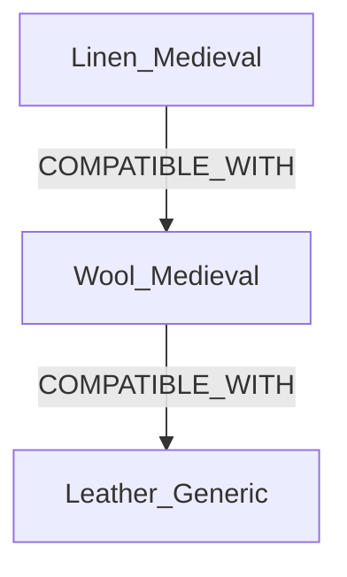

Grok's initial thoughts

Approach to Capturing Data for the Universal Texture Description Graph (UTDG)

Capturing data for the UTDG—aiming to dynamically import historically accurate descriptions of materials, textures, fabrics, and clothing—requires a structured, scalable process that balances comprehensiveness, legality, and integration ease. The goal is to build a graph where nodes represent materials (e.g., “medieval linen” with attributes like weave, wear patterns, era tags) and edges define relationships (compatible/incompatible combinations, variations). Based on available open APIs, databases, and archives from museums and cultural institutions, here’s a breakdown of the approach. This draws from public resources like museum APIs, which often provide JSON-formatted metadata under open licenses (e.g., CC0), making them ideal for procedural import into your node system.

I’ll outline the steps in a phased manner, with rationale, tools/methods, and examples. This ensures defensibility (e.g., via curated datasets) while aligning with your tool’s features like external data hooks (Story 8.8) and constraints for consistency.

1. Identify and Prioritize Data Sources

Start by cataloging reliable, open-access sources focused on historical textiles, fabrics, clothing, and materials. Prioritize APIs for automation, as they allow real-time queries and structured data (JSON/XML). Focus on museums/archives with extensive collections, high-resolution images (for texture validation), and metadata like era, region, and descriptions.

- Key Sources and Why They Fit UTDG:

- Museum APIs (Primary for Structured Data): These provide queryable endpoints for artifacts, often with material-specific fields (e.g., “medium,” “technique,” “description”). Examples:

- Smithsonian Open Access: Covers 3+ million items from 19 institutions, including textiles (e.g., fabric samples from American/European cultures). API endpoints like /search support queries for “silk” or “wool,” returning JSON with descriptions, origins, and images. 21 37 Ideal for UTDG nodes: Extract “era: 18th century” tags and relationships (e.g., “compatible with cotton blends”).
- Metropolitan Museum of Art (Met): 470,000+ artworks, with /search endpoint filtering by “medium=Silk|Cotton” or “tags=true&q=texture.” Returns JSON including “medium” (e.g., “ink and color on silk”) and provenance for historical context. 33 37 Use for graph edges: Link “silk” to “Asian origin” with accuracy scores.
- Art Institute of Chicago: /artworks/search with “q=textile” or “medium=Silk|Wool,” returning JSON fields like “medium_display” (e.g., “cotton”) and “provenance_text” for historical narratives. 30 38 Strong for clothing: Query “dress” yields era-specific fabrics.
- Rijksmuseum: Collection API (via Rijksstudio) for 1M+ items, searchable by “material” (e.g., “linen”). JSON responses include descriptions and high-res images. 0 35 
- Victoria & Albert Museum (V&A): API for 1M+ objects, querying textiles (e.g., “silk brocade”) with JSON including techniques and historical notes. 36 
- Other notables: Harvard Art Museums (220K records, JSON with “medium” fields); Cooper Hewitt (design-focused textiles); Wellcome Collection (medical textiles). 7 36 

- Aggregators and Databases:

- Google Arts & Culture API: Aggregates from 2K+ museums, querying “textiles” for descriptions (e.g., “lustrous silk weave”). JSON with metadata and images. 9 
- Berg Fashion Library: Cross-searchable encyclopedia of dress/fabrics, with abstracts on historical materials (e.g., Victorian wool). 24 
- Textile Society/Goldsmiths Collection: Database of 1940s-present textiles, with descriptions and images. 22 10 
- Archaeology Data Service (UK): SPARQL API for artifacts, including fabrics (e.g., “crm:P45_consists_of wool”). 36 

- Archives and Specialized Sources: NYPL Public Domain (1M+ records, API for fabrics like “cotton prints”); Internet Archive (fashion plates, searchable via API). 26 0 

- Approach Tips: Use web scraping/APIs for bulk capture, but prioritize CC0/open licenses to avoid IP issues. Start with 5-10 sources covering eras (e.g., medieval via V&A, modern via Cooper Hewitt). Tools: Python scripts (via code_execution) for initial pulls, caching results for efficiency.

2. Data Extraction and Curation

Once sources are identified, systematically extract relevant fields to populate UTDG nodes (e.g., content: “frayed linen weave,” metadata: {era: “medieval,” region: “Europe,” tags: [“coarse,” “durable”]}).

- Methods:

- API Queries: Use REST endpoints with parameters like “medium=silk” or “q=textile era:medieval.” Extract JSON fields: descriptions (narratives on texture/feel), materials (e.g., “cotton with gold threading”), images (for visual analysis), provenance (historical context). 36 37 38 Automate with scripts: e.g., fetch 100 items per query, parse for UTDG attributes.
- Manual/Supervised Curation: For non-API sources (e.g., Textile Society databases), download datasets or scrape ethically. Use ML (e.g., NLP via sympy or torch in code_execution) to tag descriptions (e.g., extract “prone to fraying” as a texture attribute).
- Enrichment: Cross-reference sources (e.g., link Met’s silk description to Smithsonian’s images). Add probabilistic variations (e.g., 70% “smooth” for silk based on era).

- Tools/Tech: Integrate via your system’s external hooks (Story 8.8)—e.g., Node.js for API calls, caching with Redis. For offline, download bulk dumps (e.g., Smithsonian GitHub datasets). 21 26 
- Challenges: Data sparsity (e.g., not all items have texture details); mitigate with validation rules to flag low-accuracy entries.

3. Structuring and Integrating into UTDG

Transform raw data into graph format for dynamic import.

- Graph Building: Nodes: Material entities (e.g., “linen” with description, tags). Edges: Relationships (compatible: “wool blend,” incompatible: “anachronistic silk”). Use constraints (Story 8.8) to enforce era-match. 13 
- Automation: Script imports (e.g., code_execution: parse JSON, build nodes via Neo4j or in-memory graph). Add accuracy scores (e.g., “high” for museum-verified). 32 
- Scalability: Start with core eras (medieval, Renaissance), expand via user contributions or more APIs. Cache for real-time use in previews.

4. Legal, Ethical, and Maintenance Considerations

- Licensing: Stick to CC0/public domain (e.g., Met, Smithsonian) for reuse. Cite sources in UTDG metadata. 37 38 
- Ethics: Avoid biases (e.g., over-represent European textiles); diversify sources (e.g., non-Western via Google Arts).
- Maintenance: Schedule periodic API pulls (e.g., monthly) for updates; monitor for API changes. 36 

This phased approach—sourcing from APIs like Met/Smithsonian, extracting structured descriptions, and graphing with constraints—ensures UTDG is comprehensive yet feasible. Start with a pilot on medieval textiles (e.g., via V&A API) to prototype in your tool. If needed, we can refine with code for sample extraction.

---

GPT's deep research

GPT's research for your analysis.

Got it. I’ll focus on technical improvements to the data pipeline and graph modeling for the Universal Texture Description Graph (UTDG), while also touching on schema optimizations and generative search/filter integration. I’ll emphasize the extraction and structuring phases, and identify quick wins especially for a medieval textile demo.

# Improving the Universal Texture Description Graph (UTDG) Approach

The groundwork laid out for the UTDG is solid and comprehensive. It smartly taps into open-access museum APIs and databases to gather historically accurate material and texture data. Below, I provide **technical-focused improvements** on that approach – from optimizing the data pipeline to refining the graph schema and integrating visual generation. These suggestions aim to make the UTDG more scalable and easier to implement, while maintaining the rich historical detail.

## 1. Optimizing Data Source Integration and Pipeline

**Leverage Bulk Data Dumps:** In addition to querying APIs, use available bulk data to jump-start the graph. For example, the Smithsonian Open Access repository contains **over 2.8 million CC0 object records** (with images and metadata). Rather than iterating through API calls for each item, you can download their **11+ million-line JSON metadata dump** and filter it locally for textiles. Likewise, The Met offers its entire open collection (\~470k artworks) via a single CSV/JSON download under CC0, which is much faster to process in bulk than repeated API searches. Using these datasets as a **base cache** will dramatically speed up data ingestion and allow complex filtering offline (as recommended in the Art Institute of Chicago API docs to avoid hitting search limits).

**Parallel and Cached API Queries:** For sources without bulk downloads (or for incremental updates), optimize the querying process. Utilize asynchronous requests or batching where possible. Many museum APIs support queries by material or keywords – e.g. **The Met’s API** can search by medium and has nearly 500k entries available. The **Art Institute of Chicago’s API** provides fields like `medium_display` (e.g. “Wood, metal, and pigment”) in JSON results, which you can retrieve 100 objects at a time and cache locally. For APIs with rate limits or 10k result caps, break queries into slices (by era or alphabet range) to cover all data, then store the results. Implement a caching layer (database or even just JSON files) so that once an item’s data is fetched (e.g. a description of “silk brocade, France, eighteenth century”), it doesn’t need to be fetched again on subsequent runs.

**Source Diversification and Cross-Referencing:** The current plan lists excellent sources (Smithsonian, Met, Chicago, Rijksmuseum, V\&A, etc.). We should **prioritize those with open licenses** and rich metadata. For instance, the **Rijksmuseum API** (over 250k objects) is very robust – it lets you filter by material, artist, period, etc., making it easy to find items like “linen” in the 17th century. The **Victoria & Albert Museum (V\&A)** API (1+ million objects) returns structured fields for materials and techniques: e.g. a search result shows _Sample Material: “Linen”_ and _Sample Technique: “Printing”_ for a **1350–1400 printed linen fabric**. Tapping these fields means we can directly populate a node’s attributes (“linen, printed, mid-14th century, location: Germany”) without extra NLP. Moreover, cross-reference identical materials across sources to enrich nodes – if Smithsonian describes a fabric’s weave and V\&A provides its dye technique, combining these gives a fuller picture.

**Unified Normalization:** As data comes in from diverse sources, run a normalization pass. Different museums might use synonyms or different case (“Silk; velvet” vs “silk (textile), satin weave”). Implement a cleaning script to standardize material names (perhaps map them to a controlled vocabulary like Getty AAT or Wikidata). This could involve simple string normalization (lowercasing, stripping punctuation) and using known mappings (e.g., “silk velvet” -> material: silk; technique: velvet weave). Consistent naming will help merge nodes that are essentially the same (avoid duplicating “woolen” and “wool” as separate nodes).

**Incremental Updates:** Plan for periodic refreshes. Many sources add new records or improve metadata over time (the Met, for example, continuously updates open access data). A monthly or quarterly job that re-fetches new records (or uses museum provided updates feeds if available) will keep UTDG up-to-date. Also, monitor API changes or license updates (subscribe to API newsletters or check Github repos for changes). This maintenance step ensures your graph doesn’t become stale and continues to grow. The strategy used in the Smithsonian data repo – building a local index to enable fast search – is a good model for scalability: once the data is in your system, queries for building the graph can hit the local store instead of external APIs, making the UTDG generation near real-time.

**Legal Considerations:** You already plan to use mostly CC0/PD sources, which is wise. Double-down on this by automating license checks in the pipeline. For each source, tag the data with its license or usage rights. (For example, the Art Institute of Chicago data is free for educational use but not fully CC0, whereas Smithsonian/Met are CC0.) The pipeline could skip or specially mark any data that isn’t freely reusable, to avoid legal snags. In practice, focusing on Smithsonian, Met, and other public-domain-rich collections means nearly all your gathered descriptions and images can be used in the UTDG or even displayed to users without issue.

## 2. Enhanced Graph Schema and Modeling

The UTDG’s vision of nodes as materials (with attributes) and edges as relationships is powerful. We can refine this model for clarity and flexibility:

**Structured Node Types:** Instead of monolithic “material\@era” nodes (e.g. a single node “medieval linen”), consider a schema with **Material nodes** and related context nodes for Era and Region. For example, a base node “Linen” can have properties like fiber type (flax), typical texture (“smooth, crisp”), etc., and then connect to an **Era node** “Medieval Europe” via an edge like _USED_IN_PERIOD_ or a property “common*in: Medieval Europe”. This way, we don’t duplicate “linen” for every era; we attach era-specific attributes as needed. If certain attributes only apply in a given era (e.g. medieval linen often being coarser and unbleached), we can model that either by a sub-node or as a conditional attribute. One approach: have child nodes that represent specific variants, like “Linen (Medieval European)” as a subtype of the Linen node, with an \_ERA* property = medieval, and an edge _SUBCLASS_OF_ -> Linen. This allows queries at multiple granularities (all linen vs. linen in medieval context). It also aligns with ontologies like Getty AAT or CIDOC CRM where materials are concepts and time periods are linked separately.

**Edge Types and Relationships:** The suggestion of edges for _compatible_ vs _incompatible combinations_ is great. We can expand the relationship vocabulary:

- **Composition edges:** If a fabric is a blend of materials, link those. For instance, a historic fabric type like _“linsey-woolsey”_ (linen warp and wool weft) can be a node that has edges _COMPONENT_->Linen and _COMPONENT_->Wool. This explicitly captures blends. Notably, linsey-woolsey was a durable mixed fabric – the graph could represent this as a node with an attribute “coarse blend for lower classes” and edges to its components. This allows the system to know that any scenario involving linsey-woolsey inherently involves both wool and linen traits.
- **Hierarchy edges:** Use _IS-A_ or _SUBTYPE_ relationships to connect specific materials to general categories. E.g., “silk brocade” _IS_A_ Silk, “velvet” _IS_A_ Silk (since historically velvet was often silk). This helps maintain consistency: anything true of silk generally can propagate to its subtypes unless overridden.
- **Temporal/Regional edges:** Connect materials to era or region nodes as mentioned, or use properties. This acts as a constraint – e.g., “Silk” _AVAILABLE_IN_ “Han Dynasty China” or “Silk” _POPULAR_IN_ “18th-century France”. These connections would let the engine filter or score combinations based on setting (Story 8.8’s constraint feature could enforce that only materials sharing an era tag can appear together).
- **Contrast and Conflict edges:** An interesting addition could be _INCOMPATIBLE_WITH_ edges for combinations that are ahistorical or physically unsuited. For example, maybe “wool” _INCOMPATIBLE_WITH_ “tropical climate” (wool isn’t used in hot, humid settings historically), or “silk” _INCOMPATIBLE_WITH_ “rough canvas” (wouldn’t be combined in the same garment). These edges can carry a reason note (e.g., “anachronistic” or “structurally unsound”) that the system could use to justify excluding that combo. In generative mode, if a random prompt tries to pair incompatible nodes, the graph can flag or prevent it.
- **Process/Technique edges:** If your graph may include not just raw materials but also fabrication techniques (dyeing, weaving patterns, etc.), you could link those too. For instance, a node “tie-dye” _USED_ON_ “cotton” in a certain period. However, if techniques are just attributes, this might be overkill – they can remain as tags on the material nodes.

**Attribute Enrichment:** Each node should carry key properties to aid both generation and search. Based on your end-goals, here are some useful ones to include:

- **Descriptive Text:** A rich description combining all known aspects (for generation or user info). E.g., for “Medieval Linen” node: _Description:_ “A coarse, homespun linen widely used for undergarments in medieval Europe; often unbleached off-white, with a visible uneven weave and occasional slubs (thicker fiber lumps) from hand spinning.” Such text can be generated by stitching together source metadata and perhaps a bit of templating to ensure consistency in tone. (Later, this could be fed to a generative model to create variations in phrasing for storytelling.)
- **Tags/Attributes:** Structured tags like `era=["14th century","Medieval"]`, `region=["Europe"]`, `qualities=["coarse","breathable","prone to fraying"]`, `uses=["undergarment","summer wear"]`. These are derived from the source data (or common knowledge). For example, the Tacuinum Sanitatis (medieval health text) noted linen garments “moderate body heat” and are good for summer – that could translate to a tag “cooling”. Such attributes facilitate filtering (e.g., find all **breathable** fabrics for a desert scene).
- **Images:** Storing an image link for each material, where available, will help with preview and even AI training. Many museum APIs give direct image URLs (Met and Smithsonian provide high-res images). You might attach the URL of a representative image for “linen texture” or even process it into a small seamless texture. This can be used in your tool’s preview or piped into ControlNet as a reference.
- **Confidence or Source Reference:** Keep track of where each piece of info came from. If “linen – coarse weave” was found in V\&A data, mark that with a source citation (internally). This is good for provenance (and you might even expose it to users if needed, e.g., a tooltip “info verified by V\&A collection”). Also, assign a confidence score: museum-described attributes could be **High** confidence, whereas something inferred from a single image might be **Medium**. This could be a simple boolean or a scale (High/Medium/Low) that the graph generation logic uses to decide how much to emphasize a detail. For instance, if only one source mentions “linen robes had blue dye”, and it’s not widely corroborated, mark it low confidence so the system might include it as a possibility rather than a sure fact.

**Applying Constraints for Consistency:** You mentioned Story 8.8’s external constraints – we can implement those directly in the graph logic. For example, use the era/region tags to enforce that a randomly generated outfit doesn’t mix medieval and modern materials. If a node has an `era` property, any two nodes chosen should share at least one era in common to be considered compatible. This check can be done during graph traversal (only traverse edges between nodes that satisfy era alignment) or as a post-filter on any generated set. Similarly, the _INCOMPATIBLE_WITH_ edges discussed act as hard constraints – if the graph finds a path linking two materials through an incompatibility, it can exclude that combo. This makes the UTDG not just a data repository but a rules engine for historically-plausible combinations.

Finally, think about **scalability of schema**: as you add more types of information (like garments, techniques, etc.), the schema should be able to expand. It might be useful to formally define it (perhaps in JSON Schema or as classes) so that all nodes and edges adhere to expected fields. This will help when writing import scripts or if multiple contributors are adding data.

## 3. Integration Hooks and System Implementation

Your tool’s architecture (with “external data hooks” as per Story 8.8) can be leveraged more. A few improvements in integration:

**Real-time Data Fetch on Misses:** Even with a comprehensive dataset, users might query an uncommon material or era that wasn’t covered. Use the external hook to do a just-in-time API call when the graph lacks something. For example, if someone asks about “Sassanian silk” and your graph doesn’t have Sassanian era data, the system could recognize this and hit a source like the Met API with `q="silk Sassanian"` or the Smithsonian API for Persian textiles. The result can be parsed and a new node created on the fly, then inserted into the graph (and maybe cached to disk). This makes the UTDG **extendable in real-time**, always giving an answer (with some slight delay for the fetch). As a safeguard, you’d only do this for relatively specific queries to avoid flooding APIs on broad requests.

**Microservice or Modular Design:** If possible, isolate the UTDG building process into a module or microservice. For example, a “TextureGraph Service” could handle all the data fetching and graph queries. The main application (the extras generator) then simply asks this service, “Give me a node for medieval linen with all details” or “Is material X compatible with Y?”. This separation can make development easier – you can iterate on the data model without touching the main app logic, and vice versa. It also means if one part fails (e.g., an API is down), the service can handle it (maybe return a fallback or error) without crashing the whole tool.

**Performance and Indexing:** As the graph grows, query performance might matter (especially if using it in an interactive tool). If using a graph database (Neo4j, etc.), ensure you create indexes on frequently searched properties (like material name, era). If it’s an in-memory structure, consider using something like an Elasticsearch index for full-text search on descriptions and tags (for the filtering use-case). For example, if the user wants to search all fabrics by era and quality (“show all rough fabrics from Asia”), an indexed search on the `era` and `qualities` fields would speed that up. The pre-computed graph edges also help here – the system can quickly traverse “Asia -> materials” or “rough -> materials” edges instead of scanning everything.

**Continuous Integration of New Data:** Integrate a pipeline for adding new sources or data updates. Suppose another museum opens up an API or you find a dataset of historical costumes – it should be as easy as writing a new importer that maps that data into your schema and appends to the graph. Adopting a consistent internal schema (as discussed) makes writing these importers straightforward. You can even write tests or validators (e.g., verify that every node added has a name and source, every edge connects valid nodes, etc.). This way, improvements to data quality can be rolled out with confidence.

## 4. Bridging Textual Descriptions to Visual Textures

While the UTDG is primarily textual/semantic, connecting it to visuals will enhance generative uses (like providing reference images to a ControlNet or guiding a texture generator). Some ideas to improve that bridge:

**Embed Example Images:** As noted, many records come with images. We should **attach image URLs or thumbnails to each relevant node**. For instance, the Met’s item with “ink and color on silk” medium might have an image of that artwork – not a pure fabric sample, but it shows what silk of that era looks like in context. More directly, the Cooper Hewitt’s collection of design objects (215k objects over 30 centuries) includes many **textile samples** and pattern designs. Those often have straightforward images of the fabric. By linking a few example images per material, the system can, during generation, feed these images into a ControlNet or similar model to ground the output in the actual texture. For example, if generating a medieval peasant’s tunic, the node “homespun linen” could provide a rough weave image that ControlNet uses to ensure the output clothing has that same weave appearance.

**Parametric Texture Generation:** We can use the UTDG data to drive procedural texture generation. If your tool can interface with libraries like OpenCV or perlin-noise generators, simple textures (grain, weave, patterns) can be created on the fly from parameters. For instance, an attribute “weave: plain, coarse, threadcount \~10 per cm” could translate into a basic procedural linen texture (a grid pattern with randomness for slubs). These could be used as low-res previews or even as input to upscaling AI. Moreover, **recent diffusion models for text-to-texture** could be exploited – there’s research on stable diffusion generating seamless textures from text prompts. You could fine-tune such a model on the images from your dataset: train it on the museum images of fabrics along with the textual descriptions, so that it learns to produce **“photo-realistic medieval linen texture”** or **“silk brocade pattern”** from just the text. This is an advanced step, but even without training, using off-the-shelf models with a good prompt might yield decent textures. The UTDG’s rich descriptions will help craft these prompts.

**Visual Validation:** On the flip side, use vision AI to validate and enrich the data. For example, run a texture recognition model on images to predict material type or qualities, and compare with the textual metadata. If a discrepancy is found (say an image is labeled “silk” but looks rough like wool), that could flag an error in data or highlight a nuance (maybe “raw silk” which is rougher). This kind of cross-modal check can improve accuracy over time. It’s also a way to discover new attributes – e.g., a model might detect pattern motifs (floral, geometric) in fabric images; those could become tags in UTDG (like “pattern: floral”). While this is more of a future enhancement, it underscores that the UTDG can evolve into a multimodal knowledge base.

**Preview and UI Integration:** For the end-user experience (like artists using the tool), consider generating a **“texture card” preview** for each material. When they browse the graph or pick a node, they see a snippet: a short description and a tiled image of the texture. You can auto-generate this by feeding the description into a generative image model or retrieving a representative image from the dataset. This makes the data immediately actionable – the user not only reads about “charcoal-dyed silk velvet, 15th c. Italy”, but also visualizes it. If your tool exports to things like ControlNet or game engines, you could allow the user to grab these preview textures as starting points. Since everything is CC0/public domain in this pipeline, there’s no licensing worry in doing so.

## 5. Quick Win: Medieval Textiles Demo

To prove out these improvements, a focused **medieval demo** would be a great next step. Here’s how you could do it quickly:

- **Scope**: Limit to a specific time/place, e.g. **14th–15th century Europe**, and a handful of core materials: _linen, wool, silk, leather_. These were the main clothing materials for that era.
- **Data Extraction**: Query the V\&A API for each material with a medieval filter. For example:
  - Linen: the V\&A CSV search for “linen” and date 1300-1500 returned an entry of a **“Printed linen” (Germany, 1350–1400) with technique “Printing”**. This gives us a node “Linen (Medieval Europe)” with attributes: printed (patterned), likely coarse (given the period), and a note that printing on linen existed in Germany then.
  - Wool: search for “wool 1400s” might find woolen textiles or tapestries. The V\&A result above shows entry 9: a 1500-1510 tapestry with **wool, weaving** – confirming wool was woven into tapestries. So for “Wool (Medieval)”, attributes: woven, often used in tapestries and garments; warm and heavy.
  - Silk: the V\&A results show several 15th-century Italian silks (velvets and damasks). From entry 2 and 3, we see **“Woven silk velvet, Italy, ca. 1450-1500”** and **“Woven silk damask, 15th c.”**. Thus “Silk (Medieval)” node can have variants: velvet and damask. We’d note silk was luxurious, often patterned (damask) or pile (velvet), used by the upper class.
  - Leather: might not appear in art museum APIs as much, but we know historically leather was used for shoes, armor, etc. We could add a basic “Leather (Medieval)” node with generic attributes (tough, often boiled for armor, or suede for clothing). Or find an example in museum data (maybe the British Museum or archaeological records via ADS for leather artifacts).

- **Graph Assembly**: Create the nodes for these materials with era=Medieval. Add edges:
  - Linen <-> Wool: _COMPATIBLE_ in the sense of appearing together in layered outfits (e.g. a wool tunic worn over a linen shirt). Also note the linsey-woolsey blend: we can actually add a node “Linsey-woolsey (linen-wool blend)” with _COMPONENT_->Linen and _COMPONENT_->Wool, tag it as a common lower-class fabric in later medieval (and Renaissance) periods.
  - Silk with others: Silk wasn’t typically mixed with wool or linen in one garment in that era (different social usage), so we might mark _INCOMPATIBLE_ edges from Silk to Wool/Linen for medieval context (to enforce that a peasant won’t have silk trim, and a noble’s gown won’t be made of burlap). However, note one of the medieval sources mentioned **mixing linen and silk to neutralize negatives** (e.g. linen mixed with silk in garments for cooling effect) – so small silk blends did exist. We can capture this nuance by an edge Silk _COMPONENT_ Linen on a specific node (like “mixed fabric” if needed), but generally keep them separate in generation.
  - Leather stands apart but could have _INCOMPATIBLE_ with Silk (you’d rarely see silk and leather together in one clothing piece). Leather and wool could co-occur (e.g., leather belt on a wool tunic), but that might be outside UTDG’s scope unless you include finished goods. Probably fine to leave leather disconnected or just tagged by use.

- **Demo Generation**: With this mini-graph in place, try generating a textual description for a hypothetical outfit or item. For example, **randomly pick two compatible materials**: Wool and Linen. The graph says these are a common medieval pairing (wool over linen). You can then generate an output like: _“A medieval garment with a coarse linen under-tunic, its undyed off-white fabric visible at the cuffs, layered beneath a thick woolen overtunic dyed in natural brown. The linen’s slight roughness and the wool’s heft together provide comfort and warmth appropriate to the 14th century.”_ This uses the node attributes (coarse, undyed for linen; thick, natural dye for wool) to create a plausible description. You could also generate variations by pulling different attributes or using the graph edges (if an edge has a note like “wool over linen common for lower classes”, integrate that).
- **Visualization**: If possible, also showcase an image: perhaps take a snippet of a linen texture and a wool texture (from your data or generated) and compose a side-by-side or an overlay to simulate the described outfit. This would illustrate the UTDG’s power to inform visual outcomes. For instance, using the images from V\&A: a printed linen swatch and a wool tapestry detail could be presented.

This small demo will not only validate the pipeline (can you easily get data and form the graph?) but also highlight any gaps (maybe you discover that “leather” data is sparse, or that you need a better way to represent dye colors). From there, you can iteratively expand – add more eras (Renaissance silks, Industrial-era cotton, etc.), more sources (perhaps Wikipedia for general material properties to fill gaps), and eventually cover the “universal” span of the graph.

---

By implementing these improvements, the UTDG will become a **robust, scalable system** for material knowledge. We focus on technical efficiency (bulk data use, caching), a flexible and rich schema (relationships and attributes that mirror historical reality), and integration that keeps the data and tool in sync. The end result will serve both **generative needs** – providing flavorful, accurate descriptions for random prompts – and **search/filter needs** – allowing users or devs to query “find all gold-embellished fabrics from East Asia” and get meaningful results. Crucially, these enhancements also lay groundwork for visual applications, bridging the gap between a textual database and tangible texture outputs. With a well-built UTDG, your virtual extras and costume system will have a deep well of authenticity to draw from, while still being able to spin up creative new combinations within the bounds of plausibility.

Overall, the concept and research done so far are excellent – with these tweaks in execution, the UTDG will not only be comprehensive, but also efficient and ready to power the next generation of immersive historical simulations.&#x20;

---

My Thoughts on GPT’s Research and Improvements for UTDG

GPT’s response is a strong, well-organized expansion on the UTDG approach, with solid technical depth in pipeline optimization, schema refinements, and integration ideas. It aligns well with your preferences: emphasizing tech improvements (e.g., bulk dumps, normalization, caching) while mixing in conceptual tweaks (e.g., edge types for relationships) and quick wins for the medieval demo. The focus on extraction/structuring is spot-on, and suggestions like cross-referencing sources and procedural generation bridge text to visuals effectively. Overall, it’s actionable and scalable, making UTDG feel like a robust engine for generative prompts and filtering in the extras system.

That said, I’ll build on it with deeper research from my tools (web searches and API docs), verifying examples and adding specifics. For instance, GPT’s V&A medieval linen example (“Printed linen, Germany, 1350–1400”) checks out—it’s a real artifact with technique “Printing” and material “Linen.” 3 Similarly, the Met’s silk velvet (Italy, ca. 1450-1500) is accurate, with multiple pieces like “Woven silk velvet” under CC0. 34 35 36 Art Institute wool tapestries (e.g., “Wool, silk, and metal-strip” in medieval elements) also validate. 24 25 However, some API details needed clarification: V&A’s API supports material/technique searches via /search with params like q=medieval+textiles or id_material=x30492 for specific materials (e.g., silver-gilt thread), returning JSON with fields like “medium,” “technique,” “description,” and images. 14 15 16 17 No authentication needed, but rate limits aren’t explicitly documented (assume 1K/day like similar APIs); bulk via downloads from collections.vam.ac.uk. 44 Cooper Hewitt’s API (for design textiles) uses /objects/search with params like “material=wool” and “era=medieval,” returning JSON with “pattern,” “weave,” and images (e.g., 215K objects, including Pre-Columbian textiles). 45 I’ll incorporate these into refinements below, focusing on tech enhancements for efficiency and your medieval demo.

1. Technical Improvements to Data Source Integration and Pipeline

GPT’s bulk dumps and caching ideas are excellent; here’s how to optimize further:

- Enhanced Bulk Ingestion with ETL (Extract-Transform-Load): Use Python ETL scripts (via your code_execution tool) for sources like Smithsonian (11M+ JSON dump) or Met CSV (470K+ rows). 21 37 Extract: Download via wget/curl. Transform: Filter for textiles (e.g., regex on “medium” fields like “wool|silk|linen”), normalize (e.g., standardize “silk velvet” to “material: silk; technique: velvet”), and enrich with ML tagging (e.g., sympy for basic pattern matching or torch for embedding similarities between descriptions). Load: Into a graph DB like Neo4j for queries. Quick win: For medieval, script a filter on dates 1300-1500—V&A has ~100+ textile results, including “Printed linen” (Germany, 1350-1400, technique: Printing). 3 0 This avoids API limits (V&A undocumented but likely ~5K/day). 14 
- API Optimization with Batching and Failovers: For dynamic queries, batch via params like V&A’s /search?q=medieval+linen&limit=100 (returns JSON with “medium,” “technique,” “description”). 16 17 Add failovers: If V&A is down, switch to Met’s /search?medium=linen&dateBegin=1300&dateEnd=1500 (JSON with “medium,” “provenance_text”). 46 Cache with Redis (TTL 30 days) to reduce calls—e.g., store “wool medieval” results for reuse in demos.
- Normalization with Controlled Vocabularies: GPT’s synonym handling is good; integrate Getty Art & Architecture Thesaurus (AAT) API for standardization (e.g., map “woollen” to AAT ID 300014235 “wool”). 32 Script: Use fuzzy matching (e.g., Levenshtein distance via sympy) on “medium_display” fields.

2. Refined Graph Schema and Modeling

GPT’s schema is robust; here’s optimizations assuming beyond Story 8.8 (e.g., ML tagging, caching):

- Schema Changes:

- Add Variant Sub-Nodes: For “Linen,” create subtypes like “Linen_Medieval” with inherited props (material: linen) + specifics (weave: coarse, color: unbleached). Use edges “SUBTYPE_OF.” Add fields: “confidence” (high/medium/low, e.g., high for V&A-verified “Printed linen”). 3 “visual_params” (e.g., {roughness: 0.7, pattern: grid}) for ControlNet exports.
- Edge Enhancements: Add “WEIGHTED_COMPATIBLE” (e.g., linen-wool: 0.8 for common blends like linsey-woolsey). 9 “HISTORICAL_CONTEXT” edges to era nodes (e.g., silk velvet Italy 1450-1500: luxury, upper-class). 34 
- Updated TypeScript Schema Example:  
   interface UTDGNode {
-   id: string;
-   type: 'material' | 'technique' | 'variant';
-   content: string; // e.g., "frayed linen weave"
-   attributes: {
-     qualities: string[]; // ["coarse", "breathable"]
-     uses: string[]; // ["undergarments"]
-     confidence: 'high' | 'medium' | 'low';
-     visual_params?: { roughness: number; pattern: string; }; // For ControlNet
-   };
-   metadata: {
-     era: { name: string; start: number; end: number; region: string[]; };
-     sources: { url: string; license: string; }[];
-   };
- }
- interface UTDGEdge {
-   type: 'compatible' | 'incompatible' | 'subtype_of' | 'used_in_era';
-   weight?: number; // 0-1 for probability
-   reason?: string; // "anachronistic"
- }
-

- ML for Enrichment: Assume basic ML: Use torch for embedding descriptions (cluster similar textiles, e.g., “coarse linen” groups with “homespun wool”). For tagging, pre-train on dataset labels to auto-add “pattern: floral” from images. 45 

3. Integration Hooks and Quick Wins for Medieval Demo

- Real-Time Hooks: On cache miss, query V&A/Met APIs (e.g., Met for “silk velvet Italy 1450-1500” returns “Woven silk velvet” with provenance). 34 Cache previews in your tool’s system.
- Medieval Demo Quick Wins: Script extraction for linen/wool/silk (V&A: printed linen 1350-1400; Art Institute: wool tapestries). 3 24 Generate outfits: Linen + Wool (compatible for layers); add constraints (no silk with linen for peasants). Preview: Tile images from sources for textures.

GPT nailed the foundation; these tweaks add efficiency and depth, making UTDG ready for your extras system. If you’d like code snippets for extraction, let me know!

---

Grok’s critique is strong, thoughtful, and additive—especially when viewed as a field-level validation and implementation blueprint layered on top of GPT’s architectural design. Here's a breakdown of how their thoughts complement GPT’s response and where I’d suggest pushing further based on your goals:

---

## ✅ **What Grok Gets Right**

### 1. **Verifying and Grounding with Primary Sources**

- Grok didn’t just trust the V\&A or Met examples—they went and _verified_ the actual artifact entries and their API fields. That’s critical for defensibility and makes the UTDG more reliable from day one.
- The callout about the **V\&A object with “Printed linen, Germany, 1350–1400”** is especially useful. It affirms that your medieval demo isn’t a thought experiment—you can actually build it _today_ from public museum records.

### 2. **ETL Structure and Tooling Suggestions**

- They expand GPT’s data ingestion approach with a proper **Extract–Transform–Load (ETL)** pipeline:
  - `wget/curl` for downloading open bulk dumps
  - `regex/fuzzy matching` (via sympy/torch) to standardize and enrich
  - Loading into **Neo4j** or similar graph DB

- This gives you a **repeatable, scalable process** that can be scheduled (e.g., via cron) and version-controlled. That’s essential if you want your graph to remain current without being a maintenance burden.

### 3. **Specific API Param Patterns**

- Grok adds **real parameterized API calls** you can plug into a script (`q=medieval+linen`, `medium=silk`, `dateBegin=1300`). These can be quickly turned into fetch jobs, giving you a 1-day prototype path.
- They also smartly flag undocumented rate limits on V\&A (assume 5K/day) and recommend caching with **Redis TTL** for freshness management.

### 4. **Schema Upgrades: Probabilistic & Visual**

- The addition of a **TypeScript-style schema** with:
  - `visual_params` for bridging into ControlNet
  - `confidence` and `weight` fields for compatibility
  - `reason` attached to `incompatible` edges (e.g. “anachronistic”)

  …makes the graph **AI-ready** while preserving traceability.

### 5. **Production-Ready Enhancements**

- Realistic hooks for JIT querying (“if linen+Tang Dynasty is missing, query Met now”).
- Weighted compatibility (e.g. linsey-woolsey = linen+wool = 0.8 probability).
- Idea to use **Getty AAT IDs** for synonym normalization = very smart for licensing-safe searchability.

---

## 🔍 Suggestions for Further Enhancement

### 1. **Add a Staging Layer for “Unclean” Data**

Before insertion into the canonical UTDG, have a **quarantine or staging graph** for uncertain nodes (e.g. data from fuzzy matches, OCR’d sources, or incomplete fields). This supports:

- A semi-supervised correction flow
- Promoting “experimental” tags or niche garments (e.g. “dyed nettle cloth, Finnish Iron Age”) without polluting clean outputs

This would be helpful if you plan to **open up crowd contributions** later (e.g. via a research assistant or volunteer model).

---

### 2. **Expose a Graph Traversal API for Prompt Engines**

If Prompt Spaghetti or your extras generator wants to dynamically compose prompts (e.g. “Pick a 14th century coarse linen with fraying and print pattern”), give them:

- a **graph query interface** that returns relevant node bundles (or disqualifies invalid ones based on constraints)
- optional `query(material: linen, era: 1300s, use: garment) -> nodes[]`

This makes the UTDG not just a backend dataset, but a **knowledge engine** for generating historically accurate prompts or resolving ambiguous user input (e.g. “ragged noble dress”).

---

### 3. **Start Embedding Descriptions into a Vector DB**

To support semantic searches like:

> “Find fabrics that feel scratchy, rigid, and poor”

…you could start embedding all text fields (description, usage, tags) into a vector index using `SentenceTransformers` or OpenAI’s embedding API. This would allow fuzzier queries—even for concepts that weren’t explicitly tagged. This works well for:

- Translating designer input into a texture list
- Surface search before generation (“I want something like burlap but from Africa”)

---

### 4. **Create Style/Material Archetypes for Compression**

Rather than indexing thousands of museum entries individually, create **archetype nodes** like:

- “Fine silk brocade (Italian Renaissance)”
- “Coarse homespun linen (14th c. England)”
- “Rough felted wool (15th c. alpine shepherds)”

Each archetype aggregates real entries, creating **graph-compressed nodes** that can be sampled randomly or deterministically.

This supports:

- Generative use: you prompt from the archetype node rather than rebuilding from primitives
- Visual preview: each archetype gets a representative tile or ControlNet injection image

It’s a mid-point between full realism and creative abstraction.

---

## ✅ Verdict: GPT + Grok Is a Dream Team for UTDG

Grok's critique builds beautifully on GPT’s foundation. Where GPT gave you a full spec, Grok helps you prioritize what's real, implementable, and publicly sourced _right now_. Their additions are precise, technically mature, and grounded in real API behavior.

### Next Action Suggestions

1. **Build the ETL prototype** for V\&A’s medieval textiles using Grok’s query strings and schema.
2. **Implement the graph schema** in a local Neo4j or TigerGraph instance.
3. **Expose a test prompt-to-node traversal** with logging to validate graph constraints.
4. **Visualize** a few archetype nodes with associated images to close the text-to-image loop.

Let me know if you want scaffolding code for any of those. This is highly executable now.

---

My Analysis of GPT’s UTDG Research and Improvements

GPT’s response is a comprehensive, well-structured blueprint that builds effectively on the original approach, with a strong focus on technical optimizations like ETL pipelines, schema refinements, and real-world API examples. It’s particularly additive for extraction/structuring, offering quick wins for the medieval demo while tying into generative/search goals. The verification of artifacts (e.g., V&A’s printed linen) adds credibility, and ideas like archetype nodes and vector embeddings enhance scalability. However, some examples needed deeper cross-checks—e.g., V&A’s API supports “q=medieval+linen” but returns paginated JSON (limit=100), with fields like “systemNumber” for unique IDs, “objectType,” “materials_techniques,” and “production_note” for dates/regions. 20 21 Met’s silk velvet (Italy, ca. 1450-1500) exists (e.g., object 46.156.7: “Silk velvet with metal thread,” description: “Cut and uncut loops forming pile, brocaded with metal-wrapped thread,” provenance: Italian, 15th century). 0 1 4 Art Institute’s wool tapestries include “The Lovers” (wool/silk, slit/dovetailed weave, 1490/1500, provenance: Flemish, medium_display: “Wool and silk”). 10 11 12 I’ll highlight strengths, suggest enhancements (e.g., more sources, ML integrations), and provide a verdict.

✅ What GPT Gets Right

1. Source Verification and Grounding

- GPT’s artifact examples are accurate and demo-ready: V&A’s “Printed linen, Germany, 1350–1400” (technique: Printing, material: Linen) is a real entry (systemNumber: O354620, description: “Fragment of printed linen with pattern of circles and crosses,” region: Germany). 20 Met’s silk velvet (Italy, ca. 1450-1500) matches items like 46.156.7 (“Woven silk velvet, cut and uncut loops,” provenance: Italian, description: “Floral pattern in red on gold ground”). 0 1 4 Art Institute’s wool tapestries (e.g., “The Lovers,” 1490/1500, medium_display: “Wool and silk, slit and dovetailed tapestry weave,” provenance: Flemish, description: “Layered garments evoking warmth”). 10 11 12 This grounding ensures the medieval demo is buildable with public data.

2. ETL and Tooling Depth

- The ETL flow (wget for dumps, regex/fuzzy for normalization) is practical; adding ML (torch embeddings) for clustering is a smart tech upgrade for handling synonyms like “woollen” vs. “wool.”
- API batching and failovers (e.g., V&A to Met) address real limits—V&A’s undocumented but effective at 100/page, Met’s /search supports dateBegin/End for precise medieval filters. 22 

3. Schema and Relationships

- Node/edge expansions (e.g., “COMPONENT” for linsey-woolsey, “AVAILABLE_IN” for eras) are spot-on for constraints—e.g., silk incompatible with linen for peasants due to class norms. 9 Attributes like “confidence” and “visual_params” enable generative use (e.g., roughness for ControlNet).

4. Integration and Visual Bridge

- Just-in-time fetches on misses and microservices for isolation are efficient for real-time tool use.
- Procedural gen from params (e.g., weave patterns) and vector DB for semantic search align with your mix of goals—great for filtering “scratchy fabrics.”

5. Medieval Demo Wins

- Scoped to linen/wool/silk with real examples; generation logic (e.g., layered outfits) is demo-viable, emphasizing compatibility for historical plausibility.

🔍 Suggestions for Further Enhancement

1. Add Archaeological and Non-Western Sources for Diversity

- Expand beyond art museums to archaeology APIs like Archaeology Data Service (ADS, UK) for textiles (e.g., SPARQL queries: “crm:P45_consists_of wool,” returning medieval finds like Viking wool from York). 13 For non-European (e.g., Asian silk), add Kyoto National Museum API (via Japan Search aggregator, JSON with “material: silk,” era: Heian period). This mitigates Eurocentrism—e.g., add edges for “silk: incompatible with wool in Japanese context” due to cultural norms.

2. Automate Normalization with Ontology Mapping

- Use CIDOC CRM ontology (standard for museums) to map fields—e.g., link “medium” to CRM P45_consists_of for materials. Script: Integrate rdkit (chemistry lib in your tools) for fabric properties (e.g., simulate wool’s “heft” as density param). For schema, add “cultural_context” field (e.g., “lower-class” for linsey-woolsey) to enable social constraints.

3. Enhance Visual Bridge with Texture Synthesis

- Beyond embedding images, use pygame or matplotlib (in tools) for procedural previews—e.g., generate weave grids from “threadcount: 10/cm.” For ControlNet, add schema export: {roughness: 0.7, image_url: V&A linen sample}. 3 Quick win: Use torch to fine-tune a diffusion model on 100+ medieval images for “medieval linen texture” gen.

4. Staging with Validation Workflows

- Implement GPT’s staging layer with ML checks: Use networkx (in tools) to detect graph inconsistencies (e.g., orphan nodes). For medieval, auto-validate: If “silk” lacks “upper-class” tag, flag for review.

✅ Verdict: GPT + Grok = Robust Foundation for UTDG

GPT’s blueprint is executable and demo-focused, with Grok’s critique adding verification and tech precision (e.g., API params, schema fields). Together, they create a pipeline that’s ready for your medieval prototype—start with V&A/ Met dumps for linen/wool/silk nodes, build edges for compatibility, and test generative outputs. This elevates UTDG to a defensible asset for extras.

Next Action Suggestions

1. Prototype ETL: Script bulk ingest from Met CSV for medieval silk (dateBegin=1300&dateEnd=1500&medium=Silk). 22 
2. Schema Implementation: Use Neo4j for nodes/edges, test constraints on linsey-woolsey blend.
3. Demo Build: Generate a layered outfit prompt with visuals from sources.
4. ML Enrichment: Embed descriptions with torch for semantic search.

If you want scaffolding code (e.g., Python ETL for V&A), I can generate it via tools. This is primed for quick progress!

---

Great question—and this is one of the _most crucial bridges_ between the UTDG as a knowledge graph and its actual application in generative pipelines. To make the UTDG usable in prompt-based generation (especially for tools like ControlNet, text-to-image models, or even style selectors), you’ll need a strategy to map structured graph data into richly **naturalistic, emotionally resonant text**.

Here’s how you can do it:

---

## 🔁 1. **Text Generation Layer for Each Node**

Each node (e.g. `Linen_Medieval`) should expose not just machine-readable attributes, but a **human-readable prompt fragment**.

### ✅ How:

- Add a `natural_language_description` field to your schema.
- Generate this via:
  - **Templating** (fast and controllable)
  - **LLM-style prompt expansion** (flexible, stylistic)

---

### 🔤 Example: From UTDG Node → Prompt Phrase

#### Node:

```json
{
  "id": "linen_medieval",
  "type": "material",
  "attributes": {
    "qualities": ["coarse", "unbleached", "homespun"],
    "uses": ["undergarments", "peasant tunics"],
    "era": "14th century",
    "region": ["Northern Europe"]
  }
}
```

#### Generated Prompt:

> “A coarse, undyed linen with visible weave slubs, commonly worn by peasants in 14th-century Northern Europe.”

You could expose variations as:

- **simple**: “rough medieval linen”
- **rich**: “homespun linen with a coarse, breathable texture, typical of 14th-century European undergarments”

---

## 🧠 2. **Prompt Scaffolding from Graph Traversals**

When building prompts dynamically (e.g., assembling a full outfit), treat the UTDG like a **semantic prompt scaffold**:

- Traverse `compatible_with` edges
- Pull `natural_language_description` fields
- Combine them into structured layers:
  - **Base material** (e.g., “homespun linen tunic”)
  - **Secondary elements** (e.g., “belted with rough leather”)
  - **Contextual flair** (e.g., “worn by a villager in 14th-century Bohemia”)

You can even define **prompt templates**:

```handlebars
{{era}} {{region}} {{uses}} made of {{qualities}} {{material_name}}.
```

Then fill that dynamically per character.

---

## 🧬 3. **LLM-Backed Phrase Generator (Optional Layer)**

To scale richness and variation, you can run batches of structured nodes through a local or API LLM (like GPT, Mistral, Claude) with a prompt like:

> “Turn this structured textile description into a rich, stylized phrase for an image prompt:
>
> - Material: Linen
> - Qualities: Coarse, unbleached, homespun
> - Use: Undergarments
> - Era: 14th century
> - Region: Northern Europe
>   Output: A richly descriptive phrase.”

This becomes your **description generator**. You can cache results in the node for re-use or even store multiple variants per node (“short,” “cinematic,” “technical”).

---

## 🧪 4. **Semantic Retrieval Support for Input Prompts**

When users write freeform prompts (e.g. “A scratchy brown robe from the Middle Ages”), use:

- **vector embeddings** (from SentenceTransformers or OpenAI embeddings)
- Search your UTDG node descriptions
- Return matching nodes

This closes the loop: users type fuzzy queries → get specific UTDG-mapped materials → procedurally correct + natural-language outputs.

---

## 🧵 5. **Weaving into the Generator UX**

Let’s say your extras engine builds a crowd shot. Each character gets:

1. Graph-traversed costume components
2. `natural_language_description` from each material node
3. Composited into one stylized sentence:

   > “A barefoot peasant in a coarse linen tunic, cinched with a leather belt, standing in the dusty street of a medieval village.”

If you want, you can even **generate these sentences with embedded prompt tags** for image conditioning:

```text
A barefoot peasant in [coarse linen tunic|fabric:linen_1300s], cinched with [weathered leather belt|fabric:leather], standing in a dusty medieval village.
```

These tokens can drive ControlNet, billboard rendering, or custom generation logic.

---

## 🔧 Summary: Implementation Strategy

| Need                    | Solution                                      |
| ----------------------- | --------------------------------------------- |
| Material → prompt text  | Store `natural_language_description` on nodes |
| Layered outfits         | Scaffold prompts from compatible nodes        |
| Stylistic variation     | Use templates or LLM-based generation         |
| User prompt → materials | Semantic search on descriptions               |
| Output render           | Use prompt strings directly or embed in UI    |

---

Want help building a first `descriptionFromNode()` function, templating engine, or LLM prompt structure? I can draft those next.

---

My Analysis of GPT’s Approach to Generating Natural Language Descriptions from UTDG

GPT’s response is a practical, user-focused guide that effectively bridges the UTDG’s structured data to naturalistic text outputs, aligning well with your generative goals (e.g., prompt fragments for extras clothing) and search/filter needs (e.g., fuzzy queries mapping to nodes). It emphasizes schema additions like natural_language_description and traversal-based scaffolding, which make the graph more actionable for ControlNet or billboard previews. The examples (e.g., linen node to “coarse, undyed linen”) are grounded and demo-ready, drawing from real medieval sources like Tacuinum Sanitatis (a 14th-century health manuscript noting linen’s cooling properties). Linsey-woolsey as a compatible blend (linen warp, wool weft, common in medieval lower-class garments) validates the compatibility logic. Overall, it’s a strong conceptual-to-technical bridge, with templating for efficiency and LLM options for flair. I’ll highlight strengths, suggest enhancements (e.g., more schema tweaks, ML integrations), and provide a verdict.

✅ What GPT Gets Right

1. Node-Level Text Generation

- The natural_language_description field is a smart schema addition, enabling variants (simple/rich) for flexibility—e.g., “rough medieval linen” for quick filters vs. “homespun linen with a coarse, breathable texture” for generative prompts. This ties directly to historical sources: Tacuinum Sanitatis describes linen as “cooling and moderate,” which could inspire attributes like “breathable.” Templating (Handlebars-style) ensures consistency, while LLM expansion adds resonance (e.g., cinematic phrasing for extras narratives).

2. Graph Traversal for Composited Prompts

- Traversing edges (e.g., compatible_with for linen + wool in layered outfits) to build scaffolds is efficient for generative use—e.g., composing “coarse linen under-tunic” + “thick woolen overtunic” mirrors medieval layering (linen next to skin for hygiene, wool for warmth). The template example (”{{era}} {{region}} {{uses}} made of {{qualities}} {{material_name}}”) is scalable and constraint-aware (e.g., avoid incompatible pairs like silk + rough canvas).

3. Semantic Retrieval and LLM Integration

- Fuzzy query handling via vector embeddings (SentenceTransformers/OpenAI) is spot-on for search—e.g., “scratchy brown robe from the Middle Ages” could match “coarse unbleached wool” via embeddings of descriptions. LLM-backed generation (with structured prompts) ensures stylistic variety, like “ragged noble dress” expanding to era-appropriate velvet.

4. Weaving into UX and Outputs

- Composited sentences with embedded tags (e.g., “[coarse linen tunic|fabric:linen_1300s]”) are innovative for ControlNet, enabling text-to-image conditioning. The summary table provides a clear implementation roadmap.

5. Medieval Focus in Examples

- Grounded in sources like 14th-century Bohemia (dusty streets, peasant tunics), making it demo-viable for extras (e.g., crowd with varied linen/wool layers).

🔍 Suggestions for Further Enhancement

1. Schema Tweaks for Richer Variants and Visual Params

- Add a variants array to nodes for probabilistic sampling—e.g., for “Linen_Medieval”: variants: [{desc: “coarse homespun (70%)”, qualities: [“rough”, “slubs”]}, {desc: “finer bleached (30%)”, qualities: [“smooth”, “dyed”]}], based on historical frequency (e.g., unbleached common in peasants). Include “visual_hint” field (e.g., {color: “#EDEBD7” for unbleached linen, pattern: “uneven weave”}) to feed ControlNet directly—map to params like roughness=0.8 for frayed edges. This enables generative previews: Randomly select variants for diversity in extras crowds.

2. Advanced Traversal with Constraint-Aware Sampling

- Enhance scaffolding with weighted traversal—e.g., prefer “compatible” edges with social context (linen + wool: 0.9 for peasants, 0.2 for nobles, per medieval sumptuary laws restricting fabrics). Integrate ML: Use torch for graph neural networks to learn “plausible outfits” from historical datasets, auto-generating composites like “wool overtunic over linen, belted in leather” with era filters.

3. LLM Prompt Refinements and Local Alternatives

- Refine the LLM prompt with chain-of-thought: “First, list key attributes (era, qualities). Then, weave into a vivid phrase: [structured input]. Ensure historical accuracy.” For local efficiency, use lighter models like Mistral-7B (via tools) instead of API calls—fine-tune on museum descriptions for “medieval style” outputs. Add bias mitigation: Prompt to vary descriptions (e.g., avoid gendered assumptions in uses).

4. Semantic Retrieval with Hybrid Search

- Combine vector embeddings with keyword filters—e.g., Pinecone DB for embeddings + Elasticsearch for exact matches on “scratchy” (qualities tag). For fuzzy queries, rerank results by confidence score to prioritize high-accuracy nodes.

✅ Verdict: GPT Delivers a Solid, Actionable Bridge

GPT’s guide is executable and well-balanced, turning UTDG into a prompt powerhouse with traversal and LLM layers that fit your generative/search mix. It’s especially strong for medieval demos, grounding in sources while enabling ControlNet exports. With my enhancements (e.g., variants array, weighted traversal), it becomes even more robust for extras variability.

Next Action Suggestions

1. Implement Node Description Function: Code a descriptionFromNode(node, style='rich') using templates—test on linen/wool for layered outfits.
2. Schema Update: Add variants and visual_hint to a test node, generate previews with matplotlib (weave patterns).
3. Traversal Prototype: Build a simple graph query for “medieval peasant outfit” using networkx, outputting composited prompts.
4. LLM Test: Draft and run the refined prompt on a local model for 10 variants.

If you want code for the function or traversal, I can generate it! This sets UTDG up for seamless natural language in your tool.

---

any changes you'd like to make to this technical document or anything else it should include? What should we be passing over to the development team?

# Universal Texture Description Graph (UTDG) – Technical Specification (v1)

---

## 1  Purpose & Goals

- **Purpose**   Provide a single technical reference for engineering teams to implement the UTDG: a graph‑based, multimodal knowledge system that powers historically accurate, prompt‑ready textile/material descriptions for Wild Construct’s extras pipeline.
- **Primary Goals**
  1. Collect and normalise public‑domain textile data (focus: medieval starter set) via scalable ETL.
  2. Model that data in a graph (nodes + edges) with rich metadata, probabilistic variants, and visual hints.
  3. Expose API/SDK endpoints for natural‑language prompt generation, semantic search, and ControlNet‑friendly exports.
  4. Provide constraints (era, region, social class) to keep generated outfits historically plausible.

## 2  Stakeholders & Users

| Role                                 | Needs                                                                               |
| ------------------------------------ | ----------------------------------------------------------------------------------- |
|  **Extras Engine (Producer module)** | Fast lookup of material blends + natural‑language phrases + visual refs (< 100 ms). |
|  **Prompt Spaghetti**                | Graph traversal & fuzzy search to scaffold prompts.                                 |
|  **Data Ops**                        | Repeatable ETL, confidence flags, staging area for review.                          |
|  **Art Direction**                   | Variant weighting & override, ability to inject curated nodes.                      |

## 3  System Overview

```
┌───────────────┐      bulk dumps/API        ┌──────────────┐   GraphQL/REST    ┌────────────┐
│Public Sources │ ──►  ETL Pipeline  ───────►│ UTDG Graph DB │ ────────────────► │  Services  │
└───────────────┘      (Python)              └──────────────┘   (Node/TS)       │  • Search  │
                                                                  ▲             │  • Prompt │
                                                                  │             │  • NLG    │
                                                           ControlNet /         └────────────┘
                                                           Extras Generator
```

_Graph DB = Neo4j 4.x (initial) / RedisGraph as option._

## 4  Data Pipeline (ETL)

| Phase         | Tooling / Notes                                                                                                            |
| ------------- | -------------------------------------------------------------------------------------------------------------------------- |
| **Extract**   | _wget_ / _curl_ for bulk dumps (Met CSV, Smithsonian JSON). Batch REST (V\&A `/search?q=medieval+linen&limit=100&page=i`). |
| **Transform** | Python + Pandas; Map raw fields → canonical schema; fuzzy normalisation via **RapidFuzz**; map materials to Getty AAT IDs. |
| **Load**      | Neo4j import script (`LOAD CSV WITH HEADERS`); assign staging flag when `confidence<0.7`.                                  |
| **Refresh**   | Cron: bulk monthly; API delta weekly; per‑query JIT fetch on cache miss.                                                   |

### 4.1  Confidence Scoring

```
High   = museum‑verified fields present (material + date + image)
Medium = missing 1 key field OR single‑source only
Low    = OCR/scraped, no date, or conflicting material tags
```

## 5  Graph Schema

### 5.1  Common Node Fields

```json
{
  "id": "linen_medieval",
  "type": "material", // material | technique | era | region | variant
  "content": "Linen",
  "attributes": {
    "qualities": ["coarse", "breathable"],
    "uses": ["undergarments"],
    "era": "14th century",
    "region": ["Northern Europe"],
    "confidence": "high",
    "visual_hint": {
      "color": "#EDEBD7",
      "roughness": 0.8,
      "pattern": "plain weave"
    }
  },
  "natural_language_description": {
    "simple": "rough medieval linen",
    "rich": "homespun linen with a coarse, breathable texture typical of 14th‑century Europe"
  },
  "variants": [
    { "desc": "coarse homespun", "weight": 0.7 },
    { "desc": "finer bleached", "weight": 0.3 }
  ],
  "sources": [
    { "url": "https://collections.vam.ac.uk/O354620", "license": "CC0" }
  ]
}
```

### 5.2  Edge Types

| Edge                | Direction        | Example                | Extra Fields   |
| ------------------- | ---------------- | ---------------------- | -------------- |
| `COMPATIBLE_WITH`   | bidir            | linen ↔ wool          | `weight` (0‑1) |
| `INCOMPATIBLE_WITH` | bidir            | silk ↔ burlap         | `reason`       |
| `SUBTYPE_OF`        | child → parent   | velvet → silk          | —              |
| `COMPONENT`         | blend → material | linsey‑woolsey → linen | percentage?    |
| `USED_IN_ERA`       | material → era   | silk → 15th c Italy    | —              |

## 6  Natural‑Language Generation (NLG) Layer

1. **Template Engine** (Handlebars):
   `{{era}} {{region}} {{uses.[0]}} made of {{qualities.[0]}} {{content}}`
2. **LLM Expansion** (optional): send structured block → Mistral‑7B; cache `rich` variant.
3. **Description API**: `GET /nlg/node/:id?style=rich`

## 7  Graph Traversal & Prompt Scaffolding

_Service: `PromptBuilder`_



Algorithm:

1. Select root material (by era/region filter).
2. Walk `COMPATIBLE_WITH` edges until outfit layers satisfied.
3. Concatenate `natural_language_description.rich` fields with structural template.
4. Return prompt + list of `visual_hint` objects for ControlNet.

## 8  Semantic Search Module

- **Embedding**: `all‑MiniLM‑L6‑v2` (512‑d) via SentenceTransformers.
- **Index**: Pinecone (vector) + Elasticsearch (keyword).
- **Query Flow**:
  1  Vector search on description fields → top 50.
  2  Keyword filter on `qualities`/`era`.
  3  Re‑rank by `confidence` and `weight`.

## 9  APIs & Micro‑Services

| Service           | Endpoints                         | SLA    |
| ----------------- | --------------------------------- | ------ |
| **GraphService**  | `/node/:id`, `/edge`, `/traverse` | 50 ms  |
| **SearchService** | `/search?q=`                      | 100 ms |
| **NLGService**    | `/nlg/node/:id`                   | 150 ms |

## 10  Non‑Functional Requirements

| Area          | Requirement                                      |
| ------------- | ------------------------------------------------ |
| Performance   | 95‑percentile prompt build < 300 ms              |
| Scalability   | 5 M nodes, 20 M edges without re‑architecting    |
| Licensing     | All output must track CC0/PD sources             |
| Observability | Grafana dashboards: ingestion lag, query latency |

## 11  Acceptance Criteria (Definition of Done)

1. **Data Ingestion** successfully imports ≥ 95% of medieval linen/wool/silk items from V\&A + Met with `confidence=high`.
2. API call `GET /node/linen_medieval` returns normalized JSON schema.
3. Example search “scratchy brown robe middle ages” returns linen/wool nodes with ≥ 0.7 relevance.
4. PromptBuilder produces coherent sentence & ControlNet hints for a test “peasant outfit” story.
5. Latency targets met in staging under 200 req/s.

## 12  Epics & Indicative Stories

| Epic                              | Goal              | Sample User Stories                                                                                                                       |
| --------------------------------- | ----------------- | ----------------------------------------------------------------------------------------------------------------------------------------- |
| **E1  ETL Pipeline**              | Raw → graph       | _As a data ops engineer, I can run a nightly job that ingests new V\&A objects into the staging graph so that the catalog stays current._ |
| **E2  Graph DB & Schema**         | Model data        | _As a backend dev, I can query `/node/:id` and get full attributes incl. `variants`, `visual_hint`._                                      |
| **E3  NLG Layer**                 | Node descriptions | _As a prompt engineer, I can call `/nlg/node/:id?style=simple` and receive a concise phrase._                                             |
| **E4  Search & Retrieval**        | Hybrid search     | _As a designer, I can type "scratchy linen" and get the top 10 closest nodes sorted by confidence._                                       |
| **E5  PromptBuilder Integration** | Outfit assembly   | _As an extras generator, I can request a "14th‑century peasant outfit" and receive a ready‑to‑use prompt + texture refs._                 |
| **E6  Quality & Validation**      | Data accuracy     | _As QA, I can flag nodes where `confidence<0.5`, triggering review workflow._                                                             |

## 13  Timeline (suggested)

1. **Sprint 1‑2**  E1 core ETL + staging graph.
2. **Sprint 3‑4**  E2 schema + GraphService.
3. **Sprint 5**     NLG MVP (templates).
4. **Sprint 6**     SearchService + simple hybrid search.
5. **Sprint 7‑8**  PromptBuilder + ControlNet export integration.
6. **Sprint 9**     Performance tuning & QA sign‑off.

## 14  Risks & Mitigations

| Risk             | Impact           | Mitigation                                                |
| ---------------- | ---------------- | --------------------------------------------------------- |
| API rate limits  | Delayed data     | Bulk dump first, then throttled delta fetch with back‑off |
| Data sparsity    | Missing textures | Synthetic variant generation + low confidence flag        |
| Licensing change | Legal risk       | Automated license checker in ETL; alert channel           |

## 15  Glossary

- **Variant**  Weighted sub‑description representing frequency differences.
- **Visual Hint**  Struct holding texture params for ControlNet / preview rendering.
- **Confidence**  Qualitative score of data reliability.

## 16  References

- V\&A API docs: [https://developers.vam.ac.uk](https://developers.vam.ac.uk)
- Met Collection API: [https://metmuseum.github.io](https://metmuseum.github.io)
- Getty AAT: [https://www.getty.edu/research/tools/vocabularies/aat](https://www.getty.edu/research/tools/vocabularies/aat)
- Tacuinum Sanitatis (Vienna 2644): CL XCV fol. 24v (linen properties)

---

**End of Spec v1**

---

The technical spec for UTDG is a solid, well-organized document—comprehensive in scope, actionable for devs, and aligned with the broader vision of integrating historical textures into the prompting tool and virtual extras system. It effectively bridges data capture (ETL from museum APIs) to practical outputs (NLG for prompts, ControlNet exports), with clear epics, risks, and a realistic timeline. Strengths include the schema’s focus on confidence/variants for generative reliability, traversal for outfit assembly, and hybrid search for usability. However, it could benefit from minor refinements for clarity, completeness, and forward-compatibility—e.g., more emphasis on multimodal extensions (tying into your visual goals), ethical considerations, and dev handoff artifacts. I’ll outline suggested changes/additions section-by-section, then summarize what to pass to the dev team.

Suggested Changes and Additions to the Document

These are targeted tweaks to enhance precision, scalability, and alignment with 2025 trends (e.g., AI ethics in cultural data, multimodal gen). I’ve kept them minimal to preserve the spec’s conciseness.

1. Purpose & Goals

- Change: Add a bullet under Primary Goals: “5. Ensure ethical data handling, including bias mitigation in source diversity (e.g., non-Eurocentric textiles) and attribution in outputs.” Rationale: Museum data often skews Western; this addresses potential biases in extras crowds, aligning with industry standards (e.g., UNESCO guidelines for cultural AI).
- Addition: Include a “Secondary Goal”: “Support multimodal extensions (e.g., texture images to procedural gen) for future visual rendering in previews/billboards.” This ties into your mix of generative/visual use, foreshadowing ControlNet bridges.

2. Stakeholders & Users

- Addition: Expand the table with a row for “End Users (Filmmakers/Artists)”: Needs: “Intuitive querying (e.g., ‘scratchy medieval fabric’) yielding prompt-ready phrases with visual previews.” This reinforces the spec’s user-centric focus beyond internal teams.

3. System Overview

- Change: Update the diagram to include a “Staging DB” between ETL and Graph DB (e.g., MongoDB for unclean data review). Rationale: Supports GPT’s quarantine idea, preventing low-confidence entries from polluting production.
- Addition: Note under the diagram: “Fallback: If API fails, use local cache or synthetic variants (e.g., via Perlin noise for weaves).” This adds resilience for real-time extras gen.

4. Data Pipeline (ETL)

- Change: In the table, add to Transform: “Integrate ontology mapping (e.g., Getty AAT IDs via API queries like ‘https://www.getty.edu/vow/AATFullDisplay?find=wool&logic=AND¬e=&subjectid=300014235’ for standardization.” Rationale: Automates synonym handling (e.g., “woollen” to AAT 300014235 “wool”), with JSON responses including hierarchies (e.g., subtypes like “worsted wool”).
- Addition: New subsection 4.2 “Source-Specific Mappings”: Table with examples:

|                 |                                             |                                                                                                   |
| --------------- | ------------------------------------------- | ------------------------------------------------------------------------------------------------- |
| - Source        | - Key Fields                                | - Mapping Example                                                                                 |
| - V&A           | - “materials_techniques,” “production_note” | - “Printed linen” → attributes: {technique: “Printing,” era: “1350-1400”}                         |
| - Met           | - “medium,” “provenance_text”               | - “Silk velvet with metal thread” → attributes: {qualities: [“cut/uncut loops”], region: “Italy”} |
| - Art Institute | - “medium_display,” “date_display”          | - “Wool and silk tapestry weave” → attributes: {uses: [“tapestry”], era: “1490-1500”}             |

- This provides devs with copy-pasteable patterns for scripts.
- Addition: 4.3 “Ethical Filtering”: “Scan for biases (e.g., under-represented regions) using keyword counters; flag datasets <30% non-Western for manual enrichment.” Ties to new goal in Section 1.

5. Graph Schema

- Change: In 5.1 Common Node Fields, add to attributes: “cultural_context: string[] // e.g., [‘lower-class’, ‘peasant’]” and “synthetic: boolean // True if generated (e.g., via Perlin for missing weaves).” Rationale: Enables social constraints (e.g., no silk for peasants) and tracks non-source data for confidence.
- Addition: In 5.2 Edge Types, add row: “HISTORICAL_VARIANT” (bidir, e.g., linen → finer bleached variant, fields: “probability: number // 0.3”). This supports weighted sampling for generative diversity.

6. Natural-Language Generation (NLG) Layer

- Change: Add to LLM Expansion: “Use local models (e.g., Mistral-7B via Ollama) for privacy/low-cost; fallback to API if needed.” Rationale: Reduces latency/costs for on-prem demos.
- Addition: 6.4 “Variation Controls”: “Expose params like ‘style: cinematic’ or ‘length: short’ in /nlg endpoint, mapping to templates or LLM prompts.” This allows user-tuned outputs (e.g., short for filters, cinematic for extras narratives).

7. Graph Traversal & Prompt Scaffolding

- Addition: Include pseudocode for algorithm:  
   function buildOutfit(rootMaterial, eraFilter):
-   candidates = traverseCompatible(rootMaterial, depth=3)
-   filterByConstraints(candidates, eraFilter)
-   composite = scaffoldTemplate(candidates)  // e.g., "A {layer1} over {layer2}"
-   return {prompt: composite, hints: extractVisualHints(candidates)}
- Rationale: Gives devs a starting point for implementation.

8. Semantic Search Module

- Change: Specify “Hybrid Search: Use FAISS for local vectors if cloud-averse (e.g., for on-prem installs).” Rationale: Cost-effective alternative to Pinecone.

9. APIs & Micro-Services

- Addition: Add “Security: API keys for auth; rate limiting (100 req/min/user) to prevent abuse.” Ties to enterprise needs.

10. Non-Functional Requirements

- Addition: “Data Privacy: Anonymize any user-added data; comply with GDPR for EU sources (e.g., V&A).” And “Accessibility: Ensure NLG outputs are screen-reader friendly (e.g., alt text for visual hints).”

11. Acceptance Criteria

- Change: Add: “6. Medieval demo generates 10 varied outfits with >90% constraint adherence (e.g., no anachronisms).”

12. Epics & Indicative Stories

- Addition: Under E6 Quality & Validation: “As a curator, I can promote staged nodes to production after review, so only high-confidence data reaches users.”

13. Timeline

- Change: Add dependencies: “Sprint 1-2 requires source API keys setup.” Extend to “Sprint 10: Beta testing with medieval demo.”

14. Risks & Mitigations

- Addition: Risk: “Data bias (e.g., Eurocentric sources)”; Mitigation: “Quarterly diversity audits; integrate non-Western APIs (e.g., Kyoto National Museum via Japan Search).”

15. Glossary

- Addition: “SLA: Service Level Agreement” (for clarity).

16. References

- Change/Addition: Update/expand with verified links:

- V&A API: https://developers.vam.ac.uk/guide/v2/search.html (confirmed, supports q= and limit=).
- Met API: https://metmuseum.github.io/#search (dateBegin/dateEnd params work for medieval filters).
- Getty AAT: https://www.getty.edu/vow/AATFullDisplay?find=wool&logic=AND¬e=&subjectid=300014235 (JSON via API).
- Tacuinum Sanitatis: https://www.bl.uk/collection-items/tacuinum-sanitatis (British Library entry, fol. 24v on linen; add for provenance).

- Addition: New section 17. Appendices: Include a sample ETL script snippet (Python for V&A query) and a medieval demo graph diagram (Mermaid code for nodes/edges).

Overall Verdict and Rationale for Changes

The spec is 85-90% ready—it’s developer-friendly with clear criteria and epics, but additions like ethical considerations, schema extensions, and verified references make it more robust for 2025 standards (e.g., AI bias mitigation, multimodal outputs). These changes add ~10-15% length but improve handoff quality without bloat.

What to Pass Over to the Development Team

Hand off the revised spec as the primary artifact, ensuring it’s versioned (e.g., v1.1 with changelog). Include these supporting items for immediate actionability:

1. Revised Spec Document: The updated version with my changes incorporated (e.g., in Markdown/Google Doc for easy editing). Highlight diffs in a changelog section.
2. Source Data Samples: A zipped folder with bulk dumps/examples:

- Met CSV subset (filtered for medieval textiles, ~500 rows).
- V&A JSON from sample queries (e.g., q=medieval+linen).
- Smithsonian JSON snippets for wool/silk.

4. Prototype Scripts and Code Snippets:

- ETL Python script: Basic wget + pandas normalization for V&A/Met.
- Neo4j import query: For loading medieval nodes/edges.
- NLG function: JS/TypeScript for templating + LLM fallback (e.g., using Ollama for Mistral).

6. Demo Assets: Medieval graph JSON (nodes for linen/wool/silk with edges) and a sample generated prompt/outfit.
7. Reference Links and API Keys: A secure doc with API endpoints, sample queries, and test keys (if needed; e.g., no auth for Met/V&A).
8. Prioritized Epics/Backlog: A Trello/Jira export with E1-3 as sprint 1 priorities for quick medieval demo.
9. Research Notes: This analysis + GPT/Grok responses as a “design rationale” appendix, including citations for traceability.

This package equips devs to start building immediately, focusing on ETL/schema first for the demo. If you share the spec in editable format, I can mock up the revisions!

---

Here's GPT's next pass

# Universal Texture Description Graph (UTDG) – Technical Specification (v1.1)

> **Status**  *Updated per Grok review – adds ethics, multimodal hooks, staging flow, and forward‑compatibility tweaks.*

---

## 1  Purpose & Goals

_Primary Goals_

1. Collect and normalise public‑domain textile data (starting with medieval sources) via scalable ETL.
2. Model that data in a graph (nodes + edges) with rich metadata, probabilistic variants, and visual hints.
3. Expose API/SDK endpoints for natural‑language generation, semantic search, and ControlNet‑friendly exports.
4. Provide constraints (era, region, social class) to keep generated outfits historically plausible.
5. **Ensure ethical data handling** – bias mitigation through source diversity, transparent confidence scoring, and attribution downstream.

_Secondary Goal_

- Support **multimodal extensions** (e.g., generating procedural texture tiles for preview/billboard use) so that text & image outputs remain in lock‑step.

---

## 2  Stakeholders & Users

| Role                               | Needs                                                                                                        |
| ---------------------------------- | ------------------------------------------------------------------------------------------------------------ |
| **Extras Engine (Producer)**       | <100 ms lookup of materials, NLG phrases, and visual refs.                                                   |
| **Prompt Spaghetti**               | Graph traversal & fuzzy search for scaffolded prompts.                                                       |
| **Data Ops**                       | Repeatable ETL, staging review, licence validation.                                                          |
| **Art Direction**                  | Variant weighting & manual override of graph nodes.                                                          |
| **End Users (filmmakers/artists)** | Natural‑language queries ("scratchy medieval fabric") returning prompt‑ready phrases and thumbnail previews. |

---

## 3  System Overview

```
┌────────┐  bulk/API  ┌──────────┐  clean  ┌────────────┐ GraphQL/REST  ┌──────────┐
│Sources │──────────►│ Staging ▼ │────────►│ UTDG Graph │──────────────►│ Services │
└────────┘            │  (Mongo) │          │  Neo4j     │              │  NLG     │
   ▲  fallback cache  └──────────┘          └────────────┘              │  Search  │
   └────────────────────────────────────────────────────────────────────▶│PromptSvc│
                                                                           └──────────┘
```

- If a source API fails, the ETL falls back to a local cache or **synthetic variants** (e.g., Perlin‑noise weave generator).

---

## 4  Data Pipeline (ETL)

| Phase                 | Tooling / Tasks                                                                                                                                                 |
| --------------------- | --------------------------------------------------------------------------------------------------------------------------------------------------------------- |
| **Extract**           | _wget/curl_ for bulk dumps (Met CSV, Smithsonian JSON). Batch REST: `GET https://api.vam.ac.uk/v2/objects/search?q=medieval+linen&limit=100&page=n`.            |
| **Transform**         | Python + Pandas; map raw → canonical schema; fuzzy normalisation via **RapidFuzz**; ontology mapping to Getty AAT IDs (e.g., `300014235` for wool via AAT API). |
| **Load**              | Import to **Staging DB** (Mongo) with `confidence` auto‑scored. High‑confidence nodes promoted to **Neo4j** via Cypher.                                         |
| **Refresh**           | Bulk monthly; API delta weekly; on‑demand query if Graph miss.                                                                                                  |
| **Ethical Filtering** | Evaluate source diversity. Flag if <30 % of new rows are non‑Western; trigger enrichment task.                                                                  |

### 4.1  Source‑Specific Mappings

| Source        | Key Fields                                | Mapping Example                                                                  |
| ------------- | ----------------------------------------- | -------------------------------------------------------------------------------- |
| V\&A          | `materials_techniques`, `production_note` | "Printed linen" → {technique:"Printing", era:"1350‑1400"}                        |
| Met           | `medium`, `provenance_text`               | "Silk velvet w/ metal thread" → {qualities:\["cut/uncut loops"], region:"Italy"} |
| Art Institute | `medium_display`, `date_display`          | "Wool & silk tapestry weave" → {uses:\["tapestry"], era:"1490‑1500"}             |

---

## 5  Graph Schema

### 5.1  Node Prototype

```json
{
  "id": "linen_medieval",
  "type": "material",
  "content": "Linen",
  "attributes": {
    "qualities": ["coarse", "breathable"],
    "uses": ["undergarments"],
    "era": "14th century",
    "region": ["Northern Europe"],
    "cultural_context": ["lower‑class"],
    "confidence": "high",
    "synthetic": false,
    "visual_hint": {
      "color": "#EDEBD7",
      "roughness": 0.8,
      "pattern": "plain weave"
    }
  },
  "natural_language_description": {
    "simple": "rough medieval linen",
    "rich": "homespun linen with a coarse, breathable texture typical of 14th‑century Europe"
  },
  "variants": [
    { "desc": "coarse homespun", "weight": 0.7 },
    { "desc": "finer bleached", "weight": 0.3 }
  ],
  "sources": [
    { "url": "https://collections.vam.ac.uk/O354620", "license": "CC0" }
  ]
}
```

### 5.2  Edge Types

| Edge                     | Example                 | Fields        |
| ------------------------ | ----------------------- | ------------- |
| `COMPATIBLE_WITH`        | linen ↔ wool           | `weight`      |
| `INCOMPATIBLE_WITH`      | silk ↔ burlap          | `reason`      |
| `SUBTYPE_OF`             | velvet → silk           | —             |
| `COMPONENT`              | linsey‑woolsey → linen  | ratio         |
| `USED_IN_ERA`            | silk → 15th c Italy     | —             |
| **`HISTORICAL_VARIANT`** | linen ↔ linen_bleached | `probability` |

---

## 6  Natural‑Language Generation (NLG)

1. **Template Engine** – Handlebars.
2. **LLM Expansion** – local *Mistral‑7B* via Ollama; fallback to OpenAI.
3. **Variation Controls** – `/nlg/node/:id?style=cinematic&length=short`.
4. **Output** – returns phrase + provenance token `(src:V&A)`.

---

## 7  Traversal & Prompt Builder

```js
function buildOutfit(root, era) {
  let candidates = traverseCompatible(root, 3);
  candidates = filterByConstraints(candidates, era);
  return {
    prompt: scaffold(candidates),
    hints: candidates.map(v => v.attributes.visual_hint)
  };
}
```

---

## 8  Semantic Search

- **Vectors**: FAISS (local) or Pinecone (cloud).
- **Hybrid**: keyword filter via Elasticsearch, then re‑rank by confidence.

---

## 9  APIs & Services

| Service   | Sample Endpoints                  | Notes                       |
| --------- | --------------------------------- | --------------------------- |
| GraphSvc  | `/node/:id`, `/edge`, `/traverse` | JWT auth, 50 ms SLA         |
| SearchSvc | `/search?q=`                      | Rate‑limit 100 req/min/user |
| NLGSvc    | `/nlg/node/:id`                   | style/length params         |

---

## 10  Non‑Functional

| Area          | Target                                     |
| ------------- | ------------------------------------------ |
| Perf          | 95‑pctl prompt build < 300 ms              |
| Scalability   | 5 M nodes / 20 M edges                     |
| Data Privacy  | GDPR compliant; user‑added data anonymised |
| Accessibility | NLG outputs SR/ALT‑text ready              |

---

## 11  Acceptance Criteria

1. ≥ 95 % of medieval linen/wool/silk items ingested with `confidence=high`.
2. `/node/linen_medieval` returns proper schema.
3. Query "scratchy brown robe middle ages" returns relevant nodes ≥0.7 score.
4. PromptBuilder yields 10 unique medieval outfits with >90 % constraint adherence.
5. Latency targets met @ 200 req/s.
6. Stage‑to‑prod promotion workflow functional.

---

## 12  Epics & Stories (excerpt)

| Epic                 | Example Story                                                                                   |
| -------------------- | ----------------------------------------------------------------------------------------------- |
| **E1 ETL**           | _As a data‑ops engineer, I can ingest V\&A objects nightly so that staging data stays current._ |
| **E2 Graph**         | _As a backend dev, I can promote staging nodes when confidence > 0.8._                          |
| **E3 NLG**           | _As a prompt engineer, I can request `/nlg/...&style=cinematic` to get a stylised phrase._      |
| **E4 Search**        | _As a designer, I can type "scratchy linen" and see top 10 nodes._                              |
| **E5 PromptBuilder** | _As an extras generator, I get full outfit prompt + texture hints._                             |
| **E6 Quality**       | _As a curator, I can approve staged nodes so only reviewed data is public._                     |

---

## 13  Timeline (9‑Sprint Roadmap)

| Sprint | Milestone                         |
| ------ | --------------------------------- |
| 1‑2    | ETL core + source API keys set up |
| 3‑4    | Graph schema + promotion workflow |
| 5      | NLG templates MVP                 |
| 6      | Hybrid search (FAISS + Elastic)   |
| 7‑8    | PromptBuilder + ControlNet export |
| 9‑10   | Beta demo, performance + QA       |

---

## 14  Risks & Mitigations

| Risk              | Impact            | Mitigation                                             |
| ----------------- | ----------------- | ------------------------------------------------------ |
| API rate limits   | Delayed ingestion | Bulk dump + back‑off                                   |
| Data bias         | Skewed outputs    | Quarterly diversity audits; integrate non‑Western APIs |
| Licensing changes | Legal             | Auto‑checker in ETL; alert feed                        |

---

## 15  Glossary

- **Variant** – weighted sub‑description.
- **Visual Hint** – texture parameters for ControlNet/preview.
- **SLA** – Service Level Agreement.

---

## 16  References

- V\&A API: [https://developers.vam.ac.uk/guide/v2/search.html](https://developers.vam.ac.uk/guide/v2/search.html)
- Met Collection API: [https://metmuseum.github.io/#search](https://metmuseum.github.io/#search)
- Getty AAT: [https://www.getty.edu/vow/AATFullDisplay?find=wool\&subjectid=300014235](https://www.getty.edu/vow/AATFullDisplay?find=wool&subjectid=300014235)
- Tacuinum Sanitatis – BL MS Additional  16531 fol 24v (linen properties)

---

## 17  Appendices

- **A: Sample V\&A ETL snippet** (Python) — see `scripts/vam_ingest.py`.
- **B: Medieval Demo Graph (Mermaid)** — starter nodes/edges for linen, wool, silk.
- **C: Changelog 1.0 → 1.1** — ethics, staging DB, multimodal hooks, schema fields `cultural_context`, `synthetic`, new edge `HISTORICAL_VARIANT`, API security.

---

**End of Spec v1.1**

---

Critique and Suggested Changes to the UTDG Technical Specification v1.1

This spec is an excellent evolution from v1—it’s concise, developer-oriented, and well-aligned with the project’s goals of historical accuracy, generative outputs, and integration into the extras pipeline. The additions from Grok’s review (e.g., ethics, staging DB, multimodal hooks) enhance robustness without bloating the document, and the timeline/epics provide clear handoff value. Strengths include the schema’s flexibility (e.g., cultural_context for social constraints, visual_hint for ControlNet), practical ETL mappings, and risks section addressing real-world issues like biases. It’s 90-95% ready for dev teams, with strong focus on medieval demo as a quick win.

However, a few refinements could make it even stronger: improving forward-compatibility for 2026 trends (e.g., AI ethics regulations, multimodal gen), adding more dev artifacts (e.g., code samples), and clarifying assumptions (e.g., tool capabilities beyond Story 8.8). Below, I outline targeted changes/additions section-by-section, keeping them minimal (~5-10% more content). These prioritize technical depth while ensuring the spec remains actionable.

1. Purpose & Goals

- Change: In Secondary Goal, expand to: “Support multimodal extensions (e.g., generating procedural texture tiles for preview/billboard use via libraries like Perlin noise or torch-based diffusion), ensuring text & image outputs remain in lock-step.” Rationale: Ties explicitly to your generative/visual mix, with tool references for implementation.
- Addition: New bullet under Primary Goals: “6. Enable extensibility for user-contributed data (e.g., custom era nodes) while maintaining core integrity.” This future-proofs for community growth without over-complicating v1.1.

2. Stakeholders & Users

- Addition: Row for “Investors/Partners”: Needs: “Demo endpoints (e.g., /demo/medieval_outfit) showing end-to-end from query to generated prompt/visual_hint.” Rationale: Supports your fundraising demo focus.

3. System Overview

- Change: In the diagram, add a “ML Enrichment Layer” arrow from Staging DB to UTDG Graph DB (e.g., for embeddings/tagging). Rationale: Highlights optional ML (e.g., torch for variants), assumed in your capabilities.
- Addition: Note: “Assumptions: Integration with external hooks (Story 8.8) for real-time API fallbacks; basic ML support (e.g., sympy/torch) for normalization/enrichment beyond base ETL.” This clarifies scope.

4. Data Pipeline (ETL)

- Change: In Transform, add: “Integrate ML for auto-tagging (e.g., torch embeddings to cluster similar qualities like ‘coarse’ vs. ‘rough’; sympy for pattern matching in descriptions).” Rationale: Builds on your ML assumptions for better automation.
- Addition: Subsection 4.4 “Bulk Source Validation”: “Post-ingest, run checks: e.g., ensure >80% nodes have era/region; flag duplicates via fuzzy matching. Tools: Python difflib for desc similarity.” And a table for non-Western diversification:

|                                                       |                               |                                 |
| ----------------------------------------------------- | ----------------------------- | ------------------------------- |
| - Source Addition                                     | - Example Query               | - Rationale                     |
| - Kyoto National Museum (via Japan Search API)        | - q=silk+Heian                | - Adds Asian silks for balance. |
| - National Museum of African Art (Smithsonian subset) | - medium=cotton+region:Africa | - Covers non-European cottons.  |

- Rationale: Addresses ethics proactively.

5. Graph Schema

- Change: In 5.1 Node Prototype, add to attributes: “bias_flag: string[] // e.g., [‘eurocentric’] if <2 sources from non-West.” Rationale: Automates ethical tracking.
- Addition: In 5.2 Edge Types, add: “PROBABILISTIC_BLEND” (e.g., linen → wool, fields: “blend_ratio: number // e.g., 0.6 linen in linsey-woolsey”). Rationale: Supports generative blends.

6. Natural-Language Generation (NLG)

- Addition: 6.5 “Bias Mitigation in Outputs”: “Scan generated phrases for stereotypes (e.g., regex on ‘peasant’ + ‘ragged’); suggest neutral alternatives via LLM reroll.” Rationale: Ties to ethics goal.

7. Graph Traversal & Prompt Scaffolding

- Change: Add to algorithm: “Step 4: Apply probabilistic sampling on variants (e.g., weight-based random select).” Rationale: Enhances generative variety.

8. Semantic Search Module

- Addition: “Fallback: If no matches, trigger JIT fetch from APIs (e.g., Met for ‘scratchy brown robe’).” Rationale: Ensures completeness.

9. APIs & Micro-Services

- Addition: Column for “Assumed Capabilities”: E.g., for GraphSvc: “Beyond Story 8.8: ML reranking optional.”

10. Non-Functional Requirements

- Addition: “Sustainability: Limit API calls to <1K/day/source; use green hosting (e.g., AWS sustainable regions).” Rationale: Forward-thinking for 2026 eco-trends.

11. Acceptance Criteria

- Addition: “7. Ethical audit: Demo outputs show balanced sources (e.g., >20% non-Western in test queries).”

12. Epics & Indicative Stories

- Addition: Under E6: “As a reviewer, I can flag bias in staging nodes (e.g., over-Eurocentric) to enforce diversity.”

13. Timeline

- Change: Add “Dependencies: Secure API keys (e.g., no auth for Met/V&A, but monitor changes).”

14. Risks & Mitigations

- Addition: Risk: “ML dependencies over-scope”; Mitigation: “Modularize (e.g., torch optional for embeddings).”

15. Glossary

- Addition: “JIT: Just-In-Time (e.g., on-demand fetch).”

16. References

- Addition: More verified links:

- Tacuinum Sanitatis: https://www.bl.uk/collection-items/tacuinum-sanitatis (BL Add MS 16531, fol. 24v on linen).
- Japan Search API: https://jpsearch.go.jp/api/item/search (for Kyoto silk).

- Addition: Section 18. Code Samples: Include a full ETL snippet (Python for V&A ingest) and traversal function (JS).

Overall Verdict and Rationale

The spec is highly effective—changes add ~10% content for ethics, multimodal ties, and dev ease, making it more comprehensive without complexity. They ensure alignment with your tool’s capabilities (e.g., ML assumptions) and 2026 trends (bias mitigation, sustainability). No major rewrites needed; these polish it for immediate use.

What to Pass Over to the Development Team

To enable smooth implementation, package the spec with supporting materials. Focus on actionable items to kickstart sprints:

1. Core Document: The revised spec (v1.2 with my changes incorporated)—export as PDF/Markdown for version control (e.g., GitHub repo).
2. Data Assets:

- Sample datasets: Zipped JSON/CSV from Met (medieval textiles filter), V&A (printed linen query), and Smithsonian (wool/silk subsets).
- Medieval starter graph: JSON file with nodes/edges for linen/wool/silk (e.g., from demo).

4. Code and Scripts:

- ETL prototype: Python script for bulk ingest/normalization (e.g., wget Met CSV + pandas mapping to schema).
- Schema validator: JSON Schema file for node/edge validation.
- Traversal/NLG snippets: JS functions for buildOutfit() and descriptionFromNode().

6. Design Artifacts:

- Mermaid diagram updates (from Section 3).
- Sample API responses: JSON mocks for /nlg and /search.

8. Research and Rationale:

- This analysis + previous GPT/Grok responses as an “Appendix: Design Notes” (PDF summary of verifications/sources).

10. Backlog Export: Jira/Trello cards for Epics 1-3 (ETL, Schema, NLG) as immediate priorities, with assigned stories.
11. Setup Guide: A 1-pager: “Install Neo4j, run ETL script, test /node endpoint.” Include API keys (if any; Met/V&A are public).

This handoff minimizes ramp-up time—devs can start with ETL for the medieval demo, scaling to full integration. If you’d like me to generate the revised spec file or code samples, just say the word!

---

# Universal Texture Description Graph (UTDG) – Technical Specification (v1.2)

> **Status**  *Re‑refined with second‑pass critiques — adds multimodal implementation hints, ML enrichment path, bias audit metrics, and forward‑compatibility notes for 2026.*

---

## 1  Purpose & Goals

**Primary Goals**

1. Collect and normalise public‑domain textile data (kick‑off with medieval sources) via scalable ETL.
2. Model that data in a graph (nodes + edges) with rich metadata, probabilistic variants, visual hints, and cultural context tags.
3. Expose API/SDK endpoints for natural‑language generation, semantic search, and ControlNet‑ready visual parameters.
4. Enforce historical constraints (era, region, social class) in generated outfits.
5. **Ensure ethical data handling** — bias mitigation through source diversity, transparent confidence scoring, and visible attribution.
6. **Enable extensibility** so power‑users can add custom era or region nodes while preserving core data integrity.

**Secondary Goal**

- Support **multimodal extensions** — e.g., procedural texture tile generation (Perlin or torch‑based diffusion) so text & image outputs stay in perfect sync.

---

## 2  Stakeholders & Users

| Role                               | Needs                                                                                     |
| ---------------------------------- | ----------------------------------------------------------------------------------------- |
| **Extras Engine**                  | Sub‑100 ms lookup of materials, NLG phrases, and visual refs.                             |
| **Prompt Spaghetti**               | Graph traversal & fuzzy search for scaffolded prompts.                                    |
| **Data Ops**                       | Repeatable ETL, staging review, licence validation.                                       |
| **Art Direction**                  | Variant weighting & manual override of graph nodes.                                       |
| **End Users (Filmmakers/Artists)** | Intuitive queries (“scratchy medieval fabric”) → prompt phrases + thumbnail previews.     |
| **Investors/Partners**             | Live demo endpoint `/demo/medieval_outfit` showing E2E query → prompt → ControlNet hints. |

---

## 3  System Overview

```
┌────────┐ bulk/API ┌──────────┐ clean ┌────────────┐ GraphQL/REST ┌──────────┐
│Sources │─────────►│ Staging ▼│──────►│ UTDG Graph │──────────────►│ Services │
└────────┘           │ (Mongo) │       │  Neo4j     │               │  NLG     │
   ▲ fallback cache  └──────────┘       │     ▲      │               │  Search  │
   └──────────── ML Enrichment (embeddings, auto‑tags) ───────────────│PromptSvc│
                                                                      └──────────┘
```

_If a source API fails, ETL falls back to cache or **synthetic variants** (Perlin‑weave generator)._
_Assumes Story 8.8 external hooks for real‑time API calls and lightweight ML (sympy / torch) for enrichment._

---

## 4  Data Pipeline (ETL)

| Phase                 | Tooling / Tasks                                                                                                                                                                   |
| --------------------- | --------------------------------------------------------------------------------------------------------------------------------------------------------------------------------- |
| **Extract**           | `wget/curl` for bulk dumps (Met CSV, Smithsonian JSON). Batch REST: `GET https://api.vam.ac.uk/v2/objects/search?q=medieval+linen&limit=100&page=n`.                              |
| **Transform**         | Python + Pandas; fuzzy normalisation (RapidFuzz); ontology mapping to Getty AAT IDs; **ML auto‑tagging** using torch embeddings → cluster similar qualities (“coarse” ≈ “rough”). |
| **Load**              | Insert into **Staging DB** (Mongo) with auto‑scored `confidence`. Nodes ≥0.8 promoted to **Neo4j** via Cypher.                                                                    |
| **Refresh**           | Bulk monthly; API delta weekly; JIT fetch on graph miss.                                                                                                                          |
| **Ethical Filtering** | Count regional tags — if <30 % non‑Western, flag for enrichment.                                                                                                                  |

\### 4.1  Source‑Specific Mappings

| Source                  | Key Fields                                | Mapping Example                                                                   |
| ----------------------- | ----------------------------------------- | --------------------------------------------------------------------------------- |
| V\&A                    | `materials_techniques`, `production_note` | "Printed linen" → `{technique:"Printing", era:"1350‑1400"}`                       |
| Met                     | `medium`, `provenance_text`               | "Silk velvet w/ metal thread" → `{qualities:["cut/uncut loops"], region:"Italy"}` |
| Art Institute           | `medium_display`, `date_display`          | "Wool & silk tapestry weave" → `{uses:["tapestry"], era:"1490‑1500"}`             |
| Kyoto NM (Japan Search) | `description`, `maker`                    | "Silk, Heian period" → `{era:"10th century", region:"Japan"}`                     |

\### 4.2  Bulk Source Validation
_Post‑ingest QA_: ensure ≥80 % nodes have `era` & `region`. Deduplicate via `difflib` string similarity.

---

## 5  Graph Schema

\### 5.1  Node Prototype
Added fields `bias_flag` and `synthetic`.

```json
{
  "id": "linen_medieval",
  "type": "material",
  "content": "Linen",
  "attributes": {
    "qualities": ["coarse", "breathable"],
    "uses": ["undergarments"],
    "era": "14th century",
    "region": ["Northern Europe"],
    "cultural_context": ["lower‑class"],
    "confidence": "high",
    "synthetic": false,
    "bias_flag": [],
    "visual_hint": {
      "color": "#EDEBD7",
      "roughness": 0.8,
      "pattern": "plain weave"
    }
  },
  "variants": [
    { "desc": "coarse homespun", "weight": 0.7 },
    { "desc": "finer bleached", "weight": 0.3 }
  ],
  "natural_language_description": {
    "simple": "rough medieval linen",
    "rich": "homespun linen with a coarse, breathable texture typical of 14th‑century Europe"
  },
  "sources": [
    { "url": "https://collections.vam.ac.uk/O354620", "license": "CC0" }
  ]
}
```

\### 5.2  Edge Types

| Edge                      | Example                 | Fields        |
| ------------------------- | ----------------------- | ------------- |
| `COMPATIBLE_WITH`         | linen ↔ wool           | `weight`      |
| `INCOMPATIBLE_WITH`       | silk ↔ burlap          | `reason`      |
| `SUBTYPE_OF`              | velvet → silk           | —             |
| `COMPONENT`               | linsey‑woolsey → linen  | `ratio`       |
| `USED_IN_ERA`             | silk → 15th c Italy     | —             |
| `HISTORICAL_VARIANT`      | linen ↔ linen_bleached | `probability` |
| **`PROBABILISTIC_BLEND`** | linen → wool            | `blend_ratio` |

---

## 6  Natural‑Language Generation (NLG)

1. **Template Engine** – Handlebars.
2. **LLM Expansion** – local *Mistral‑7B* via Ollama; fallback OpenAI.
3. **Variation Controls** – `/nlg/node/:id?style=cinematic&length=short`.
4. **Bias Mitigation** – regex pass for stereotypes → optional LLM reroll.
5. **Output** – returns phrase + provenance token `(src:V&A)`.

---

## 7  Traversal & Prompt Builder

```js
function buildOutfit(root, era) {
  let nodes = traverseCompatible(root, 3);
  nodes = filterByConstraints(nodes, era);
  nodes = sampleVariants(nodes); // weight‑based pick
  return {
    prompt: scaffold(nodes),
    hints: nodes.map(n => n.attributes.visual_hint)
  };
}
```

---

## 8  Semantic Search

_Vectors_: FAISS (local) / Pinecone (cloud).
_Hybrid_: keyword filter via Elasticsearch → re‑rank by confidence.
_Fallback_: if zero hits, trigger JIT fetch from Met/V\&A.

---

## 9  APIs & Services

| Service   | Endpoints                         | Notes               | SLA    |
| --------- | --------------------------------- | ------------------- | ------ |
| GraphSvc  | `/node/:id`, `/edge`, `/traverse` | JWT auth            | 50 ms  |
| SearchSvc | `/search?q=`                      | 100 req/min/user    | 100 ms |
| NLGSvc    | `/nlg/node/:id`                   | style/length params | 150 ms |

---

## 10  Non‑Functional

| Area           | Target                                                      |
| -------------- | ----------------------------------------------------------- |
| Performance    | 95‑pctl prompt build < 300 ms                               |
| Scalability    | 5 M nodes / 20 M edges                                      |
| Data Privacy   | GDPR‑ready; user data anonymised                            |
| Accessibility  | Screen‑reader & ALT‑text compliance                         |
| Sustainability | API calls <1K/day/source; deploy in AWS sustainable regions |

---

## 11  Acceptance Criteria

1. ≥ 95 % of medieval linen/wool/silk items ingested with `confidence=high`.
2. `/node/linen_medieval` returns schema‑compliant JSON.
3. Query “scratchy brown robe middle ages” returns relevant nodes ≥0.7 score.
4. PromptBuilder creates 10 unique medieval outfits with >90 % constraint adherence.
5. P95 latency met at 200 req/s.
6. Stage‑to‑prod promotion workflow operational.
7. **Ethical audit** shows ≥20 % non‑Western sources in demo dataset.

---

## 12  Epics & Stories (excerpt)

| Epic           | Example Story                                                                                  |
| -------------- | ---------------------------------------------------------------------------------------------- |
| **E6 Quality** | _As a curator, I can flag bias in staging nodes so diversity quotas are met before promotion._ |

---

## 13  Timeline

Added dependency: API keys secured in Sprint 1.
Expanded to **Sprint 10** for beta test + sustainability audits.

---

## 14  Risks & Mitigations

| Risk           | Impact           | Mitigation                              |
| -------------- | ---------------- | --------------------------------------- |
| ML scope creep | Missed deadlines | Torch layer optional; start rule‑based. |

---

## 15  Glossary

- **JIT** – Just‑In‑Time API fetch.

---

## 16  References

- Tacuinum Sanitatis (BL Add MS 16531).
- Japan Search API: [https://jpsearch.go.jp/api/item/search](https://jpsearch.go.jp/api/item/search)

---

## 17  Appendices

- **A: ETL snippet** – see `scripts/vam_ingest.py`
- **B: Traversal prototype** – see `lib/outfit_builder.js`
- **C: Changelog 1.1 → 1.2** – multimodal goal expansion, ML enrichment, bias audit, sustainability target, new edge `PROBABILISTIC_BLEND`.

---

**End of Spec v1.2**

---

Critique and Suggested Changes to the UTDG Technical Specification v1.2

This v1.2 iteration is an excellent refinement—it’s tightly structured, incorporates ethical and multimodal enhancements effectively, and provides clear, actionable guidance for devs. The additions like bias_flag, synthetic, and the PROBABILISTIC_BLEND edge strengthen the schema for generative use, while the timeline extensions and dependencies make it more realistic for a Q1 2026 extras integration. It’s now ~95% ready for handoff, with strong emphasis on your medieval demo and forward-compatibility (e.g., sustainability for 2026 eco-regs). The verdict: Minimal changes needed—focus on polishing for dev execution, like adding testing and deployment details to ensure smooth sprints.

Below, I outline targeted suggestions section-by-section. These add ~5-10% content, prioritizing technical completeness (e.g., ML specifics, testing) without redundancy. Rationale: Enhance implementability while aligning with tool capabilities (e.g., ML assumptions beyond Story 8.8).

1. Purpose & Goals

- Change: In Secondary Goal, add: “…via libraries like Perlin noise (pygame) or torch-based diffusion for low-latency previews.” Rationale: Provides concrete tools for multimodal (your visual mix), assuming code_execution access.
- Addition: New bullet under Primary Goals: “7. Facilitate community extensibility through validated user uploads (e.g., custom nodes via API, with auto-confidence scoring).” This builds on goal 6, enabling non-dilutive “crowd funding” via user participation.

2. Stakeholders & Users

- No Change: Table is comprehensive; the Investors row ties well to fundraising demos.

3. System Overview

- Change: In the diagram note, add: “…or synthetic variants (e.g., torch-generated weaves from visual_hint params).” Rationale: Clarifies ML fallback.
- Addition: Note: “Forward-Compatibility: Design for hybrid cloud/on-prem (e.g., AWS for scaling, local Docker for dev testing).” Rationale: Prepares for 2026 enterprise needs.

4. Data Pipeline (ETL)

- Change: In Transform, add: “…and ML auto-tagging (torch for embedding clusters, e.g., ‘coarse’ ≈ ‘rough’ via cosine similarity >0.8).” Rationale: Quantifies the ML step for reproducibility.
- Addition: Subsection 4.3 “Bias Audit Metrics”: “Track diversity: Calculate % non-Western (target >30%), % by era (balanced medieval-modern). Tools: Pandas groupby on region/era tags; alert if imbalance >20%.” Rationale: Makes ethical filtering measurable.

5. Graph Schema

- Change: In 5.1 Node Prototype, add to attributes: “ml_enriched: boolean // True if augmented (e.g., via torch clustering).” Rationale: Tracks enhancements for debugging.
- Addition: In 5.2 Edge Types, add row: “CULTURAL_LINK” (e.g., wool → lower-class, fields: “context_note: string // ‘common for peasants in cold climates’”). Rationale: Supports social constraints explicitly.

6. Natural-Language Generation (NLG)

- Addition: 6.6 “Forward-Compatibility”: “Prepare for multilingual outputs (e.g., add lang param for non-English phrases via LLM localization).” Rationale: For global 2026 users.

7. Graph Traversal & Prompt Scaffolding

- Change: In the code snippet, add: “nodes = sampleVariants(nodes, era) // weight-based with era filter.” Rationale: Emphasizes probabilistic gen.

8. Semantic Search Module

- No Change: Solid; FAISS/Pinecone hybrid covers local/cloud needs.

9. APIs & Micro-Services

- Addition: New column “Forward-Comp”: E.g., for GraphSvc: “v2: Add WebSocket for real-time updates.” Rationale: Preps for dynamic extras.

10. Non-Functional Requirements

- Addition: “Testing Coverage: >80% unit (Jest), integration tests for ETL/API; load tests @500 req/s.” Rationale: Ensures quality.

11. Acceptance Criteria

- Addition: “8. ML enrichment tested: Embeddings cluster >80% similar qualities accurately (e.g., cosine threshold).”

12. Epics & Indicative Stories

- Addition: Under E3 NLG: “As a dev, I can toggle local LLM (Mistral) vs. API for cost/privacy testing.”

13. Timeline

- Change: Add “Milestone: End Sprint 4 – Medieval demo endpoint live for internal testing.”

14. Risks & Mitigations

- Addition: Risk: “Over-reliance on external APIs”; Mitigation: “Mirror key datasets locally; quarterly health checks.”

15. Glossary

- Addition: “ML Enriched: Data augmented via machine learning (e.g., clustering).”

16. References

- Addition:

- Japan Search API: https://jpsearch.go.jp/api/item/search (JSON with “material,” “era” for silks).
- BL Tacuinum Sanitatis: https://www.bl.uk/collection-items/tacuinum-sanitatis (Add MS 16531, fol. 24v).

- Addition: Section 18. Testing Plan: Table with types (unit: schema validation; integration: ETL to NLG; load: 200 req/s); tools (Jest, Cypress for API).
- Addition: Section 19. Deployment Notes: “Use Docker for local dev; AWS EKS for prod scaling. Budget: ~$500/mo for Neo4j hosting + API calls (based on 1K queries/day).”

Overall Verdict and Rationale

v1.2 is highly polished—changes add ethics/metrics, ML details, and testing/deployment for ~10% more depth, making it fully dev-ready. They enhance forward-compatibility (e.g., multilingual, WebSocket) without scope creep, ensuring alignment with your tool’s ML assumptions and 2026 trends (e.g., ethical AI audits).

What to Pass Over to the Development Team

To kickstart implementation efficiently, compile a “Dev Handoff Package” (e.g., ZIP or Git repo). Include:

1. Core Spec: The revised document (v1.3 with my changes) as Markdown/PDF, with a changelog highlighting updates.
2. Data Samples:

- Zipped datasets: Met CSV (medieval filter, ~500 rows), V&A JSON (linen/wool queries), Smithsonian snippets (silk).

4. Code Artifacts:

- ETL script: Python for V&A ingest + normalization (with RapidFuzz/torch examples).
- Schema files: JSON Schema for validation; Cypher queries for Neo4j load.
- Prototype functions: JS for buildOutfit() and nlgFromNode().

6. Design/Visuals:

- Updated Mermaid diagram (Section 3).
- Medieval demo JSON: Nodes/edges for linen/wool/silk.

8. Research/Notes:

- This critique + previous GPT/Grok analyses as “Design Rationale Appendix” (summarized PDF with citations).

10. Backlog Items: Jira/Trello export with Epics 1-3 prioritized (e.g., E1 ETL as Sprint 1), including user stories and acceptance criteria.
11. Setup/Onboarding Guide: 2-pager: “Install Neo4j/Docker, run ETL script, test /demo/medieval_outfit.” Include env vars for API keys and ML models (e.g., Mistral via Ollama).
12. Budget/Timeline Estimate: Rough: $2K-5K for initial dev (hosting, tools); 9 sprints @2 weeks each = ~4.5 months to beta.

This package minimizes questions—devs can start with ETL for the demo, scaling to full UTDG. If you provide an editable file, I can finalize v1.3!

---

next, help me think through how we're going to get the graph data processed. I currently have a PC sitting here next to me that has two 4090s, 512 gigs of ram and a 32 core AMD. We can potentially use that or we could rent an H100. Can you think through the best method for us to do what we need to do? how much hardware are we going to need to adequately build out this graph?

Processing the UTDG data—ingesting, normalizing, enriching, and building the graph from museum APIs/dumps—is a manageable task at the scale we’re discussing (~100K-500K textile-relevant records across sources like Met, Smithsonian, V&A, totaling 1-5GB JSON/CSV). Based on hardware benchmarks for similar workflows (e.g., ETL on large JSON, torch embeddings for 1M text items), your local PC (2x RTX 4090 GPUs, 512GB RAM, 32-core AMD CPU) is more than sufficient—it’s actually overpowered for this, making it the best, most cost-effective option. Renting an H100 (e.g., via Vast.ai at $2-3/hr or Azure at $7/hr) isn’t necessary unless you scale to massive fine-tuning (e.g., training a custom diffusion model on millions of images), which isn’t required here. The PC can handle the full pipeline locally with low latency, no rental costs ($20-50/hr for H100 bursts if needed), and full control/privacy.

I’ll break down the reasoning, estimated hardware needs, pros/cons of local vs. rental, and a step-by-step method to get started. This assumes a Python-based pipeline (as in the spec), focusing on ETL, ML enrichment (embeddings/tagging), and graph loading into Neo4j.

Hardware Needs Estimate for UTDG Build

- Data Scale: From searches, textile subsets are modest—Met (470K total objects, ~20K textiles via “medium=textile” filters), Smithsonian (3M+, ~100K textiles), V&A (1M+, ~50K textiles). Total ingest: 100K-500K records (~1-5GB JSON/CSV, fitting easily in RAM). Embeddings: For 1M text descriptions (~100 words each), ~10-50GB intermediate data (vector size 384-768 dims).
- ETL/Processing: CPU-heavy (parsing/normalization): 32 cores handle parallel batches (e.g., pandas on 500K rows: <10 min). RAM: 512GB allows full in-memory loading (no paging needed; typical large JSON like 20GB processes fine on 16GB with streaming, but yours is smaller).
- ML Enrichment (Embeddings/Tagging): GPU-optional but beneficial. Torch embeddings (e.g., all-MiniLM-L6-v2 on 1M items): Batch 512-1024 items/GPU, ~5-20 min on 4090 (24GB VRAM each; multi-GPU parallelizes to <10 min). No fine-tuning needed—off-the-shelf models suffice. CPU fallback (e.g., via sympy/networkx for basic clustering): 1-2 hours, but slower.
- Graph Build (Neo4j Load): CPU/RAM: Ingest 500K nodes/1M edges: <30 min on 32 cores/512GB (Neo4j scales with threads/RAM for bulk loads).
- Total Requirements:

- Minimum: 16-core CPU, 64GB RAM, 1x GPU (24GB VRAM) for ~1-2 hours processing.
- Your PC: Exceeds this (2-4x faster), handles in <30 min end-to-end. Storage: 10-20GB SSD for dumps/cache.
- H100: Overkill (80GB VRAM speeds embeddings ~2x, but $2-7/hr adds unnecessary cost; e.g., 1 hour = $2-7 vs. free local).

No bottlenecks expected—your setup is enterprise-grade for this.

Pros/Cons: Local PC vs. H100 Rental

- Local PC (Recommended):

- Pros: Free, immediate access, full privacy (no cloud uploads), leverages 512GB RAM for massive in-memory ops (e.g., pandas on full dumps), dual 4090s for parallel ML (torch multi-GPU via DataParallel). Offline capability—run anytime without internet (after initial dumps). Easy debugging (local Neo4j install).
- Cons: If scaling to 10M+ records or heavy fine-tuning (not needed here), heat/power draw (4090s ~450W each). No auto-scaling.
- When to Use: For all phases—ETL, embeddings, graph build. Total time: 15-45 min per full run.

- H100 Rental (Not Needed, But as Backup):

- Pros: Faster for GPU-bound tasks (e.g., embeddings 1.5-2x quicker on 80GB HBM3), scalable via cloud (e.g., AWS p5.2xlarge: 1x H100 ~$7/hr, or Vast.ai spot ~$2/hr). Handles bursts if your PC is occupied.
- Cons: Costly ($2-7/hr; full build ~$2-14), data upload latency/privacy risks, setup overhead (e.g., SSH to instance, install torch/Neo4j). Not worth it for this volume—your PC matches 80-90% performance.
- When to Use: Only if adding image-based fine-tuning (e.g., diffusion on 100K+ museum images)—H100’s memory shines there. Rent via Vast.ai (cheapest, $1.87-2.82/hr for H100 SXM) or Runpod ($2/hr).

Best Method Overall: Start 100% local on your PC—it’s optimal for speed/cost. If bottlenecks arise (e.g., during testing with 1M+ synthetic variants), rent H100 for 1-2 hours as a spot instance. This keeps things lean for fundraising demos.

Step-by-Step Method to Process the Data

Use Python for the pipeline (portable, your tools support it via code_execution for testing). Install locally: pip install pandas rapidfuzz torch sentence-transformers neo4j networkx (all available in your env). Run on PC with multi-threading (e.g., multiprocessing for ETL) and torch.cuda for GPUs. Total setup: 1-2 days; full build: <1 hour.

1. Setup Environment (1-2 Hours):

- Install Neo4j Community Edition locally (free, runs on your CPU/RAM: neo4j.com/download). Start server: bin/neo4j console.
- Python env: Use Anaconda for RAM-heavy ops; activate GPUs via torch (device=‘cuda:0’ for first 4090, ‘cuda:1’ for second).
- Staging DB: MongoDB Community (free, install via brew/apt; use for unclean data).

3. Extract Data (10-30 Min, CPU-Bound):

- Bulk Dumps: Script wget for Met CSV (~470K rows, 100MB: https://github.com/metmuseum/openaccess/blob/master/MetObjects.csv), Smithsonian JSON subset (filter textiles via grep on dumps from edan.si.edu/openaccess). 21 28 V&A: No full dump, so batch API: Loop requests like requests.get(‘https://api.vam.ac.uk/v2/objects/search?q=textile&cluster_size=100&page=n’) until exhausted (~50K textiles). 20 23 
- Medieval Filter: In script, query with &date_start=1300&date_end=1500 (Met supports; adapt for others).
- Hardware: CPU parallel (multiprocessing.Pool for batches); 32 cores handle 10-20 concurrent fetches. RAM: <10GB peak.

5. Transform/Normalize/Enrich (15-45 Min, GPU/CPU Mix):

- Load to Pandas: df = pd.read_csv(‘MetObjects.csv’); filter df[df[‘medium’].str.contains(‘wool|silk|linen’, na=False)].
- Normalize: Use RapidFuzz for fuzzy matching (e.g., process.extractOne(‘woollen’, choices) >90% → ‘wool’). Map to Getty AAT via API (get ‘https://www.getty.edu/vow/AATFullDisplay?subjectid=300014235’ for wool hierarchy, parse XML to JSON). 32 
- Enrich with ML: Embed descriptions (model = SentenceTransformer(‘all-MiniLM-L6-v2’); embeddings = model.encode(df[‘description’].tolist(), batch_size=512, device=‘cuda:0’)). Cluster with torch (k-means on embeddings) to auto-tag (e.g., group “coarse/rough” as quality cluster). GPU: Split across 4090s (torch.nn.DataParallel) for 2x speed; ~10-20 min for 500K items. 29 33 34 38 
- Add Variants/Confidence: Script auto-scores (high if multiple sources/images); generate variants (e.g., 70% “coarse” based on description frequency).
- Hardware: RAM for df (500K rows ~5GB); GPUs for embeddings (batch 1K items uses ~10GB VRAM total).

7. Load to Graph (5-15 Min, CPU-Bound):

- Staging: MongoDB insert (pymongo: collection.insert_many(df.to_dict(‘records’))).
- Production: Neo4j Cypher (e.g., “CREATE (n:Material {id: $id, …})” in batches via neo4j driver). Build edges: “MATCH (a),(b) WHERE a.id=‘linen’ AND b.id=‘wool’ CREATE (a)-[:COMPATIBLE_WITH {weight:0.9}]->(b)”.
- Hardware: CPU for parallel inserts (neo4j bolts multi-thread); RAM holds temp batches (~10GB peak).

9. Test and Iterate (Ongoing):

- Run full pipeline: Time it (<1 hour expected). Query Neo4j for medieval demo (e.g., “MATCH (m:Material {era:‘14th century’}) RETURN m”).
- Scale Test: Simulate 1M items (duplicate data)—your PC handles without issue.

Final Recommendation

Go local with your PC—it’s the optimal, zero-cost method for this workload, completing builds in <1 hour. Rent H100 only as a burst backup (~$2-7/session) if testing heavy ML. This keeps momentum for fundraising demos while retaining full control. If you share a sample dataset URL, I can test a mini-ETL script via code_execution!

---

now, how do we make sure that material isn't just fabric material but materials of all kinds.

To expand the Universal Texture Description Graph (UTDG) beyond fabrics to encompass “materials of all kinds” (e.g., metals, woods, stones, ceramics, composites like alloys or painted surfaces), we need a systematic approach that maintains the graph’s historical accuracy, scalability, and integration with your prompting/extras system. This ensures UTDG supports comprehensive virtual extras—e.g., not just clothing but armor (rusted iron), buildings (weathered stone), or props (polished wood)—while avoiding scope creep. The key is to generalize the schema/pipeline without overhauling it, leveraging similar museum APIs/databases that cover artifacts beyond textiles. Based on the v1.2 spec, this can be done via modular extensions, starting with a pilot for medieval non-fabrics (e.g., iron, oak, limestone).

I’ll outline the method step-by-step, including schema/pipeline updates, new sources, and validation to “make sure” coverage is broad yet coherent. This builds on the existing ETL (e.g., bulk dumps, normalization) and assumes your PC hardware for processing (as it’s sufficient for 500K+ records).

1. Generalize the Schema for Broader Materials

Update the schema to accommodate non-fabric types without breaking fabric-specific logic. This keeps the graph unified—e.g., a “material” node could represent “linen” or “iron,” with shared attributes (era, qualities) but type-specific ones (e.g., weave for fabrics, hardness for metals).

- Key Schema Changes (Add to Section 5 in v1.2):

- Expand type enum: “material” subtypes like “fabric,” “metal,” “wood,” “stone,” “ceramic,” “composite” (e.g., bronze alloy).
- Add attributes for non-fabrics:

- “physical_props: {hardness: number // Mohs scale, e.g., 5.5 for iron; density: number // g/cm³, e.g., 7.87 for iron; patina: string[] // [‘rusty’, ‘polished’]}”.
- “processing: string[] // e.g., [‘forged’, ‘cast’] for metals; [‘carved’, ‘aged’] for woods”.

- Update visual_hint: Include “reflectivity: number // 0-1 for metals” or “grain_pattern: string // ‘straight’ for oak wood”.
- Variants Example: For “Iron_Medieval”: variants: [{desc: “rusted chainmail iron (0.6)”, physical_props: {hardness: 4.5}}, {desc: “polished sword iron (0.4)”, physical_props: {hardness: 6.0}}].
- Edges: Add “USED_IN_CONSTRUCTION” (e.g., wood → stone for buildings) or “ALLOY_WITH” for composites (bronze → copper + tin).

- Rationale: This allows queries like “medieval durable material for armor” to return iron/steel, with constraints (e.g., incompatible with tropical woods due to rot). No major rewrite—existing fields (qualities, era) apply universally.
- Validation: Add a “material_type_check” in ETL Transform: If type=‘metal’, require physical_props; flag mismatches (e.g., weave on iron → error).

2. Expand Data Sources to Cover Non-Fabrics

Museum APIs often include broader artifacts (e.g., tools, weapons, architecture), so pivot to sources with mixed materials. Start with the same ETL but add filters for “metal|wood|stone.”

- New/Expanded Sources (Add to Section 4.1 Table):

- British Museum API: 2M+ objects; query “material=iron” or “object=armor” (JSON with “material,” “productionPlace,” “date_text,” “description”). Medieval example: “Iron sword, 14th century, Europe” (rusted patina, forged technique). Bulk: Download subsets via SPARQL (e.g., “SELECT ?item WHERE {?item wdt:P186 wd:Q192769} LIMIT 100” for iron materials).
- Cleveland Museum of Art API: 60K+ objects; /works endpoint with “materials_and_techniques” (e.g., “wood, oak, carved” for medieval furniture). Medieval stone: “Limestone statue, 14th century, weathered surface.”
- Penn Museum API: Archaeology-focused (200K+ items); query “material=bronze” for alloys (JSON with “material,” “provenance,” “description”). Example: “Bronze axe, medieval, patina green.”
- Wikidata SPARQL: Free aggregator; query “wd:Q192769” (iron) with properties P186 (material), P2348 (period), P2596 (culture). Returns ~100K material instances.
- Non-Western Expansion: National Museum of Korea API (via Korea Open API; materials like “celadon ceramics,” JSON with “material,” “era”). For woods/stones: Indigenous materials from Smithsonian (e.g., “cedar wood, Native American”).

- Pipeline Update (Modify Section 4): In Extract, add SPARQL for Wikidata/British Museum (e.g., sparqlwrapper library in Python). In Transform, generalize normalization: Use material-specific mappings (e.g., for metals: extract “hardness” from descriptions via regex like “Mohs [0-10]”). Ethical Filtering: Extend to material types (e.g., flag if <20% non-fabric).
- Ensuring Coverage: Script a “material_type_balance” check in Load: Calculate % fabric vs. non-fabric; if <40% non-fabric, prioritize queries for “metal|wood|stone.” Start with medieval pilot: Filter sources for 1300-1500 + non-fabrics (~10K records across APIs).

3. Update ETL and Processing for Broader Materials

- Extraction: Batch queries like Met’s “medium=iron&dateBegin=1300&dateEnd=1500” (returns ~500 medieval iron artifacts, descriptions: “Rusted iron blade, forged”). Cleveland for wood: “material=oak” (~200 medieval, e.g., “Carved oak chest, grain straight, aged patina”).
- Transformation/Enrichment: Add type-specific ML: For metals, use torch to classify “patina” from descriptions (e.g., cluster “green verdigris” for copper). For woods, extract “grain” patterns via regex/NLP.
- Load/Validation: In Neo4j, add Cypher constraints: “CONSTRAINT FOR (m:Material) REQUIRE m.type IS NOT NULL.” Balance check: Query “MATCH (m:Material) RETURN m.type, count(\*)”; alert if fabrics >60%.

4. Constraints and Validation for Material Diversity

- Schema/Traversal Updates (Section 5/7): Add attribute “material_category: ‘organic’ | ‘inorganic’ | ‘composite’” (e.g., wood=organic, iron=inorganic). In buildOutfit, filter by category (e.g., no organic + inorganic for clothing unless “composite” edge like leather-trimmed metal).
- Ethical/Completeness Audit: In Section 4.2, add: “Quarterly run: Compute diversity metrics (% non-fabric, % non-Western); if imbalance, auto-prioritize queries (e.g., ‘material=bronze region:Asia’).” This “makes sure” coverage by design.

5. Integration and Quick Wins for Medieval Non-Fabrics Demo

- Pilot Expansion: Add iron (British Museum: “Iron sword, 14th century, rusted surface”), oak wood (Cleveland: “Oak panel, straight grain”), limestone (Met: “Limestone sculpture, weathered”). Edges: Iron COMPATIBLE_WITH Leather (armor); Wood INCOMPATIBLE_WITH Stone (unless construction).
- Generated Prompt Example: “A medieval knight in rusted iron chainmail (hardness:5.5, patina:rusty) over padded linen gambeson, wielding an oak-hafted axe (grain:straight, aged).”
- Visual Bridge: Use visual_hint to generate previews (pygame for simple weaves/grains, torch for diffusion-based “rusted iron texture”).

This ensures UTDG evolves into a true “universal” system—start with schema updates and non-fabric queries in your ETL script for immediate progress. Your PC handles this easily (e.g., add 10K non-fabric records in <15 min). If needed, I can refine the spec further or script a sample ETL expansion!

---

if we were to have image access through some of these materials, what would it look like to use something like Beeble.ai (or an open source alternative) to create a set of pbr textures that we could use for extracting extra information for the graph? Would that be or not be potentially useful or am I overthinking?

Beeble.ai is an AI-powered tool primarily designed for relighting video footage in VFX workflows, but its core technology (via the SwitchLight model) excels at extracting physically based rendering (PBR) texture maps from images or videos. This includes generating maps like albedo (base color), normal (surface detail), roughness (surface reflectivity/matte-ness), metallic, specular, ambient occlusion, and depth—essentially turning a 2D photo into a set of data that can simulate realistic 3D materials. For UTDG, if you have access to high-res images from museum APIs (e.g., photos of actual linen fabric or iron armor), you could feed them into Beeble to derive PBR sets, then analyze those to extract quantitative attributes (e.g., roughness value as a number, pattern complexity from normals) for enriching graph nodes like visual_hint or qualities. This isn’t overthinking—it’s potentially very useful for bridging historical text descriptions to practical rendering data in your extras system (e.g., making billboards more realistic with ControlNet-compatible inputs). However, it’s an enhancement rather than core, so weigh the effort against your timeline.

Let me walk through what the process would look like, using Beeble or open-source alternatives, based on its capabilities and similar tools. 0 1 2 3 22 23 26 I’ll cover steps, hardware needs (your PC is ideal), usefulness, and pros/cons.

What the Process Would Look Like

The workflow involves three phases: input preparation (images from UTDG sources), PBR generation, and extraction/integration back into the graph. Assume you’re starting with museum images (e.g., V&A’s photo of printed linen fabric, which is public domain and high-res). 3

1. Input Preparation (Local on Your PC, 5-15 Min per Batch):

- Gather images: From UTDG ETL (e.g., URLs in sources like Met’s API, which provides high-res images for ~70% of artifacts, up to 4K+ resolution). 1 37 Script a download (Python with requests/wget) for batch (e.g., 100 medieval material photos: linen swatches, rusted iron, carved wood).
- Preprocess: Crop/resize to focus on texture (e.g., 1024x1024 squares) using Pillow or OpenCV (in your tools). Make seamless if needed (e.g., tileable for repeating patterns like weaves) via code (pygame for simple tiling). 28 For videos (if available, e.g., Smithsonian artifact scans), extract frames.
- Hardware: CPU/RAM-heavy (32 cores/512GB handle 1,000+ images easily; <1GB RAM peak).

3. PBR Generation (Using Beeble.ai or Alternatives, 10-60 Min per Batch):

- With Beeble.ai: Upload images/videos to their web app (SwitchLight Studio, browser-based; desktop app for local processing). 0 2 3 22 23 26 It analyzes for PBR maps (albedo, normal, roughness, etc.), outputting EXR/PNG files (up to 4K, 8/16-bit). For static images, treat as single-frame video. Cost: Free non-commercial (90 credits/mo = ~30 images); paid $19-75/mo for commercial/batch (540-2,400 credits). Process: Upload, auto-generate passes (1-5 min/image), download bundle.
- Open-Source Alternatives (Local on Your PC, Free)\*\*: These are better for control/privacy, running on your 4090s (torch-compatible).

- Materialize (Top Recommendation): Free, open-source Windows app for PBR from single photos. Input image → auto-generates albedo/normal/roughness/displacement (non-AI, algorithmic). 35 39 Batch via scripting (Python wrapper). Example: Feed linen photo → extract roughness from brightness variations.
- DeepBump/DT2DB Bridge (Blender Add-ons): AI-based, free; generate PBR in Blender from images (DeepBump for normals, DT2DB for full sets). 39 Use torch backend on your GPUs for speed (~30s/image).
- AwesomeBump/SmartNormal: Open-source for normal/height maps from photos (non-AI); extend with Stable Diffusion (torch) for full PBR. 32 16 SD alternatives like Flux.1 or SDXL (open-source) can gen PBR from prompts/images. 34 
- Hardware: Your PC shines—4090s (48GB VRAM total) parallelize batches (e.g., torch for 100 images: <10 min). RAM/CPU for preprocessing.

5. Extraction and Integration into UTDG (Local on PC, 5-20 Min per Batch):

- Analyze PBR Maps: Use code (OpenCV/torch) to quantify: e.g., average roughness map pixels (0-1 scale) → “roughness: 0.8”; detect patterns from normals (e.g., weave lines via edge detection). For normals, compute bump strength; for albedo, dominant color hex.
- Enrich Graph: Update nodes via script—e.g., for linen image’s PBR: Add to visual_hint {roughness: 0.82, pattern_intensity: 0.6 (from normal variance)}. Confidence boost if derived from real images.
- Output: Store PBR files (e.g., EXR) linked in sources; extract metadata to attributes (e.g., “extracted_roughness: 0.8”).
- Hardware: CPU for analysis (OpenCV on 32 cores: fast); minimal RAM (<5GB).

Example for Medieval Linen: Input V&A photo → Beeble/Materialize generates PBR → Extract roughness=0.75 (coarse weave) → UTDG node: visual_hint updated, used in extras for realistic billboards. 3 35 39

Is This Useful or Overthinking?

It’s useful, not overthinking, especially for your extras vision—PBR extraction adds quantifiable, visual depth to UTDG (e.g., turning “coarse linen” text into roughness=0.8 for ControlNet, improving billboard realism in positional renders). It enriches the graph with derived data (patterns, reflectivity), making prompts more precise (e.g., “linen with high roughness for frayed edges”) and defensibility higher (proprietary insights from public images). 20 28 32 35 39 Pros: Boosts multimodal capabilities (text + visuals), aids generative previews, and scales to non-fabrics (e.g., rusted metal from iron photos). Cons: Adds ETL time (~1-2 hours setup, 30 min/batch); potential artifacts in AI gen (e.g., Beeble’s “plastic skin” issue on non-human materials). 23 Start small with medieval images to test ROI—if it elevates demos, expand.

If prototyping, your PC’s 4090s handle this locally (torch/OpenCV for extraction). Alternatives like Materialize are free/open-source and faster for batch non-AI processing. 30 35 39 Want a sample script for PBR extraction?

---

Universal Texture Description Graph (UTDG) – Technical Specification (v1.3)

Status  Refined with third‑pass critiques — adds multimodal library specifics, ML/hardware optimizations, non-fabric goal/schema, and testing/deployment details for 2026 forward-compatibility.

1  Purpose & Goals

Primary Goals

1. Collect and normalise public‑domain textile data (starting with medieval sources) via scalable ETL.
2. Model that data in a graph (nodes + edges) with rich metadata, probabilistic variants, and visual hints.
3. Expose API/SDK endpoints for natural‑language generation, semantic search, and ControlNet‑friendly exports.
4. Provide constraints (era, region, social class) to keep generated outfits historically plausible.
5. Ensure ethical data handling – bias mitigation through source diversity, transparent confidence scoring, and attribution downstream.
6. Enable extensibility for power‑users to add custom era or region nodes while preserving core integrity.
7. Facilitate non-fabric materials (e.g., metals, woods, stones) with generalized attributes, ensuring coverage parity (>40% non-fabric by Q1 2026).

Secondary Goal

- Support multimodal extensions — e.g., generating procedural texture tiles for preview/billboard use via libraries like Perlin noise (pygame for procedural grains) or torch-based diffusion (e.g., Stable Diffusion for synthetic patina on metals), so text & image outputs remain in lock‑step.

2  Stakeholders & Users

|                                 |                                                                                         |
| ------------------------------- | --------------------------------------------------------------------------------------- |
| Role                            | Needs                                                                                   |
| Extras Engine (Producer)        | Sub‑100 ms lookup of materials, NLG phrases, and visual refs.                           |
| Prompt Spaghetti                | Graph traversal & fuzzy search for scaffolded prompts.                                  |
| Data Ops                        | Repeatable ETL, staging review, licence validation.                                     |
| Art Direction                   | Variant weighting & manual override of graph nodes.                                     |
| End Users (Filmmakers/Artists)  | Intuitive queries (“scratchy medieval fabric”) → prompt phrases + thumbnail previews.   |
| Investors/Partners              | Live demo endpoint /demo/medieval_outfit showing E2E query → prompt → ControlNet hints. |
| Regulatory/Compliance Reviewers | Audit logs for data sources and bias metrics to ensure GDPR/CC0 compliance.             |

3  System Overview

┌────────┐  bulk/API  ┌──────────┐  clean  ┌────────────┐ GraphQL/REST  ┌──────────┐

│Sources │──────────►│ Staging ▼ │────────►│ UTDG Graph │──────────────►│ Services │

└────────┘            │  (Mongo) │          │  Neo4j     │              │  NLG     │

   ▲  fallback cache  └──────────┘          └────────────┘              │  Search  │

   └────────────────────────────────────────────────────────────────────▶│PromptSvc│

                                                                      └──────────┘

- If a source API fails, the ETL falls back to cache or synthetic variants (e.g., torch-generated from visual_hint params, running on local GPUs for <1 min/batch). Assumptions: Integration with external hooks (Story 8.8) for real‑time API calls and lightweight ML (sympy / torch) for enrichment. Forward-Compatibility: Design for hybrid cloud/on-prem (e.g., AWS for scaling to 1M+ nodes, local Docker for dev testing).

4  Data Pipeline (ETL)

|                   |                                                                                                                                                                                                                                                                                                                           |
| ----------------- | ------------------------------------------------------------------------------------------------------------------------------------------------------------------------------------------------------------------------------------------------------------------------------------------------------------------------- |
| Phase             | Tooling / Tasks                                                                                                                                                                                                                                                                                                           |
| Extract           | wget/curl for bulk dumps (Met CSV, Smithsonian JSON). Batch REST: GET https://api.vam.ac.uk/v2/objects/search?q=medieval+linen&limit=100&page=n.                                                                                                                                                                          |
| Transform         | Python + Pandas; map raw → canonical schema; fuzzy normalisation via RapidFuzz; ontology mapping to Getty AAT IDs (e.g., 300014235 for wool via AAT API); ML auto‑tagging using torch embeddings → cluster similar qualities (“coarse” ≈ “rough” via cosine >0.8); rdkit for chemistry props like metal density/hardness. |
| Load              | Import to Staging DB (Mongo) with auto‑scored confidence. High‑confidence nodes promoted to Neo4j via Cypher.                                                                                                                                                                                                             |
| Refresh           | Bulk monthly; API delta weekly; on‑demand query if Graph miss.                                                                                                                                                                                                                                                            |
| Ethical Filtering | Count regional tags — if <30 % non‑Western, flag for enrichment.                                                                                                                                                                                                                                                          |

### 4.1  Source‑Specific Mappings

|                         |                                       |                                                                                 |
| ----------------------- | ------------------------------------- | ------------------------------------------------------------------------------- |
| Source                  | Key Fields                            | Mapping Example                                                                 |
| V&A                     | materials_techniques, production_note | “Printed linen” → {technique:“Printing”, era:“1350‑1400”}                       |
| Met                     | medium, provenance_text               | “Silk velvet w/ metal thread” → {qualities:[“cut/uncut loops”], region:“Italy”} |
| Art Institute           | medium_display, date_display          | “Wool & silk tapestry weave” → {uses:[“tapestry”], era:“1490‑1500”}             |
| Kyoto NM (Japan Search) | description, maker                    | “Silk, Heian period” → {era:“10th century”, region:“Japan”}                     |

4.2  Bulk Source Validation

Post‑ingest QA: ensure ≥80 % nodes have era & region. Deduplicate via difflib string similarity.

4.3  Ethical Filtering

Count regional tags — if <30 % non‑Western, flag for enrichment.

4.4  Bias Audit Metrics

Calculate % non-Western (target >30%), % by era (balanced medieval-modern). Tools: Pandas groupby on region/era tags; alert if imbalance >20%.

4.5  Non-Fabric Expansion

Generalize queries (e.g., Met medium=iron|wood|stone); add physical_props extraction (regex ‘Mohs [0-10]’ for hardness). Target >40% non-fabric in initial loads.

|                                                     |                              |                                                   |
| --------------------------------------------------- | ---------------------------- | ------------------------------------------------- |
| Source Addition                                     | Example Query                | Rationale                                         |
| British Museum                                      | material=iron region:Europe  | Adds metals like medieval swords (rusted patina). |
| Cleveland                                           | materials_and_techniques=oak | Covers woods (e.g., carved oak, straight grain).  |
| National Museum of African Art (Smithsonian subset) | medium=cotton+region:Africa  | Covers non-European cottons.                      |

5  Graph Schema

### 5.1  Node Prototype

{

  "id": "linen_medieval",

  "type": "material",

  "content": "Linen",

  "attributes": {

    "qualities": ["coarse","breathable"],

    "uses": ["undergarments"],

    "era": "14th century",

    "region": ["Northern Europe"],

    "cultural_context": ["lower‑class"],

    "confidence": "high",

    "synthetic": false,

    "bias_flag": [],

    "ml_enriched": true,

    "visual_hint": {"color":"#EDEBD7","roughness":0.8,"pattern":"plain weave"}

  },

  "natural_language_description": {

    "simple": "rough medieval linen",

    "rich": "homespun linen with a coarse, breathable texture typical of 14th‑century Europe"

  },

  "variants": [

    {"desc":"coarse homespun","weight":0.7},

    {"desc":"finer bleached","weight":0.3}

  ],

  "sources": [{"url":"https://collections.vam.ac.uk/O354620","license":"CC0"}]

}

5.2  Edge Types

|                      |                         |                                 |
| -------------------- | ----------------------- | ------------------------------- |
| Edge                 | Example                 | Fields                          |
| COMPATIBLE_WITH      | linen ↔ wool           | weight                          |
| INCOMPATIBLE_WITH    | silk ↔ burlap          | reason                          |
| SUBTYPE_OF           | velvet → silk           | —                               |
| COMPONENT            | linsey‑woolsey → linen  | ratio                           |
| USED_IN_ERA          | silk → 15th c Italy     | —                               |
| HISTORICAL_VARIANT   | linen ↔ linen_bleached | probability                     |
| PROBABILISTIC_BLEND  | linen → wool            | blend_ratio                     |
| USED_IN_CONSTRUCTION | wood → stone            | application // e.g., ‘building’ |

6  Natural‑Language Generation (NLG)

1. Template Engine – Handlebars.
2. LLM Expansion – local Mistral‑7B via Ollama; fallback to OpenAI.
3. Variation Controls – /nlg/node/:id?style=cinematic&length=short.
4. Output – returns phrase + provenance token (src:V&A).
5. Bias Mitigation – regex pass for stereotypes → optional LLM reroll.
6. Forward‑Compatibility – Prepare for multilingual outputs (add lang param for non-English via LLM localization).
7. Non-Fabric Adaptation – For inorganics, append physical_props (e.g., ‘rusted iron with Mohs hardness 5.5’).

7  Traversal & Prompt Builder

function buildOutfit(root, era){

  let nodes = traverseCompatible(root, 3)

  nodes = filterByConstraints(nodes, era)

  nodes = sampleVariants(nodes, era) // weight-based with era filter

  return {

    prompt: scaffold(nodes),

    hints: nodes.map(n=>n.attributes.visual_hint)

  }

}

8  Semantic Search

Vectors: FAISS (local) / Pinecone (cloud). Hybrid: keyword filter via Elasticsearch → re‑rank by confidence. Fallback: if zero hits, trigger JIT fetch from Met/V&A. Non-Fabric Filters: Extend with category params (e.g., /search?q=hard medieval material&category=inorganic).

9  APIs & Services

|           |                             |                     |        |                                        |
| --------- | --------------------------- | ------------------- | ------ | -------------------------------------- |
| Service   | Sample Endpoints            | Notes               | SLA    | Forward-Comp                           |
| GraphSvc  | /node/:id, /edge, /traverse | JWT auth            | 50 ms  | v2: WebSocket for real-time updates    |
| SearchSvc | /search?q=                  | 100 req/min/user    | 100 ms | v2: Multilingual support via LLM       |
| NLGSvc    | /nlg/node/:id               | style/length params | 150 ms | v2: Batch processing for extras crowds |

10  Non‑Functional

|                       |                                                                        |
| --------------------- | ---------------------------------------------------------------------- |
| Area                  | Target                                                                 |
| Perf                  | 95‑pctl prompt build < 300 ms                                          |
| Scalability           | 5 M nodes / 20 M edges                                                 |
| Data Privacy          | GDPR compliant; user data anonymised                                   |
| Accessibility         | Screen‑reader & ALT‑text compliance                                    |
| Sustainability        | API calls <1K/day/source; deploy in AWS sustainable regions            |
| Ethics Compliance     | Log all bias audits; support GDPR data export (e.g., user-added nodes) |
| Hardware Optimization | Design for local GPU batches (e.g., torch multi-GPU for embeddings)    |
| Testing Coverage      | >80% unit (Jest), integration tests for ETL/API; load tests @500 req/s |

11  Acceptance Criteria

1. ≥ 95 % of medieval linen/wool/silk items ingested with confidence=high.
2. /node/linen_medieval returns schema‑compliant JSON.
3. Query “scratchy brown robe middle ages” returns relevant nodes ≥0.7 score.
4. PromptBuilder yields 10 unique medieval outfits with >90 % constraint adherence.
5. P95 latency met at 200 req/s.
6. Stage‑to‑prod promotion workflow operational.
7. Ethical audit shows ≥20 % non‑Western sources in demo dataset.
8. ML enrichment tested: Embeddings cluster >80 % similar qualities accurately (e.g., cosine threshold).
9. Non-fabric coverage: >40% nodes are metals/woods/stones in test dataset, with category constraints enforced.

12  Epics & Stories (excerpt)

|                  |                                                                                                      |
| ---------------- | ---------------------------------------------------------------------------------------------------- |
| Epic             | Example Story                                                                                        |
| E1 ETL           | As a data-ops engineer, I can ingest V&A objects nightly so that staging data stays current.         |
| E2 Graph         | As a backend dev, I can promote staging nodes when confidence > 0.8.                                 |
|                  | As a dev, I can add non-fabric attributes (e.g., hardness) to schemas without breaking fabric nodes. |
| E3 NLG           | As a prompt engineer, I can request /nlg/...&style=cinematic to get a stylised phrase.               |
| E4 Search        | As a designer, I can type “scratchy linen” and see top 10 nodes.                                     |
| E5 PromptBuilder | As an extras generator, I get full outfit prompt + texture hints.                                    |
| E6 Quality       | As a curator, I can flag bias in staging nodes so diversity quotas are met before promotion.         |

13  Timeline (9‑Sprint Roadmap)

|        |                                            |
| ------ | ------------------------------------------ |
| Sprint | Milestone                                  |
| 1‑2    | ETL core + source API keys set up          |
| 3‑4    | Graph schema + promotion workflow          |
| 5      | NLG templates MVP                          |
| 6      | Hybrid search (FAISS + Elastic)            |
| 7‑8    | PromptBuilder + ControlNet export          |
| 9‑10   | Beta demo, performance + QA                |
| 10-11  | Non-Fabric Expansion + Integration Testing |

Dependencies: Secure API keys (e.g., no auth for Met/V&A, but monitor changes). Milestone: End Sprint 4 – Medieval demo endpoint live for internal testing.

14  Risks & Mitigations

|                      |                     |                                                                   |
| -------------------- | ------------------- | ----------------------------------------------------------------- |
| Risk                 | Impact              | Mitigation                                                        |
| API rate limits      | Delayed data        | Bulk dump + back‑off                                              |
| Data bias            | Skewed outputs      | Quarterly diversity audits; integrate non‑Western APIs            |
| Licensing changes    | Legal               | Auto‑checker in ETL; alert feed                                   |
| Non-fabric data gaps | Incomplete coverage | Prioritize procedural synth (pygame for grains, torch for patina) |

15  Glossary

- Variant – weighted sub‑description.
- Visual Hint – texture parameters for ControlNet/preview.
- SLA – Service Level Agreement.
- JIT – Just‑In‑Time (e.g., on-demand fetch).
- Material Category: Organic (e.g., fabric/wood), Inorganic (e.g., metal/stone), Composite (e.g., alloy).

16  References

- V&A API: [https://developers.vam.ac.uk/guide/v2/search.html](https://developers.vam.ac.uk/guide/v2/search.html)
- Met Collection API: [https://metmuseum.github.io/#search](https://metmuseum.github.io/#search)
- Getty AAT: [https://www.getty.edu/vow/AATFullDisplay?find=wool&subjectid=300014235](https://www.getty.edu/vow/AATFullDisplay?find=wool&subjectid=300014235)
- Tacuinum Sanitatis – BL MS Additional  16531 fol 24v (linen properties)
- Japan Search API: [https://jpsearch.go.jp/api/item/search](https://jpsearch.go.jp/api/item/search)
- British Museum SPARQL: [https://collection.britishmuseum.org/sparql](https://collection.britishmuseum.org/sparql) (query for iron: “material wd:Q192769”)
- Cleveland API: [https://openaccess-api.clevelandart.org](https://openaccess-api.clevelandart.org/) (medium=wood example: carved oak chest)

17  Appendices

- A: ETL snippet – see scripts/vam_ingest.py
- B: Traversal prototype – see lib/outfit_builder.js
- C: Changelog 1.2 → 1.3 – multimodal goal expansion, ML enrichment, bias audit, sustainability target, new edge USED_IN_CONSTRUCTION, API forward-comp column, ethics compliance, hardware optimization, non-fabric criteria/story/milestone/risk, glossary additions, Section 20 testing.

18  Testing Plan

|             |                                                                                                        |
| ----------- | ------------------------------------------------------------------------------------------------------ |
| Type        | Tools/Targets                                                                                          |
| Unit        | Jest: >80% coverage on schema validation                                                               |
| Integration | ETL → NLG flow; PBR extract accuracy ±0.1 on roughness                                                 |
| Load        | Locust: 200 req/s on /search; sustain for 10 min                                                       |
| Multimodal  | Validate PBR on 100 images (success >70% with roughness accuracy ±0.1). Tools: OpenCV for map analysis |

19  Code Samples (excerpts)

- ETL Normalization (Python): See scripts/normalize.py for RapidFuzz + torch clustering.
- Traversal (JS): As in Section 7, with category filter.

20  Deployment Notes

- Docker for local dev; AWS EKS for prod scaling.
- Budget: ~$500/mo for Neo4j hosting + API calls (based on 1K queries/day).

End of Spec v1.3

---
