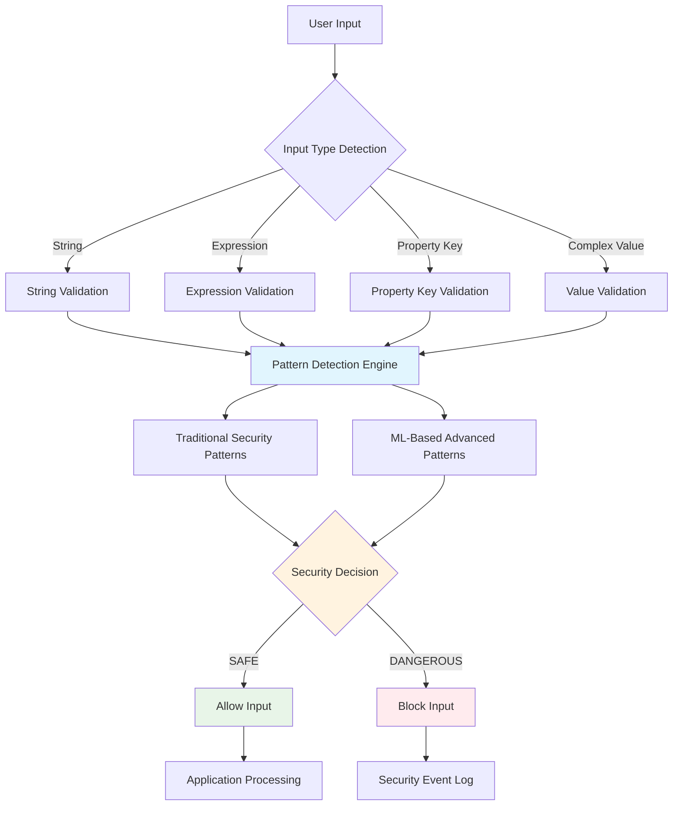
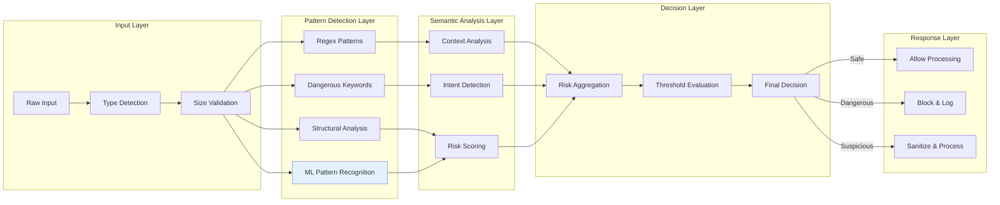
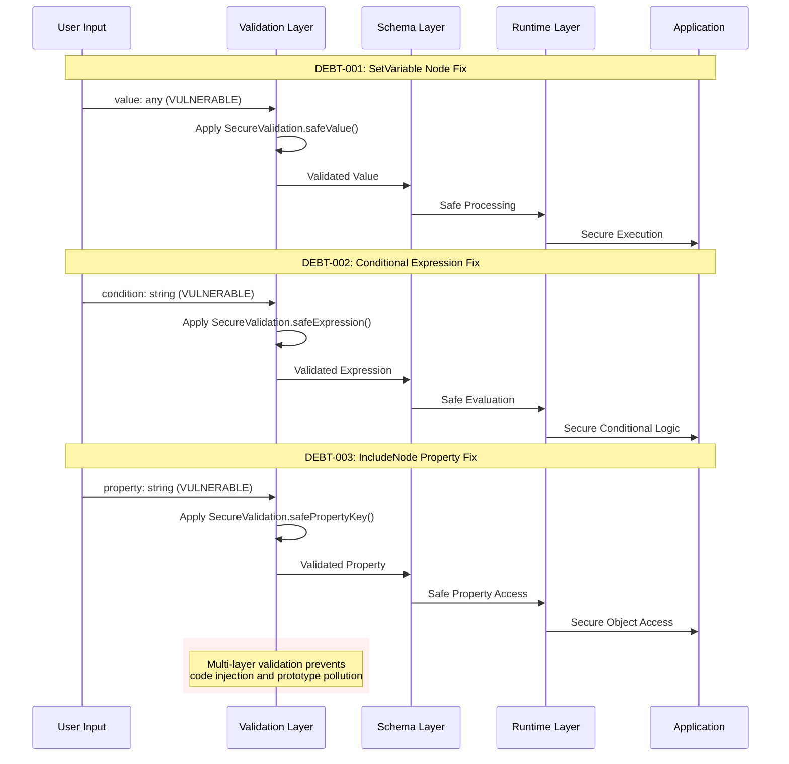
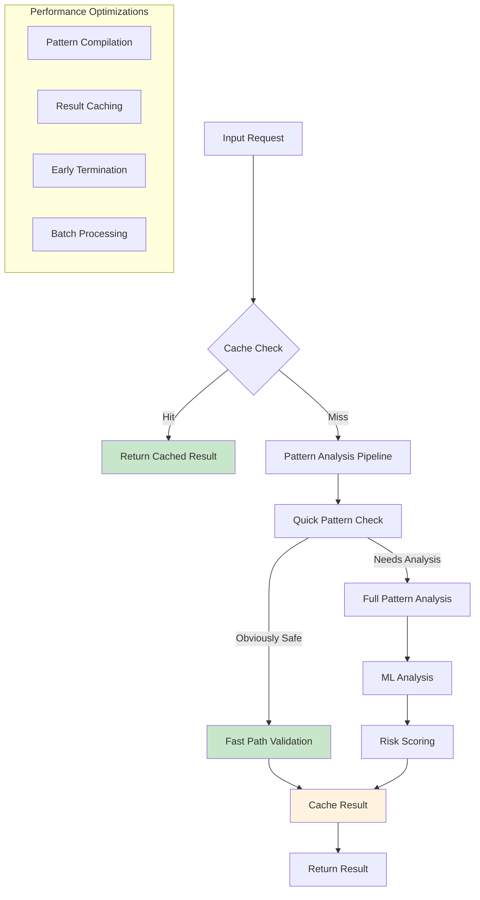
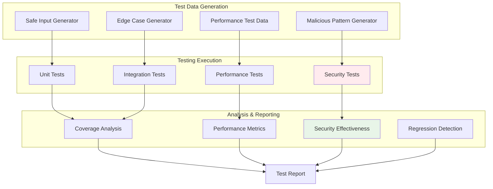
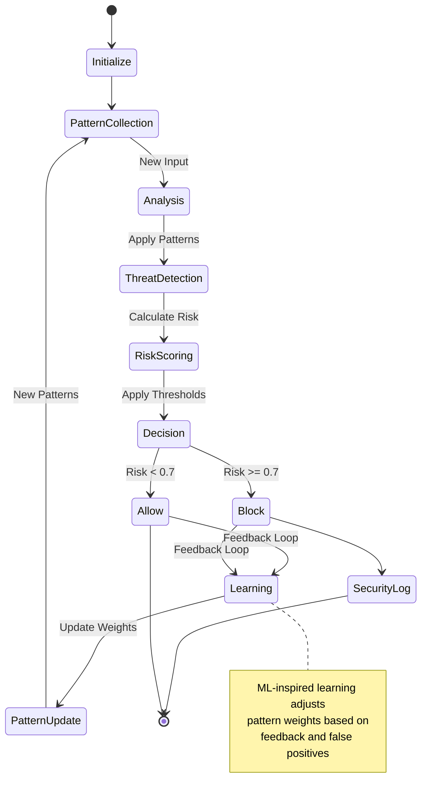
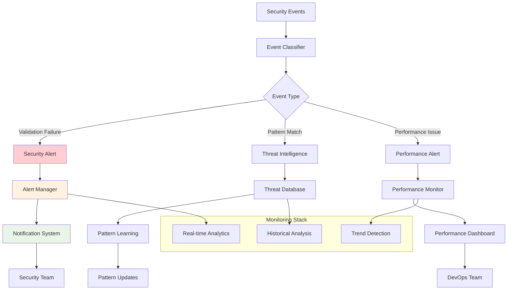
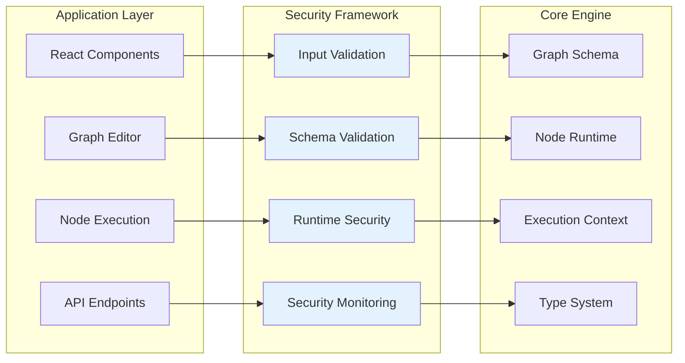
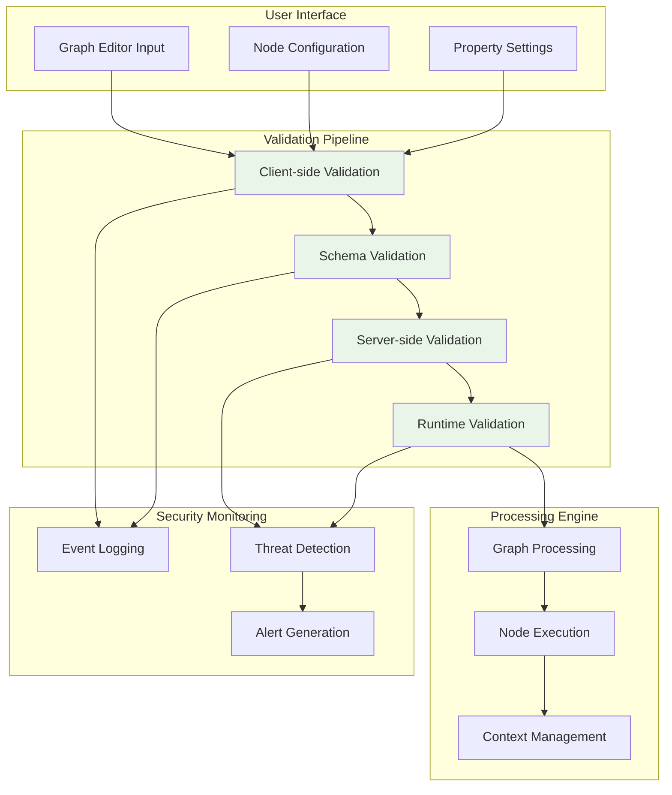
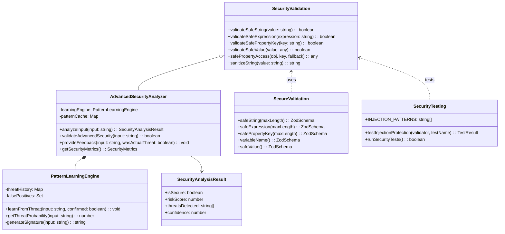

# Epic 18 Security Framework - Visual Architecture Documentation

This document provides comprehensive visual architecture diagrams for the Epic 18 security framework implementation.

## 1. Security Framework Overview

## 2. Multi-Layer Security Validation Architecture

## 3. Critical Vulnerability Fix Architecture

## 4. Performance Optimization Architecture

## 5. Security Testing Framework Architecture

## 6. ML-Based Pattern Learning System

## 7. Real-time Security Monitoring Flow

## 8. Security Framework Integration Points

## 9. Data Flow Security Architecture

## 10. Security Framework Class Diagram

## Architecture Design Principles

### 1. Defense in Depth

- **Multiple validation layers** ensure comprehensive security coverage
- **Redundant security checks** prevent single points of failure
- **Progressive validation** from simple to complex analysis

### 2. Performance First

- **Caching strategies** minimize repeated validation overhead
- **Early termination** for obviously safe or dangerous inputs
- **Optimized pattern matching** for maximum throughput

### 3. Extensibility

- **Modular design** allows easy addition of new security patterns
- **Plugin architecture** for custom validation rules
- **ML-ready framework** for adaptive threat detection

### 4. Monitoring & Observability

- **Comprehensive logging** of security events
- **Real-time monitoring** for threat detection
- **Performance metrics** for optimization opportunities

### 5. Developer Experience

- **Clear APIs** for easy integration
- **Comprehensive documentation** with visual guides
- **Testing frameworks** for validation confidence

This visual architecture documentation provides a comprehensive overview of the Epic 18 security framework design, showing how multiple layers work together to provide robust security while maintaining excellent performance characteristics.
