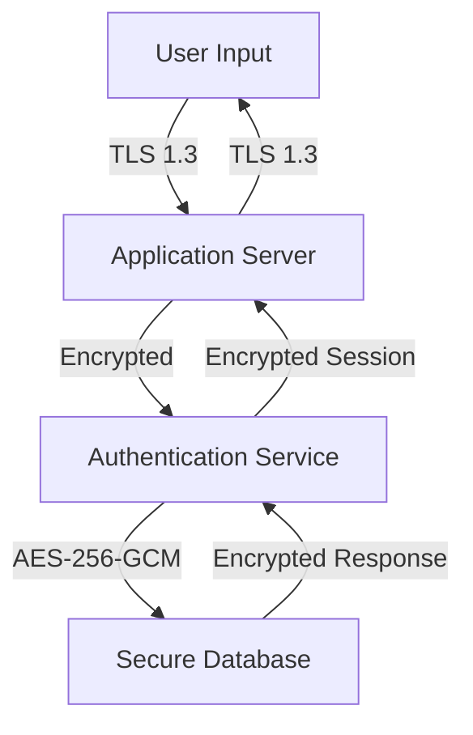
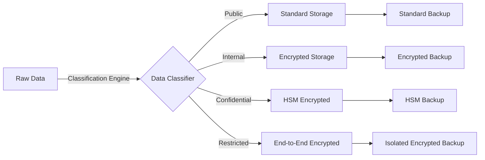

# Data Classification Framework & Encryption Requirements

## Executive Summary

This document establishes a comprehensive data classification framework for identifying sensitive data requiring encryption, aligned with GDPR, NIST SP 800-53, and 2025 cybersecurity best practices. The framework supports zero-trust architecture and data-centric security management for MFA and authentication systems.

## Classification Levels & Definitions

### Level 1: Public
**Definition**: Information that can be freely shared without risk to the organization or individuals.

**Examples**:
- Marketing materials
- Published documentation
- Public API specifications
- General product information

**Encryption Requirements**: None required
**Access Controls**: None required
**Retention**: As needed for business purposes

### Level 2: Internal
**Definition**: Information intended for internal use that could cause minor damage if disclosed.

**Examples**:
- Internal procedures and policies
- Employee directories
- Non-sensitive operational metrics
- Development environment configurations

**Encryption Requirements**: 
- TLS 1.3 for transmission
- Optional encryption at rest

**Access Controls**: 
- Authenticated users only
- Role-based access control (RBAC)

**Retention**: Standard business retention policies

### Level 3: Confidential
**Definition**: Sensitive business information that could cause significant damage if disclosed.

**Examples for MFA Systems**:
- User authentication logs (without PII)
- System configuration details
- Performance metrics and analytics
- Security scan results
- API keys and service credentials

**Encryption Requirements**:
- **At Rest**: AES-256 encryption mandatory
- **In Transit**: TLS 1.3 with perfect forward secrecy
- **Key Management**: Hardware Security Module (HSM) or cloud KMS

**Access Controls**:
- Need-to-know basis
- Multi-factor authentication required
- Detailed audit logging
- Data Loss Prevention (DLP) monitoring

**Retention**: 7 years for compliance, 1 year for operational data

### Level 4: Restricted
**Definition**: Highly sensitive data requiring maximum protection due to legal, regulatory, or business requirements.

**Examples for MFA Systems**:
- **Personal Identifiable Information (PII)**:
  - User email addresses
  - Phone numbers
  - Authentication device identifiers
  - Biometric templates (if used)
  
- **Authentication Data**:
  - Password hashes
  - TOTP secret keys
  - Recovery codes
  - Security questions and answers
  
- **Security-Critical Data**:
  - Encryption keys
  - Security incident details
  - Vulnerability assessments
  - Fraud detection algorithms
  
- **Compliance Data**:
  - Audit trails with PII
  - Breach investigation records
  - Legal hold data

**Encryption Requirements**:
- **At Rest**: AES-256-GCM with authenticated encryption
- **In Transit**: TLS 1.3 with certificate pinning
- **Application Layer**: End-to-end encryption for highly sensitive fields
- **Key Management**: HSM with key rotation every 90 days
- **Backup Encryption**: Separate encryption keys for backups

**Access Controls**:
- Zero-trust verification for all access
- Privileged Access Management (PAM)
- Just-in-time access provisioning
- Dual authorization for administrative actions
- Continuous monitoring and behavioral analytics

**Retention**: 
- PII: As required by GDPR (minimal necessary)
- Authentication data: 90 days after account closure
- Audit logs: 7 years for compliance

## Sensitive Data Identification Matrix

### MFA System Data Inventory

| Data Type | Classification | Encryption Required | Key Rationale |
|-----------|---------------|-------------------|---------------|
| **User Identity Data** |
| Email addresses | Restricted | Yes | PII under GDPR, required for breach notification |
| Phone numbers | Restricted | Yes | PII under GDPR, sensitive personal data |
| Full names | Restricted | Yes | Direct PII, identity disclosure risk |
| User IDs (internal) | Confidential | Yes | Could enable user enumeration attacks |
| **Authentication Credentials** |
| Password hashes | Restricted | Yes | Critical for account security |
| TOTP secrets | Restricted | Yes | Compromise enables account takeover |
| Recovery codes | Restricted | Yes | Bypass MFA if compromised |
| Biometric templates | Restricted | Yes | Immutable personal data, high privacy risk |
| **Session & Activity Data** |
| Session tokens | Restricted | Yes | Active session compromise risk |
| Authentication logs with PII | Restricted | Yes | Privacy risk, behavioral profiling |
| Login attempt details | Confidential | Yes | Security pattern analysis |
| Device fingerprints | Confidential | Yes | Tracking and profiling concerns |
| **System Configuration** |
| API keys | Confidential | Yes | System access and privilege escalation |
| Database connection strings | Confidential | Yes | Infrastructure access |
| Encryption keys | Restricted | Yes | Master keys for other encrypted data |
| Security policies | Internal | Optional | Configuration disclosure |
| **Operational Data** |
| Error logs (no PII) | Internal | Optional | System troubleshooting |
| Performance metrics | Internal | Optional | Operational intelligence |
| Feature usage statistics | Confidential | Yes | Business intelligence |
| A/B test results | Confidential | Yes | Competitive advantage |

## GDPR Compliance Matrix

### Personal Data Categories

| GDPR Category | Examples in MFA | Classification | Special Requirements |
|---------------|-----------------|----------------|---------------------|
| **Basic Personal Data** | Email, phone, name | Restricted | Lawful basis required, data minimization |
| **Special Categories** | Biometric data | Restricted | Explicit consent, enhanced security |
| **Criminal Offence Data** | Fraud alerts, security violations | Restricted | Legal authority required |
| **Data Subject Rights** | Access requests, deletion records | Restricted | 30-day response requirement |

### GDPR Protection Measures

1. **Data Minimization**: Only collect authentication data necessary for MFA
2. **Purpose Limitation**: Use data only for authentication and security
3. **Storage Limitation**: Automatic deletion after retention period
4. **Accuracy**: Regular data validation and correction mechanisms
5. **Security**: Encryption, access controls, and breach detection
6. **Accountability**: Detailed audit trails and compliance documentation

## NIST SP 800-53 Control Mapping

### Access Control (AC)
- **AC-2**: Account Management
  - Classification: Confidential
  - Controls: Automated provisioning/deprovisioning, role-based access

- **AC-3**: Access Enforcement
  - Classification: Restricted
  - Controls: Attribute-based access control (ABAC), least privilege

### Identification and Authentication (IA)
- **IA-2**: Identification and Authentication
  - Classification: Restricted
  - Controls: Multi-factor authentication, cryptographic authentication

- **IA-5**: Authenticator Management
  - Classification: Restricted
  - Controls: Secure storage, lifecycle management, revocation

### System and Communications Protection (SC)
- **SC-8**: Transmission Confidentiality and Integrity
  - Classification: Restricted
  - Controls: TLS 1.3, certificate validation, encryption in transit

- **SC-28**: Protection of Information at Rest
  - Classification: Restricted
  - Controls: AES-256 encryption, key management, secure deletion

## Encryption Implementation Requirements

### Encryption Standards by Classification

#### Level 3 (Confidential)
```yaml
encryption_at_rest:
  algorithm: AES-256-CBC
  key_size: 256 bits
  key_rotation: 1 year
  key_storage: Cloud KMS or HSM

encryption_in_transit:
  protocol: TLS 1.3
  cipher_suites: 
    - TLS_AES_256_GCM_SHA384
    - TLS_CHACHA20_POLY1305_SHA256
  certificate_validation: strict
  perfect_forward_secrecy: required

database_encryption:
  type: Transparent Data Encryption (TDE)
  column_encryption: Optional
  backup_encryption: Required
```

#### Level 4 (Restricted)
```yaml
encryption_at_rest:
  algorithm: AES-256-GCM
  key_size: 256 bits
  key_rotation: 90 days
  key_storage: HSM (FIPS 140-2 Level 3)
  authenticated_encryption: required

encryption_in_transit:
  protocol: TLS 1.3
  cipher_suites:
    - TLS_AES_256_GCM_SHA384
  certificate_pinning: required
  perfect_forward_secrecy: required
  mutual_authentication: required

application_layer_encryption:
  field_level: AES-256-GCM
  end_to_end: Required for PII
  key_derivation: PBKDF2 (100,000 iterations)
  
database_encryption:
  type: Always Encrypted or equivalent
  column_encryption: Required for PII
  backup_encryption: Separate key hierarchy
  point_in_time_recovery: Encrypted
```

### Key Management Architecture

```yaml
key_hierarchy:
  master_key:
    location: HSM or Cloud HSM
    rotation: Annual
    backup: Secure escrow
    
  data_encryption_keys:
    location: Key Management Service
    rotation: Quarterly (Restricted), Annual (Confidential)
    versioning: All versions retained during rotation
    
  application_keys:
    derivation: Key derivation function from master
    scope: Per-tenant, per-classification level
    rotation: On-demand or scheduled
```

## Data Flow Encryption Requirements

### Authentication Flow


### Data Processing Pipeline


## Implementation Checklist

### Phase 1: Data Discovery & Classification
- [ ] Inventory all data assets in MFA system
- [ ] Map data to classification levels
- [ ] Identify data flows and processing locations
- [ ] Document data lineage and dependencies
- [ ] Establish data ownership and stewardship

### Phase 2: Encryption Implementation
- [ ] Deploy key management infrastructure
- [ ] Implement encryption at rest for Restricted data
- [ ] Upgrade TLS configurations to 1.3
- [ ] Implement application-layer encryption for PII
- [ ] Configure encrypted backups

### Phase 3: Access Controls & Monitoring
- [ ] Implement RBAC/ABAC for classified data
- [ ] Deploy data loss prevention (DLP) tools
- [ ] Establish monitoring and alerting
- [ ] Implement audit logging
- [ ] Configure breach detection

### Phase 4: Compliance & Validation
- [ ] Conduct encryption validation testing
- [ ] Perform data classification audit
- [ ] Validate GDPR compliance measures
- [ ] Review NIST control implementation
- [ ] Document compliance posture

## Monitoring & Compliance

### Key Performance Indicators

| Metric | Target | Classification Focus |
|--------|--------|---------------------|
| Data encrypted at rest | 100% | Confidential, Restricted |
| TLS 1.3 coverage | 100% | All classifications |
| Key rotation compliance | 100% | Restricted: 90 days, Confidential: 1 year |
| Unauthorized access attempts | < 0.1% | Restricted data |
| Data breach response time | < 4 hours | All classifications |
| GDPR request fulfillment | < 30 days | Personal data |

### Audit Requirements

1. **Quarterly Reviews**:
   - Data classification accuracy
   - Encryption coverage assessment
   - Key management audit
   - Access control validation

2. **Annual Assessments**:
   - Comprehensive security audit
   - GDPR compliance review
   - NIST control effectiveness
   - Third-party penetration testing

3. **Continuous Monitoring**:
   - Real-time access monitoring
   - Encryption status verification
   - Key rotation tracking
   - Anomaly detection

## Risk Assessment Matrix

| Data Type | Confidentiality Risk | Integrity Risk | Availability Risk | Overall Classification |
|-----------|---------------------|----------------|-------------------|----------------------|
| User passwords | Critical | Critical | High | Restricted |
| TOTP secrets | Critical | Critical | High | Restricted |
| Email addresses | High | Medium | Medium | Restricted |
| Phone numbers | High | Medium | Medium | Restricted |
| Session tokens | Critical | Critical | Critical | Restricted |
| API keys | Critical | High | High | Confidential |
| System logs | Medium | Medium | High | Confidential |
| Configuration | Medium | High | High | Confidential |

## Conclusion

This data classification framework provides a comprehensive foundation for securing sensitive data in MFA systems while ensuring compliance with GDPR and NIST requirements. The classification-based encryption approach enables proportional security controls while maintaining operational efficiency.

### Key Benefits
- 🛡️ **Zero-Trust Foundation**: Data-centric security regardless of location
- 📊 **Risk-Based Protection**: Encryption proportional to sensitivity
- ⚖️ **Regulatory Compliance**: GDPR and NIST alignment
- 🔄 **Operational Efficiency**: Automated classification and protection
- 📈 **Scalable Architecture**: Supports growth and new data types