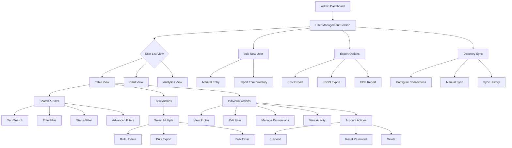

# User Listing - Information Architecture & User Flow

## Task: E17-1753114396997-21FFF5 - Create User Listing Wireframes
**Epic:** 17.3 User & Permission Management Dashboard

---

## User Flow Diagram



---

## Information Architecture

```
USER LISTING SYSTEM
├── 📊 Dashboard Overview
│   ├── User Statistics
│   ├── Activity Metrics  
│   └── System Health
│
├── 👥 User Directory
│   ├── 🔍 Search & Filters
│   │   ├── Text Search
│   │   ├── Role Filters
│   │   ├── Status Filters
│   │   └── Advanced Filters
│   │
│   ├── 📋 User List Display
│   │   ├── Table View
│   │   ├── Card View
│   │   └── Compact View
│   │
│   └── ⚙️ User Actions
│       ├── Individual Actions
│       ├── Bulk Operations
│       └── Quick Actions
│
├── ➕ User Management
│   ├── Add New User
│   ├── Import Users
│   └── User Templates
│
├── 📤 Export & Reporting
│   ├── Data Export
│   ├── Activity Reports
│   └── Compliance Reports
│
└── 🔄 System Integration
    ├── Directory Sync
    ├── SSO Configuration
    └── API Management
```

---

## Component Hierarchy

```
UserListingDashboard
├── HeaderBar
│   ├── NavigationTabs
│   ├── QuickActions
│   └── UserInfo
│
├── StatisticsOverview
│   ├── UserCountCard
│   ├── ActivityCard
│   ├── StatusCard
│   └── IssuesCard
│
├── FilterPanel
│   ├── SearchInput
│   ├── RoleFilter
│   ├── StatusFilter
│   └── AdvancedFilters
│
├── ActionBar
│   ├── AddUserButton
│   ├── ExportButton
│   ├── SyncButton
│   └── BulkActionsMenu
│
├── UserListContainer
│   ├── ViewSelector
│   ├── UserTableView
│   │   ├── UserTableHeader
│   │   ├── UserTableRow[]
│   │   └── UserTableFooter
│   │
│   └── UserCardView
│       └── UserCard[]
│
├── PaginationBar
│   ├── PageSizeSelector
│   ├── PageNavigation
│   └── ItemCounter
│
└── ModalsContainer
    ├── UserDetailModal
    ├── BulkActionModal
    ├── ExportModal
    └── ConfirmationModal
```

---

## State Management Architecture

```javascript
// User Listing State Structure
const userListingState = {
  // Data Layer
  users: {
    items: User[],
    totalCount: number,
    loading: boolean,
    error: string | null
  },
  
  // Filter Layer  
  filters: {
    searchTerm: string,
    roleFilter: string[],
    statusFilter: string[],
    departmentFilter: string[],
    activityFilter: 'all' | 'active' | 'recent',
    customFilters: FilterCriteria[]
  },
  
  // View Layer
  view: {
    mode: 'table' | 'cards' | 'analytics',
    sortBy: string,
    sortOrder: 'asc' | 'desc',
    pageSize: 25 | 50 | 100,
    currentPage: number
  },
  
  // Selection Layer
  selection: {
    selectedUsers: string[],
    bulkActionMode: boolean,
    allSelected: boolean
  },
  
  // UI Layer
  ui: {
    filtersExpanded: boolean,
    bulkPanelOpen: boolean,
    activeModal: string | null,
    sidebarCollapsed: boolean
  },
  
  // Sync Layer
  sync: {
    lastSyncTime: Date,
    syncInProgress: boolean,
    syncErrors: SyncError[],
    connectedSystems: DirectoryConnection[]
  }
};
```

---

## API Integration Points

```typescript
// User Management API Endpoints
interface UserListingAPI {
  // Core CRUD Operations
  getUsers(params: GetUsersParams): Promise<UserListResponse>;
  getUserById(id: string): Promise<User>;
  createUser(userData: CreateUserRequest): Promise<User>;
  updateUser(id: string, updates: UpdateUserRequest): Promise<User>;
  deleteUser(id: string): Promise<void>;
  
  // Bulk Operations
  bulkUpdateUsers(userIds: string[], updates: BulkUpdateRequest): Promise<BulkOperationResult>;
  bulkDeleteUsers(userIds: string[]): Promise<BulkOperationResult>;
  
  // Search & Filter
  searchUsers(query: SearchQuery): Promise<UserListResponse>;
  getFilterOptions(): Promise<FilterOptions>;
  
  // Export & Reporting
  exportUsers(params: ExportParams): Promise<ExportResult>;
  generateUserReport(params: ReportParams): Promise<Report>;
  
  // Directory Integration
  syncDirectory(systemId: string): Promise<SyncResult>;
  getSyncStatus(): Promise<SyncStatus[]>;
  
  // Activity & Analytics
  getUserActivity(userId: string, timeRange: TimeRange): Promise<ActivityLog[]>;
  getSystemMetrics(): Promise<SystemMetrics>;
}
```

---

## Responsive Design Breakpoints

```scss
// Breakpoint System
$breakpoints: (
  mobile: 0,
  tablet: 768px,
  desktop: 1024px,
  wide: 1440px
);

// Layout Adaptations
@media (max-width: 767px) {
  .user-listing {
    // Switch to card-based layout
    // Hide non-essential columns
    // Simplify filters to dropdown
    // Stack action buttons
  }
}

@media (min-width: 768px) and (max-width: 1023px) {
  .user-listing {
    // Compact table layout
    // Collapsible filter panel  
    // Reduced padding/margins
    // Simplified bulk actions
  }
}

@media (min-width: 1024px) {
  .user-listing {
    // Full desktop experience
    // All columns visible
    // Advanced filter panel
    // Complete action menus
  }
}
```

---

## Performance Optimization Strategy

### Data Management
- **Virtual Scrolling**: For large user lists (> 500 users)
- **Lazy Loading**: Load user details on-demand
- **Caching Strategy**: Cache frequently accessed user data
- **Pagination**: Server-side pagination with configurable page sizes

### Search Optimization
- **Debounced Search**: 300ms delay to prevent excessive API calls
- **Search Indexing**: Server-side indexed search for fast results  
- **Filter Caching**: Cache filter results for repeated queries
- **Predictive Loading**: Pre-load likely next page results

### UI Performance
- **Component Memoization**: React.memo for user list items
- **Virtual DOM**: Efficient re-rendering of large lists
- **Image Optimization**: Lazy-load user avatars
- **Bundle Splitting**: Code-split admin features

---

## Accessibility Implementation

### Keyboard Navigation
```typescript
// Keyboard shortcuts for user listing
const keyboardShortcuts = {
  'Ctrl+F': 'focusSearchInput',
  'Ctrl+A': 'selectAllUsers',
  'Delete': 'deleteSelectedUsers',
  'Escape': 'clearSelection',
  'Enter': 'openUserDetails',
  'Tab': 'navigateElements',
  'Space': 'toggleUserSelection'
};
```

### Screen Reader Support
- **ARIA Labels**: Comprehensive labeling for all interactive elements
- **Role Attributes**: Proper semantic roles for table and grid elements  
- **Live Regions**: Dynamic content announcements
- **Skip Links**: Quick navigation to main content areas

### Visual Accessibility
- **High Contrast Mode**: Alternative color scheme support
- **Focus Indicators**: Clear visual focus states
- **Text Scaling**: Support for 200% zoom level
- **Color Independence**: Information not conveyed by color alone

---

## Security & Compliance Considerations

### Data Protection
- **Role-based Access**: Filter displayed data based on user permissions
- **PII Masking**: Automatic masking of sensitive information
- **Audit Logging**: Track all user management actions
- **Export Controls**: Permission-based export restrictions

### Compliance Features  
- **GDPR Support**: Data portability and deletion capabilities
- **SOX Compliance**: Audit trail for all user changes
- **HIPAA Considerations**: Additional privacy controls for healthcare
- **Data Retention**: Configurable data retention policies

---

*This comprehensive design documentation ensures the User Listing wireframes meet all requirements for Epic 17.3 - User & Permission Management Dashboard.*